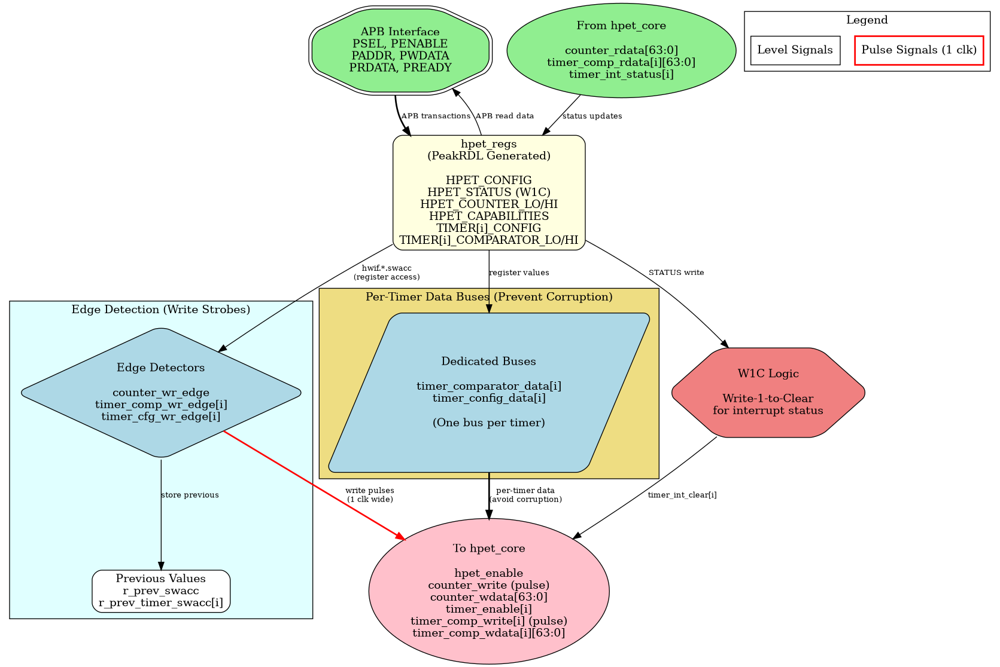

### HPET Configuration Registers - PeakRDL Wrapper

#### Overview

The `hpet_config_regs` module serves as the critical bridge between the PeakRDL-generated register file (`hpet_regs.sv`) and the HPET core timer logic (`hpet_core.sv`). This wrapper handles interface adaptation, per-timer data bus isolation, and register write edge detection.

**Block Diagram:**



*Figure: HPET Config Registers architecture showing APB interface, PeakRDL registers, edge detection, per-timer data buses, and W1C logic. [Source: assets/graphviz/hpet_config_regs.gv](../assets/graphviz/hpet_config_regs.gv) | [SVG](../assets/svg/hpet_config_regs.svg)*

#### Key Responsibilities

1. **PeakRDL Integration:** Instantiates `hpet_regs.sv` and `peakrdl_to_cmdrsp` adapter
2. **Interface Mapping:** Converts PeakRDL hardware interface to HPET core signals
3. **Per-Timer Data Buses:** Implements dedicated 64-bit data paths per timer (prevents corruption)
4. **Edge Detection:** Generates write strobes from register updates
5. **Counter Write Handling:** Captures software writes to counter registers
6. **Interrupt Management:** Handles W1C status clearing and interrupt feedback

#### Interface Specification

##### Parameters

| Parameter | Type | Default | Range | Description |
|-----------|------|---------|-------|-------------|
| `VENDOR_ID` | int | 1 | 0-65535 | Vendor identification (read-only in HPET_ID) |
| `REVISION_ID` | int | 1 | 0-65535 | Revision identification (read-only in HPET_ID) |
| `NUM_TIMERS` | int | 2 | 2, 3, 8 | Number of independent timers in array |

##### Clock and Reset

| Signal Name | Type | Width | Direction | Description |
|-------------|------|-------|-----------|----------------|
| **clk** | logic | 1 | Input | Configuration clock (pclk or hpet_clk based on CDC_ENABLE) |
| **rst_n** | logic | 1 | Input | Active-low asynchronous reset |

##### Command/Response Interface (from APB Slave)

| Signal Name | Type | Width | Direction | Description |
|-------------|------|-------|-----------|-------------|
| **cmd_valid** | logic | 1 | Input | Command valid |
| **cmd_ready** | logic | 1 | Output | Command ready |
| **cmd_pwrite** | logic | 1 | Input | Command write (1) or read (0) |
| **cmd_paddr** | logic | 12 | Input | Command address |
| **cmd_pwdata** | logic | 32 | Input | Command write data |
| **cmd_pstrb** | logic | 4 | Input | Command write byte strobes |
| **rsp_valid** | logic | 1 | Output | Response valid |
| **rsp_ready** | logic | 1 | Input | Response ready |
| **rsp_prdata** | logic | 32 | Output | Response read data |
| **rsp_pslverr** | logic | 1 | Output | Response error flag |

##### HPET Core Interface (to hpet_core.sv)

**Global Configuration:**
| Signal Name | Type | Width | Direction | Description |
|-------------|------|-------|-----------|-------------|
| **hpet_enable** | logic | 1 | Output | Global HPET enable (from HPET_CONFIG[0]) |
| **legacy_replacement** | logic | 1 | Output | Legacy replacement mode (from HPET_CONFIG[1]) |

**Counter Interface:**
| Signal Name | Type | Width | Direction | Description |
|-------------|------|-------|-----------|-------------|
| **counter_write** | logic | 1 | Output | Counter write strobe (pulse) |
| **counter_wdata** | logic | 64 | Output | Counter write data (combined LO/HI) |
| **counter_rdata** | logic | 64 | Input | Live counter value (from hpet_core) |

**Per-Timer Configuration:**
| Signal Name | Type | Width | Direction | Description |
|-------------|------|-------|-----------|-------------|
| **timer_enable[NUM_TIMERS-1:0]** | logic | NUM_TIMERS | Output | Per-timer enable bits (from TIMER_CONFIG[2]) |
| **timer_int_enable[NUM_TIMERS-1:0]** | logic | NUM_TIMERS | Output | Per-timer interrupt enable (from TIMER_CONFIG[3]) |
| **timer_type[NUM_TIMERS-1:0]** | logic | NUM_TIMERS | Output | Per-timer mode: 0=One-shot, 1=Periodic (from TIMER_CONFIG[4]) |
| **timer_size[NUM_TIMERS-1:0]** | logic | NUM_TIMERS | Output | Per-timer size: 0=32-bit, 1=64-bit (from TIMER_CONFIG[5]) |
| **timer_value_set[NUM_TIMERS-1:0]** | logic | NUM_TIMERS | Output | Per-timer accumulator mode (from TIMER_CONFIG[6]) |

**Per-Timer Comparator (Dedicated Buses):**
| Signal Name | Type | Width | Direction | Description |
|-------------|------|-------|-----------|-------------|
| **timer_comp_write[NUM_TIMERS-1:0]** | logic | NUM_TIMERS | Output | Per-timer comparator write strobes |
| **timer_comp_wdata[NUM_TIMERS]** | logic [63:0] | NUM_TIMERS×64 | Output | Per-timer comparator data (LO/HI combined) |
| **timer_comp_write_high** | logic | 1 | Output | High half write detection |
| **timer_comp_rdata[NUM_TIMERS]** | logic [63:0] | NUM_TIMERS×64 | Input | Per-timer comparator read data |

**Interrupt Status:**
| Signal Name | Type | Width | Direction | Description |
|-------------|------|-------|-----------|-------------|
| **timer_int_status[NUM_TIMERS-1:0]** | logic | NUM_TIMERS | Input | Per-timer fire status (from hpet_core) |
| **timer_int_clear[NUM_TIMERS-1:0]** | logic | NUM_TIMERS | Output | Per-timer status clear (W1C pulse) |

#### Internal Architecture

##### Component Instantiation

**1. Protocol Adapter:**
```systemverilog
peakrdl_to_cmdrsp #(
    .ADDR_WIDTH(12),
    .DATA_WIDTH(32)
) u_adapter (
    .aclk(clk), .aresetn(rst_n),
    // cmd/rsp interface (external)
    .cmd_valid, .cmd_ready, .cmd_pwrite, .cmd_paddr, .cmd_pwdata, .cmd_pstrb,
    .rsp_valid, .rsp_ready, .rsp_prdata, .rsp_pslverr,
    // PeakRDL passthrough interface (to register block)
    .regblk_req, .regblk_req_is_wr, .regblk_addr, .regblk_wr_data, .regblk_wr_biten,
    .regblk_req_stall_wr, .regblk_req_stall_rd,
    .regblk_rd_ack, .regblk_rd_err, .regblk_rd_data,
    .regblk_wr_ack, .regblk_wr_err
);
```

**2. PeakRDL Register Block:**
```systemverilog
hpet_regs u_hpet_regs (
    .clk(clk),
    .rst(~rst_n),  // PeakRDL uses active-high reset
    // Passthrough CPU interface
    .s_cpuif_req(regblk_req),
    .s_cpuif_req_is_wr(regblk_req_is_wr),
    .s_cpuif_addr(regblk_addr[8:0]),  // 9-bit internal addressing
    .s_cpuif_wr_data(regblk_wr_data),
    .s_cpuif_wr_biten(regblk_wr_biten),
    .s_cpuif_req_stall_wr(regblk_req_stall_wr),
    .s_cpuif_req_stall_rd(regblk_req_stall_rd),
    .s_cpuif_rd_ack(regblk_rd_ack),
    .s_cpuif_rd_err(regblk_rd_err),
    .s_cpuif_rd_data(regblk_rd_data),
    .s_cpuif_wr_ack(regblk_wr_ack),
    .s_cpuif_wr_err(regblk_wr_err),
    // Hardware interface
    .hwif_in(hwif_in),
    .hwif_out(hwif_out)
);
```

#### Mapping Logic Details

##### Global Configuration Mapping

Direct assignment from PeakRDL outputs:
```systemverilog
assign hpet_enable = hwif_out.HPET_CONFIG.hpet_enable.value;
assign legacy_replacement = hwif_out.HPET_CONFIG.legacy_replacement.value;
```

##### Counter Write Detection

Uses address-based detection and data capture:
```systemverilog
// Detect which register was written
assign counter_lo_written = regblk_req && regblk_req_is_wr && (regblk_addr[8:0] == 9'h010);
assign counter_hi_written = regblk_req && regblk_req_is_wr && (regblk_addr[8:0] == 9'h014);

// Capture software-written values from write data bus
always_ff @(posedge clk or negedge rst_n) begin
    if (!rst_n) begin
        last_sw_counter_lo <= '0;
        last_sw_counter_hi <= '0;
    end else begin
        if (counter_lo_written) last_sw_counter_lo <= regblk_wr_data;
        if (counter_hi_written) last_sw_counter_hi <= regblk_wr_data;
    end
end

// Counter write strobe asserted when software modifies either half
assign counter_write = hwif_out.HPET_COUNTER_LO.counter_lo.swmod ||
                      hwif_out.HPET_COUNTER_HI.counter_hi.swmod;

// Combined 64-bit write data
assign counter_wdata = {last_sw_counter_hi, last_sw_counter_lo};
```

**Timing:**
```
Clock:        -+ +-+ +-+ +-+ +-
clk           +-+ +-+ +-+ +-

Write:        ---+ +---------
counter_lo_written+-

Data:         [OLD][NEW][NEW]
regblk_wr_data

Captured:     [OLD][OLD][NEW]
last_sw_counter_lo

swmod:        ----+ +-----
              +-

counter_write:----+ +-----
              +-

Note: 1-cycle pulse when software writes
```

##### Timer Configuration Mapping

Per-timer array mapping:
```systemverilog
generate
    for (genvar i = 0; i < NUM_TIMERS; i++) begin : g_timer_mapping
        assign timer_enable[i]     = hwif_out.TIMER[i].TIMER_CONFIG.timer_enable.value;
        assign timer_int_enable[i] = hwif_out.TIMER[i].TIMER_CONFIG.timer_int_enable.value;
        assign timer_type[i]       = hwif_out.TIMER[i].TIMER_CONFIG.timer_type.value;
        assign timer_size[i]       = hwif_out.TIMER[i].TIMER_CONFIG.timer_size.value;
        assign timer_value_set[i]  = hwif_out.TIMER[i].TIMER_CONFIG.timer_value_set.value;
    end
endgenerate
```

##### Per-Timer Data Bus Architecture (Corruption Fix)

**The Problem:**
Early designs shared a single 64-bit bus for all timer comparators. Rapid writes to different timers caused corruption when one timer's data overwrote another timer's registers.

**The Solution:**
Each timer gets a dedicated 64-bit data bus, preventing any possibility of cross-timer corruption:

```systemverilog
// ✅ CORRECT: Per-timer dedicated data buses
generate
    for (genvar i = 0; i < NUM_TIMERS; i++) begin : g_timer_wdata
        assign timer_comp_wdata[i] = {
            hwif_out.TIMER[i].TIMER_COMPARATOR_HI.timer_comp_hi.value,
            hwif_out.TIMER[i].TIMER_COMPARATOR_LO.timer_comp_lo.value
        };
    end
endgenerate

// Per-timer write strobe generation (edge detection)
generate
    for (genvar i = 0; i < NUM_TIMERS; i++) begin : g_timer_wr_detect
        always_ff @(posedge clk or negedge rst_n) begin
            if (!rst_n) begin
                prev_timer_comp_lo[i] <= '0;
                prev_timer_comp_hi[i] <= '0;
            end else begin
                prev_timer_comp_lo[i] <= hwif_out.TIMER[i].TIMER_COMPARATOR_LO.timer_comp_lo.value;
                prev_timer_comp_hi[i] <= hwif_out.TIMER[i].TIMER_COMPARATOR_HI.timer_comp_hi.value;
            end
        end

        assign timer_comp_write[i] =
            (hwif_out.TIMER[i].TIMER_COMPARATOR_LO.timer_comp_lo.value != prev_timer_comp_lo[i]) ||
            (hwif_out.TIMER[i].TIMER_COMPARATOR_HI.timer_comp_hi.value != prev_timer_comp_hi[i]);
    end
endgenerate
```

**Architecture Benefit:**

```
Timer 0:  hwif.TIMER[0].COMP_LO/HI -> timer_comp_wdata[0] -> hpet_core timer 0 ONLY
Timer 1:  hwif.TIMER[1].COMP_LO/HI -> timer_comp_wdata[1] -> hpet_core timer 1 ONLY
Timer 2:  hwif.TIMER[2].COMP_LO/HI -> timer_comp_wdata[2] -> hpet_core timer 2 ONLY

No shared bus -> No corruption possible
```

##### Interrupt Status Handling

**Edge Detection for Sticky Interrupts:**

PeakRDL sticky interrupt fields expect edge pulses (not levels). The wrapper implements edge detection:

```systemverilog
// Previous state storage
logic [NUM_TIMERS-1:0] prev_timer_int_status;

always_ff @(posedge clk or negedge rst_n) begin
    if (!rst_n) begin
        prev_timer_int_status <= '0;
    end else begin
        prev_timer_int_status <= timer_int_status;
    end
end

// Detect rising edge (0->1 transition)
assign timer_int_rising_edge = timer_int_status & ~prev_timer_int_status;

// Feed edge-detected pulse to PeakRDL hwset
assign hwif_in.HPET_STATUS.timer_int_status.hwset = |timer_int_rising_edge;

// Feed current level to next (for multi-bit sticky logic)
assign hwif_in.HPET_STATUS.timer_int_status.next = {{(8-NUM_TIMERS){1'b0}}, timer_int_status};
```

**Interrupt Clearing (W1C):**

When software writes 1 to HPET_STATUS bit to clear (W1C), the wrapper generates a clear pulse to hpet_core:

```systemverilog
// Detect when software writes W1C to HPET_STATUS
// PeakRDL swmod signal pulses when SW modifies the field
assign timer_int_clear = {NUM_TIMERS{hwif_out.HPET_STATUS.timer_int_status.swmod}} & timer_int_status;
```

**Timing:**
```
Clock:           -+ +-+ +-+ +-
clk              +-+ +-+ +-

Timer Fires:     --+ +-------
timer_int_status   +-

Edge Detect:     ----+ +-----
timer_int_rising_edge+-

hwset Pulse:     ----+ +-----
hwif_in.hwset    +-

PeakRDL Sticky:  --+
STATUS bit       +---------

SW Write W1C:    --------+ +-
swmod pulse              +-

Clear Pulse:     --------+ +-
timer_int_clear          +-

Timer Clears:    --+       +-
timer_int_status   +-------+

Note: Edge detection + W1C clearing flow
```

#### Register-to-Core Signal Summary

**Critical Signals:**

1. **hpet_enable:** Level signal, directly gates counter incrementing
2. **counter_write:** Pulse (1 cycle) when software writes counter
3. **counter_wdata:** Captured value from software write
4. **timer_enable[i]:** Level signal per timer
5. **timer_comp_write[i]:** Pulse (1 cycle) when software writes comparator
6. **timer_comp_wdata[i]:** Per-timer dedicated data bus (corruption-proof)
7. **timer_int_clear[i]:** Pulse (1 cycle) when software clears status W1C

**Signal Types:**
- **Level Signals:** Direct PeakRDL `.value` outputs (enable, type, size)
- **Pulse Signals:** Edge-detected from register changes (write strobes, clears)
- **Data Buses:** Captured or combined register values (counter, comparators)

#### Resource Utilization

**Configuration Register Logic (hpet_config_regs only, excluding hpet_regs):**

| Component | NUM_TIMERS=2 | NUM_TIMERS=3 | NUM_TIMERS=8 |
|-----------|--------------|--------------|--------------|
| **Mapping Logic** | ~50 FF, ~100 LUTs | ~75 FF, ~150 LUTs | ~150 FF, ~300 LUTs |
| **Edge Detect** | ~10 FF, ~20 LUTs | ~15 FF, ~30 LUTs | ~30 FF, ~60 LUTs |
| **Interrupt Handling** | ~10 FF, ~20 LUTs | ~15 FF, ~30 LUTs | ~30 FF, ~60 LUTs |
| **Total** | ~70 FF, ~140 LUTs | ~105 FF, ~210 LUTs | ~210 FF, ~420 LUTs |

**Scaling:** Primarily driven by number of timers. Each additional timer adds ~35 FF and ~70 LUTs for mapping and edge detection logic.

---

**Next:** [Chapter 2.3 - hpet_regs (PeakRDL)](03_hpet_regs.md)
