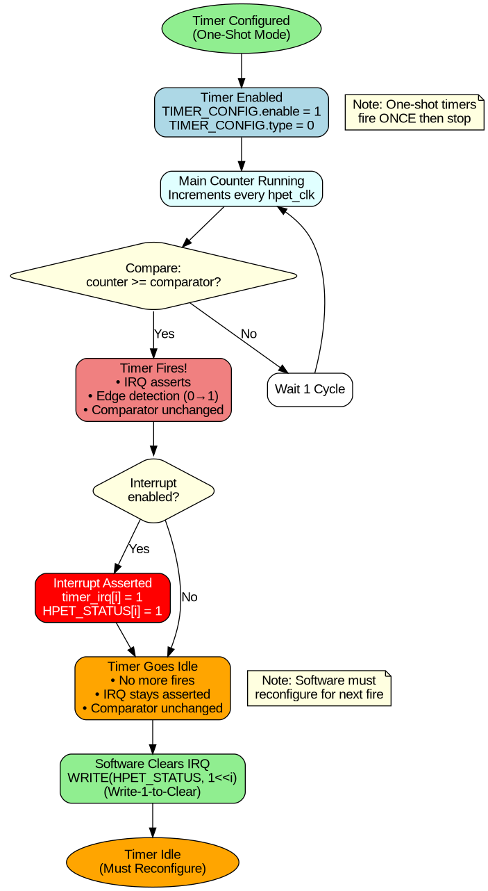
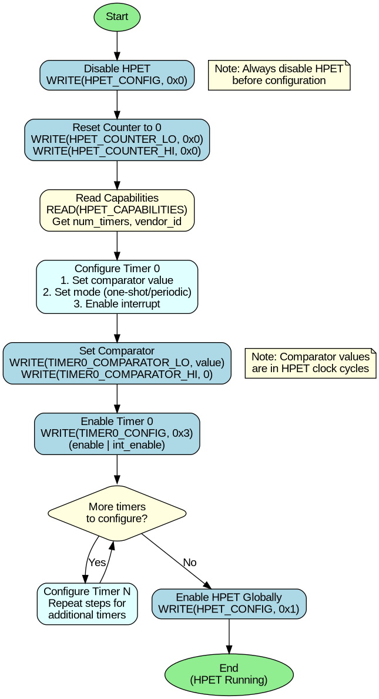
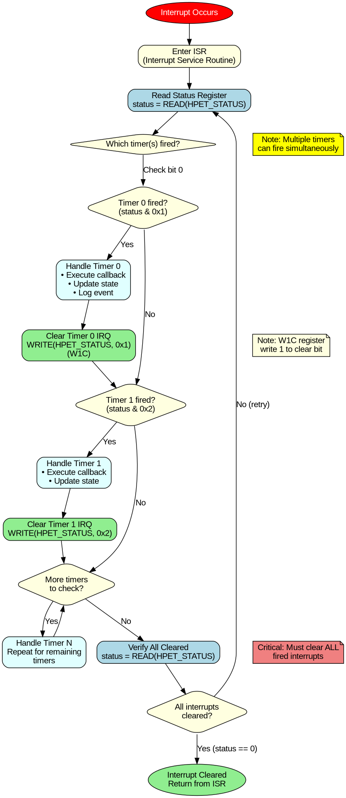

# APB HPET Register Map

**Chapter:** 5.1
**Title:** Complete Register Address Map
**Version:** 1.0
**Last Updated:** 2025-10-20

---

## Overview

The APB HPET provides a memory-mapped register interface accessible via the APB slave port. The register space is organized into two main sections:

1. **Global Registers (0x000-0x0FF):** Configuration, status, and main counter
2. **Per-Timer Registers (0x100-0x1FF):** Timer-specific configuration and comparators

Each timer occupies a 32-byte (0x20) register block, supporting up to 8 timers.

### Block Diagram


*Figure 1: APB HPET top-level architecture showing APB interface, configuration registers, HPET core, and timer outputs.*

---

## Register Address Map Summary

### Global Registers

| Offset | Register Name | Access | Width | Description |
|--------|---------------|--------|-------|-------------|
| 0x000 | HPET_ID | RO | 32b | Identification register (vendor, revision, capabilities) |
| 0x004 | HPET_CONFIG | RW | 32b | Global configuration and control |
| 0x008 | HPET_STATUS | RW/W1C | 32b | Interrupt status for all timers (write-1-to-clear) |
| 0x00C | RESERVED | RO | 32b | Reserved |
| 0x010 | HPET_COUNTER_LO | RW | 32b | Main counter bits [31:0] |
| 0x014 | HPET_COUNTER_HI | RW | 32b | Main counter bits [63:32] |
| 0x018-0x0FF | RESERVED | RO | - | Reserved for future use |

### Per-Timer Registers

Each timer (N = 0 to NUM_TIMERS-1) has a 32-byte register block at base address `0x100 + N*0x20`.

**Timer N Base Address:** `0x100 + N * 0x20`

| Offset | Register Name | Access | Width | Description |
|--------|---------------|--------|-------|-------------|
| +0x00 | TIMER_CONFIG | RW | 32b | Timer configuration and control |
| +0x04 | TIMER_COMPARATOR_LO | RW | 32b | Timer comparator bits [31:0] |
| +0x08 | TIMER_COMPARATOR_HI | RW | 32b | Timer comparator bits [63:32] |
| +0x0C | RESERVED | RO | 32b | Reserved |
| +0x10-0x1F | RESERVED | RO | - | Reserved for timer expansion |

**Example Timer Addresses:**

| Timer | Base Address | CONFIG | COMPARATOR_LO | COMPARATOR_HI |
|-------|--------------|--------|---------------|---------------|
| 0 | 0x100 | 0x100 | 0x104 | 0x108 |
| 1 | 0x120 | 0x120 | 0x124 | 0x128 |
| 2 | 0x140 | 0x140 | 0x144 | 0x148 |
| 3 | 0x160 | 0x160 | 0x164 | 0x168 |
| 4 | 0x180 | 0x180 | 0x184 | 0x188 |
| 5 | 0x1A0 | 0x1A0 | 0x1A4 | 0x1A8 |
| 6 | 0x1C0 | 0x1C0 | 0x1C4 | 0x1C8 |
| 7 | 0x1E0 | 0x1E0 | 0x1E4 | 0x1E8 |

---

## Global Register Descriptions

### HPET_ID (0x000) - Identification Register

**Access:** Read-Only
**Reset Value:** Parameterized (VENDOR_ID, REVISION_ID, NUM_TIMERS)

Contains capability information and identification fields.

| Bits | Field | Access | Reset | Description |
|------|-------|--------|-------|-------------|
| [31:24] | vendor_id | RO | VENDOR_ID | Vendor identifier (parameterized) |
| [23:16] | rev_id | RO | REVISION_ID | Revision identifier (parameterized) |
| [15:13] | reserved | RO | 0 | Reserved |
| [12:8] | num_tim_cap | RO | NUM_TIMERS-1 | Number of timers minus 1 (e.g., 7 for 8 timers) |
| [7] | count_size_cap | RO | 1 | Counter size capability (1 = 64-bit counter) |
| [6] | reserved | RO | 0 | Reserved |
| [5] | leg_rt_cap | RO | 1 | Legacy replacement capable (1 = supported) |
| [4:0] | reserved | RO | 0 | Reserved |

**Example Values:**
- 2-timer Intel-like: `0x80860001_00000171` (vendor=0x8086, rev=1, timers=1)
- 3-timer AMD-like: `0x10220002_00000271` (vendor=0x1022, rev=2, timers=2)
- 8-timer custom: `0x12340001_000007F1` (vendor=0x1234, rev=1, timers=7)

---

### HPET_CONFIG (0x004) - Configuration Register

**Access:** Read-Write
**Reset Value:** 0x00000000

Global enable and configuration control.

| Bits | Field | Access | Reset | Description |
|------|-------|--------|-------|-------------|
| [31:2] | reserved | RO | 0 | Reserved |
| [1] | legacy_replacement | RW | 0 | Legacy replacement mode enable (0=disabled, 1=enabled) |
| [0] | hpet_enable | RW | 0 | HPET main counter enable (0=stopped, 1=running) |

**Usage Notes:**
- Write `hpet_enable=1` to start the main counter
- Write `hpet_enable=0` to stop the main counter (value preserved)
- `legacy_replacement` enables mapping to legacy timer interrupt lines (implementation-specific)
- Counter must be enabled for any timer to fire

**Example Configuration Sequence:**
```c
// Disable HPET
WRITE(HPET_CONFIG, 0x0);

// Reset counter
WRITE(HPET_COUNTER_LO, 0x0);
WRITE(HPET_COUNTER_HI, 0x0);

// Configure timers...

// Enable HPET
WRITE(HPET_CONFIG, 0x1);
```

---

### HPET_STATUS (0x008) - Interrupt Status Register

**Access:** Read-Write (Write-1-to-Clear)
**Reset Value:** 0x00000000

Interrupt status bits for all timers. Write 1 to a bit to clear the corresponding interrupt.

| Bits | Field | Access | Reset | Description |
|------|-------|--------|-------|-------------|
| [31:NUM_TIMERS] | reserved | RO | 0 | Reserved (unused timer bits) |
| [NUM_TIMERS-1:0] | timer_int_status | RW/W1C | 0 | Timer interrupt status bits |

**Per-Timer Status Bit:**
- **Bit[N]** = Timer N interrupt status
  - 0 = No interrupt pending
  - 1 = Timer N has fired, interrupt pending

**Write-1-to-Clear (W1C) Behavior:**
- Write 1 to bit[N] to clear Timer N interrupt status
- Write 0 has no effect
- Reading returns current interrupt status

**Example Interrupt Handling:**
```c
// Read interrupt status
uint32_t status = READ(HPET_STATUS);

// Check if Timer 0 fired
if (status & 0x1) {
    // Handle Timer 0 interrupt

    // Clear Timer 0 interrupt
    WRITE(HPET_STATUS, 0x1);  // Write 1 to clear bit 0
}

// Clear all pending interrupts
WRITE(HPET_STATUS, status);  // Write back read value clears all set bits
```

---

### HPET_COUNTER_LO (0x010) - Main Counter Low

**Access:** Read-Write
**Reset Value:** 0x00000000

Lower 32 bits of the 64-bit free-running main counter.

| Bits | Field | Access | Reset | Description |
|------|-------|--------|-------|-------------|
| [31:0] | counter_lo | RW | 0 | Main counter bits [31:0] |

**Behavior:**
- **Read:** Returns current counter value [31:0]
- **Write:** Sets counter value [31:0] (writes both LO and HI together)
- Counter increments every `hpet_clk` cycle when `HPET_CONFIG.hpet_enable=1`
- Software can write to reset or set counter to specific value

**Usage Notes:**
- Writing counter is useful for test/debug or implementing periodic reset
- When writing 64-bit counter, write LO first, then HI
- Counter write takes effect immediately (on next `hpet_clk`)
- All timers compare against this counter value

---

### HPET_COUNTER_HI (0x014) - Main Counter High

**Access:** Read-Write
**Reset Value:** 0x00000000

Upper 32 bits of the 64-bit free-running main counter.

| Bits | Field | Access | Reset | Description |
|------|-------|--------|-------|-------------|
| [31:0] | counter_hi | RW | 0 | Main counter bits [63:32] |

**Behavior:**
- Same as HPET_COUNTER_LO but for upper 32 bits
- Forms complete 64-bit counter value: `{counter_hi, counter_lo}`

**Reading 64-bit Counter:**
```c
// Read lower 32 bits first (in case of rollover during read)
uint32_t lo = READ(HPET_COUNTER_LO);
uint32_t hi = READ(HPET_COUNTER_HI);
uint64_t counter = ((uint64_t)hi << 32) | lo;
```

**Writing 64-bit Counter:**
```c
// Write lower 32 bits first, then upper
WRITE(HPET_COUNTER_LO, 0x00000000);
WRITE(HPET_COUNTER_HI, 0x00000000);
```

---

## Per-Timer Register Descriptions

Each timer has a dedicated 32-byte register block. The following descriptions apply to Timer N at base address `0x100 + N*0x20`.

### TIMER_CONFIG (Timer Base + 0x00) - Timer Configuration

**Access:** Read-Write
**Reset Value:** 0x00000000

Configuration and control for individual timer.

| Bits | Field | Access | Reset | Description |
|------|-------|--------|-------|-------------|
| [31:7] | reserved | RO | 0 | Reserved |
| [6] | timer_value_set | RW | 0 | Write 1 to set timer value (implementation-specific) |
| [5] | timer_size | RW | 0 | Timer size (0=32-bit, 1=64-bit) |
| [4] | timer_type | RW | 0 | Timer mode (0=one-shot, 1=periodic) |
| [3] | timer_int_enable | RW | 0 | Interrupt enable (0=disabled, 1=enabled) |
| [2] | timer_enable | RW | 0 | Timer enable (0=disabled, 1=enabled) |
| [1:0] | reserved | RO | 0 | Reserved |

**Field Descriptions:**

**timer_enable (bit 2):**
- 0 = Timer disabled (comparator inactive)
- 1 = Timer enabled (comparator active)
- Timer only fires when enabled AND `HPET_CONFIG.hpet_enable=1`

**timer_int_enable (bit 3):**
- 0 = Interrupt generation disabled (timer fires but no interrupt)
- 1 = Interrupt generation enabled (sets `HPET_STATUS` bit on fire)

**timer_type (bit 4):**
- 0 = **One-shot mode:** Timer fires once when counter >= comparator, then stays idle
- 1 = **Periodic mode:** Timer fires repeatedly, auto-increments comparator by period

**timer_size (bit 5):**
- 0 = 32-bit timer (uses only COMPARATOR_LO, ignores COMPARATOR_HI)
- 1 = 64-bit timer (uses full 64-bit comparator)
- APB HPET supports 64-bit by default

**timer_value_set (bit 6):**
- Implementation-specific flag for timer value updates
- Writing 1 may trigger immediate comparator reload (implementation-dependent)

**Common Configurations:**
```c
// One-shot timer with interrupt
WRITE(TIMER0_CONFIG, 0x0C);  // bits [3:2] = enable | int_enable

// Periodic timer with interrupt
WRITE(TIMER0_CONFIG, 0x1C);  // bits [4:3:2] = periodic | int_enable | enable

// One-shot timer, 64-bit, with interrupt
WRITE(TIMER0_CONFIG, 0x2C);  // bits [5:3:2] = 64-bit | int_enable | enable
```

---

### TIMER_COMPARATOR_LO (Timer Base + 0x04) - Comparator Low

**Access:** Read-Write
**Reset Value:** 0x00000000

Lower 32 bits of the 64-bit timer comparator value.

| Bits | Field | Access | Reset | Description |
|------|-------|--------|-------|-------------|
| [31:0] | timer_comp_lo | RW | 0 | Timer comparator bits [31:0] |

**Behavior:**
- Timer fires when `main_counter >= comparator`
- For **one-shot mode:** Comparator value stays unchanged after fire
- For **periodic mode:** Comparator auto-increments by period value on fire
- Software writes to set initial comparator value

**Usage:**
```c
// Set Timer 0 to fire at 1000 cycles (assuming HPET_clk = counter increment)
WRITE(TIMER0_COMPARATOR_LO, 1000);
WRITE(TIMER0_COMPARATOR_HI, 0);
```

---

### TIMER_COMPARATOR_HI (Timer Base + 0x08) - Comparator High

**Access:** Read-Write
**Reset Value:** 0x00000000

Upper 32 bits of the 64-bit timer comparator value.

| Bits | Field | Access | Reset | Description |
|------|-------|--------|-------|-------------|
| [31:0] | timer_comp_hi | RW | 0 | Timer comparator bits [63:32] |

**Behavior:**
- Forms complete 64-bit comparator: `{timer_comp_hi, timer_comp_lo}`
- Same behavior as COMPARATOR_LO but for upper 32 bits

**64-bit Timer Example:**
```c
// Set Timer 1 to fire at 0x0000_0001_0000_0000 (4.3 billion cycles)
WRITE(TIMER1_COMPARATOR_LO, 0x00000000);
WRITE(TIMER1_COMPARATOR_HI, 0x00000001);
```

---

## Timer Operation Modes

### One-Shot Mode (timer_type = 0)



*Figure 2: One-shot timer operation flow showing counter increment, comparator match, and idle state after fire.*

**Behavior:**
1. Counter increments: 0 → 1 → 2 → ... → comparator
2. When `counter >= comparator`: Timer fires (edge detection 0→1)
3. If `timer_int_enable=1`: Sets `HPET_STATUS` bit
4. Timer stays idle (must reconfigure to fire again)

**Comparator Behavior:**
- Stays unchanged after fire
- Software must write new comparator value to re-arm timer

**Use Cases:**
- Single timeout events
- Software-initiated timing
- Watchdog timers (with software reload)

**Example:**
```c
// Configure Timer 0: One-shot, 1000 cycles
WRITE(TIMER0_COMPARATOR_LO, 1000);
WRITE(TIMER0_CONFIG, 0x0C);  // enable | int_enable

// Enable HPET
WRITE(HPET_CONFIG, 0x1);

// Wait for interrupt
while (!(READ(HPET_STATUS) & 0x1));

// Clear interrupt
WRITE(HPET_STATUS, 0x1);

// Re-arm for next fire at 2000 cycles
WRITE(TIMER0_COMPARATOR_LO, 2000);
WRITE(TIMER0_CONFIG, 0x0C);
```

---

### Periodic Mode (timer_type = 1)


*Figure 3: Periodic timer operation flow showing counter increment, comparator match, auto-increment, and continuous firing.*

**Behavior:**
1. Counter increments: 0 → 1 → 2 → ... → comparator
2. When `counter >= comparator`: Timer fires (edge detection 0→1)
3. If `timer_int_enable=1`: Sets `HPET_STATUS` bit
4. **Comparator auto-increments:** `comparator = comparator + period`
5. Timer repeats indefinitely (fires at 1×period, 2×period, 3×period, ...)

**Comparator Auto-Increment:**
- Hardware automatically adds period value to comparator
- Period = initial comparator value written by software
- Example: Initial comparator = 1000 → Fires at 1000, 2000, 3000, ...

**Use Cases:**
- Periodic interrupts (e.g., 1 kHz tick)
- PWM generation
- Periodic data sampling
- Heartbeat signals

**Example:**
```c
// Configure Timer 1: Periodic, 2000 cycle period
WRITE(TIMER1_COMPARATOR_LO, 2000);  // Initial comparator = period
WRITE(TIMER1_CONFIG, 0x1C);  // periodic | int_enable | enable

// Enable HPET
WRITE(HPET_CONFIG, 0x1);

// Timer fires at:
// - 2000 cycles (counter >= 2000)
// - 4000 cycles (counter >= 4000) [comparator auto-incremented to 4000]
// - 6000 cycles (counter >= 6000) [comparator auto-incremented to 6000]
// - ... indefinitely

// Interrupt handler
void timer1_isr(void) {
    // Clear interrupt
    WRITE(HPET_STATUS, 0x2);  // Clear bit 1 (Timer 1)

    // Handle periodic event
    // ...

    // No need to reconfigure - timer continues automatically
}
```

---

## Register Access Examples

### Initialization Sequence



*Figure 4: Software initialization sequence showing configuration steps from disable to enable.*

```c
// 1. Disable HPET
WRITE(HPET_CONFIG, 0x0);

// 2. Reset main counter
WRITE(HPET_COUNTER_LO, 0x0);
WRITE(HPET_COUNTER_HI, 0x0);

// 3. Configure Timer 0 (one-shot, 10ms @ 10MHz)
WRITE(TIMER0_COMPARATOR_LO, 100000);  // 100,000 cycles = 10ms
WRITE(TIMER0_COMPARATOR_HI, 0x0);
WRITE(TIMER0_CONFIG, 0x0C);  // enable | int_enable

// 4. Configure Timer 1 (periodic, 1ms @ 10MHz)
WRITE(TIMER1_COMPARATOR_LO, 10000);  // 10,000 cycles = 1ms period
WRITE(TIMER1_COMPARATOR_HI, 0x0);
WRITE(TIMER1_CONFIG, 0x1C);  // periodic | int_enable | enable

// 5. Enable HPET
WRITE(HPET_CONFIG, 0x1);
```

### Reading Capabilities

```c
// Read identification register
uint32_t id = READ(HPET_ID);

// Extract fields
uint8_t vendor_id = (id >> 24) & 0xFF;
uint8_t rev_id = (id >> 16) & 0xFF;
uint8_t num_timers = ((id >> 8) & 0x1F) + 1;  // num_tim_cap + 1
uint8_t is_64bit = (id >> 7) & 0x1;
uint8_t leg_cap = (id >> 5) & 0x1;

printf("HPET: Vendor=0x%02X, Rev=%d, Timers=%d, 64-bit=%d\n",
       vendor_id, rev_id, num_timers, is_64bit);
```

### Interrupt Handling



*Figure 5: Interrupt handling flow showing status check, handler dispatch, and W1C clear sequence.*

```c
// Generic interrupt handler
void hpet_interrupt_handler(void) {
    // Read status register
    uint32_t status = READ(HPET_STATUS);

    // Check which timers fired
    if (status & (1 << 0)) {
        // Timer 0 fired
        handle_timer0();
        WRITE(HPET_STATUS, (1 << 0));  // Clear Timer 0 interrupt
    }

    if (status & (1 << 1)) {
        // Timer 1 fired
        handle_timer1();
        WRITE(HPET_STATUS, (1 << 1));  // Clear Timer 1 interrupt
    }

    // Clear all pending interrupts at once (alternative approach)
    // WRITE(HPET_STATUS, status);
}
```

---

## Register Access Conventions

### Access Types

| Type | Description | Behavior |
|------|-------------|----------|
| **RO** | Read-Only | Software can read, writes ignored |
| **RW** | Read-Write | Software can read and write |
| **W1C** | Write-1-to-Clear | Write 1 to clear bit, write 0 has no effect |
| **RW/W1C** | Read-Write with W1C | Readable, writable, with W1C clear behavior |

### Reset Values

- **Global registers:** Reset to 0x00000000 (except HPET_ID)
- **HPET_ID:** Reset to parameterized values (VENDOR_ID, REVISION_ID, NUM_TIMERS)
- **All timers:** Reset to disabled state (0x00000000)
- **Main counter:** Reset to 0x00000000_00000000

### Read/Write Ordering

**64-bit Register Writes:**
1. Write lower 32 bits (LO) first
2. Write upper 32 bits (HI) second
3. Hardware applies full 64-bit value atomically

**64-bit Register Reads:**
1. Read lower 32 bits (LO) first
2. Read upper 32 bits (HI) second
3. Be aware of potential rollover during read (rare for slow reads)

---

## Memory Map Diagram

```
0x000  ┌─────────────────────────┐
       │ HPET_ID (RO)            │  Vendor, revision, capabilities
0x004  ├─────────────────────────┤
       │ HPET_CONFIG (RW)        │  Global enable, legacy mode
0x008  ├─────────────────────────┤
       │ HPET_STATUS (RW/W1C)    │  Timer interrupt status
0x00C  ├─────────────────────────┤
       │ RESERVED (RO)           │
0x010  ├─────────────────────────┤
       │ HPET_COUNTER_LO (RW)    │  Main counter [31:0]
0x014  ├─────────────────────────┤
       │ HPET_COUNTER_HI (RW)    │  Main counter [63:32]
0x018  ├─────────────────────────┤
       │                         │
       │ RESERVED                │
       │                         │
0x0FF  ├─────────────────────────┤

0x100  ┌─────────────────────────┐
       │ TIMER0_CONFIG (RW)      │  Timer 0 configuration
0x104  ├─────────────────────────┤
       │ TIMER0_COMPARATOR_LO    │  Timer 0 comparator [31:0]
0x108  ├─────────────────────────┤
       │ TIMER0_COMPARATOR_HI    │  Timer 0 comparator [63:32]
0x10C  ├─────────────────────────┤
       │ RESERVED                │
       │                         │
0x11F  ├─────────────────────────┤

0x120  ┌─────────────────────────┐
       │ TIMER1_CONFIG (RW)      │  Timer 1 configuration
0x124  ├─────────────────────────┤
       │ TIMER1_COMPARATOR_LO    │  Timer 1 comparator [31:0]
0x128  ├─────────────────────────┤
       │ TIMER1_COMPARATOR_HI    │  Timer 1 comparator [63:32]
0x12C  ├─────────────────────────┤
       │ RESERVED                │
       │                         │
0x13F  ├─────────────────────────┤

       │         ...             │

0x1E0  ┌─────────────────────────┐
       │ TIMER7_CONFIG (RW)      │  Timer 7 configuration (if 8 timers)
0x1E4  ├─────────────────────────┤
       │ TIMER7_COMPARATOR_LO    │  Timer 7 comparator [31:0]
0x1E8  ├─────────────────────────┤
       │ TIMER7_COMPARATOR_HI    │  Timer 7 comparator [63:32]
0x1EC  ├─────────────────────────┤
       │ RESERVED                │
       │                         │
0x1FF  └─────────────────────────┘
```

---

## Related Documentation

- [Chapter 2: Blocks](../ch02_blocks/00_overview.md) - Block-level architecture
- [Chapter 3: Interfaces](../ch03_interfaces/01_top_level.md) - Signal interfaces
- [Chapter 4: Programming Model](../ch04_programming/01_initialization.md) - Software usage
- [PeakRDL Specification](../../rtl/peakrdl/hpet_regs.rdl) - SystemRDL register definition

### Additional Diagrams

- [Block Diagram](../assets/draw.io/apb_hpet.drawio.png) - Top-level architecture
- [One-Shot Timer](../assets/graphviz/oneshot_timer.png) - One-shot mode operation
- [Periodic Timer](../assets/graphviz/periodic_timer.png) - Periodic mode operation
- [Software Init](../assets/graphviz/software_init.png) - Initialization sequence
- [Interrupt Handling](../assets/graphviz/interrupt_handling.png) - Interrupt flow
- [Timer Mode Switch](../assets/graphviz/timer_mode_switch.png) - Mode switching
- [Multi-Timer Concurrent](../assets/graphviz/multi_timer_concurrent.png) - Concurrent operation
- [CDC Handshake](../assets/graphviz/cdc_handshake.png) - Clock domain crossing

---

**Document Version:** 1.0
**Generated:** 2025-10-20
**Based on:** hpet_regs.rdl v2
