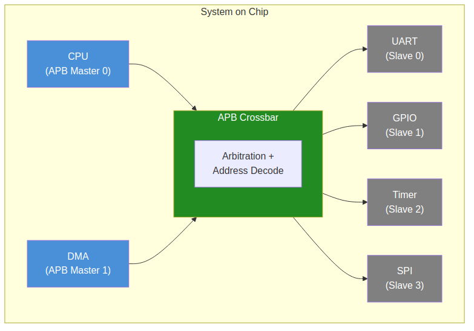

<!-- RTL Design Sherpa Documentation Header -->
<table>
<tr>
<td width="80">
  
</td>
<td>
  <strong>RTL Design Sherpa</strong> · <em>Learning Hardware Design Through Practice</em> 
  
    <a href="https://github.com/sean-galloway/RTLDesignSherpa">GitHub</a> ·
    <a href="https://github.com/sean-galloway/RTLDesignSherpa/blob/main/docs/DOCUMENTATION_INDEX.md">Documentation Index</a> ·
    <a href="https://github.com/sean-galloway/RTLDesignSherpa/blob/main/LICENSE">MIT License</a>
  
</td>
</tr>
</table>

---

<!-- End Header -->

# System Context

## System Context Diagram

The following diagram shows the APB Crossbar in a typical SoC context:

### Figure 2.1: System Context Diagram

## Typical Integration Topology

### Master-Side Connections

The APB Crossbar connects to upstream APB masters:

| Master Type | Typical Source | Connection Point |
|-------------|----------------|------------------|
| CPU | AHB-to-APB Bridge | `m0_apb_*` |
| DMA | DMA Controller APB Port | `m1_apb_*` |
| Debug | Debug Access Port | `m2_apb_*` (if present) |

: Typical Master Connections

### Slave-Side Connections

The crossbar connects to downstream APB peripherals:

| Slave Type | Address Offset | Connection Point |
|------------|----------------|------------------|
| UART | +0x0_0000 | `s0_apb_*` |
| GPIO | +0x1_0000 | `s1_apb_*` |
| Timer | +0x2_0000 | `s2_apb_*` |
| SPI | +0x3_0000 | `s3_apb_*` |

: Typical Slave Connections (1to4 example)

## Interface Boundaries

### Input Boundary (Master-Side)

Each master port presents a complete APB slave interface:

- Receives PSEL, PENABLE, PADDR, PWRITE, PWDATA, PSTRB, PPROT
- Returns PRDATA, PSLVERR, PREADY

### Output Boundary (Slave-Side)

Each slave port presents a complete APB master interface:

- Drives PSEL, PENABLE, PADDR, PWRITE, PWDATA, PSTRB, PPROT
- Receives PRDATA, PSLVERR, PREADY

### Clock and Reset

Single clock domain:
- `pclk` - APB clock (all signals synchronous)
- `presetn` - Active-low asynchronous reset

## System Integration Considerations

### Address Map Planning

The fixed 64KB per-slave allocation requires planning:

1. **Peripheral fit:** Ensure each peripheral needs <= 64KB address space
2. **Base address:** Set `BASE_ADDR` to avoid conflicts with other subsystems
3. **Address width:** `ADDR_WIDTH` must accommodate BASE_ADDR + (NUM_SLAVES x 64KB)

### Multi-Master Considerations

When using multiple masters:

1. **Arbitration overhead:** Expect 1-2 cycle delay on contended access
2. **Priority:** All masters have equal priority (round-robin)
3. **Bandwidth:** Shared access reduces per-master bandwidth

---

**Next:** [Chapter 3: Architecture](../ch03_architecture/01_block_diagram.md)
