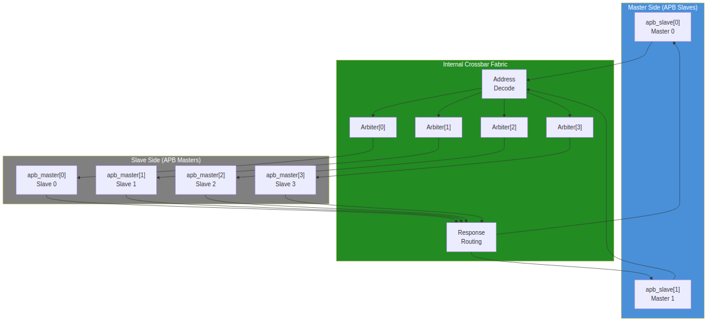

<!-- RTL Design Sherpa Documentation Header -->
<table>
<tr>
<td width="80">
  <a href="https://github.com/sean-galloway/RTLDesignSherpa">
    
  </a>
</td>
<td>
  <strong>RTL Design Sherpa</strong> · <em>Learning Hardware Design Through Practice</em><br>
  <sub>
    <a href="https://github.com/sean-galloway/RTLDesignSherpa">GitHub</a> ·
    <a href="https://github.com/sean-galloway/RTLDesignSherpa/blob/main/docs/DOCUMENTATION_INDEX.md">Documentation Index</a> ·
    <a href="https://github.com/sean-galloway/RTLDesignSherpa/blob/main/LICENSE">MIT License</a>
  </sub>
</td>
</tr>
</table>

---

<!-- End Header -->

# Block Diagram

## Top-Level Architecture

The APB Crossbar consists of three main functional layers:

### Figure 3.1: APB Crossbar Block Diagram



## Functional Blocks

### Master-Side Protocol Conversion

**Component:** `apb_slave[M]` instances (one per master)

Each APB slave instance:
- Accepts incoming APB transactions from a master
- Converts APB protocol to internal command/response format
- Provides transaction buffering
- Generates appropriate response timing

**Interface:**
- Input: Complete APB slave signals from external master
- Output: Internal cmd/rsp bus to crossbar fabric

### Internal Crossbar Fabric

**Components:**
- **Address Decode** - Parallel decode logic
- **Per-Slave Arbiters** - Round-robin arbiter per slave (N instances)
- **Response Routing** - Registered response mux

The crossbar fabric:
1. Decodes transaction address to determine target slave
2. Arbitrates when multiple masters request the same slave
3. Routes commands to the selected slave
4. Routes responses back to the originating master

### Slave-Side Protocol Conversion

**Component:** `apb_master[N]` instances (one per slave)

Each APB master instance:
- Accepts internal cmd/rsp from crossbar fabric
- Generates compliant APB transactions to the slave
- Handles wait states via PREADY
- Propagates error responses via PSLVERR

**Interface:**
- Input: Internal cmd/rsp bus from crossbar fabric
- Output: Complete APB master signals to external slave

## Module Hierarchy

```
apb_xbar_MxN
+-- apb_slave[0..M-1]          # Master-side conversion
+-- addr_decode                 # Parallel address decode
+-- arbiter[0..N-1]            # Per-slave round-robin
+-- response_mux               # Response routing
+-- apb_master[0..N-1]         # Slave-side conversion
```

## Data Path Width

All data paths maintain consistent width:

| Parameter | Default | Range | Description |
|-----------|---------|-------|-------------|
| ADDR_WIDTH | 32 | 8-64 | Address bus width |
| DATA_WIDTH | 32 | 8-64 | Data bus width |
| STRB_WIDTH | 4 | 1-8 | Byte strobe width (DATA_WIDTH/8) |

: Data Path Width Parameters

---

**Next:** [Data Flow](02_data_flow.md)
