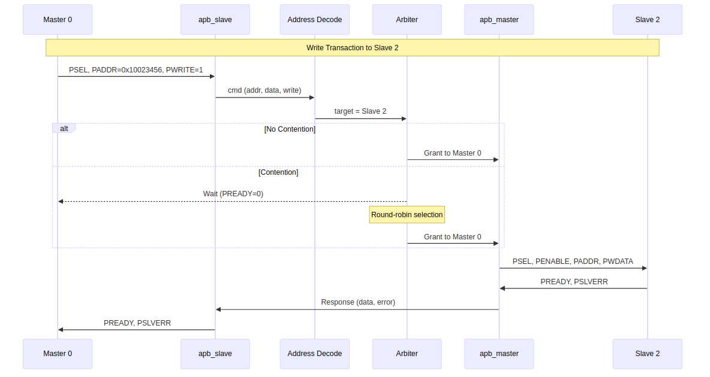

<!-- RTL Design Sherpa Documentation Header -->
<table>
<tr>
<td width="80">
  <a href="https://github.com/sean-galloway/RTLDesignSherpa">
    
  </a>
</td>
<td>
  <strong>RTL Design Sherpa</strong> · <em>Learning Hardware Design Through Practice</em><br>
  <sub>
    <a href="https://github.com/sean-galloway/RTLDesignSherpa">GitHub</a> ·
    <a href="https://github.com/sean-galloway/RTLDesignSherpa/blob/main/docs/DOCUMENTATION_INDEX.md">Documentation Index</a> ·
    <a href="https://github.com/sean-galloway/RTLDesignSherpa/blob/main/LICENSE">MIT License</a>
  </sub>
</td>
</tr>
</table>

---

<!-- End Header -->

# Data Flow

## Transaction Flow Overview

### Figure 3.2: Transaction Data Flow



## Write Transaction Flow

A write transaction flows through the following stages:

### Stage 1: Master Request

The external master initiates an APB write:
1. Master asserts PSEL and PADDR with target address
2. Master sets PWRITE=1 and provides PWDATA
3. Next cycle: Master asserts PENABLE

### Stage 2: Protocol Conversion (Master-Side)

The `apb_slave` module converts to internal format:
1. Captures transaction parameters (address, data, write)
2. Generates internal command
3. Routes to address decode

### Stage 3: Address Decode

Parallel decode determines target slave:
```
slave_index = (PADDR - BASE_ADDR) >> 16
```

### Stage 4: Arbitration (if needed)

If multiple masters target the same slave:
1. Arbiter selects one master (round-robin priority)
2. Other masters wait (PREADY low)
3. Grant held until transaction completes

### Stage 5: Protocol Conversion (Slave-Side)

The `apb_master` module generates APB transaction:
1. Asserts PSEL to selected slave
2. Provides PADDR, PWRITE, PWDATA
3. Asserts PENABLE next cycle
4. Waits for slave PREADY

### Stage 6: Response Return

Response flows back to originating master:
1. Slave asserts PREADY (with optional PSLVERR)
2. `apb_master` captures response
3. Response routed to correct `apb_slave`
4. `apb_slave` asserts PREADY to original master

## Read Transaction Flow

Read transactions follow the same flow with these differences:

- PWRITE=0 indicates read operation
- No PWDATA on forward path
- PRDATA returned on response path

## Timing Summary

| Transaction Phase | Clock Cycles | Notes |
|-------------------|--------------|-------|
| Setup phase | 1 | PSEL asserted, PENABLE low |
| Data phase | 1+ | PENABLE high, wait for PREADY |
| Decode | 0 | Combinational (parallel decode) |
| Arbitration | 0-1 | 0 if uncontended, 1 if contended |

: Transaction Timing Summary

## Back-to-Back Transactions

The crossbar supports zero-bubble back-to-back transactions:

1. Master can assert new PSEL immediately after PREADY
2. Grant persistence eliminates re-arbitration overhead
3. Maximum throughput: 1 transaction per 2 APB cycles

---

**Next:** [Address Mapping](03_address_mapping.md)
