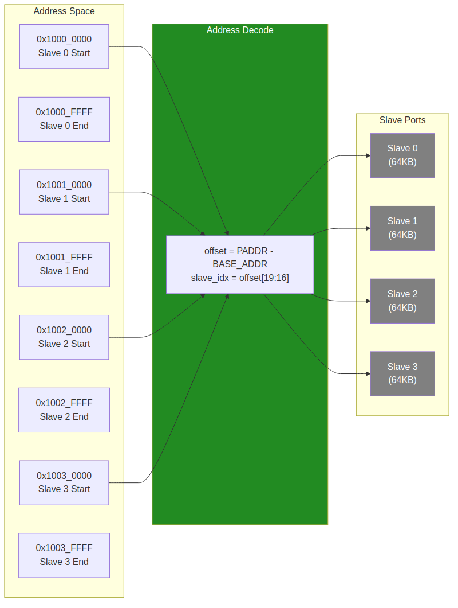

<!-- RTL Design Sherpa Documentation Header -->
<table>
<tr>
<td width="80">
  <a href="https://github.com/sean-galloway/RTLDesignSherpa">
    
  </a>
</td>
<td>
  <strong>RTL Design Sherpa</strong> · <em>Learning Hardware Design Through Practice</em><br>
  <sub>
    <a href="https://github.com/sean-galloway/RTLDesignSherpa">GitHub</a> ·
    <a href="https://github.com/sean-galloway/RTLDesignSherpa/blob/main/docs/DOCUMENTATION_INDEX.md">Documentation Index</a> ·
    <a href="https://github.com/sean-galloway/RTLDesignSherpa/blob/main/LICENSE">MIT License</a>
  </sub>
</td>
</tr>
</table>

---

<!-- End Header -->

# Address Mapping

## Address Map Structure

The APB Crossbar uses a fixed 64KB address region per slave:

### Figure 3.3: Address Mapping Structure



## Default Address Map

With default `BASE_ADDR = 0x1000_0000`:

| Slave Index | Start Address | End Address | Size |
|-------------|---------------|-------------|------|
| 0 | 0x1000_0000 | 0x1000_FFFF | 64KB |
| 1 | 0x1001_0000 | 0x1001_FFFF | 64KB |
| 2 | 0x1002_0000 | 0x1002_FFFF | 64KB |
| 3 | 0x1003_0000 | 0x1003_FFFF | 64KB |
| ... | ... | ... | ... |
| N-1 | BASE + (N-1)*64KB | BASE + N*64KB - 1 | 64KB |

: Default Address Map (4-slave example)

## Address Decode Logic

The target slave is determined by simple bit extraction:

```
offset = PADDR - BASE_ADDR
slave_index = offset[19:16]    // Bits 19:16 select slave (0-15)
local_addr = offset[15:0]      // Bits 15:0 are local address within slave
```

### Example Decode

For address `0x1002_3456` with `BASE_ADDR = 0x1000_0000`:

| Step | Calculation | Result |
|------|-------------|--------|
| 1. Compute offset | 0x1002_3456 - 0x1000_0000 | 0x0002_3456 |
| 2. Extract slave index | offset[19:16] | 0x2 (Slave 2) |
| 3. Extract local address | offset[15:0] | 0x3456 |

: Address Decode Example

## Customizing Base Address

The `BASE_ADDR` parameter shifts the entire address map:

```systemverilog
// Peripheral space at 0x4000_0000
apb_xbar_1to4 #(
    .BASE_ADDR(32'h4000_0000)
) u_xbar (...);

// Resulting map:
// Slave 0: 0x4000_0000 - 0x4000_FFFF
// Slave 1: 0x4001_0000 - 0x4001_FFFF
// Slave 2: 0x4002_0000 - 0x4002_FFFF
// Slave 3: 0x4003_0000 - 0x4003_FFFF
```

## Address Map Constraints

### Fixed Slave Region Size

Each slave occupies exactly 64KB (0x10000 bytes). This is a current design constraint.

**Implications:**
- Peripherals requiring more than 64KB need multiple slave ports
- Peripherals using less than 64KB have unused address space

### Maximum Configuration

With 4-bit slave index extraction:
- Maximum 16 slaves
- Total address space: 16 x 64KB = 1MB

### Address Width Requirement

The `ADDR_WIDTH` parameter must be sufficient to address:
- BASE_ADDR + (NUM_SLAVES x 64KB)

**Example:** For 4 slaves at BASE_ADDR = 0x8000_0000, need:
- 0x8000_0000 + 0x4_0000 = 0x8004_0000
- Minimum ADDR_WIDTH: 32 bits

---

**Next:** [Chapter 4: Interfaces](../ch04_interfaces/01_master_side.md)
