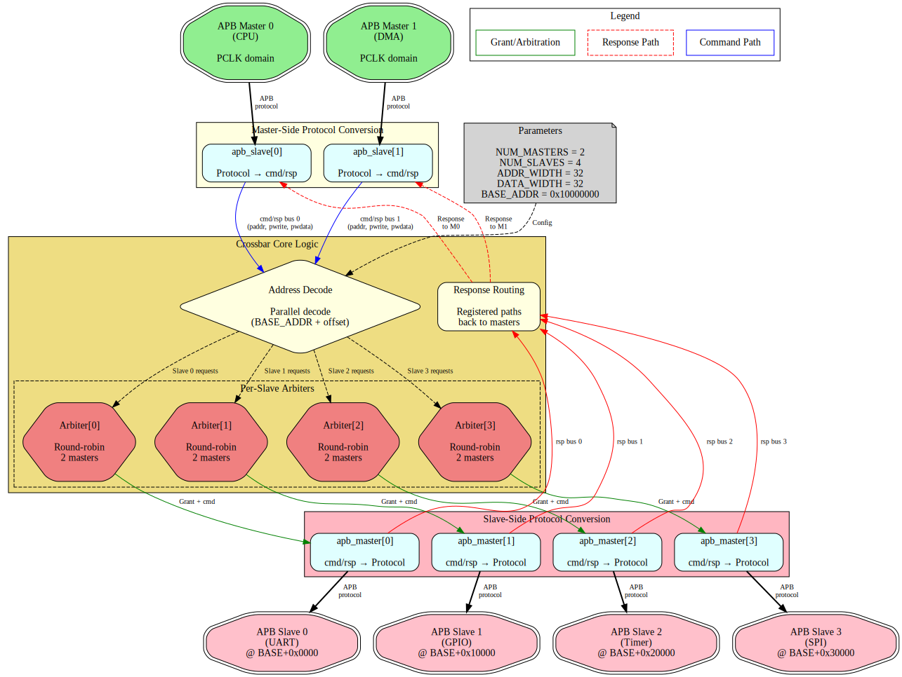

# APB Crossbar Architecture

**Component:** APB Crossbar (MxN Interconnect)
**Version:** 1.0
**Status:** Production Ready

---

## Overview

The APB Crossbar is a parametric interconnect that connects M APB masters to N APB slaves with automatic address-based routing and per-slave round-robin arbitration. Built from proven `apb_slave` and `apb_master` components, the crossbar provides a clean, scalable solution for SoC peripheral interconnect.

**Key Features:**
- Arbitrary MxN configuration (up to 16x16)
- Automatic address decode (64KB per slave)
- Round-robin arbitration per slave
- Zero-bubble throughput
- Grant persistence through transaction completion

---

## Architecture Diagram

The following diagram shows a 2x4 crossbar configuration connecting 2 masters (CPU and DMA) to 4 slaves (UART, GPIO, Timer, SPI):



*Figure: APB Crossbar top-level architecture showing 2 masters connected to 4 slaves via master-side protocol conversion, internal arbitration logic, and slave-side protocol conversion. [Source](../assets/graphviz/apb_xbar_architecture.gv) | [SVG](../assets/svg/apb_xbar_architecture.svg)*

---

## Functional Blocks

### 1. Master-Side Protocol Conversion

**Component:** `apb_slave[M]` instances (one per master)

**Purpose:** Convert incoming APB protocol transactions to internal cmd/rsp bus format

**Features:**
- Full APB protocol handling (PSEL, PENABLE, PREADY)
- Transaction buffering
- Error response generation
- Back-to-back transaction support

**Dataflow:**
```
APB Master → apb_slave → cmd/rsp bus → Internal Crossbar Logic
```

---

### 2. Internal Crossbar Logic

**Components:**
- **Address Decode** - Parallel decode to determine target slave
- **Per-Slave Arbiters** - Round-robin arbitration for each slave
- **Response Routing** - Registered paths back to requesting masters

**Key Operations:**

**Address Decode:**
```
offset = PADDR - BASE_ADDR
slave_index = offset[19:16]  // Upper 4 bits of 20-bit offset (64KB regions)
```

**Arbitration:**
- Independent arbiter per slave
- Round-robin priority rotation
- Grant persistence through response
- No starvation guarantee

**Response Routing:**
- Track which master initiated each transaction
- Route PRDATA/PSLVERR back to originating master
- Maintain transaction ordering per master

---

### 3. Slave-Side Protocol Conversion

**Component:** `apb_master[N]` instances (one per slave)

**Purpose:** Convert internal cmd/rsp bus format back to APB protocol for slaves

**Features:**
- APB protocol generation (PSEL, PENABLE timing)
- Response collection (PRDATA, PSLVERR, PREADY)
- Wait state handling
- Error propagation

**Dataflow:**
```
Internal Crossbar Logic → cmd/rsp bus → apb_master → APB Slave
```

---

## Signal Flow Example

**Transaction:** Master 0 (CPU) writes to Slave 2 (Timer) at address 0x10023456

**Step-by-step:**

1. **Master 0 → apb_slave[0]:**
   - CPU asserts PSEL, PADDR=0x10023456, PWRITE=1
   - apb_slave[0] converts to cmd/rsp format

2. **Address Decode:**
   - offset = 0x10023456 - 0x10000000 = 0x00023456
   - slave_index = 0x00023456 >> 16 = 0x2
   - Target: Slave 2

3. **Arbiter[2]:**
   - Check if Slave 2 is available
   - Grant to Master 0 (if no conflict)
   - Route cmd to apb_master[2]

4. **apb_master[2] → Slave 2:**
   - Generate APB write transaction
   - Assert PSEL[2], PENABLE, PADDR, PWDATA
   - Wait for PREADY

5. **Response Path:**
   - Slave 2 responds with PREADY, PSLVERR
   - apb_master[2] captures response
   - Response routed back to apb_slave[0]
   - apb_slave[0] returns PREADY to CPU

**Total Latency:** Typically 2-3 cycles for uncontended access

---

## Parameter Configuration

**Top-Level Parameters:**

| Parameter | Range | Default | Description |
|-----------|-------|---------|-------------|
| `NUM_MASTERS` | 1-16 | 2 | Number of APB masters |
| `NUM_SLAVES` | 1-16 | 4 | Number of APB slaves |
| `ADDR_WIDTH` | 8-64 | 32 | Address bus width |
| `DATA_WIDTH` | 8-64 | 32 | Data bus width |
| `BASE_ADDR` | Any | 0x10000000 | Base address for address map |

**Derived Parameters:**
- Slave address range: 64KB (0x10000) per slave
- Total address space: NUM_SLAVES × 64KB

---

## Pre-Generated Variants

| Module | M×N | LOC | Use Case |
|--------|-----|-----|----------|
| `apb_xbar_1to1` | 1×1 | ~200 | Passthrough, protocol conversion |
| `apb_xbar_2to1` | 2×1 | ~400 | Multi-master arbitration |
| `apb_xbar_1to4` | 1×4 | ~500 | Simple SoC peripheral bus |
| `apb_xbar_2to4` | 2×4 | ~1000 | Typical SoC with CPU+DMA |
| `apb_xbar_thin` | 1×1 | ~150 | Minimal overhead passthrough |

**Custom Variants:** Generated on-demand via Python script

---

## Design Philosophy

**Proven Components:**
- Built from production-tested `apb_slave.sv` and `apb_master.sv`
- No new protocol logic - pure composition
- Each component independently verified

**Scalability:**
- Parametric generation for any MxN configuration
- Resource usage scales linearly with M×N
- No centralized bottlenecks

**Predictability:**
- Round-robin arbitration provides deterministic behavior
- Fixed address map simplifies software integration
- Zero-bubble design ensures maximum throughput

---

## Next Steps

- See [Address Decode and Arbitration](02_address_and_arbitration.md) for detailed operation examples
- See [PRD.md](../../PRD.md) for complete specification
- See [CLAUDE.md](../../CLAUDE.md) for integration guidance
- See [README.md](../../README.md) for quick start guide

---

**Version:** 1.0
**Last Updated:** 2025-10-25
**Maintained By:** RTL Design Sherpa Project
