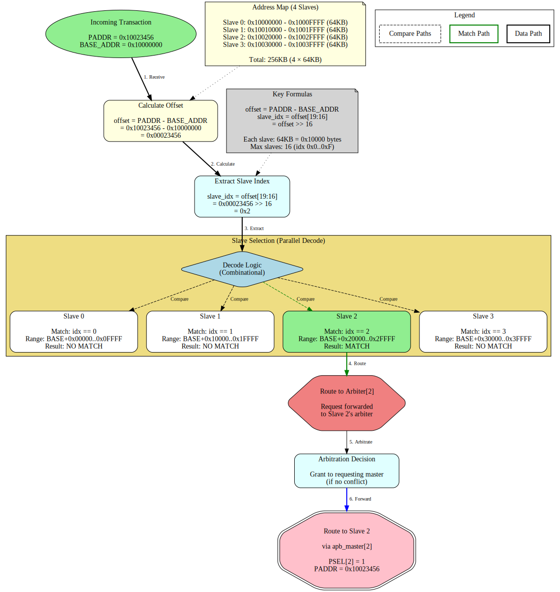

# Address Decode and Arbitration

**Component:** APB Crossbar (MxN Interconnect)
**Version:** 1.0
**Status:** Production Ready

---

## Overview

This document details the two core mechanisms of the APB Crossbar:
1. **Address Decode** - How incoming addresses map to specific slaves
2. **Arbitration** - How multiple masters share access to the same slave

---

## Address Decode

### Address Map Structure

The crossbar uses a fixed 64KB (0x10000 bytes) region per slave:

```
BASE_ADDR + 0x0000_0000 → 0x0000_FFFF : Slave 0 (64KB)
BASE_ADDR + 0x0001_0000 → 0x0001_FFFF : Slave 1 (64KB)
BASE_ADDR + 0x0002_0000 → 0x0002_FFFF : Slave 2 (64KB)
BASE_ADDR + 0x0003_0000 → 0x0003_FFFF : Slave 3 (64KB)
...
BASE_ADDR + 0x000F_0000 → 0x000F_FFFF : Slave 15 (64KB)
```

**Default BASE_ADDR:** 0x10000000

**Total Address Space:** NUM_SLAVES × 64KB

### Decode Algorithm

The crossbar extracts the slave index from the upper bits of the address offset:

```systemverilog
offset = PADDR - BASE_ADDR
slave_index = offset[19:16]  // Upper 4 bits of 20-bit offset
```

**Why offset[19:16]?**
- 64KB = 0x10000 = 2^16 bytes
- Lower 16 bits (offset[15:0]) are byte address within slave
- Upper 4 bits (offset[19:16]) select which of 16 slaves
- Supports up to 16 slaves (0x0 through 0xF)

### Address Decode Flow Diagram

The following diagram shows a concrete example of how address 0x10023456 routes to Slave 2:



*Figure: Address decode flow showing step-by-step routing of address 0x10023456 to Slave 2. [Source](../assets/graphviz/address_decode_flow.gv) | [SVG](../assets/svg/address_decode_flow.svg)*

### Decode Example Walkthrough

**Scenario:** Master accesses address 0x10023456 with BASE_ADDR = 0x10000000

**Step 1: Calculate Offset**
```
offset = PADDR - BASE_ADDR
       = 0x10023456 - 0x10000000
       = 0x00023456
```

**Step 2: Extract Slave Index**
```
slave_index = offset[19:16]
            = 0x00023456 >> 16
            = 0x2
```

**Step 3: Parallel Decode**

The crossbar checks all slave ranges in parallel:
- Slave 0: 0x00000 - 0x0FFFF → NO MATCH
- Slave 1: 0x10000 - 0x1FFFF → NO MATCH
- **Slave 2: 0x20000 - 0x2FFFF → MATCH** ✓
- Slave 3: 0x30000 - 0x3FFFF → NO MATCH

**Step 4: Route to Arbiter**

Transaction request forwarded to Arbiter[2] (Slave 2's arbiter)

**Step 5: Forward to Slave**

After arbitration grant, transaction forwarded via apb_master[2] to physical Slave 2

**Final Address Sent to Slave:** 0x10023456 (full address preserved)

### Multiple Address Maps

You can create multiple distinct address maps by using different BASE_ADDR values:

**Example: Two Crossbars**

```systemverilog
// Peripheral Bus: 0x1000_0000 - 0x1003_FFFF
apb_xbar_1to4 #(
    .BASE_ADDR(32'h1000_0000)
) u_periph_xbar (...);
// Slaves at: 0x1000_0000, 0x1001_0000, 0x1002_0000, 0x1003_0000

// Memory-Mapped I/O: 0x8000_0000 - 0x8003_FFFF
apb_xbar_1to4 #(
    .BASE_ADDR(32'h8000_0000)
) u_mmio_xbar (...);
// Slaves at: 0x8000_0000, 0x8001_0000, 0x8002_0000, 0x8003_0000
```

---

## Arbitration

### Per-Slave Round-Robin

Each slave has an **independent arbiter** that implements round-robin scheduling:

**Key Properties:**
- **Fair:** No master can starve another
- **Independent:** Each slave arbitrates separately
- **Predictable:** Priority rotates after each grant
- **Persistent:** Grant held from command through response

### Round-Robin Timing Diagram

The following timing diagram shows 2 masters (M0, M1) competing for access to Slave 0:


**Source:** [arbitration_round_robin.json](../assets/wavedrom/arbitration_round_robin.json)

### Arbitration Example Walkthrough

**Scenario:** Master 0 and Master 1 both want to access Slave 0

**Initial State:**
- Priority: M0 (M0 has priority initially)
- Slave 0: IDLE

**Transaction 1: M0 Requests Slave 0**
```
Cycle 1: M0 asserts request (M0_PSEL, M0_PADDR=0x1000_0000)
Cycle 2: Arbiter[0] grants to M0 (only requester)
         M0_PENABLE asserted
         S0_PSEL asserted to Slave 0
Cycle 3: Slave 0 responds (S0_PREADY)
         Transaction completes
         Priority rotates: M1 now has priority
```

**Transaction 2: M0 and M1 Both Request Slave 0**
```
Cycle 4: M0 asserts request (M0_PADDR=0x1000_0010)
         M1 asserts request (M1_PADDR=0x1000_0000) -- CONFLICT!
Cycle 5: Arbiter[0] grants to M1 (has priority)
         M1_PENABLE asserted
         S0_PSEL asserted to Slave 0
         M0 blocked, waits
Cycle 6: Slave 0 responds (S0_PREADY)
         M1 transaction completes
         Priority rotates: M0 now has priority
```

**Transaction 3: M0 Request (After Rotation)**
```
Cycle 7: M0 still asserting request (was blocked)
Cycle 8: Arbiter[0] grants to M0 (now has priority)
         M0_PENABLE asserted
         S0_PSEL asserted to Slave 0
Cycle 9: Slave 0 responds (S0_PREADY)
         Transaction completes
         Priority rotates: M1 now has priority
```

**Result:** Fair access - each master gets served in turn when both request

### Multi-Slave Parallelism

**Key Feature:** Different slaves can be accessed simultaneously by different masters

**Example: Parallel Transactions**

```
Time T0:
- Master 0 accesses Slave 0 (UART) - GRANTED
- Master 1 accesses Slave 2 (Timer) - GRANTED
Both transactions proceed in parallel (no conflict)

Time T1:
- Master 0 accesses Slave 0 (UART) - GRANTED
- Master 1 accesses Slave 0 (UART) - BLOCKED (arbitration)
Master 1 waits for Master 0 to complete

Time T2:
- Master 0 completes, releases Slave 0
- Master 1 accesses Slave 0 (UART) - GRANTED
Priority rotated for Slave 0's arbiter
```

**Benefit:** Maximum throughput when masters access different slaves

### Grant Persistence

**Critical Property:** Once granted, a master holds the slave until response completes

**Why This Matters:**

```
WITHOUT Grant Persistence:
- Master 0 granted Slave 0
- Master 0 asserts PENABLE
- *Grant could change here* ← BREAKS PROTOCOL!
- Slave 0 responds to wrong master

WITH Grant Persistence:
- Master 0 granted Slave 0
- Master 0 asserts PENABLE
- Grant held until PREADY asserted ← SAFE
- Slave 0 responds to correct master
- Grant released for next transaction
```

**Implementation:** Grant signal registered and held from PSEL assertion through PREADY response

### Arbitration Latency

**Best Case (No Contention):**
- 0 cycles arbitration delay
- Request → Grant in same cycle
- APB protocol overhead: 2 cycles minimum (PSEL + PENABLE)

**Worst Case (Maximum Contention):**
- M-1 cycles wait time (other masters ahead in round-robin)
- Example: 2 masters, worst case = 1 cycle wait
- Example: 4 masters, worst case = 3 cycles wait

**Average Case (Random Access Pattern):**
- (M-1)/2 cycles average wait time
- Statistical fairness over time

---

## Integration Examples

### Example 1: CPU to 4 Peripherals (No Contention)

```systemverilog
apb_xbar_1to4 #(
    .BASE_ADDR(32'h1000_0000)
) u_periph_xbar (
    // Single master (CPU)
    .m0_apb_* (cpu_apb_*),

    // 4 slaves (UART, GPIO, Timer, SPI)
    .s0_apb_* (uart_*),   // 0x1000_0000
    .s1_apb_* (gpio_*),   // 0x1001_0000
    .s2_apb_* (timer_*),  // 0x1002_0000
    .s3_apb_* (spi_*)     // 0x1003_0000
);
```

**Behavior:**
- No arbitration needed (single master)
- Pure address decode functionality
- Zero arbitration overhead

### Example 2: CPU + DMA to 4 Peripherals (Potential Contention)

```systemverilog
apb_xbar_2to4 #(
    .BASE_ADDR(32'h4000_0000)
) u_soc_xbar (
    // Two masters
    .m0_apb_* (cpu_apb_*),
    .m1_apb_* (dma_apb_*),

    // 4 slaves
    .s0_apb_* (mem_ctrl_*),  // 0x4000_0000
    .s1_apb_* (uart_*),      // 0x4001_0000
    .s2_apb_* (i2c_*),       // 0x4002_0000
    .s3_apb_* (adc_*)        // 0x4003_0000
);
```

**Behavior:**
- Each slave has independent arbiter
- CPU and DMA can access different slaves simultaneously
- If both access same slave, round-robin arbitration
- Fair access guaranteed

---

## Performance Characteristics

### Throughput

**Single Master:**
- Back-to-back transactions supported
- Zero bubble (no idle cycles between transactions)
- Limited only by slave PREADY response time

**Multiple Masters (Same Slave):**
- Round-robin introduces fair sharing
- Each master gets ~1/M of bandwidth
- Example: 2 masters = 50% bandwidth each

**Multiple Masters (Different Slaves):**
- Full parallelism
- Each master gets 100% of its target slave
- Total system bandwidth = NUM_SLAVES × slave_bandwidth

### Latency

**Components:**

1. **Address Decode:** 0 cycles (combinational, parallel)
2. **Arbitration Decision:** 0 cycles (combinational)
3. **APB Protocol:** 2 cycles minimum (PSEL + PENABLE)
4. **Slave Response:** Variable (depends on slave)

**Total Minimum Latency:** 2 cycles (uncontended access)

**With Contention:** +1 to +(M-1) cycles arbitration wait time

---

## Design Notes

### Why 64KB Per Slave?

**Rationale:**
- Sufficient for most APB peripherals (typically 256B - 4KB register space)
- Simple decode logic (single shift operation)
- Allows up to 16 slaves with clean byte alignment
- Software-friendly (each peripheral has "round" base address)

**Alternatives:**
- Smaller regions (4KB, 16KB) → more slaves, more complex decode
- Larger regions (256KB, 1MB) → fewer slaves, wasted address space

### Why Round-Robin?

**Advantages:**
- Fair: Prevents starvation
- Simple: Minimal logic (counter + comparator)
- Predictable: Software can reason about worst-case latency
- No configuration: Works out-of-box

**Alternatives:**
- Fixed priority → Can starve low-priority masters
- Weighted fair queuing → More complex, requires configuration
- Lottery scheduling → Unpredictable, harder to verify

---

## Troubleshooting

### Issue: Wrong Slave Selected

**Check:**
1. BASE_ADDR parameter correct?
2. Address within expected range?
3. Calculated slave_index matches expectation?

**Debug:**
```systemverilog
offset = PADDR - BASE_ADDR
slave_index = offset >> 16
expected_slave = slave_index  // Should match actual PSEL
```

### Issue: Master Starved

**Check:**
1. Other masters continuously accessing same slave?
2. Arbitration timeout monitoring enabled?
3. Round-robin priority rotating correctly?

**Expected Behavior:**
- Each master should get grant within M transactions
- No master should wait indefinitely

### Issue: Back-to-Back Transactions Stalling

**Check:**
1. Grant persistence working?
2. Slave asserting PREADY correctly?
3. No unintended pipeline bubbles?

**Expected Behavior:**
- Consecutive transactions from same master should flow without gaps
- Only arbitration conflicts should introduce wait states

---

## Next Steps

- See [Architecture](01_architecture.md) for top-level design overview
- See [PRD.md](../../PRD.md) for complete specification
- See [CLAUDE.md](../../CLAUDE.md) for integration guidance
- See [README.md](../../README.md) for quick start guide

---

**Version:** 1.0
**Last Updated:** 2025-10-25
**Maintained By:** RTL Design Sherpa Project
