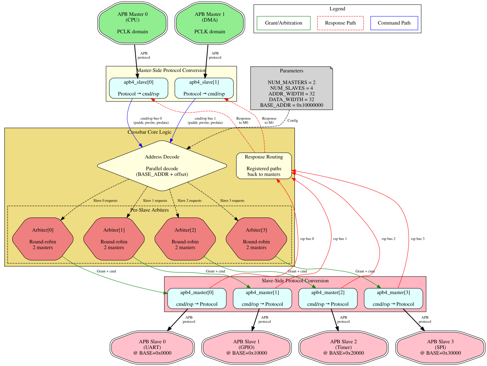
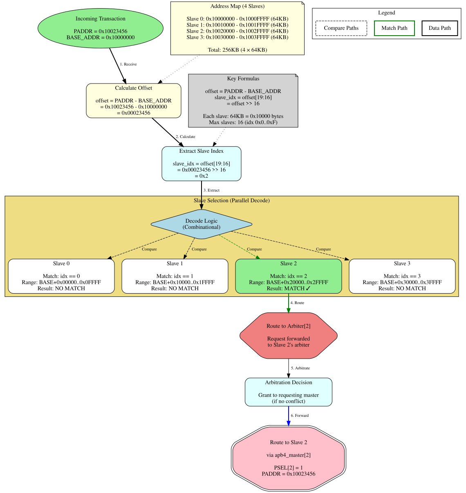
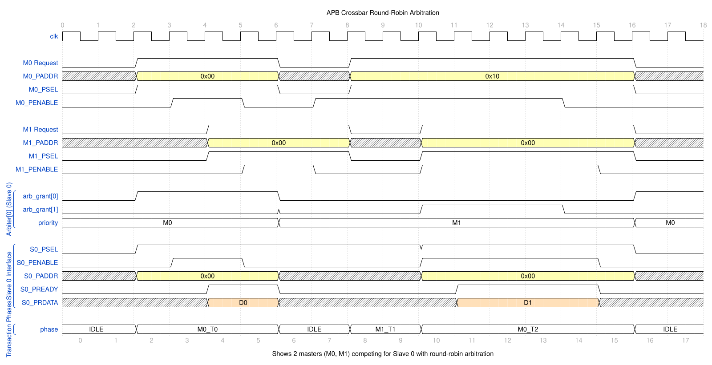

<!-- RTL Design Sherpa Documentation Header -->
<table>
<tr>
<td width="80">
  <a href="https://github.com/sean-galloway/RTLDesignSherpa">
    
  </a>
</td>
<td>
  <strong>RTL Design Sherpa</strong> · <em>Learning Hardware Design Through Practice</em><br>
  <sub>
    <a href="https://github.com/sean-galloway/RTLDesignSherpa">GitHub</a> ·
    <a href="https://github.com/sean-galloway/RTLDesignSherpa/blob/main/docs/DOCUMENTATION_INDEX.md">Documentation Index</a> ·
    <a href="https://github.com/sean-galloway/RTLDesignSherpa/blob/main/LICENSE">MIT License</a>
  </sub>
</td>
</tr>
</table>

---

<!-- End Header -->

# Product Requirements Document (PRD)
## APB Crossbar Generator

**Version:** 1.0
**Date:** 2025-10-19
**Status:** Production Ready
**Owner:** RTL Design Sherpa Project
**Parent Document:** `/PRD.md`

---

## 1. Executive Summary

The **APB Crossbar** is a parametric APB interconnect generator that creates configurable MxN crossbar fabrics for connecting multiple APB masters to multiple APB slaves. Built using proven `apb4_slave` and `apb4_master` modules, the crossbar provides independent round-robin arbitration per slave and automatic address-based routing.

### 1.1 Quick Stats

- **Modules:** 6 pre-generated variants + generator for custom sizes
- **Max Capacity:** Up to 16x16 (configurable)
- **Architecture:** apb4_slave → arbitration + decode → apb4_master
- **Status:** Production ready, all tests passing
- **Generator:** Python-based parametric code generation

### 1.2 Project Goals

- **Primary:** Provide production-quality APB interconnect for SoC integration
- **Secondary:** Demonstrate parametric RTL generation best practices
- **Tertiary:** Support both fixed and dynamically-generated variants

---

## 2. Key Design Principles

### 2.1 Architecture Philosophy

**Proven Building Blocks:**
- Uses `apb4_slave.sv` and `apb4_master.sv` from rtl/amba/apb4
- Each module independently tested and production-proven
- Crossbar = composition of proven components

**Parametric Generation:**
- Generator creates any MxN configuration
- Pre-generated common variants (1to1, 2to1, 1to4, 2to4, thin)
- Custom variants generated on-demand

**Clean Separation:**
- Master-side: APB slaves convert protocol to cmd/rsp
- Internal: Arbitration + address decoding
- Slave-side: APB masters convert cmd/rsp back to protocol

### 2.2 Design Trade-offs

| Feature | Choice | Rationale |
|---------|--------|-----------|
| **Arbitration** | Round-robin per slave | Fair, simple, predictable |
| **Address Map** | 64KB per slave | Sufficient for most peripherals |
| **Grant Persistence** | Hold through response | One transaction per grant; mask rotates after |
| **Address Decode** | Parallel decode | Low latency, simple logic |

---

## 3. Architecture Overview

### 3.1 Top-Level Block Diagram

```
APB Crossbar (M masters × N slaves)
┌─────────────────────────────────────────────────────────────────┐
│                                                                  │
│  Master-Side (APB slaves)                                        │
│  ┌──────────────┐  ┌──────────────┐       ┌──────────────┐     │
│  │ apb4_slave[0] │  │ apb4_slave[1] │  ...  │ apb4_slave[M-1]│     │
│  │ (Master 0)   │  │ (Master 1)   │       │ (Master M-1)  │     │
│  └──────┬───────┘  └──────┬───────┘       └──────┬────────┘     │
│         │                  │                      │              │
│         └──────────────────┴──────────────────────┘              │
│                            │                                     │
│                     cmd/rsp buses                                │
│                            │                                     │
│         ┌──────────────────┴──────────────────────┐              │
│         │                                          │              │
│  ┌──────▼──────┐  ┌──────────────┐  ┌────────────▼──┐          │
│  │ Address     │  │ Arbitration  │  │ Response       │          │
│  │ Decode      │  │ per Slave    │  │ Routing        │          │
│  │ (parallel)  │  │ (round-robin)│  │ (registered)   │          │
│  └──────┬──────┘  └──────┬───────┘  └────────┬───────┘          │
│         │                 │                   │                  │
│         └─────────────────┴───────────────────┘                  │
│                            │                                     │
│                     cmd/rsp buses                                │
│                            │                                     │
│         ┌──────────────────┴──────────────────────┐              │
│         │                  │                      │              │
│  ┌──────▼───────┐  ┌──────▼───────┐       ┌──────▼────────┐    │
│  │ apb4_master[0]│  │ apb4_master[1]│  ...  │ apb4_master[N-1]│    │
│  │ (Slave 0)    │  │ (Slave 1)    │       │ (Slave N-1)    │    │
│  └──────────────┘  └──────────────┘       └───────────────┘    │
│                                                                  │
│  Slave-Side (APB masters)                                        │
└──────────────────────────────────────────────────────────────────┘
```


*Figure: APB Crossbar top-level architecture showing 2 masters connected to 4 slaves. [Source: docs/apbx_xbar_mas/assets/graphviz/apbx_xbar_architecture.gv](docs/apbx_xbar_mas/assets/graphviz/apbx_xbar_architecture.gv) | [SVG](docs/apbx_xbar_mas/assets/svg/apbx_xbar_architecture.svg)*

### 3.2 Address Mapping

```
BASE_ADDR + 0x0000_0000 → 0x0000_FFFF : Slave 0 (64KB)
BASE_ADDR + 0x0001_0000 → 0x0001_FFFF : Slave 1 (64KB)
BASE_ADDR + 0x0002_0000 → 0x0002_FFFF : Slave 2 (64KB)
BASE_ADDR + 0x0003_0000 → 0x0003_FFFF : Slave 3 (64KB)
...
BASE_ADDR + 0x000F_0000 → 0x000F_FFFF : Slave 15 (64KB)
```

**Default BASE_ADDR:** 0x1000_0000

**Address Decode Example:**

The crossbar extracts the slave index from the upper bits of the address offset:
```
slave_index = (address - BASE_ADDR) >> 16  // Divide by 64KB (0x10000)
```


*Figure: Address decode flow showing how address 0x10023456 routes to Slave 2. [Source: docs/apbx_xbar_mas/assets/graphviz/address_decode_flow.gv](docs/apbx_xbar_mas/assets/graphviz/address_decode_flow.gv) | [SVG](docs/apbx_xbar_mas/assets/svg/address_decode_flow.svg)*

### 3.3 Arbitration Strategy

**Per-Slave Round-Robin:**
- Each slave has independent arbiter
- Master priority rotates after each grant
- Grant held from command acceptance through response completion
- No master can starve another master

**Example:**
```
Slave 0 accessed by M0, M1, M0 → Next grant goes to M1
Slave 1 accessed by M1, M1, M0 → Next grant goes to M1
  (the winner cannot immediately re-win: after an M0 grant the
   mask leaves only M1 eligible)
```


*Figure: Round-robin arbitration timing showing 2 masters competing for Slave 0. Master priority rotates after each grant to ensure fair access. [Source: docs/apbx_xbar_mas/assets/wavedrom/arbitration_round_robin.json](docs/apbx_xbar_mas/assets/wavedrom/arbitration_round_robin.json)*

---

## 4. Available Variants

### 4.1 Pre-Generated Modules

| Module | Masters | Slaves | Use Case | File Size |
|--------|---------|--------|----------|-----------|
| **apbx_xbar_1to1** | 1 | 1 | Protocol conversion, testing | ~200 LOC |
| **apbx_xbar_2to1** | 2 | 1 | Multi-master arbitration | ~400 LOC |
| **apbx_xbar_1to4** | 1 | 4 | Address decode, simple SoC | ~500 LOC |
| **apbx_xbar_2to4** | 2 | 4 | Full crossbar, typical SoC | ~1000 LOC |
| **apbx_xbar_2to2_mixed** | 2 | 2 | Mixed APB4/APB5 (s0 is APB5) | ~570 LOC |
| **apbx_xbar_thin** *(RETIRED 2026-08-27)* | `M` (dflt 2) | `S` (dflt 4) | Parameterized MxS, WEIGHTED RR, per-slave base/limit PORTS, APB5+parity | ~300 LOC |

### 4.2 Wrapper Modules

Pre-configured wrappers for common topologies:

| Wrapper | Configuration | Purpose |
|---------|---------------|---------|
| `apbx_xbar_1to1_wrap` | 1×1 | Simple connection |
| `apbx_xbar_2to1_wrap` | 2×1 | Dual-master arbitration |
| `apbx_xbar_1to4_wrap` | 1×4 | Single-master decode |
| `apbx_xbar_2to4_wrap` | 2×4 | Full SoC crossbar |
| `apbx_xbar_wrap_m10_s10` | 10×10 | Large crossbar |
| `apbx_xbar_thin_wrap_m10_s10` | 10×10 | Minimal version |

---

## 5. Functional Requirements

### FR-1: Arbitrary MxN Configuration
**Priority:** P0 (Critical)
**Status:** ✅ Implemented and verified

**Description:** Generate crossbar for any M masters and N slaves (up to 16x16)

**Verification:** Generator creates valid RTL for all tested configurations

### FR-2: Round-Robin Arbitration
**Priority:** P0 (Critical)
**Status:** ✅ Implemented and verified

**Description:** Fair per-slave arbitration with rotating master priority

**Verification:** Arbitration stress tests (130+ transactions for 2to1)

### FR-3: Address-Based Routing
**Priority:** P0 (Critical)
**Status:** ✅ Implemented and verified

**Description:** Automatic slave selection based on address ranges

**Verification:** Address decode validation (200+ transactions for 1to4)

### FR-4: Back-to-Back Transactions
**Priority:** P1 (High)
**Status:** ✅ Implemented and verified

**Description:** Consecutive transactions are accepted with no
master-side idle cycles required. They do NOT overlap inside the
fabric -- `apb4_slave` is one-command-at-a-time, so sustained cadence
equals single-transfer latency (~10 pclk cycles, HAS 5.1/5.2).

**Verification:** Performance tests show consecutive transactions

### FR-5: Configurable Address Map
**Priority:** P1 (High)
**Status:** ✅ Implemented and verified

**Description:** BASE_ADDR parameter sets base of address map

**Verification:** Tests with multiple BASE_ADDR values

---

## 6. Interface Specifications

### 6.1 Master-Side Interface (APB Slave)

Per-master APB slave interface:

```systemverilog
input  logic                    m<i>_apb_PSEL
input  logic                    m<i>_apb_PENABLE
input  logic [ADDR_WIDTH-1:0]   m<i>_apb_PADDR
input  logic                    m<i>_apb_PWRITE
input  logic [DATA_WIDTH-1:0]   m<i>_apb_PWDATA
input  logic [STRB_WIDTH-1:0]   m<i>_apb_PSTRB
input  logic [2:0]              m<i>_apb_PPROT
output logic [DATA_WIDTH-1:0]   m<i>_apb_PRDATA
output logic                    m<i>_apb_PSLVERR
output logic                    m<i>_apb_PREADY
```

### 6.2 Slave-Side Interface (APB Master)

Per-slave APB master interface:

```systemverilog
output logic                    s<j>_apb_PSEL
output logic                    s<j>_apb_PENABLE
output logic [ADDR_WIDTH-1:0]   s<j>_apb_PADDR
output logic                    s<j>_apb_PWRITE
output logic [DATA_WIDTH-1:0]   s<j>_apb_PWDATA
output logic [STRB_WIDTH-1:0]   s<j>_apb_PSTRB
output logic [2:0]              s<j>_apb_PPROT
input  logic [DATA_WIDTH-1:0]   s<j>_apb_PRDATA
input  logic                    s<j>_apb_PSLVERR
input  logic                    s<j>_apb_PREADY
```

---

## 7. Parameter Configuration

| Parameter | Type | Default | Range | Description |
|-----------|------|---------|-------|-------------|
| `ADDR_WIDTH` | int | 32 | 18-64 for multi-slave variants (the decode part-select needs bit 17); 1-64 for 1to1/2to1 | Address bus width |
| `DATA_WIDTH` | int | 32 | 8,16,32,64 | Data bus width |
| `STRB_WIDTH` | int | DATA_WIDTH/8 | - | Strobe width (auto-calc) |
| `BASE_ADDR` | logic [ADDR_WIDTH-1:0] | 0x10000000 | Any | Base address for slave map |

---

## 8. Generator Usage

### 8.1 Pre-Generated Variants

Use existing modules directly:

```bash
# Available in projects/components/apbx-xbar/rtl/
apbx_xbar_1to1.sv
apbx_xbar_2to1.sv
apbx_xbar_1to4.sv
apbx_xbar_2to4.sv
apbx_xbar_thin.sv
```

### 8.2 Custom Generation

Generate custom MxN crossbar:

```bash
cd projects/components/apbx-xbar/bin/
python generate_xbars.py --masters 3 --slaves 6
python generate_xbars.py --masters 4 --slaves 8 --base-addr 0x80000000
```

### 8.3 Generator Options

```bash
python generate_xbars.py --help

Options:
  --masters M       Number of masters (1-16)
  --slaves N        Number of slaves (1-16)
  --base-addr ADDR  Base address (default: 0x10000000)
```

---

## 9. Performance Characteristics

### 9.1 Latency

| Path | Latency | Notes |
|------|---------|-------|
| **Command path** | 7 cycles | master APB phases (2) + apb4_slave capture and cmd skid (2) + apb4_master IDLE/SETUP/ACCESS (3) |
| **Response path** | 3 cycles | slave response + rsp skid + apb4_slave BUSY→PREADY |
| **Total** | **10 cycles** | measured, uncontended, zero-wait slave |

APB's 2-cycle minimum applies to a directly-attached slave, not through
this fabric: the crossbar converts APB→cmd/rsp→APB across registered
skid buffers in both directions. See HAS 5.2 for the cycle-by-cycle
breakdown and the measurement.

### 9.2 Throughput

- **Back-to-back transactions:** Supported, but not overlapped --
  `apb4_slave` is a one-command-at-a-time FSM, so the next command is
  captured only after the previous transaction completes
- **Maximum rate:** ~1 transaction per 10 pclk cycles per master (no overlap, so cadence equals latency)
  (measured back-to-back at an always-ready slave)

### 9.3 Resource Utilization (Estimated)

See HAS ch05_performance/03_resources.md -- that table is the single
source of truth. An earlier duplicate here quoted figures 2-3x smaller
in every cell; both were unsourced hand estimates, so the duplicate is
withdrawn rather than reconciled.


## 10. Verification Status

### 10.1 Test Coverage

| Test | Transactions | Status | Coverage |
|------|--------------|--------|----------|
| **test_apbx_xbar_1to1** | 100+ | ✅ Pass | Basic connectivity |
| **test_apbx_xbar_2to1** | 130+ | ✅ Pass | Arbitration stress |
| **test_apbx_xbar_1to4** | 200+ | ✅ Pass | Address decode |
| **test_apbx_xbar_2to4** | 350+ | ✅ Pass | Full crossbar stress |

**Overall:** 100% passing, >750 total transactions tested

### 10.2 Test Methodology

**Test Structure:**
- CocoTB framework
- Random transaction generation
- Variable delay profiles
- Address range validation
- Arbitration fairness checks

**Verification Points:**
- Correct address routing
- Round-robin arbitration
- Response integrity
- Back-to-back transactions
- Error propagation

---

## 11. Integration Guide

### 11.1 Simple Integration (1to4)

```systemverilog
apbx_xbar_1to4 #(
    .ADDR_WIDTH(32),
    .DATA_WIDTH(32),
    .BASE_ADDR(32'h1000_0000)
) u_xbar (
    .pclk(apb_clk),
    .presetn(apb_rst_n),

    // Master interface
    .m0_apb_PSEL(cpu_psel),
    .m0_apb_PENABLE(cpu_penable),
    .m0_apb_PADDR(cpu_paddr),
    .m0_apb_PWRITE(cpu_pwrite),
    .m0_apb_PWDATA(cpu_pwdata),
    .m0_apb_PSTRB(cpu_pstrb),
    .m0_apb_PPROT(cpu_pprot),
    .m0_apb_PRDATA(cpu_prdata),
    .m0_apb_PSLVERR(cpu_pslverr),
    .m0_apb_PREADY(cpu_pready),

    // Slave 0: UART (0x1000_0000 - 0x1000_FFFF)
    .s0_apb_PSEL(uart_psel),
    .s0_apb_PENABLE(uart_penable),
    // ... (similar connections)

    // Slave 1: GPIO (0x1001_0000 - 0x1001_FFFF)
    .s1_apb_PSEL(gpio_psel),
    // ... (similar connections)

    // Slave 2: Timer (0x1002_0000 - 0x1002_FFFF)
    // Slave 3: SPI (0x1003_0000 - 0x1003_FFFF)
);
```

### 11.2 Multi-Master Integration (2to4)

```systemverilog
apbx_xbar_2to4 #(
    .ADDR_WIDTH(32),
    .DATA_WIDTH(32),
    .BASE_ADDR(32'h1000_0000)
) u_xbar (
    .pclk(apb_clk),
    .presetn(apb_rst_n),

    // Master 0: CPU
    .m0_apb_PSEL(cpu_psel),
    // ... (full interface)

    // Master 1: DMA
    .m1_apb_PSEL(dma_psel),
    // ... (full interface)

    // Slaves 0-3: Peripherals
    // ... (slave connections)
);
```

---

## 12. Design Constraints

### 12.1 Limitations

| Constraint | Value | Rationale |
|------------|-------|-----------|
| **Max masters** | 16 | Generator limit (configurable) |
| **Max slaves** | 16 | Generator limit (configurable) |
| **Slave region size** | 64KB | Fixed per slave |
| **No slave disable** | N/A | All slaves always active |
| **No timeout** | N/A | Assumes slaves always respond |

### 12.2 Assumptions

1. **Slave responses:** All slaves respond eventually (no timeout handling)
2. **Address ranges:** Slaves occupy 64KB regions starting at BASE_ADDR
3. **APB compliance:** All masters and slaves follow APB protocol
4. **Single clock domain:** All signals synchronous to pclk

---

## 13. Future Enhancements

### 13.1 Potential Features

- **Configurable slave region sizes:** Not just 64KB
- **Slave enable/disable:** Dynamic slave activation
- **Timeout detection:** Watchdog for hung slaves
- **Transaction ordering:** Optional in-order completion
- **Priority arbitration:** Weighted instead of round-robin  *(already implemented in `apbx_xbar_thin` via `THRESHOLDS`; this item covers the generated MtoN variants.)*

### 13.2 Generator Improvements

- **HDL output formats:** Support Verilog, VHDL, Chisel
- **Automated testing:** Generate tests alongside RTL
- **Documentation generation:** Auto-generate integration guides
- **Synthesis scripts:** Generate vendor-specific scripts

---

## 14. References

### 14.1 Internal Documentation

- `README.md` - Quick start guide
- `CLAUDE.md` - AI assistant guidelines
- `bin/generate_xbars.py` - Generator script
- `dv/tests/` - Test implementations

### 14.2 External Standards

- **AMBA APB Protocol v2.0** - ARM IHI 0024C
- **APB4 Extensions** - AMBA 5 specification

### 14.3 Related Components

- `rtl/amba/apb4/apb4_slave.sv` - Master-side building block
- `rtl/amba/apb4/apb4_master.sv` - Slave-side building block
- `projects/components/apbx-xbar/bin/apbx_xbar_generator.py` - Main generator

---

**Document Version:** 1.0
**Last Review:** 2025-10-19
**Next Review:** 2026-01-01
**Maintained By:** RTL Design Sherpa Project
