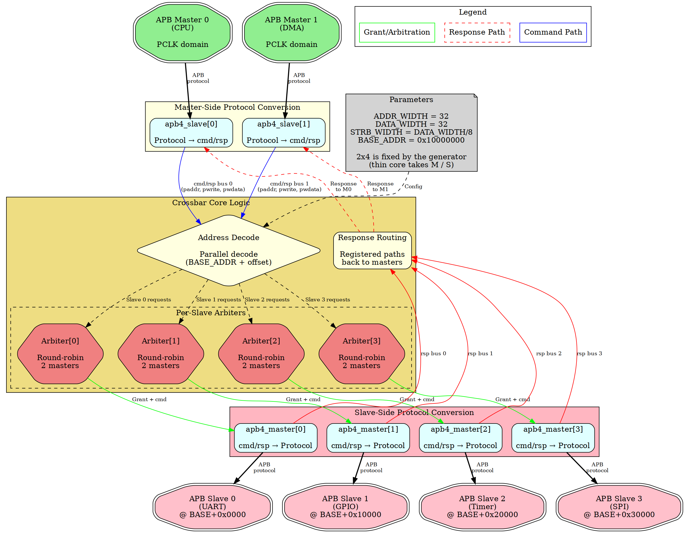

<!-- RTL Design Sherpa Documentation Header -->
<table>
<tr>
<td width="80">
  <a href="https://github.com/sean-galloway/RTLDesignSherpa">
    
  </a>
</td>
<td>
  <strong>RTL Design Sherpa</strong> · <em>Learning Hardware Design Through Practice</em><br>
  <sub>
    <a href="https://github.com/sean-galloway/RTLDesignSherpa">GitHub</a> ·
    <a href="https://github.com/sean-galloway/RTLDesignSherpa/blob/main/docs/DOCUMENTATION_INDEX.md">Documentation Index</a> ·
    <a href="https://github.com/sean-galloway/RTLDesignSherpa/blob/main/LICENSE">MIT License</a>
  </sub>
</td>
</tr>
</table>

---

<!-- End Header -->

# APB Crossbar Architecture

**Component:** APB Crossbar (MxN Interconnect)
**Version:** 1.0
**Status:** Production Ready

---

## Overview

The APB Crossbar is a parametric interconnect that connects M APB masters to N APB slaves with automatic address-based routing and per-slave round-robin arbitration. Built from proven `apb4_slave` and `apb4_master` components, the crossbar provides a clean, scalable solution for SoC peripheral interconnect.

**Key Features:**
- Arbitrary MxN configuration (up to 16x16)
- Automatic address decode (64KB per slave)
- Round-robin arbitration per slave
- Back-to-back transactions (no overlap; 10 pclk cycles each for M = 1,
  11 when arbitrated)
- Grant persistence through transaction completion

---

## Architecture Diagram

The following diagram shows a 2x4 crossbar configuration connecting 2 masters (CPU and DMA) to 4 slaves (UART, GPIO, Timer, SPI):

### Figure 1.1: APB Crossbar Top-Level Architecture



The figure shows 2 masters connected to 4 slaves via master-side protocol conversion, internal arbitration logic, and slave-side protocol conversion.

---

## Functional Blocks

### 1. Master-Side Protocol Conversion

**Component:** `apb4_slave[M]` instances (one per master)

**Purpose:** Convert incoming APB protocol transactions to internal cmd/rsp bus format

**Features:**
- Full APB protocol handling (PSEL, PENABLE, PREADY)
- Transaction buffering
- Error response generation
- Back-to-back transaction support

**Dataflow:**
```
APB Master → apb4_slave → cmd/rsp bus → Internal Crossbar Logic
```

---

### 2. Internal Crossbar Logic

**Components:**
- **Address Decode** - Parallel decode to determine target slave
- **Per-Slave Arbiters** - Round-robin arbitration for each slave
- **Response Routing** - Registered paths back to requesting masters

**Key Operations:**

**Address Decode:**
```
offset = PADDR - BASE_ADDR
slave_index = offset[16 +: $clog2(S)]  // [17:16] for S=4, [16] for S=2
```

**Arbitration:**
- Independent arbiter per slave
- Round-robin priority rotation
- Grant persistence through response
- No starvation guarantee

**Response Routing:**
- Track which master initiated each transaction
- Route PRDATA/PSLVERR back to originating master
- Maintain transaction ordering per master

---

### 3. Slave-Side Protocol Conversion

**Component:** `apb4_master[N]` instances (one per slave)

**Purpose:** Convert internal cmd/rsp bus format back to APB protocol for slaves

**Features:**
- APB protocol generation (PSEL, PENABLE timing)
- Response collection (PRDATA, PSLVERR, PREADY)
- Wait state handling
- Error propagation

**Dataflow:**
```
Internal Crossbar Logic → cmd/rsp bus → apb4_master → APB Slave
```

---

## Signal Flow Example

**Transaction:** Master 0 (CPU) writes to Slave 2 (Timer) at address 0x10023456

**Step-by-step:**

1. **Master 0 → apb4_slave[0]:**
   - CPU asserts PSEL, PADDR=0x10023456, PWRITE=1
   - apb4_slave[0] converts to cmd/rsp format

2. **Address Decode:**
   - offset = 0x10023456 - 0x10000000 = 0x00023456
   - slave_index = 0x00023456 >> 16 = 0x2
   - Target: Slave 2

3. **Arbiter[2]:**
   - Check if Slave 2 is available
   - Grant to Master 0 (if no conflict)
   - Route cmd to apb4_master[2]

4. **apb4_master[2] → Slave 2:**
   - Generate APB write transaction
   - Assert PSEL[2], PENABLE, PADDR, PWDATA
   - Wait for PREADY

5. **Response Path:**
   - Slave 2 responds with PREADY, PSLVERR
   - apb4_master[2] captures response
   - Response routed back to apb4_slave[0]
   - apb4_slave[0] returns PREADY to CPU

**Total Latency:** 9 cycles SETUP-to-PREADY uncontended on a single-master variant, 10 when arbitrated; sustained back-to-back cadence is 10 and 11 respectively (measured; see 2.x -- the fabric's boundary IP and registered skid buffers dominate, not APB's 2-cycle protocol minimum)

---

## Parameter Configuration

Every variant has its M×N **baked in** by the generator, so there is no
port-count parameter to override at elaboration — a different shape means
regenerating, not re-elaborating. What remains parameterizable:

| Parameter | Range | Default | Description |
|-----------|-------|---------|-------------|
| `ADDR_WIDTH` | 18-64 (decoding variants); 1-64 (1to1/2to1) | 32 | Address bus width |
| `DATA_WIDTH` | 8-64 | 32 | Data bus width |
| `STRB_WIDTH` | derived | `DATA_WIDTH/8` | Write strobe width |
| `BASE_ADDR` | any except the top S x 64KB (where BASE+span wraps 32-bit) | 0x10000000 | Base of the slave address map |

: Generated-Variant Parameters

Port counts, per-slave window size and APB version per port are
generator inputs, not parameters — see chapter 3.

**Derived:**
- Slave address range: 64KB (0x10000) per slave, as the shipped variants
  are generated (the generator's own default window is 4KB)
- Total address space: S × 64KB

---

## APB5 Parity Across the Fabric

Parity is carried only between two APB5 ports. A **mixed pairing ignores
parity entirely**, gated by the same `MST_APB5`/`SLV_APB5` masks as the
rest of the APB5 sideband — there is no separate policy knob.

On an APB5→APB5 path the fabric **checks and regenerates**, and its
architecture leaves no alternative. The boundary IP deconstructs each
transfer into cmd/rsp, and the parity bits do not cross that interface:
`apb5_slave` checks on the way in, `apb5_master` regenerates on the way
out. The cmd/rsp fabric between them is therefore **outside the
protected domain** — corruption *inside* that span is invisible, because
the regenerated bit is correct by construction and masks it. That span
is documented rather than hidden, and because of it each port brings its
`parity_error_*` flag out individually: a check whose result goes
nowhere is not protection.

The error flags are deliberately **not** folded into `PSLVERR`, which
would make a fabric fault indistinguishable from the slave's own error
response.

Formal coverage: `formal/apbx_xbar/apbx_xbar_2to2_mixed/` proves the
mixed configuration as of 2026-08-29, replacing the proof lost with the
thin core on 2026-08-27. Note it proves the SIDEBAND gate, not a parity
gate -- a mixed pairing carries no parity at all here, so there is no
parity property left to state. The generated variants are instantiated
with `ENABLE_PARITY=0`, and the APB4-port never-sees-parity question the
thin core answered does not arise when the port has no parity pins.

---

## Pre-Generated Variants

| Module | M×N | Use Case |
|--------|-----|----------|
| `apbx_xbar_1to1` | 1×1 | Passthrough, protocol conversion |
| `apbx_xbar_2to1` | 2×1 | Multi-master arbitration |
| `apbx_xbar_1to4` | 1×4 | Simple SoC peripheral bus |
| `apbx_xbar_2to4` | 2×4 | Typical SoC with CPU+DMA |
| `apbx_xbar_2to2_mixed` | 2×2 | Mixed APB4/APB5 ports, version gating |

LOC per variant is in HAS ch05_performance/03_resources.md, which is the
single source of truth for it. The column that used to sit here went stale
within two days of being reconciled.

: Pre-Generated Crossbar Variants

**Custom Variants:** Generated on-demand via Python script

---

## Design Philosophy

**Proven Components:**
- Built from production-tested `apb4_slave.sv` and `apb4_master.sv`
- No new protocol logic - pure composition
- Each component independently verified

**Scalability:**
- Parametric generation for any MxN configuration
- Resource usage scales linearly with M×N
- No centralized bottlenecks

**Predictability:**
- Round-robin arbitration provides deterministic behavior
- Fixed address map simplifies software integration
- Deterministic transfer cost: 9 pclk cycles SETUP-to-PREADY (10 back-to-
  back) with one master, 10 (11 back-to-back) when arbitrated

---

## Next Steps

- See [Address Decode and Arbitration](02_address_and_arbitration.md) for detailed operation examples
- See [PRD.md](../../PRD.md) for complete specification
- See [CLAUDE.md](../../CLAUDE.md) for integration guidance
- See [README.md](../../README.md) for quick start guide

---

**Version:** 1.0
**Last Updated:** 2025-10-25
**Maintained By:** RTL Design Sherpa Project
