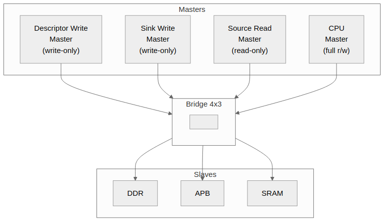

<!-- RTL Design Sherpa Documentation Header -->
<table>
<tr>
<td width="80">
  <a href="https://github.com/sean-galloway/RTLDesignSherpa">
    
  </a>
</td>
<td>
  <strong>RTL Design Sherpa</strong> · <em>Learning Hardware Design Through Practice</em><br>
  <sub>
    <a href="https://github.com/sean-galloway/RTLDesignSherpa">GitHub</a> ·
    <a href="https://github.com/sean-galloway/RTLDesignSherpa/blob/main/docs/DOCUMENTATION_INDEX.md">Documentation Index</a> ·
    <a href="https://github.com/sean-galloway/RTLDesignSherpa/blob/main/LICENSE">MIT License</a>
  </sub>
</td>
</tr>
</table>

---

<!-- End Header -->

# Use Cases

## Primary Applications

### SoC Interconnects

Bridge serves as the primary interconnect fabric for System-on-Chip designs:

- **Multi-core processor memory subsystems** - Connect multiple CPU cores to shared memory
- **Accelerator integration** - Route GPU, DSP, or custom accelerator traffic
- **DMA engine routing** - Connect DMA controllers to memory and peripherals
- **Peripheral bus bridges** - Convert AXI4 to APB for low-speed peripherals

### Memory Systems

Bridge provides flexible memory access:

- **Multi-port DDR controllers** - Multiple masters accessing shared DDR
- **SRAM buffer sharing** - Shared packet buffers for networking
- **Cache coherency interconnects** - Connect cache controllers
- **Memory-mapped I/O** - Unified address space for peripherals

### Accelerator Systems

Bridge supports custom accelerator architectures like RAPIDS:

- **Descriptor write masters** - Write control descriptors (write-only)
- **Sink write masters** - Write incoming data packets (write-only)
- **Source read masters** - Read outgoing data packets (read-only)
- **CPU configuration** - Full access for register configuration

## Example: RAPIDS Accelerator

### Figure 2.1: RAPIDS System Topology



Bridge topology for RAPIDS accelerator with channel-specific masters.

### Configuration

```toml
[bridge]
  name = "bridge_rapids"
  masters = [
    {name = "rapids_descr_wr", channels = "wr", data_width = 512},
    {name = "rapids_sink_wr", channels = "wr", data_width = 512},
    {name = "rapids_src_rd", channels = "rd", data_width = 512},
    {name = "cpu", channels = "rw", data_width = 64}
  ]
  slaves = [
    {name = "ddr", protocol = "axi4", data_width = 512},
    {name = "apb_periph", protocol = "apb", data_width = 32},
    {name = "sram", protocol = "axi4", data_width = 256}
  ]
```

### Benefits

- **39% port reduction** for write-only masters (3 channels vs 5)
- **61% port reduction** for read-only masters (2 channels vs 5)
- **Automatic width conversion** for 64b CPU to 512b DDR
- **Protocol conversion** for APB peripheral access

## Rapid Prototyping

Bridge accelerates design exploration:

- **Quick topology exploration** - Try different master/slave configurations
- **Performance analysis** - Evaluate arbitration and bandwidth
- **Design space exploration** - Compare resource usage
- **Educational projects** - Learn AXI4 protocol and interconnects
