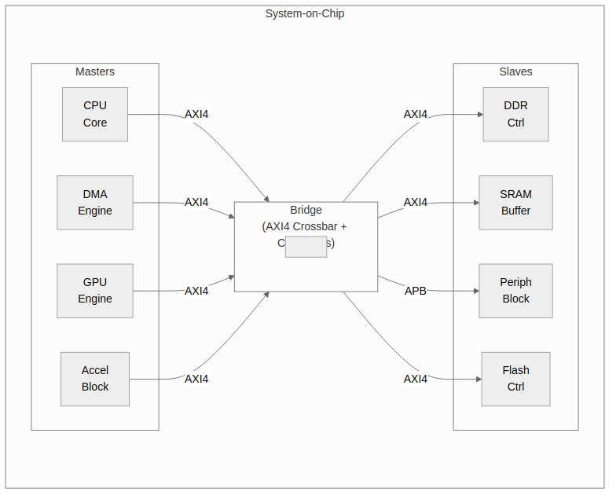

<!-- RTL Design Sherpa Documentation Header -->
<table>
<tr>
<td width="80">
  
</td>
<td>
  <strong>RTL Design Sherpa</strong> · <em>Learning Hardware Design Through Practice</em> 
  
    <a href="https://github.com/sean-galloway/RTLDesignSherpa">GitHub</a> ·
    <a href="https://github.com/sean-galloway/RTLDesignSherpa/blob/main/docs/DOCUMENTATION_INDEX.md">Documentation Index</a> ·
    <a href="https://github.com/sean-galloway/RTLDesignSherpa/blob/main/LICENSE">MIT License</a>
  
</td>
</tr>
</table>

---

<!-- End Header -->

# System Context

## Bridge in SoC Architecture

### Figure 2.2: Bridge System Context

Bridge as central interconnect connecting masters to slaves with protocol conversion.

## Interface Boundaries

### Master-Side (Upstream)

Bridge presents slave interfaces to upstream masters:

- Accepts AXI4 transactions from masters
- Provides flow control via ready signals
- Returns responses (B/R channels) to correct master

### Slave-Side (Downstream)

Bridge presents master interfaces to downstream slaves:

- Issues AXI4/APB transactions to slaves
- Accepts responses from slaves
- Routes responses back through ID tracking

## Address Space

### Address Map Organization

Each slave occupies a configurable address region:

| Slave | Base Address | Address Range | Size |
|-------|--------------|---------------|------|
| Slave 0 | `BASE + 0x0000_0000` | Configurable | Variable |
| Slave 1 | `BASE + addr_range_0` | Configurable | Variable |
| Slave N | Sum of previous ranges | Configurable | Variable |

: Table 2.3: Address Map Organization

### Address Decode

- **Parallel decode** - All slaves checked simultaneously
- **One-hot result** - Exactly one slave selected per transaction
- **Out-of-range detection** - DECERR for unmapped addresses

## Clock and Reset

### Clock Domain

- **Single clock domain** - All Bridge logic synchronous to `aclk`
- **No CDC** - Masters and slaves must be in same clock domain

### Reset

- **Active-low asynchronous** - Standard `aresetn` convention
- **Full reset** - All internal state cleared on reset
- **Transaction safety** - Outstanding transactions aborted on reset

## Dependencies

### Required Infrastructure

- AXI4-compliant masters and slaves
- Proper clock and reset distribution
- Address map configuration matching slave address ranges

### Optional Features

- Width converters (only if widths mismatch)
- Protocol converters (only if protocols differ)
- ID tracking CAM (only if OOO support needed)
