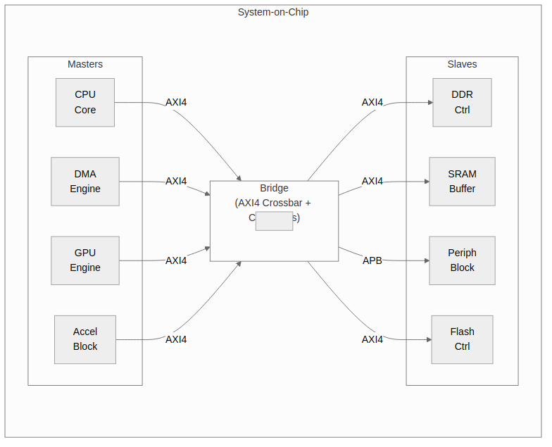

<!-- RTL Design Sherpa Documentation Header -->
<table>
<tr>
<td width="80">
  
</td>
<td>
  <strong>RTL Design Sherpa</strong> · <em>Learning Hardware Design Through Practice</em> 
  
    <a href="https://github.com/sean-galloway/RTLDesignSherpa">GitHub</a> ·
    <a href="https://github.com/sean-galloway/RTLDesignSherpa/blob/main/docs/DOCUMENTATION_INDEX.md">Documentation Index</a> ·
    <a href="https://github.com/sean-galloway/RTLDesignSherpa/blob/main/LICENSE">MIT License</a>
  
</td>
</tr>
</table>

---

<!-- End Header -->

# System Context

## Bridge in SoC Architecture

### Figure 2.2: Bridge System Context

Bridge as central interconnect connecting masters to slaves with protocol conversion.

## Interface Boundaries

### Master-Side (Upstream)

Bridge presents slave interfaces to upstream masters:

- Accepts AXI4 transactions from masters
- Provides flow control via ready signals
- Returns responses (B/R channels) to correct master

### Slave-Side (Downstream)

Bridge presents master interfaces to downstream slaves:

- Issues AXI4/APB transactions to slaves
- Accepts responses from slaves
- Routes responses back through ID tracking

## Address Space

### Address Map Organization

Each slave occupies a configurable address region:

| Slave | Base Address | Address Range | Size |
|-------|--------------|---------------|------|
| Slave 0 | `base_addr` from its own TOML entry | `addr_range` | Variable |
| Slave 1 | `base_addr` from its own TOML entry | `addr_range` | Variable |
| Slave N | `base_addr` from its own TOML entry | `addr_range` | Variable |

: Table 2.3: Address Map Organization

**Windows are not derived from a single BASE and are not contiguous.** Each
slave carries its own `base_addr`, subject only to 4 KB alignment and
non-overlap ([Parameters](../ch06_integration/02_parameters.md)). An earlier
revision of this table showed `BASE + addr_range_0` and "sum of previous
ranges", which no shipped config follows -- `bridge_mix_d` places a 1 GB `ddr`
at `0x0000_0000`, a 4 KB `doorbell` at `0x4000_0000` and a 64 KB `apb_periph`
at `0x4000_1000`, and gaps between windows are legal (they decode-miss).

### Address Decode

- **Subtractive decode** - the ranges are tested in order and the chain ends
  in an `else`, so the one-hot result is *never* all-zero
- **One-hot result** - exactly one slave selected per transaction, always
- **Out-of-range** - an address matching no slave range selects the internal
  subtractive slave, which completes the transaction with **DECERR** and
  `0xDEADBEEF` read data rather than leaving it unanswered

Until 2026-09-07 the last bullet was aspirational: the decode chain had no
`else`, so an unmapped address produced an all-zero select, no slave ever saw
AWVALID/ARVALID, READY never rose, and **the master waited forever**. A hang is
the worst available failure here because it destroys the evidence -- there is
no response to inspect, no error bit to read, and the offending address is
whatever the master still has latched. See 4.5 for the status/interrupt path
that now reports it.

## Clock and Reset

### Clock Domain

- **Single clock domain** - All Bridge logic synchronous to `aclk`
- **No CDC** - Masters and slaves must be in same clock domain

### Reset

- **Active-low asynchronous** - Standard `aresetn` convention
- **Full reset** - All internal state cleared on reset
- **Transaction safety** - Outstanding transactions aborted on reset

## Dependencies

### Required Infrastructure

- AXI4-compliant masters and slaves
- Proper clock and reset distribution
- Address map configuration matching slave address ranges

### Optional Features

- Width converters (only if widths mismatch)
- Protocol converters (only if protocols differ)
- Per-slave in-order bridge_id FIFO (no CAM; OOO is not supported)
