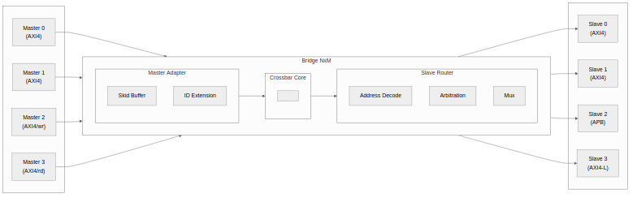
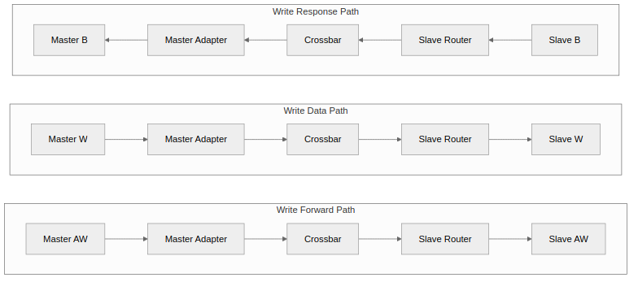
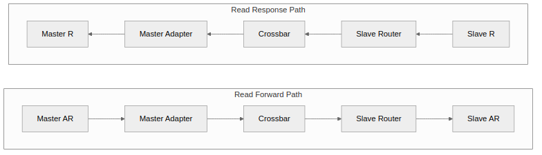

<!-- RTL Design Sherpa Documentation Header -->
<table>
<tr>
<td width="80">
  
</td>
<td>
  <strong>RTL Design Sherpa</strong> · <em>Learning Hardware Design Through Practice</em> 
  
    <a href="https://github.com/sean-galloway/RTLDesignSherpa">GitHub</a> ·
    <a href="https://github.com/sean-galloway/RTLDesignSherpa/blob/main/docs/DOCUMENTATION_INDEX.md">Documentation Index</a> ·
    <a href="https://github.com/sean-galloway/RTLDesignSherpa/blob/main/LICENSE">MIT License</a>
  
</td>
</tr>
</table>

---

<!-- End Header -->

# Block Diagram

## Bridge Architecture Overview

### Figure 3.1: Bridge Block Diagram

Bridge high-level block diagram showing master adapters, crossbar core, and slave routers.

## Functional Blocks

### Master Adapter

Receives transactions from upstream masters:

- **Skid buffer** - Pipeline registration for timing
- **ID extension** - Prepend Bridge ID for response routing
- **Channel separation** - Route AW/W/AR independently

### Crossbar Core

Central switching fabric:

- **5-channel routing** - Independent AW, W, B, AR, R paths
- **Address decode** - Determine target slave
- **Arbitration** - Per-slave round-robin selection

### Slave Router

Delivers transactions to downstream slaves:

- **Protocol conversion** - AXI4 to APB/AXI4-Lite if needed
- **Width conversion** - Upsize/downsize data paths
- **Response collection** - Route B/R back to masters

## Data Flow

### Figure 3.2: Write Path

### Figure 3.3: Read Path

## Scalability

### Topology Parameters

| Parameter | Range | Impact |
|-----------|-------|--------|
| NUM_MASTERS | 1-32 | Linear MUX growth |
| NUM_SLAVES | 1-256 | Linear decoder growth |
| DATA_WIDTH | 32-512 | Linear data path growth |
| ID_WIDTH | 1-16 | Logarithmic CAM growth |

: Table 3.1: Topology Parameter Scaling

### Resource Scaling

- **Logic:** O(M x N) for crossbar core
- **Routing:** O(M + N) for address/response paths
- **Memory:** O(M x outstanding) for ID tracking
