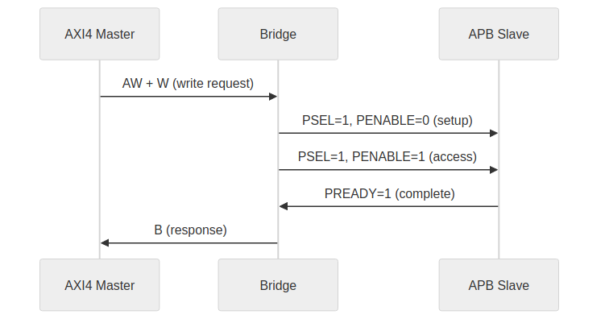
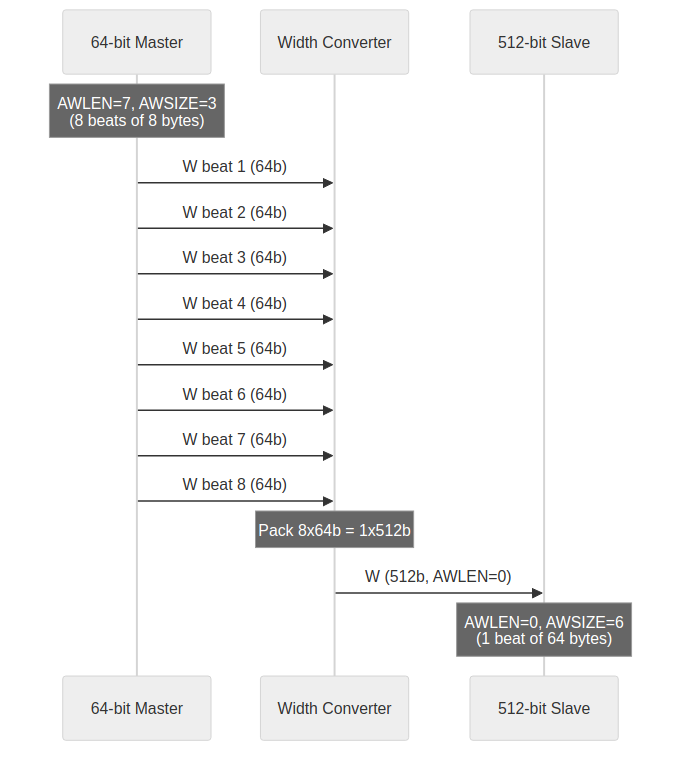
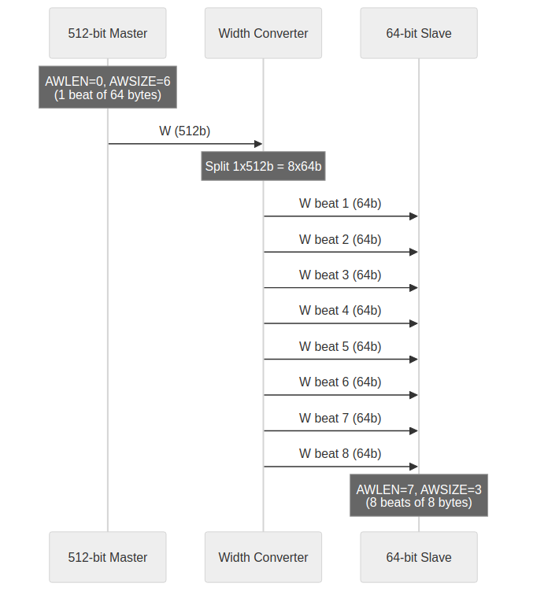

<!-- RTL Design Sherpa Documentation Header -->
<table>
<tr>
<td width="80">
  
</td>
<td>
  <strong>RTL Design Sherpa</strong> · <em>Learning Hardware Design Through Practice</em> 
  
    <a href="https://github.com/sean-galloway/RTLDesignSherpa">GitHub</a> ·
    <a href="https://github.com/sean-galloway/RTLDesignSherpa/blob/main/docs/DOCUMENTATION_INDEX.md">Documentation Index</a> ·
    <a href="https://github.com/sean-galloway/RTLDesignSherpa/blob/main/LICENSE">MIT License</a>
  
</td>
</tr>
</table>

---

<!-- End Header -->

# Protocol Support

## Supported Protocols

### AXI4 Full

Complete AMBA AXI4 protocol support:

- **5 channels:** AW, W, B, AR, R
- **Burst transactions:** FIXED, INCR, WRAP
- **Transaction IDs:** Configurable width
- **Out-of-order:** Response reordering supported
- **Data widths:** 32, 64, 128, 256, 512 bits

### AXI4-Lite

Simplified AXI4 for register access:

- **5 channels:** Same as AXI4
- **Single-beat only:** AWLEN/ARLEN = 0
- **No IDs:** Transaction ordering by channel
- **Fixed width:** Typically 32 or 64 bits

### APB (Advanced Peripheral Bus)

Low-power peripheral protocol:

- **Single channel:** Combined address and data
- **Simple handshake:** PSEL, PENABLE, PREADY
- **No bursts:** Single transfer per transaction
- **Low overhead:** Minimal logic for slow peripherals

## Protocol Conversion Matrix

| Master | Slave | Conversion Type | Notes |
|--------|-------|-----------------|-------|
| AXI4 | AXI4 | Direct | Width conversion if needed |
| AXI4 | AXI4-Lite | Downgrade | Burst split to single beats |
| AXI4 | APB | Full convert | Channel and timing conversion |
| AXI4-Lite | AXI4 | Upgrade | Single-beat pass-through |
| AXI4-Lite | AXI4-Lite | Direct | Width conversion if needed |
| AXI4-Lite | APB | Convert | Simplified conversion |

: Table 3.3: Protocol Conversion Matrix

## AXI4 to APB Conversion

### Conversion Process

### Figure 3.1: AXI4 to APB Conversion Sequence

### Burst Handling

- AXI4 bursts split into individual APB transfers
- WSTRB converted to per-byte enables
- B response generated after all beats complete

### Timing Considerations

- APB is inherently slower (minimum 2 cycles per transfer)
- Pipeline stalls during APB access
- Consider separate APB crossbar for multiple slow peripherals

## Width Conversion

### Upsize (Narrow to Wide)

### Figure 3.2: Width Upsize Conversion

### Downsize (Wide to Narrow)

### Figure 3.3: Width Downsize Conversion

## Channel-Specific Protocol

### Write-Only Masters

Only AW, W, B channels active:

- AR permanently deasserted
- R channel ignored (no routing logic)
- Reduced signal count and logic

### Read-Only Masters

Only AR, R channels active:

- AW, W, B channels ignored
- No write arbitration for this master
- Reduced signal count and logic
