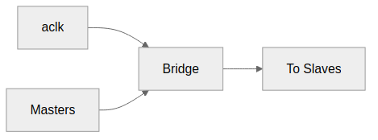
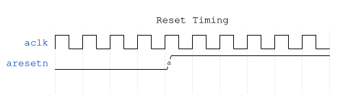
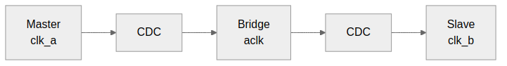

<!-- RTL Design Sherpa Documentation Header -->
<table>
<tr>
<td width="80">
  <a href="https://github.com/sean-galloway/RTLDesignSherpa">
    
  </a>
</td>
<td>
  <strong>RTL Design Sherpa</strong> · <em>Learning Hardware Design Through Practice</em><br>
  <sub>
    <a href="https://github.com/sean-galloway/RTLDesignSherpa">GitHub</a> ·
    <a href="https://github.com/sean-galloway/RTLDesignSherpa/blob/main/docs/DOCUMENTATION_INDEX.md">Documentation Index</a> ·
    <a href="https://github.com/sean-galloway/RTLDesignSherpa/blob/main/LICENSE">MIT License</a>
  </sub>
</td>
</tr>
</table>

---

<!-- End Header -->

# Clock and Reset

## Clock Requirements

### Single Clock Domain

Bridge operates in a single synchronous clock domain:

| Signal | Description | Requirements |
|--------|-------------|--------------|
| aclk | System clock | All interfaces synchronous |
| Frequency | Operating frequency | Design-dependent |
| Duty cycle | Clock duty cycle | 40-60% typical |

: Table 4.4: Clock Requirements

### Figure 4.1: Clock Distribution



All masters and slaves must be in the same clock domain as Bridge.

### No Clock Domain Crossing

Bridge does not include CDC logic:

- All inputs sampled on aclk rising edge
- All outputs generated on aclk rising edge
- External CDC required if masters/slaves use different clocks

## Reset Requirements

### Asynchronous Active-Low Reset

| Signal | Description | Polarity |
|--------|-------------|----------|
| aresetn | Async reset | Active-low |

: Table 4.5: Reset Signal

### Reset Behavior

### Figure 4.3: Reset Timing



The diagram shows the relationship between clock and reset signals. Reset is active-low, meaning the system is in reset when `aresetn = 0`.

### Reset Effects

During reset (aresetn = 0):

| Component | State |
|-----------|-------|
| Arbiters | Cleared (no grants) |
| ID tables | Cleared (no outstanding) |
| FIFOs | Emptied |
| Outputs | Deasserted (VALID = 0) |

: Table 4.6: Reset Effects

### Outstanding Transactions

**Warning:** Transactions in flight during reset are lost:

- Master may see timeout (no response)
- Slave may receive partial transaction
- System must ensure quiescence before reset

### Reset Release

After reset release (aresetn = 1):

1. Bridge accepts new transactions after 1 cycle
2. All state machines start in IDLE
3. No residual grants or locks

## Timing Constraints

### Setup and Hold

All inputs must meet setup/hold relative to aclk:

| Constraint | Typical Value |
|------------|---------------|
| Setup time | Process-dependent |
| Hold time | Process-dependent |

: Table 4.7: Timing Constraints

### Clock-to-Output

All outputs appear after aclk rising edge:

| Path | Typical Delay |
|------|---------------|
| aclk to VALID | 1 cycle (registered) |
| aclk to READY | Combinational |
| aclk to DATA | 1 cycle (registered) |

: Table 4.8: Clock-to-Output Delays

### Recommended Constraints

```tcl
# Example SDC constraints
create_clock -period 10 [get_ports aclk]  ;# 100 MHz

# Reset is async - synchronize externally
set_false_path -from [get_ports aresetn]
```

## Multi-Clock Systems

### External CDC Required

For systems with multiple clock domains:

### Figure 4.2: Multi-Clock CDC



### CDC Recommendations

- Use AXI4 async FIFO bridges
- Consider AXI4 clock converter IP
- Ensure proper gray-coding for pointers
