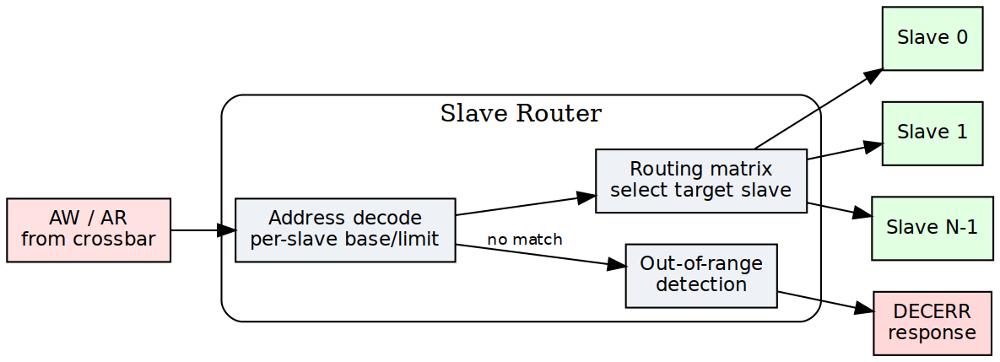
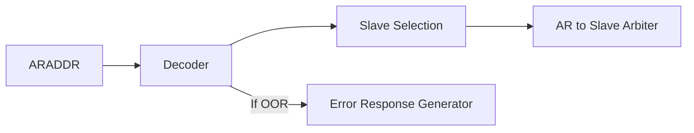
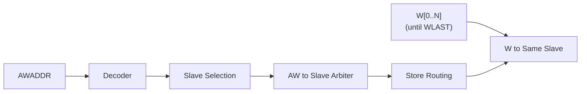

<!-- RTL Design Sherpa Documentation Header -->
<table>
<tr>
<td width="80">
  <a href="https://github.com/sean-galloway/RTLDesignSherpa">
    
  </a>
</td>
<td>
  <strong>RTL Design Sherpa</strong> · <em>Learning Hardware Design Through Practice</em><br>
  <sub>
    <a href="https://github.com/sean-galloway/RTLDesignSherpa">GitHub</a> ·
    <a href="https://github.com/sean-galloway/RTLDesignSherpa/blob/main/docs/DOCUMENTATION_INDEX.md">Documentation Index</a> ·
    <a href="https://github.com/sean-galloway/RTLDesignSherpa/blob/main/LICENSE">MIT License</a>
  </sub>
</td>
</tr>
</table>

---

<!-- End Header -->

# 2.2 Slave Router

Every master gets its own Slave Router. The router examines each request address, steers the transaction to one of the configured slaves, and produces the error response itself when the address lands nowhere.

## 2.2.1 Purpose and Function

The router does five things:

1. **Address Decoding**: Matches request addresses against configured slave address ranges
2. **Request Routing**: Directs AR/AW/W channels to the selected slave
3. **Out-of-Range Detection**: Identifies addresses that don't map to any slave
4. **Error Response Generation**: Creates DECERR responses for invalid addresses
5. **Default Slave Support**: Routes unmapped addresses to optional default slave

## 2.2.2 Block Diagram

### Figure 2.2: Slave Router Architecture



Slave router architecture showing address decoding, routing matrix, and out-of-range detection for AW and AR channels.

## 2.2.3 Address Decoding Algorithm

### Configuration-Based Address Maps

Each slave is configured with:
```toml
[[bridge.slaves]]
name = "memory"
base_address = 0x4000_0000
size = 0x1000_0000        # 256 MB
default = false           # Not a default slave
```

The router generates address ranges:
```
Start Address = base_address
End Address   = base_address + size - 1
```

### Decoding Priority

When multiple slaves have overlapping address ranges, the router uses **first-match priority**:

```
Priority Order = Order in configuration file (top to bottom)

Example:
  Slave 0: 0x0000_0000 - 0x0FFF_FFFF  (checked first)
  Slave 1: 0x1000_0000 - 0x1FFF_FFFF  (checked second)
  Slave 2: 0x2000_0000 - 0x2FFF_FFFF  (checked third)
  
Address 0x1000_5000 → Matches Slave 1
```

### Range Checking Logic

For each address, the router performs:

```systemverilog
// Simplified address decode logic
logic [NUM_SLAVES-1:0] slave_match;

for (int i = 0; i < NUM_SLAVES; i++) begin
    slave_match[i] = (addr >= SLAVE_BASE[i]) && 
                     (addr <= SLAVE_END[i]);
end

// Priority encode: Select first matching slave
logic [$clog2(NUM_SLAVES)-1:0] slave_select;
always_comb begin
    slave_select = 0;
    for (int i = 0; i < NUM_SLAVES; i++) begin
        if (slave_match[i]) begin
            slave_select = i;
            break;  // First match wins
        end
    end
end

// Out-of-range detection
logic oor = ~(|slave_match);  // No slaves matched
```

### Subtractive decode: the `else` that removes the hang

The pseudocode above computes an out-of-range flag; the generated RTL goes
further and gives that case a destination. The emitted decode chain ends in a
bare `else` selecting an internal catch-all slave:

```systemverilog
comb_slave_select_aw = '0;
if      (fub_axi_awaddr <= 32'h3FFFFFFF)  comb_slave_select_aw[0] = 1'b1;  // ddr
else if (fub_axi_awaddr >= 32'h40000000)  comb_slave_select_aw[1] = 1'b1;  // scratch
else                                      comb_slave_select_aw[3] = 1'b1;  // subtractive
```

So the one-hot is **never all-zero**. Before 2026-09-07 there was no `else`:
an unmapped address selected nothing, the AW-ready MUX fell through to
`default: // No slave selected` with `awready` low, and the master hung
forever. The hang is now impossible by construction rather than handled.

### Three decoders, not one

The catch-all is a synthetic slave appended last to the slave list, so it
reuses the crossbar's routing rather than needing a new datapath. What made
that harder than it sounds is that **three independent places derive the slave
list for themselves**, and each needed telling:

| Where | What it derives | What the catch-all needed |
|---|---|---|
| master adapter | the if/else decode above | nothing -- subtractive semantics come free from the `else` |
| crossbar | its own per-slave `_to_` terms, from address RANGES | the term must be `!(other ranges)`; a full-span slave otherwise reduces to `1'b1` |
| cfg regblock | per-slave configuration registers | exclusion -- it has no monitor wrapper to configure |

The crossbar case is the instructive one. Its decode is derived from each
slave's address range independently of the adapter's chain, so a full-span
catch-all became `wire cpu_32b_aw_to_subtractive = 1'b1;` -- matching every
address. Every transaction then routed to the real slave *and* the catch-all
at once, and because the payload muxes OR their inputs, the master read back
`addr = real | catchall`. Silent corruption, which is worse than the hang it
replaced. The term is now the negation of the other ranges, **inlined** rather
than referencing the sibling `<master>_<suffix>_<channel>_to_<slave>` wires:
those are emitted per channel, so a slave with no read path from a given master
has no `ar_to_` wire at all and naming it does not compile.

The cfg regblock case cost a whole debug cycle for a subtler reason: emitting
per-slave cfg for the catch-all added 52 fields and **renumbered every register
after them**, which moved the monitor-enable bits. One monbus stress test saw
`pkts=0` while all 69 other tests passed, because only that test depended on
register offsets. A register map is an ABI.

### Power-of-Two Optimization

For slaves with power-of-two sizes starting at aligned addresses, simplified decode:

```systemverilog
// Optimized decode for: base=0x8000_0000, size=0x1000_0000 (256MB)
// Mask off lower bits: Only check upper bits
logic match = (addr[31:28] == 4'h8);  // Much simpler than range check
```

The generator automatically detects and applies this optimization.

## 2.2.4 Request Routing

### AR Channel Routing

Read address routing flow:
1. **Decode**: Determine target slave from ARADDR
2. **Check OOR**: If no slave matches, flag for error response
3. **Route**: Send AR transaction to selected slave's arbiter
4. **Track**: Remember routing decision for R channel responses



### AW/W Channel Routing

Write transactions require coordinated routing:

1. **AW Phase**: 
   - Decode AWADDR to determine target slave
   - Route AW transaction to selected slave's arbiter
   - **Store routing decision** for subsequent W beats

2. **W Phase**:
   - **Follow AW routing** (W channel has no address)
   - Route all W beats to same slave as AW
   - Continue until WLAST = 1



### Write Data Tracking FSM

```
State Machine for W Channel Routing:

IDLE:
  - Wait for AWVALID && AWREADY
  - On handshake: Store target slave, goto WRITING
  
WRITING:
  - Route W beats to stored slave
  - On WVALID && WREADY && WLAST: goto IDLE
  
Error Handling:
  - If AW was OOR: Discard W beats, generate BRESP error
```

## 2.2.5 Out-of-Range Handling

### Detection

An address is out-of-range if it matches no slave's range. The decode chain
ends in an `else`, so such an address is not "detected and handled" -- it is
*routed*, to an internal subtractive slave that always answers.

### Error Response Generation

The responder is `rtl/amba/axi4/axi4_subtractive_slave.sv`, instantiated by
the generator as the last (internal) slave. It emits no top-level pins of its
own; its behaviour is fixed, not configurable.

**Read (AR -> R)**

```
1. Accept ARVALID (ARREADY high while no read is active)
2. Return exactly ARLEN+1 beats:
     RID   = ARID, unmodified (IDs are pass-through -- nothing is prepended)
     RDATA = 0xDEADBEEF, replicated to the data width
     RRESP = 2'b11 (DECERR)
     RLAST = 1 on the FINAL beat only
```

`RLAST` on every beat -- which an earlier revision of this page specified --
would make a burst master terminate early. The RTL asserts it as
`r_r_active && (r_beats_left == 0)`, and the module test checks that it appears
on the last beat and no other.

**Write (AW/W -> B)**

```
1. WREADY is unconditionally high -- W beats are sunk whether or not AW has
   arrived yet. AXI4 permits write data before its address, and gating WREADY
   on having seen AW deadlocks such a master.
2. One B per AW:
     BID   = AWID, unmodified
     BRESP = 2'b11 (DECERR)
3. Write data is discarded. There is nowhere for it to go.
```

**Status.** The first unmapped access latches a sticky flag with its address
and a saturating count, raised on `unmapped_irq` and, on cfg-regblock builds,
readable and clearable via `SUBTRACTIVE_STATUS` / `SUBTRACTIVE_ADDR`. See
HAS 4.5.

**Reachability.** The catch-all is the decode `else`, so it can only fire if
the slave ranges leave a gap. Of the 22 generated bridges, 18 tile the address
space completely and the branch is unreachable logic that synthesis removes.

### Read data pattern

`READ_FILL`, a module parameter, defaults to `32'hDEAD_BEEF` and is replicated
to the bus width. It is not run-time configurable and there is no menu of
options: an earlier revision of this page offered four (zeros, a debug
signature, an address echo, a master/slave ID indicator), none of which was
ever built.

The value matters more than the choice. Zeros are indistinguishable from real
memory, so an all-zero error return reads as a plausible value and the fault
stays hidden; `0xDEADBEEF` in a dump is unambiguous. Address-echo variants
sound useful but the address is already captured in `SUBTRACTIVE_ADDR`, where
software can read it without decoding it out of the data bus.

## 2.2.6 Default Slave Support

### Configuration

```toml
[[bridge.slaves]]
name = "error_responder"
base_address = 0x0        # Ignored for default slave
size = 0x0                # Ignored for default slave
default = true            # Catch-all for unmapped addresses
```

### Behavior

When a default slave is configured:
- Addresses that don't match any specific slave → Routed to default slave
- Default slave typically returns DECERR but with configurable response
- Useful for prototyping (accept all addresses initially)
- Can implement memory-mapped debug register for address capture

**Note**: Only ONE default slave allowed per bridge.

## 2.2.7 Address Aliasing

### Multiple Slaves, Same Address

If configuration has overlapping ranges:
```toml
[[bridge.slaves]]
name = "fast_cache"
base_address = 0x8000_0000
size = 0x1000_0000

[[bridge.slaves]]
name = "slow_memory"
base_address = 0x8000_0000  # Same base!
size = 0x4000_0000
```

**Result**: First-match priority applies. All accesses go to `fast_cache`. The `slow_memory` range 0x9000_0000-0xBFFF_FFFF is **unreachable** from this master.

**Warning**: Generator can optionally flag this as error in DRC mode.

### Intentional Aliasing Use-Cases

Legitimate uses of overlapping ranges:
1. **Cache hierarchy**: Small fast cache shadows larger slow memory
2. **Memory remapping**: Different views of same physical memory
3. **Peripheral mirroring**: Register block appears at multiple addresses

## 2.2.8 Configuration Parameters

### Per-Router Parameters

```toml
# Router behavior is defined by slave configurations

[[bridge.slaves]]
name = "ddr_memory"
base_address = 0x8000_0000
size = 0x4000_0000           # 1 GB
default = false
# (no oor_data_pattern knob: READ_FILL is a module parameter, 0xDEADBEEF)
```

### Global Parameters

```toml
[bridge]
enable_default_slave = false      # Allow default slave
strict_address_decode = true      # Flag overlapping ranges as errors
# (no oor_response_latency knob: the responder answers as fast as the
#  handshake allows; there is nothing to tune)
```

## 2.2.9 Resource Utilization

### Per-Router Resources (Typical)

**4-slave configuration (32-bit address)**:
```
Logic Elements:  ~150-200 LEs
Registers:       ~50 regs
Block RAM:       0

Breakdown:
- Address comparators (4 slaves × ~30 LEs): ~120 LEs
- Priority encoder: ~20 LEs
- W channel FSM: ~30 regs, ~20 LEs
- OOR error generator: ~20 regs, ~10 LEs
```

**8-slave configuration**:
```
Logic Elements:  ~250-350 LEs (scales roughly with slave count)
Registers:       ~60 regs
```

### Scaling Considerations

Resource usage scales with:
- **Number of slaves**: Linear (each slave adds comparator logic)
- **Address width**: Minimal impact (wider comparators, but same structure)
- **Optimizations**: Power-of-two sizes reduce logic significantly

## 2.2.10 Timing Characteristics

### Decode Latency

**Combinatorial Decode (Default)**:
- Address → Slave selection: 0 cycles (combinatorial)
- Critical path: ARADDR → Slave arbiter request
- May limit maximum frequency in large systems

**Registered Decode (Optional)**:
- Address → Slave selection: 1 cycle (registered)
- Adds latency but breaks critical path
- Recommended for >8 slaves or >300 MHz operation

### Throughput

- **Maximum**: 1 transaction per cycle per master
- **No blocking**: Router does not stall; arbiters handle conflicts
- **Pipelining**: AR and AW decode in parallel (independent paths)

### Critical Paths

Typical critical paths:
- ARADDR → Address comparators → Priority encoder → Arbiter request
- w/4 slaves: ~10-15 logic levels (FPGA-dependent)
- w/8 slaves: ~12-18 logic levels

**Mitigation**:
- Enable registered decode mode (+1 cycle latency)
- Use power-of-two slave sizes (simplified compare)
- Synthesizer optimization directives

## 2.2.11 Debug and Observability

### Recommended Debug Signals

```
- Address decode outputs (which slave matched)
- OOR flags (per channel)
- Default slave hit counter
- W channel FSM state
- Routing decision storage (for W tracking)
```

### Common Issues and Debug

**Symptom**: Reads return all zeros  
**Check**:
- Is address out-of-range?
- Check slave base/size configuration
- Verify address decode logic in waveform

**Symptom**: Write data goes to wrong slave  
**Check**:
- W channel tracking FSM state
- Did AW routing complete before W started?
- Check for AWVALID/AWREADY handshake

**Symptom**: Unexpected DECERR responses  
**Check**:
- Address decode configuration
- Overlapping slave ranges (wrong priority)
- Off-by-one in size calculations

## 2.2.12 Verification Considerations

### Address Decode Tests

Critical test scenarios:
1. **Boundary conditions**: base_address, base_address + size - 1
2. **Just out-of-range**: base_address - 1, base_address + size
3. **Each slave**: Verify routing to correct slave
4. **Overlapping ranges**: Verify priority encoding
5. **Default slave**: Unmapped addresses route correctly

### Write Tracking Tests

W channel FSM testing:
1. **Simple write**: Single AW, single W (WLAST=1)
2. **Burst write**: AW with AWLEN=7, eight W beats
3. **Back-to-back writes**: New AW before previous W completes
4. **Interleaved masters**: Multiple masters writing simultaneously (if supported)

### OOR Error Tests

```
Test: Read from unmapped address
- Send AR to 0xFFFF_FFFF (assuming unmapped)
- Verify R response with RRESP = DECERR
- Verify RID matches ARID
- Check response latency

Test: Write to unmapped address
- Send AW to invalid address
- Send W data
- Verify B response with BRESP = DECERR
- Verify BID matches AWID
```

## 2.2.13 Performance Optimization

### Techniques

**1. Registered Decode (High Frequency)**
```
Trade-off: +1 cycle latency for timing closure
Best for: >8 slaves, >300 MHz targets
```

**2. Simplified Address Decode (Power-of-2)**
```
Optimization: Mask-based compare instead of range check
Best for: Slaves with aligned, power-of-2 sizes
Savings: ~50% reduction in comparator logic
```

**3. Parallel Decode (Low Logic)**
```
Implementation: Separate decoders per address bit-field
Best for: Many non-overlapping slaves
Savings: Reduces logic depth for priority encoding
```

**4. CAM-Based Decode (Many Slaves)**
```
Trade-off: Uses block RAM for address lookup table
Best for: >16 slaves, non-contiguous ranges
Note: Requires RAM resources
```

## 2.2.14 Future Enhancements

### Planned Features
- **Dynamic Address Remapping**: Runtime-configurable slave ranges
- **Transaction Filtering**: Block certain address ranges per-master
- **Priority Hints**: QoS-based prioritization (beyond first-match)
- **Address Translation**: Offset/mask transformations before slave routing

### Under Consideration
- **Multi-region Slaves**: Slave spans multiple non-contiguous ranges
- **Secure Address Spaces**: Per-master access control lists
- **Debug Address Capture**: Log invalid addresses to register

---

**Related Sections**:
- Section 2.1: Master Adapter (upstream from router)
- Section 2.3: Crossbar Core (downstream arbitration)
- Section 2.4: Arbitration (how routed requests compete)
- HAS ch04_interfaces/01_axi4_interface.md (slave port signals)
