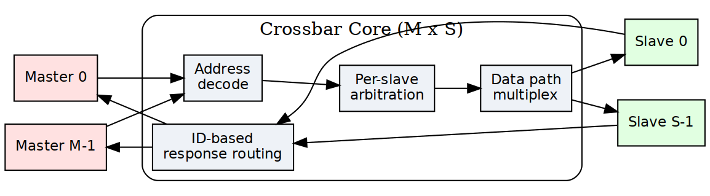

<!-- RTL Design Sherpa Documentation Header -->
<table>
<tr>
<td width="80">
  <a href="https://github.com/sean-galloway/RTLDesignSherpa">
    
  </a>
</td>
<td>
  <strong>RTL Design Sherpa</strong> · <em>Learning Hardware Design Through Practice</em><br>
  <sub>
    <a href="https://github.com/sean-galloway/RTLDesignSherpa">GitHub</a> ·
    <a href="https://github.com/sean-galloway/RTLDesignSherpa/blob/main/docs/DOCUMENTATION_INDEX.md">Documentation Index</a> ·
    <a href="https://github.com/sean-galloway/RTLDesignSherpa/blob/main/LICENSE">MIT License</a>
  </sub>
</td>
</tr>
</table>

---

<!-- End Header -->

# 2.3 Crossbar Core

The crossbar core is the fabric itself — any master can reach any slave through it. Arbitration, request routing, and response management, the machinery that makes any-to-any work, all live here.

## Overview

The core does five things:

1. **Full Connectivity**: Provides complete N×M master-to-slave interconnect matrix
2. **Independent Arbitration**: Per-slave arbiters allow parallel access to different slaves
3. **Response Routing**: Directs slave responses back to originating masters using Bridge IDs
4. **Transaction Ordering**: Maintains AXI ordering requirements within address dependencies
5. **Backpressure Management**: Handles flow control across multiple concurrent transactions

### Figure 2.3: Crossbar Core Architecture



Crossbar core architecture showing complete M×S switching fabric with address decode, per-slave arbitration, data path multiplexing, and ID-based response routing.

## Parameters

The crossbar-level knobs come straight from the TOML. Read the comments as carefully as the keys — several entries you'd expect to find here don't exist, and the file says so:

```toml
[bridge]
num_masters = 4
num_slaves = 3
# internal_data_width: NOT A KEY -- the crossbar has no fixed internal width;
# each path carries its own port width and converters sit at the boundaries.
arbiter_type = "round_robin"       # "round_robin", "fixed_priority", "weighted"
registered_mux = false             # true = +1 cycle, better timing
registered_demux = false           # true = +1 cycle, better timing
# NOTE: there is no enable_cam key -- the loader does not know it, and no CAM exists
# cam_depth: NOT A KEY. No CAM exists and the loader does not know this name.
```

## Functional Description

### Connectivity Matrix

The bridge implements a **non-blocking crossbar** where:
- N masters can each access different slaves simultaneously
- Conflicts occur only when multiple masters target the same slave
- Independent read and write paths increase parallelism

**Example**: 4 masters, 3 slaves
```
         S0   S1   S2
    M0   ●    ●    ●
    M1   ●    ●    ●
    M2   ●    ●    ●
    M3   ●    ●    ●

● = Connection available
```

### Request Path Multiplexing

For each slave, requests from all masters are multiplexed:

```
Slave 0 Request Inputs:
  - M0 → S0 (AR, AW, W channels)
  - M1 → S0 (AR, AW, W channels)
  - M2 → S0 (AR, AW, W channels)
  - M3 → S0 (AR, AW, W channels)
  
Arbiter selects one master per channel per cycle
  → Grants propagate through MUX
  → Selected master's transaction forwarded to slave
```

### Response Path Demultiplexing

Responses from slaves are demultiplexed back to masters:

```
Slave 0 Response Outputs (R, B channels):
  - Extract Bridge ID from RID/BID
  - Route to corresponding master (M0, M1, M2, or M3)
  - Strip Bridge ID before delivering to master adapter
  
Routes responses by the position of a per-slave in-order bridge_id FIFO (no CAM)
```

### Per-Slave Request Arbitration

Each slave has **independent arbiters** for:
1. **AR Channel**: Read address arbitration (all masters competing)
2. **AW/W Channels**: Write address/data arbitration (all masters competing)

This separation allows:
- Simultaneous read and write to same slave (if slave supports it)
- Independent grant decisions for AR vs. AW channels
- Better throughput for mixed read/write workloads

**Policy** (`[bridge] arbitration`, BRIDGE-017). `"rr"` (default) is
round-robin among the requesting masters, grant locked until the slave-side
handshake. `"qos"` picks the requester with the highest *effective*
priority: `AxQOS` plus an age term that climbs one level every
`2**qos_aging_shift` cycles a request waits (default 16), saturating at 15,
cleared on grant; equals share round-robin. A QoS-0 requester behind a
QoS-15 one is therefore served after at most `15 * 2**shift` cycles of
waiting -- delayed, never starved. Priority reorders only what is waiting
at the arbiter: a slave that accepts an AW every cycle takes each master's
AW as it arrives, faster than any master issues them, so no two requests
are ever pending together and the W order is arrival order whatever the
QoS values say. It takes effect where it is meant to, at a slave whose
outstanding-write depth is full and whose AW channel backpressures, because
that is when a backlog forms and every AW slot is a decision. Measured on
`bridge_2x2_rw_qos` (`test_bridge_2x2_rw_qos_arb`) against a port that
accepts one AW per 13 cycles: a QoS-8 stream against a QoS-0 stream takes
>= 75% of the beats in either orientation, the QoS-0 stream's longest wait
for an AW grant stays inside the aging bound, and equal QoS splits the port
like the baseline. `AxQOS` itself is still passed through to the
slave unchanged.

### Request Multiplexers with Stable Address Gating

After arbitration, multiplexers select the granted master's signals. AR/AW gating uses **inline address re-decode** on the stable m_axi address bus (held stable across the full handshake):

```systemverilog
// Inline address re-decode for stable gating (replaces slave_select_* gating)
// The address on m_axi is held stable from fub_axi handshake through m_axi handshake
always_comb begin
    // Re-decode each master's address to determine target slave
    m0_targets_s0 = (m0_m_axi_araddr >= S0_BASE) && (m0_m_axi_araddr < S0_END);
    m1_targets_s0 = (m1_m_axi_araddr >= S0_BASE) && (m1_m_axi_araddr < S0_END);
    m2_targets_s0 = (m2_m_axi_araddr >= S0_BASE) && (m2_m_axi_araddr < S0_END);
    m3_targets_s0 = (m3_m_axi_araddr >= S0_BASE) && (m3_m_axi_araddr < S0_END);
end

// Gate with valid signals
assign m0_ar_s0_valid = m0_arvalid && m0_targets_s0;
assign m1_ar_s0_valid = m1_arvalid && m1_targets_s0;
assign m2_ar_s0_valid = m2_arvalid && m2_targets_s0;
assign m3_ar_s0_valid = m3_arvalid && m3_targets_s0;

// Simplified AR channel MUX for Slave 0
always_comb begin
    case (ar_grant_s0)
        2'b00: begin  // Master 0 granted
            s0_arvalid = m0_arvalid;
            s0_araddr  = m0_m_axi_araddr;  // Stable across m_axi handshake
            s0_arid    = m0_arid;    // Includes Bridge ID
            // ... other AR signals
        end
        2'b01: begin  // Master 1 granted
            s0_arvalid = m1_arvalid;
            s0_araddr  = m1_m_axi_araddr;  // Stable across m_axi handshake
            s0_arid    = m1_arid;
            // ... other AR signals
        end
        // ... cases for M2, M3
    endcase
end
```

**Why this matters**: The address on `m_axi_*` is held stable for the entire AXI handshake (arvalid && arready). This allows address re-decoding to determine the target slave even as the master's internal address state changes.

### AW→W Burst Tracking FIFO

For masters with multiple slave connections, W beats must follow the slave that the AW was driven to. A per-(master, slave) FIFO tracks which slave the AW was routed to:

```systemverilog
// Track which slave the AW was driven to
always_ff @(posedge aclk or negedge aresetn) begin
    if (!aresetn) begin
        aw_trk_slave_id <= '0;
        aw_trk_valid <= 1'b0;
    end else if (m0_awvalid && m0_m_axi_awready && s_selected_aw == S0) begin
        aw_trk_slave_id <= S0;  // Track that AW went to slave 0
        aw_trk_valid <= 1'b1;
    end else if (m0_wvalid && m0_m_axi_wready && m0_m_axi_wlast) begin
        aw_trk_valid <= 1'b0;  // AW->W burst complete
    end
end

// Gate W path based on tracked slave
logic w_to_s0, w_to_s1, w_to_s2;
always_comb begin
    w_to_s0 = m0_wvalid && (aw_trk_slave_id == S0);
    w_to_s1 = m0_wvalid && (aw_trk_slave_id == S1);
    w_to_s2 = m0_wvalid && (aw_trk_slave_id == S2);
end
```

**Why this matters**: Without tracking, W beats would re-evaluate address decode which may have stale or different values, routing to the wrong width converter or slave.

### Backpressure Propagation

Ready signals flow back from slave through arbiter to the granted master:

```
Slave S0 ARREADY → Arbiter → Granted Master ARREADY
                           ↘ Other Masters ARREADY = 0
```

This ensures:
- Only granted master sees READY from slave
- Non-granted masters see READY = 0 (backpressure)
- No combinatorial loops in ready path (registered arbitration)

### Bridge ID Extraction

> **Not built.** Nothing is extracted from the BID. IDs pass through untouched
> (`cpu_m_axi_awid` and `ddr_s_axi_awid` are both 4 bits in `bridge_2x2_rw`),
> and the originating master travels as a separate sideband into a per-slave
> in-order FIFO whose POSITION selects the return path. The returned BID/RID is
> never consulted. The section below describes the replaced scheme; see ch04
> `02_id_tracking.md`.


Response routing uses the Bridge ID embedded in transaction IDs:

```
R Channel:
  Slave RID = {BID[BID_WIDTH-1:0], Original_ID[ID_WIDTH-1:0]}
  Extract: Master_Index = BID
  Route R response to Master[Master_Index]

B Channel:
  Slave BID = {BID[BID_WIDTH-1:0], Original_ID[ID_WIDTH-1:0]}
  Extract: Master_Index = BID
  Route B response to Master[Master_Index]
```

### CAM-Based Routing (Optional)

> **Not built.** No generated bridge contains a CAM -- `bridge_cam.sv` is
> instantiated in zero of them. Responses are routed by the POSITION of an
> in-order per-slave FIFO holding a sideband master id, so out-of-order
> completion is not supported and the section below describes an option
> that was never implemented. See ch04 `02_id_tracking.md`.


For large master counts or OOO responses, a CAM tracks outstanding transactions:

```
CAM Entry Structure:
  - Internal ID (with BID)
  - Master index
  - Transaction type (read/write)
  - Timestamp (for timeout detection)

Lookup:
  Input: RID or BID from slave
  Output: Master index for routing
  Latency: 1 cycle (registered CAM)
```

**Benefit** (of the unbuilt CAM): would have handled ID reordering and burst interleaving

### Response Demultiplexers

Based on the extracted Bridge ID, responses are routed:

```systemverilog
// Simplified R channel DEMUX from Slave 0
logic [BID_WIDTH-1:0] master_id;
assign master_id = s0_rid[TOTAL_ID_WIDTH-1:ID_WIDTH];  // Extract BID

always_comb begin
    // Default: No masters receive response
    m0_rvalid = 1'b0;
    m1_rvalid = 1'b0;
    m2_rvalid = 1'b0;
    m3_rvalid = 1'b0;
    
    // Route to indicated master
    case (master_id)
        2'b00: begin
            m0_rvalid = s0_rvalid;
            m0_rdata  = s0_rdata;
            m0_rid    = s0_rid[ID_WIDTH-1:0];  // Strip BID
            // ... other R signals
        end
        2'b01: begin
            m1_rvalid = s0_rvalid;
            // ... route to M1
        end
        // ... M2, M3
    endcase
end
```

### Multi-Slave Response Merging

When multiple slaves can respond simultaneously, arbitration ensures:
- Only one slave's response delivered per master per cycle
- Fair arbitration if multiple slaves have responses for same master
- No response loss (responses queued until master ready)

### AXI Ordering Requirements

The crossbar maintains AXI ordering rules.

#### Read-After-Write (RAW) Ordering

**Rule**: Read from address must see data from earlier write to same address

**Crossbar Behavior**:
- Ordering enforced at slave level (slave handles RAW within itself)
- Crossbar does NOT reorder transactions to same slave from same master
- Different masters to same slave: No ordering guaranteed (slave must handle)

#### Write-After-Write (WAW) Ordering

**Rule**: Writes to overlapping addresses must complete in issue order

**Crossbar Behavior**:
- Same master to same slave: Order preserved by arbiter (FIFO grant queue)
- Different masters to same slave: Slave responsible for write ordering

#### Out-of-Order (OOO) Completion

> **Not built.** No generated bridge contains a CAM -- `bridge_cam.sv` is
> instantiated in zero of them. Responses are routed by the POSITION of an
> in-order per-slave FIFO holding a sideband master id, so out-of-order
> completion is not supported and the section below describes an option
> that was never implemented. See ch04 `02_id_tracking.md`.


**Allowed**: 
- Read responses must return IN ORDER; a slave that reorders between RIDs misroutes (BRIDGE-010)
- Reads to different slaves can complete in any order
- Writes to different slaves can complete in any order

**Crossbar Support**:
- Bridge ID tracking enables OOO response routing
- Master sees responses in slave-determined order
- Multi-master OOO requires careful slave design

### Monitor Aggregation at Bridge Top (when `variants` includes `mon`)

When monitor collection is enabled, per-port monitor streams from `axi4_master_{rd,wr}_mon` and `axi4_slave_{rd,wr}_mon` wrappers are aggregated through a tree of `monbus_arbiter` instances. The final aggregated stream feeds a single `monbus_axil4_axil4_group` instance at the bridge top level:

**Aggregation Hierarchy**:
```
Master-side monitors → monbus_arbiter tree (if >2 masters)
Slave-side monitors  → monbus_arbiter tree (if >2 slaves)
                    ↓
            monbus_axil4_axil4_group
                    ↓
      s_mon_axil (slave), m_axil_mon (master), stream_irq
```

The `monbus_axil4_axil4_group` instance:
- Provides a 64-bit slave AXIL interface for CPU read access (`s_mon_axil_*`)
- Provides a master AXIL interface for DMA writes to system memory (`m_axil_mon_*`)
- Contains an error FIFO tracking packets with error flags
- Exposes `stream_irq` (asserted when error FIFO has records)
- Includes an internal 64-bit free-running timestamp counter sampled at each packet arrival

**Reference**: See `docs/markdown/rtl-amba/_book_monitor_index.md` (monitor documentation book, with per-module pages under `docs/markdown/rtl-amba/monitor/`) for complete monitor design-surface documentation and `docs/markdown/rtl-amba/includes/monitor_package_spec.md` for the packet layout.

## Timing

### Latency

**Request Path** (Master → Slave):
- Arbiter decision: 1 cycle (registered)
- MUX selection: 0 cycles (combinatorial) or +1 cycle with `xbar_pipeline`
- **Total**: 1-2 cycles through crossbar (measured end to end: 2 combinational, 3 registered -- HAS Table 5.7)

**Response Path** (Slave → Master):
- BID extraction: 0 cycles (combinatorial)
- DEMUX routing: 0 cycles (combinatorial) or +1 cycle with `xbar_pipeline`
- **Total**: 0-1 cycles through crossbar (measured end to end: 2 combinational, 3 registered)

**End-to-End** (Master adapter → Slave adapter):
- Adapters: 2 cycles (skid buffers)
- Router: 0-1 cycles (decode)
- Crossbar: 1-2 cycles (arbitration + MUX)
- **Total**: 3-5 cycles minimum latency

### Throughput

**Best Case** (no conflicts):
- Each master to different slave: N transactions/cycle (N = master count)
- Maximum aggregate bandwidth: N × data_width bits/cycle

**Arbitration Limits**:
- Multiple masters to one slave: 1 transaction/cycle to that slave
- Other slaves remain available for parallel access

**Burst Performance**:
- Once granted, bursts flow at 1 beat/cycle
- Grant held until burst completes (RLAST or WLAST)

### Critical Paths

The paths that will bite you first:

1. **Arbiter Request → Grant**:
   - All masters' VALID signals → Arbiter logic → Grant decision
   - Depth: ~5-8 logic levels for 4 masters

2. **Grant → Ready Backpressure**:
   - Slave READY → Arbiter → Selected master READY
   - Depth: ~4-6 logic levels

3. **Response Demux**:
   - Slave RDATA/RID → BID extraction → Master select → Master RDATA
   - Depth: ~6-10 logic levels for 64-bit data

**Mitigation Strategies**:

1. **Registered crossbar** -- BUILT (BRIDGE-017, `[bridge] xbar_pipeline = true`).
   Every slave-side channel gets a 2-deep `gaxi_skid_buffer` inside the
   xbar: the request stages (AW, W, AR) sit between the arbitrated mux and
   the slave port and carry the bridge id in their payload; the response
   stages (B, R) sit between the slave port and the OR-merge and carry the
   slave adapter's `bid/rid_bridge_id` and route-open flag WITH the beat, so
   the merge keys on the staged id and the stage's own valid. Both cones --
   decode -> arbiter -> N-way mux, and the response OR-merge -- end at a
   register. The skid's ready is registered too, so both directions are cut
   and throughput is unchanged: `test_bridge_2x2_rw_perf` measures the same
   1.00 beat/cycle on `bridge_2x2_rw_pipe` as on `bridge_2x2_rw`, and
   `test_bridge_2x2_rw_pipe_latency` pins the cost at exactly one cycle each
   way (3/3 against the baseline's 2/2). The routing and mux emitters are
   untouched; they drive `xs_<slave>_axi_*` nets and
   `_generate_pipeline_stages()` joins those to the ports. Off by default.
2. **Pipelined Arbitration**: Multi-cycle arbiter for >8 masters (not built)
3. **Hierarchical Crossbar**: For >16 masters, use tree structure (not built)

## Design Notes

### Resource Utilization

**4 masters × 3 slaves configuration (64-bit data, 32-bit addr)**:

```
Logic Elements:  ~2000-3500 LEs
Registers:       ~800-1200 regs
Block RAM:       0 (no CAM is built)

Breakdown per slave:
- Arbiter (4 masters, RR):        ~200 LEs, ~50 regs
- Request MUX (AR/AW/W):          ~400 LEs, ~100 regs
- Response DEMUX (R/B):           ~300 LEs, ~80 regs
- Control FSMs:                   ~100 LEs, ~50 regs

Total for 3 slaves: 3 × 1000 LEs = ~3000 LEs
Plus routing overhead: +500 LEs
```

**Scaling with Masters and Slaves** — linear:
- Adding 1 master: +~500 LEs per slave (new arbiter input)
- Adding 1 slave: +~1000 LEs (complete new slave port)

**Example**: 8 masters × 6 slaves
```
Estimated:  ~12,000 LEs, ~3000 regs
Block RAM:  0 (no CAM is built)
```

**Optimization Techniques**:

1. **Read-Only/Write-Only Masters**: Reduces arbiter complexity by 40-50%
2. **Power-of-Two Master Count**: Simplifies BID width and routing logic
3. **Pipeline Stages**: Trading latency for frequency (deeper pipelines)

### Debug and Observability

Recommended debug signals:

```
Per Slave:
- Arbiter grants (which master granted)
- Arbiter requests (which masters requesting)
- Request MUX outputs (VALID, READY, ADDR, ID)
- Response DEMUX inputs (VALID, READY, DATA, ID)

Global:
- Active transactions count
- Stall counters (arbiter conflicts)
- BID extraction errors
- bridge_id FIFO occupancy (wr_ptr/rd_ptr)
```

Useful metrics for profiling:

```
- Transactions per slave (read, write separate)
- Arbiter conflict rate (requests denied due to grant  contention)
- Average grant latency
- Utilization per master (% cycles active)
- Utilization per slave (% cycles busy)
```

### Common Issues

**Symptom**: Master hangs with VALID=1, READY=0  
**Check**:
- Is another master holding grant to this slave?
- Is arbiter logic functioning (check grant signals)?
- Is slave responding with READY?

**Symptom**: Response goes to wrong master  
**Check**:
- Bridge ID values (verify correct BID per master)
- bridge_id FIFO contents (wr_fifo/rd_fifo)
- BID extraction logic (check bit positions)

**Symptom**: Throughput lower than expected  
**Check**:
- Arbiter conflicts (multiple masters to same slave?)
- Pipeline depth (excessive latency reducing effective bandwidth?)
- Burst efficiency (are bursts being granted properly?)

### Future Enhancements

**Planned Features**:
- **Weighted Round-Robin**: QoS support with configurable priorities
- **Slave-Side Arbitration Policies**: Per-slave arbiter configuration
- **Grant Prediction**: Speculative grant for lower latency
- **Congestion Control**: Throttling to prevent hotspots

**Under Consideration**:
- **Partial Crossbar**: Configurable master-to-slave connectivity (not full mesh)
- **Multi-Tier Hierarchy**: For 32+ masters/slaves
- **Virtual Channels**: Separate channels for different traffic classes
- **Register Slicing**: Automatic pipeline insertion for timing

## Related Modules

- Section 2.1: Master Adapter (request sources)
- Section 2.2: Slave Router (address decode before arbitration)
- Section 2.4: Arbitration (detailed arbiter algorithms)
- Section 2.5: ID Management (sideband bridge_id tracking; its CAM was never built)
- Section 3.1: Top-Level Integration (crossbar instantiation)

## Testing

### Functional Tests

1. **Single Master to Each Slave**: Verify basic connectivity
2. **All Masters to One Slave**: Stress arbiter fairness
3. **All Masters to All Slaves**: Maximum parallelism test
4. **OOO Responses**: Issue transactions with different latencies
5. **Burst Interleaving**: Multiple masters with bursts to same slave

### Corner Cases

```
- Back-to-back grants (no idle cycles)
- Grant held for maximum burst length (256 beats)
- Rapid master switching (each gets 1 transaction then switches)
- Response while request in progress (pipelining)
- All masters requesting same slave simultaneously
```

### Protocol Compliance

- AXI4 protocol checker at each master/slave interface
- Verify no READY → VALID dependencies (AXI violation)
- Check ID preservation through crossbar (modulo Bridge ID)
- Verify LAST signal handling
