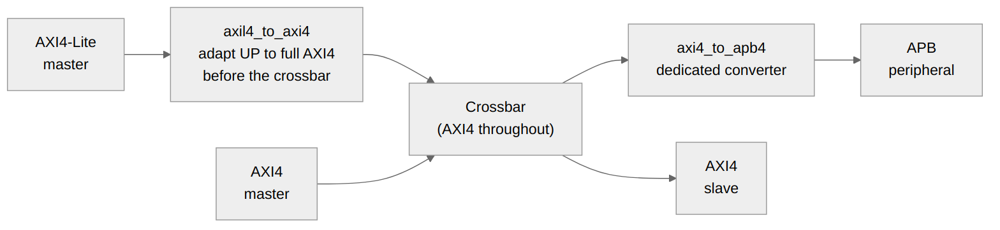
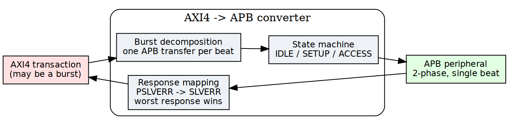

<!-- RTL Design Sherpa Documentation Header -->
<table>
<tr>
<td width="80">
  <a href="https://github.com/sean-galloway/RTLDesignSherpa">
    
  </a>
</td>
<td>
  <strong>RTL Design Sherpa</strong> · <em>Learning Hardware Design Through Practice</em><br>
  <sub>
    <a href="https://github.com/sean-galloway/RTLDesignSherpa">GitHub</a> ·
    <a href="https://github.com/sean-galloway/RTLDesignSherpa/blob/main/docs/DOCUMENTATION_INDEX.md">Documentation Index</a> ·
    <a href="https://github.com/sean-galloway/RTLDesignSherpa/blob/main/LICENSE">MIT License</a>
  </sub>
</td>
</tr>
</table>

---

<!-- End Header -->

# 2.7 Protocol Conversion

The crossbar speaks AXI4 internally. Protocol conversion is what lets the bridge reach slaves that speak something simpler — APB (Advanced Peripheral Bus) for low-bandwidth peripherals being the common case.

## 2.7.1 Purpose and Function

Protocol conversion has five jobs:

1. **Protocol Translation**: Converts AXI4 transactions to target protocol (e.g., APB)
2. **Handshake Mapping**: Translates ready/valid to protocol-specific handshakes
3. **Burst Decomposition**: Breaks AXI bursts into single-beat target transactions
4. **Response Mapping**: Converts protocol-specific responses back to AXI responses
5. **Timing Adaptation**: Handles different timing requirements between protocols

## 2.7.2 Supported Protocols

### Current Support (Phase 2)

**AXI4 (Native)**:
- Full AXI4 protocol
- No conversion required
- Maximum performance

**AXI4-Lite (Master-Side)**:
- Simplified AXI4 subset
- Single-beat transactions only (ARLEN=0, AWLEN=0)
- Converts to full AXI4 for crossbar
- Common for control/status registers

**APB (Slave-Side)**:
- APB3 and APB4 support
- For low-bandwidth peripherals
- Simplified handshaking

**APB and APB5 (Master-Side, BRIDGE-014)**:
- The bridge is the APB completer; `apb4_to_axi4` / `apb5_to_axi4`
  (converters component) turn each transfer into one single-beat AXI4
  transaction in front of the ordinary master timing wrapper
- SLVERR and DECERR both fold to PSLVERR (APB has one error bit)
- APB5: `PAUSER[0]`/`PWUSER[0]` ride the fabric's USER bit; `PWAKEUP` is
  accepted and terminated

**AXI5-Lite (Master-Side, BRIDGE-014)**:
- The AXI4-Lite path plus the AXI5-Lite sideband on the boundary
- `exclusive` -> `AxLOCK` and `user` -> the 1-bit USER fields ride the
  fabric; every other group is terminated at the bridge top

### Current Limitation: AXI4-Lite Conversion

**Superseded.** This paragraph said AXIL slaves were treated as full AXI4 internally with no real conversion; the very next paragraph, and the RTL, say otherwise -- `axi4_to_axil4_{rd,wr}.sv` perform genuine burst decomposition into single-beat AXI4-Lite transactions. Kept only so the contradiction is not silently deleted. The old text read:
- Use the standard AXI4 timing wrapper (same as AXI4 slaves)
- Expose full 5-channel AXI4 interface at the bridge boundary
- Are documented as "axil" for user reference only

The bridge now emits real AXI4-to-AXIL4 conversion shims (`axi4_to_axil4_{rd,wr}.sv`) at the slave boundary when `protocol = "axil"` is specified in the TOML. These shims downgrade bursts to single beats and enforce AXIL protocol constraints transparently. See "Generator-Emitted Conversion Shims" below.

### Future Support (Phase 2+)

> AXI4-Lite conversion was listed here as future work while the section
> directly above states it is built and names the shims. It is built; the
> stale entry has been removed.

- **AHB**: Advanced High-performance Bus
- **Wishbone**: Open-source bus standard
- **Custom**: User-defined protocols

## 2.7.3 Conversion Architecture Overview

### Figure 2.7.1: Protocol Conversion Architecture



The diagram shows the complete protocol conversion flow: AXI4-Lite masters are adapted to full AXI4 before entering the crossbar, while APB peripherals receive AXI4 transactions through a dedicated converter.

## 2.7.4 Block Diagram

### Figure 2.7: Protocol Conversion Architecture



Protocol conversion showing AXI4 to APB conversion with state machine, burst decomposition, and response mapping.

## 2.7.5 AXI4-Lite to AXI4 Conversion (Master-Side)

### AXI4-Lite Protocol Overview

AXI4-Lite is a simplified subset of AXI4 aimed at simple control/status register access:

```
Key Differences from Full AXI4:
- FIXED burst length: ARLEN/AWLEN always = 0 (single beat)
- FIXED burst size: No SIZE field, always full data width
- FIXED burst type: No BURST field, always INCR
- NO exclusive access: No LOCK support
- NO unaligned transfers: Address must be aligned
- Simpler ID: Typically 1-4 bits (fewer outstanding transactions)

Similarities to AXI4:
- Same 5 channels: AR, R, AW, W, B
- Same valid/ready handshaking
- Response codes: OKAY, SLVERR, DECERR. NOT EXOKAY -- AXI4-Lite has no
  exclusive access, so the code has no meaning on this interface.
- Same data widths: 32 or 64 bits typically
```

### Conversion Requirements

Adapting an AXI4-Lite master to the full AXI4 crossbar takes three things:

1. **Add Missing Signals**: Provide default values for burst-related signals
2. **Validate Constraints**: Ensure single-beat assumption holds
3. **Pass-Through Simplicity**: Most signals connect directly

### Signal Mapping

```systemverilog
// AXI4-Lite to AXI4 Signal Mapping

// AR Channel (Read Address)
// AXI4-Lite Input          AXI4 Crossbar Output
axi4lite_arvalid      →     axi4_arvalid
axi4lite_arready      ←     axi4_arready
axi4lite_araddr       →     axi4_araddr
axi4lite_arprot       →     axi4_arprot
axi4lite_arid (opt)   →     axi4_arid

// Added by adapter (constants):
                            axi4_arlen    = 8'h00      // Always 1 beat
                            axi4_arsize   = log2(DW/8) // Full width
                            axi4_arburst  = 2'b01      // INCR
                            axi4_arlock   = 1'b0       // No lock
                            axi4_arcache  = 4'b0000    // Device non-buf
                            axi4_arqos    = 4'h0       // No QoS
                            axi4_arregion = 4'h0       // Region 0

// R Channel (Read Data)
// AXI4 Crossbar Input      AXI4-Lite Output
axi4_rvalid           →     axi4lite_rvalid
axi4_rready           ←     axi4lite_rready
axi4_rdata            →     axi4lite_rdata
axi4_rresp            →     axi4lite_rresp
axi4_rid (opt)        →     axi4lite_rid (opt)

// Discarded by adapter:
axi4_rlast                  // Always 1 for single beat

// AW Channel (Write Address)
axi4lite_awvalid      →     axi4_awvalid
axi4lite_awready      ←     axi4_awready
axi4lite_awaddr       →     axi4_awaddr
axi4lite_awprot       →     axi4_awprot
axi4lite_awid (opt)   →     axi4_awid

// Added by adapter:
                            axi4_awlen    = 8'h00
                            axi4_awsize   = log2(DW/8)
                            axi4_awburst  = 2'b01
                            axi4_awlock   = 1'b0
                            axi4_awcache  = 4'b0000
                            axi4_awqos    = 4'h0
                            axi4_awregion = 4'h0

// W Channel (Write Data)
axi4lite_wvalid       →     axi4_wvalid
axi4lite_wready       ←     axi4_wready
axi4lite_wdata        →     axi4_wdata
axi4lite_wstrb        →     axi4_wstrb

// Added by adapter:
                            axi4_wlast    = 1'b1       // Always last

// B Channel (Write Response)
axi4_bvalid           →     axi4lite_bvalid
axi4_bready           ←     axi4lite_bready
axi4_bresp            →     axi4lite_bresp
axi4_bid (opt)        →     axi4lite_bid (opt)
```

### Implementation

The adapter itself is almost embarrassingly simple — mostly wires, with constants tied off for everything AXI4-Lite doesn't have:

```systemverilog
// AXI4-Lite to AXI4 Adapter (simplified)
module axi4lite_to_axi4_adapter #(
    parameter ADDR_WIDTH = 32,
    parameter DATA_WIDTH = 64,
    parameter ID_WIDTH = 4         // Optional, often 0 for AXI4-Lite
) (
    input logic clk,
    input logic rst_n,
    
    // AXI4-Lite Master Interface
    input  logic                     lite_arvalid,
    output logic                     lite_arready,
    input  logic [ADDR_WIDTH-1:0]    lite_araddr,
    input  logic [2:0]               lite_arprot,
    input  logic [ID_WIDTH-1:0]      lite_arid,    // Optional
    
    output logic                     lite_rvalid,
    input  logic                     lite_rready,
    output logic [DATA_WIDTH-1:0]    lite_rdata,
    output logic [1:0]               lite_rresp,
    output logic [ID_WIDTH-1:0]      lite_rid,     // Optional
    
    input  logic                     lite_awvalid,
    output logic                     lite_awready,
    input  logic [ADDR_WIDTH-1:0]    lite_awaddr,
    input  logic [2:0]               lite_awprot,
    input  logic [ID_WIDTH-1:0]      lite_awid,    // Optional
    
    input  logic                     lite_wvalid,
    output logic                     lite_wready,
    input  logic [DATA_WIDTH-1:0]    lite_wdata,
    input  logic [DATA_WIDTH/8-1:0]  lite_wstrb,
    
    output logic                     lite_bvalid,
    input  logic                     lite_bready,
    output logic [1:0]               lite_bresp,
    output logic [ID_WIDTH-1:0]      lite_bid,     // Optional
    
    // Full AXI4 Crossbar Interface
    output logic                     axi4_arvalid,
    input  logic                     axi4_arready,
    output logic [ADDR_WIDTH-1:0]    axi4_araddr,
    output logic [7:0]               axi4_arlen,
    output logic [2:0]               axi4_arsize,
    output logic [1:0]               axi4_arburst,
    output logic                     axi4_arlock,
    output logic [3:0]               axi4_arcache,
    output logic [2:0]               axi4_arprot,
    output logic [3:0]               axi4_arqos,
    output logic [3:0]               axi4_arregion,
    output logic [ID_WIDTH-1:0]      axi4_arid,
    
    input  logic                     axi4_rvalid,
    output logic                     axi4_rready,
    input  logic [DATA_WIDTH-1:0]    axi4_rdata,
    input  logic [1:0]               axi4_rresp,
    input  logic                     axi4_rlast,
    input  logic [ID_WIDTH-1:0]      axi4_rid,
    
    // ... (AW, W, B channels similar)
);

    // AR Channel: Pass-through with constants
    assign axi4_arvalid  = lite_arvalid;
    assign lite_arready  = axi4_arready;
    assign axi4_araddr   = lite_araddr;
    assign axi4_arprot   = lite_arprot;
    assign axi4_arid     = lite_arid;
    
    // Constants for single-beat burst
    assign axi4_arlen    = 8'h00;                    // 1 beat
    assign axi4_arsize   = $clog2(DATA_WIDTH/8);     // Full width
    assign axi4_arburst  = 2'b01;                    // INCR
    assign axi4_arlock   = 1'b0;                     // No lock
    assign axi4_arcache  = 4'b0000;                  // Device non-buf
    assign axi4_arqos    = 4'h0;                     // No QoS
    assign axi4_arregion = 4'h0;                     // Region 0
    
    // R Channel: Pass-through, ignore rlast
    assign lite_rvalid = axi4_rvalid;
    assign axi4_rready = lite_rready;
    assign lite_rdata  = axi4_rdata;
    assign lite_rresp  = axi4_rresp;
    assign lite_rid    = axi4_rid;
    // axi4_rlast ignored (always 1 for single beat)
    
    // AW Channel: Similar to AR
    assign axi4_awvalid  = lite_awvalid;
    assign lite_awready  = axi4_awready;
    assign axi4_awaddr   = lite_awaddr;
    assign axi4_awprot   = lite_awprot;
    assign axi4_awid     = lite_awid;
    assign axi4_awlen    = 8'h00;
    assign axi4_awsize   = $clog2(DATA_WIDTH/8);
    assign axi4_awburst  = 2'b01;
    assign axi4_awlock   = 1'b0;
    assign axi4_awcache  = 4'b0000;
    assign axi4_awqos    = 4'h0;
    assign axi4_awregion = 4'h0;
    
    // W Channel: Pass-through, add wlast
    assign axi4_wvalid = lite_wvalid;
    assign lite_wready = axi4_wready;
    assign axi4_wdata  = lite_wdata;
    assign axi4_wstrb  = lite_wstrb;
    assign axi4_wlast  = 1'b1;                       // Always last
    
    // B Channel: Pass-through
    assign lite_bvalid = axi4_bvalid;
    assign axi4_bready = lite_bready;
    assign lite_bresp  = axi4_bresp;
    assign lite_bid    = axi4_bid;

endmodule
```

### Resource Utilization

**AXI4-Lite Adapter Resources**:
```
Logic Elements:  ~50-100 LEs (minimal, mostly wiring)
Registers:       ~50 regs (if skid buffers added)
Block RAM:       0

Breakdown:
- Signal pass-through: ~20 LEs (buffering)
- Constant generation: ~10 LEs
- Optional skid buffers: ~50 regs (for timing)

Note: Most implementations are purely combinatorial wire
      assignments with optional pipeline registers.
```

### Performance Impact

**Latency**:
- **Zero-latency** (combinatorial) if no pipeline stages
- **1-2 cycles** if skid buffers added for timing
- No protocol conversion overhead

**Throughput**:
- **1 transaction per cycle** (same as native AXI4)
- No degradation for single-beat transactions
- Limited by AXI4-Lite's single-beat constraint

### Configuration

```toml
[[bridge.masters]]
name       = "control_processor"
prefix     = "cpu_axil_"       # required -- prefixes every external signal
protocol   = "axil"            # NOT "axi4lite"; see the protocol table in the HAS
channels   = "rw"              # "rw" | "rd" | "wr"
id_width   = 0                 # AXI4-Lite carries no ID
addr_width = 32
data_width = 32
user_width = 1
```

Mind the field names: they are `id_width` / `addr_width` / `data_width` -- one `id_width` per
port, not the `arid_width` / `awid_width` pair an earlier revision of this page
showed, which the loader does not read. The table is `[[bridge.masters]]`, not
`[[masters]]`. Compare `bin/test_configs/bridge_1x5_wr_axil.toml` for a config
that actually generates.

### Common Issues and Debug

**Issue 1: Burst Detected on AXI4-Lite**
```
Symptom: ARLEN/AWLEN != 0 on AXI4-Lite interface
Cause: Master not properly configured as AXI4-Lite
Check: Verify master only issues single-beat transactions
```

**Issue 2: Unaligned Addresses**
```
Symptom: ARADDR/AWADDR not aligned to data width
Cause: AXI4-Lite requires full-width aligned access
Check: Address[log2(DW/8)-1:0] should be zero
```

**Issue 3: rlast/wlast Handling**
```
Symptom: Master expects rlast/wlast but doesn't have them
Cause: True AXI4-Lite interface omits these signals
Solution: Adapter provides wlast=1 to crossbar, strips rlast
```

## 2.7.6 AXI4 to APB Conversion (Slave-Side)

### APB Protocol Overview

APB is a simple, low-power bus protocol — it earns its keep on area and power, not speed:

```
Characteristics:
- Single address phase
- Single data phase
- No burst support (one transfer per operation)
- Minimal logic
- Low power consumption
- Suitable for peripherals: UARTs, timers, GPIOs
```

### APB Signals

```
Address Phase:
  PADDR[N-1:0]  - Address bus
  PSEL          - Slave select
  PENABLE       - Enable (2nd cycle of transfer)
  PWRITE        - Write direction (1=write, 0=read)
  
Data Phase (Write):
  PWDATA[N-1:0] - Write data
  PSTRB[N/8-1:0]- Write strobes (APB4 only)
  
Data Phase (Read):
  PRDATA[N-1:0] - Read data
  
Response:
  PREADY        - Slave ready (can extend transfer)
  PSLVERR       - Slave error (APB3+)
```

### APB State Machine

Every APB transfer is a 2-phase handshake — SETUP, then ACCESS:

```
IDLE:
  - Wait for AXI request (ARVALID or AWVALID)
  - PSEL = 0, PENABLE = 0
  
SETUP:
  - Assert PSEL = 1
  - Drive PADDR, PWRITE, PWDATA (if write)
  - PENABLE = 0
  - Duration: 1 cycle
  
ACCESS:
  - Assert PENABLE = 1
  - Wait for PREADY = 1
  - Capture PRDATA (if read) or PSLVERR
  - Can extend multiple cycles if PREADY = 0
  
Complete:
  - De-assert PSEL, PENABLE
  - Return to IDLE or SETUP (if more beats)
```

### Read Transaction Conversion

**AXI4 Read**:
```
Cycle 0: ARVALID=1, ARADDR=0x100, ARLEN=3 (4 beats)
Cycle 1: ARREADY=1
Cycles 2-5: R beats returning
```

**Converted to APB** (4 separate APB reads):
```
Beat 0:
  Cycle 0: PSEL=1, PENABLE=0, PADDR=0x100, PWRITE=0 (SETUP)
  Cycle 1: PSEL=1, PENABLE=1, wait PREADY (ACCESS)
  Cycle 2: PREADY=1, capture PRDATA → First R beat

Beat 1:
  Cycle 3: PSEL=1, PENABLE=0, PADDR=0x104 (SETUP)
  Cycle 4: PSEL=1, PENABLE=1, wait PREADY (ACCESS)
  Cycle 5: PREADY=1, capture PRDATA → Second R beat
  
... (beats 2 and 3 similar)
```

**Latency**: 2-3 cycles per beat (SETUP + ACCESS + ready)

### Write Transaction Conversion

**AXI4 Write**:
```
Cycle 0: AWVALID=1, AWADDR=0x200, AWLEN=1 (2 beats)
Cycle 1: AWREADY=1
Cycle 1: WVALID=1, WDATA=0xAAAA_BBBB, WLAST=0
Cycle 2: WREADY=1
Cycle 2: WVALID=1, WDATA=0xCCCC_DDDD, WLAST=1
Cycle 3: WREADY=1
Cycle 4: BVALID=1, BRESP=OKAY
```

**Converted to APB** (2 separate APB writes):
```
Beat 0:
  Cycle 0: PSEL=1, PENABLE=0, PADDR=0x200, PWRITE=1, PWDATA=0xAAAA_BBBB
  Cycle 1: PSEL=1, PENABLE=1, wait PREADY
  Cycle 2: PREADY=1 → First write complete

Beat 1:
  Cycle 3: PSEL=1, PENABLE=0, PADDR=0x204, PWRITE=1, PWDATA=0xCCCC_DDDD
  Cycle 4: PSEL=1, PENABLE=1, wait PREADY
  Cycle 5: PREADY=1 → Second write complete, return B
```

### Burst Handling

APB has no burst concept, so the converter decomposes:

```
AXI Burst: AWLEN = 15 (16 beats)
→ 16 separate APB transfers
→ Address increments per AWBURST type:
   - INCR: Addr += SIZE each beat
   - WRAP: Wrapping within boundary
   - FIXED: Same address each beat
```

### Response Mapping

```
APB → AXI Response Translation:

PREADY=1, PSLVERR=0 → RRESP/BRESP = 2'b00 (OKAY)
PREADY=1, PSLVERR=1 → RRESP/BRESP = 2'b10 (SLVERR)

PREADY stuck at 0:
  The converter WAITS. There is no timeout and no DECERR.
```

**There is no PREADY timeout anywhere in the path.** `apb4_master` waits
unconditionally in ACCESS (`if (m_apb_PREADY) ...` with no counter), and
neither `axi4_to_apb4_convert`, `axi4_to_apb4_shim` nor `axi4_to_apb5_shim`
contains a threshold register or cycle counter. A slave that never asserts
PREADY stalls that path indefinitely, and the stall propagates back through
the crossbar as backpressure. Budget for it in the system, or put a watchdog
outside the bridge; the bridge will not manufacture an error response.

## 2.7.7 Implementation

### AXI4-to-APB Converter FSM

```systemverilog
// Simplified AXI4-to-APB converter
typedef enum logic [2:0] {
    IDLE,
    AR_SETUP,
    AR_ACCESS,
    AW_SETUP,
    W_ACCESS,
    B_RESPONSE
} state_t;

state_t state, next_state;

always_ff @(posedge clk) begin
    if (!rst_n) state <= IDLE;
    else state <= next_state;
end

always_comb begin
    next_state = state;
    
    case (state)
        IDLE: begin
            if (arvalid) next_state = AR_SETUP;
            else if (awvalid) next_state = AW_SETUP;
        end
        
        AR_SETUP: begin
            next_state = AR_ACCESS;  // 1 cycle SETUP
        end
        
        AR_ACCESS: begin
            if (pready) begin
                if (more_beats) next_state = AR_SETUP;  // Next beat
                else next_state = IDLE;
            end
        end
        
        AW_SETUP: begin
            if (wvalid) next_state = W_ACCESS;
        end
        
        W_ACCESS: begin
            if (pready) begin
                if (!wlast) next_state = AW_SETUP;  // Next beat
                else next_state = B_RESPONSE;
            end
        end
        
        B_RESPONSE: begin
            if (bready) next_state = IDLE;
        end
    endcase
end

// APB signal generation
assign psel = (state != IDLE);
assign penable = (state == AR_ACCESS || state == W_ACCESS);
assign pwrite = (state == AW_SETUP || state == W_ACCESS);
```

### Address Generation

```systemverilog
// Address increment for burst
logic [ADDR_WIDTH-1:0] current_addr;
logic [7:0] beat_count;

always_ff @(posedge clk) begin
    if (state == IDLE) begin
        current_addr <= arvalid ? araddr : awaddr;
        beat_count <= 0;
    end else if ((state == AR_ACCESS || state == W_ACCESS) && pready) begin
        beat_count <= beat_count + 1;
        
        case (burst_type)
            2'b01: current_addr <= current_addr + (1 << size);  // INCR
            2'b10: current_addr <= wrap_address(current_addr);  // WRAP
            2'b00: current_addr <= current_addr;                // FIXED
        endcase
    end
end

assign paddr = current_addr;
```

## 2.7.8 Resource Utilization

### APB Converter Resources

**Per APB Slave Interface**:
```
Logic Elements:  ~400 LEs
Registers:       ~150 regs
Block RAM:       0

Breakdown:
- FSM control:           ~100 LEs, ~20 regs
- Address generation:    ~80 LEs, ~40 regs
- Burst counter:         ~50 LEs, ~20 regs
- Response accumulation: ~80 LEs, ~30 regs
- Data path MUX:         ~90 LEs, ~40 regs
```

### Scaling

Adding APB slaves:
- Linear scaling: +~400 LEs per APB slave
- Shared address decoder logic
- Independent per-slave FSMs

## 2.7.9 Timing Characteristics

### Latency

**APB Read Latency** (per beat):
```
Best case: 2 cycles (SETUP + ACCESS with PREADY=1)
Typical: 3-5 cycles (if slave extends with PREADY=0)
Worst case: unbounded -- the converter waits for PREADY with no timeout

For 8-beat AXI burst:
  Total: 8 × 3 = 24 cycles typical
```

**APB Write Latency** (per beat):
```
Similar to read: 2-5 cycles per beat
```

### Throughput

**Severely Limited**:
```
APB: ~0.3-0.5 transactions/cycle (due to 2-3 cycle protocol)
AXI4: 1 transaction/cycle (burst mode)

APB suitable only for low-bandwidth peripherals
```

No amount of buffering fixes that — the 2-3 cycle protocol itself is the bottleneck.

## 2.7.10 Configuration Parameters

### Protocol Conversion Configuration (TOML)

```toml
[[bridge.slaves]]
name = "uart_peripheral"
protocol = "apb"            # "axi4", "apb", "ahb" (future)
base_address = 0xF000_0000
size = 0x1000
data_width = 32

[[bridge.slaves]]
name = "ddr_memory"
protocol = "axi4"           # Native, no conversion
base_address = 0x8000_0000
size = 0x4000_0000
data_width = 64
```

## 2.7.11 Debug and Observability

### Recommended Debug Signals

```
APB Converter:
- FSM state
- APB phase (SETUP, ACCESS)
- Beat counter (progress through burst)
- Response accumulation (for burst)

APB Bus:
- PSEL, PENABLE, PWRITE
- PADDR, PWDATA, PRDATA
- PREADY, PSLVERR
```

### Common Issues and Debug

**Symptom**: APB slave not responding (timeout)  
**Check**:
- PREADY signal (stuck at 0?)
- APB slave clock/reset
- PSEL assertion
(There is no timeout threshold to check -- the converter waits forever.)

**Symptom**: Data corruption on APB  
**Check**:
- SETUP phase duration (should be 1 cycle)
- PENABLE assertion timing
- Data sampling on correct cycle

**Symptom**: Burst to APB takes too long  
**Check**:
- Burst length (consider limiting ARLEN/AWLEN)
- APB slave response time (PREADY)
- Alternative: Use AXI4 slave instead

## 2.7.12 Verification Considerations

### Test Scenarios

1. **Single APB Transfer**:
```
- AXI ARLEN=0 (1 beat) → 1 APB read
- Verify SETUP → ACCESS sequence
- Check PREADY handling
```

2. **APB Burst Decomposition**:
```
- AXI AWLEN=7 (8 beats) → 8 APB writes
- Verify address increment
- Check each beat completes before next
```

3. **APB PREADY Extension**:
```
- Slave holds PREADY=0 for N cycles
- Verify converter waits
- Check no data corruption
```

4. **APB Error Response**:
```
- Slave asserts PSLVERR
- Verify mapped to AXI SLVERR
- Check error propagated to master
```

5. **APB stall (no timeout to test)**:
```
- Slave never asserts PREADY
- Verify the path stalls and backpressures cleanly, with no lost or
  duplicated beats once PREADY finally arrives
- There is NO timeout and NO DECERR to check for -- see 2.7.6
```

## 2.7.13 Performance Considerations

### When to Use APB

**Good Use Cases**:
- Low-speed peripherals (UART, GPIO, timers)
- Infrequent accesses
- Simple register interfaces
- Power-sensitive designs

**Poor Use Cases**:
- High-bandwidth devices
- Burst-intensive masters
- Performance-critical paths
- Memory interfaces

### APB vs. AXI4 Comparison

```
Feature          APB              AXI4
Complexity       Simple           Complex
Throughput       Low (~0.3/cyc)   High (1/cyc burst)
Latency/beat     2-5 cycles       1 cycle
Burst Support    No               Yes (up to 256)
Resources        ~400 LEs         Native (no converter)
Power            Very low         Moderate
Use Case         Peripherals      Memory, DMA
```

## 2.7.14 Mixed Protocol Bridges

### Example Configuration

```toml
# Bridge with mixed protocols
[bridge]
num_masters = 2
num_slaves = 3

[[bridge.masters]]
name = "cpu"
protocol = "axi4"

[[bridge.masters]]
name = "dma"
protocol = "axi4"

[[bridge.slaves]]
name = "ddr_memory"
protocol = "axi4"          # High bandwidth

[[bridge.slaves]]
name = "sram"
protocol = "axi4"          # Medium bandwidth

[[bridge.slaves]]
name = "peripherals"
protocol = "apb"           # Low bandwidth, simple
```

### Routing Optimization

Walk the routes and you can see exactly where the conversion cost lands:

```
CPU → DDR Memory: AXI4-to-AXI4 (native, fast)
CPU → Peripherals: AXI4-to-APB (converted, slower)
DMA → SRAM: AXI4-to-AXI4 (native, fast)
DMA → Peripherals: AXI4-to-APB (rare, acceptable slowdown)
```

## 2.7.15 Master-Side vs Slave-Side Conversion

### Comparison

```
Feature              Master-Side (AXI4-Lite)    Slave-Side (APB)
──────────────────────────────────────────────────────────────────
Complexity           Very Simple                Complex
Resource Usage       ~50-100 LEs                ~400 LEs
Latency Added        0-1 cycles                 2-5 cycles/beat
Throughput Impact    None                       Severe (3x slower)
Burst Handling       Single beat only           Decompose to singles
State Machine        None (combinatorial)       Multi-state FSM
Buffering Required   Optional (timing)          Essential
Use Case             Control registers          Peripherals
```

### When to Use Each

**AXI4-Lite Master Adapter**:
- Simple control/status register interfaces
- Low-complexity masters (MCUs, simple CPUs)
- Minimal resource overhead acceptable
- No burst performance needed

**APB Master Front End** (`apb{4,5}_to_axi4`, BRIDGE-014):
- An APB requester that needs to reach AXI4 or AXI4-Lite completers
- One-outstanding by nature of APB: one transfer per fabric round trip
- Same lane behaviour as an AXI4-Lite master toward wider slaves (the
  aligner is shared)

**APB Slave Converter**:
- Legacy peripheral integration
- Very simple slave devices (GPIO, timers)
- Low-bandwidth acceptable
- Power optimization critical

## 2.7.16 Generator-Emitted Conversion Shims

You don't instantiate any of these converters by hand. The bridge generator automatically emits protocol conversion shims at the slave boundary based on the TOML configuration. These shims are instantiated between the crossbar core (uniformly AXI4 internally) and the external slave port.

### AXI4 to AXI4-Lite Conversion

When `protocol = "axil"` is specified in the slave TOML:
- Generator emits `axi4_to_axil4_rd.sv` (read path) and `axi4_to_axil4_wr.sv` (write path)
- Shims downgrade bursts to single beats (set ARLEN/AWLEN = 0 on output)
- Enforce single-beat semantics transparently
- Data width remains unchanged (upsizing/downsizing done separately)
- Shims are inserted **between crossbar and slave port** in the generated top-level module

**Modules**: `projects/components/converters/rtl/axi4_to_axil4_{rd,wr}.sv`

### AXI4 to APB Conversion

When `protocol = "apb"` is specified in the slave TOML:
- Generator emits ONE shim, `axi4_to_apb4_shim` -- a direct full-AXI4-to-APB4
  converter. There is no AXI4-Lite stage: the shim does its own burst
  decomposition (`r_burst_count` + `axi_gen_addr`), so nothing upstream has to
  reduce the burst first.
- `protocol = "apb5"` emits `axi4_to_apb5_shim`, a sideband wrapper over that
  same shim -- see [AMBA5 Boundary](10_amba5_boundary.md).
- Slave port externally presents APB signals; internally the crossbar is AXI4

**Modules**: `projects/components/converters/rtl/axi4_to_apb4_shim.sv`
(`axi4_to_apb5_shim.sv` for `apb5`)

An earlier revision of this page described the path as an `axi4_to_axil4`
shim followed by an internal AXIL-to-APB bridge chain. No such chain exists,
and no generated APB slave adapter instantiates `axi4_to_axil4`.

### Master-Side APB Front End

When `protocol = "apb"` or `"apb5"` is specified on a **master** (BRIDGE-014):
- The master adapter's external surface is the APB completer set (the
  requester's `PSEL/PENABLE/PADDR/PWRITE/PWDATA/PSTRB/PPROT` are inputs;
  `PREADY/PRDATA/PSLVERR` outputs; `apb5` adds `PAUSER/PWUSER/PWAKEUP` in
  and `PRUSER/PBUSER` out).
- The adapter instantiates `apb4_to_axi4` / `apb5_to_axi4` on an internal
  AXI4 face (`apbx_axi_*`) and feeds that to the same `axi4_slave_{wr,rd}`
  timing wrapper -- `_mon` in the monitored variant -- an AXI4 master port
  gets. From the wrapper onward the port is an AXI4-Lite-shaped single-beat
  requester: decode, the width converters and the wide-slave aligner, and
  the response mux are untouched.
- The fabric ID is the master index alone (`id_width = 0`, BRIDGE-016).

**Modules**: `projects/components/converters/rtl/apb4_to_axi4.sv`,
`apb5_to_axi4.sv`, `apb_cmdrsp_to_axi4.sv` -- see the converters MAS.

### Master-Side AXI5-Lite Sideband

When `protocol = "axil5"` is specified on a **master** (BRIDGE-014), the
bridge top exposes the AXI4-Lite set plus every AXI5-Lite sideband group
(from `bridge_pkg/axil5_sideband.py`, the one table the slave side also
reads, with the directions flipped for a requester). The enabled forwardable
groups join the Lite surface and are wired into the adapter's AXI4 face
(`exclusive` -> `awlock`/`arlock`, `user` -> `aw/w/ar user`); the rest is
terminated at the top -- requester-driven inputs consumed by a reduction into
an `_unused_<master>_axil5_sb` wire, completer-driven outputs driven `'0`.
Response-side USER (`buser`/`ruser`) is connected but reads 0, because the
master adapters tie response USER (PRD).

### Master-Side AXIL→Wider-Slave Alignment

When an AXI4-Lite master interfaces with a wider AXI4 slave (e.g., 32-bit AXIL master to 64-bit AXI4 slave) -- and likewise an AXI5-Lite or APB master, which present the same single-beat stream:
- Generator emits `axil_to_axi4_wide_align_rd.sv` (read) and `axil_to_axi4_wide_align_wr.sv` (write) at the **master adapter output** (before crossbar core)
- These modules handle **width alignment** (not protocol conversion — that's done at the slave boundary if needed)
- Preserves AXIL's single-beat constraint on the master side
- Properly aligns partial-word reads/writes on the wide slave side

**Modules**: `projects/components/converters/rtl/axil_to_axi4_wide_align_{rd,wr}.sv`

**Example**: 32-bit AXIL master → 64-bit AXI4 slave
- Master writes to addr 0x04 with data 0xAABBCCDD. The shim selects the lane
  from `addr[2]` (= 1), so the data lands on the UPPER half: the slave sees
  `wdata[63:32] = 0xAABBCCDD`, `WSTRB = 0xF0`, at row-aligned address `0x00` --
  the lane bits move out of the address and into the strobe. Worked through in
  [Width Converters](../ch05_converters/01_width_converters.md).
- Shim is inserted after master adapter, before crossbar

## 2.7.17 Future Protocol Support

### Planned Features

**AXI4-Lite** -- NOT future work; BUILT. `axi4_to_axil4_{rd,wr}` shims are
emitted when `protocol = "axil"`, and `bridge_1x2_rw_axil5` and the `mix_*`
configurations ship AXIL slaves with tests in the FULL regression. It was
listed here as planned while the same page describes the shims that implement
it.

**AHB (AMBA High-performance Bus)**:
- More capable than APB
- Pipeline support
- Burst support
- Suitable for moderate-bandwidth peripherals

**Wishbone**:
- Open-source bus standard
- Common in FPGA designs
- Multiple addressing modes
- Configurable data widths

### Under Consideration

- **Custom Protocol**: User-defined through configuration
- **Stream Interface**: AXI4-Stream for data streaming
- **PCIe TLP**: For PCIe endpoint integration
- **CHI**: ARM's Coherent Hub Interface

## 2.7.18 Best Practices

### Design Recommendations

1. **Limit APB Burst Lengths**: Configure masters to use short bursts to APB slaves
2. **Watchdog Outside the Bridge**: the converter has no PREADY timeout, so a
   wedged APB slave stalls its path forever. If the system needs to survive
   that, the watchdog belongs upstream.
3. **Protocol Matching**: Use native AXI4 where possible, APB only when necessary
4. **Address Map Planning**: Group APB peripherals together for efficient decoding
5. **Width Matching**: Match APB data width to peripheral requirements

### Performance Tips

```
Inefficient: 256-beat AXI burst → APB
  256 beats × 3 cyc/beat = 768 cycles

Better: Limit to 4-beat bursts → APB
  64 bursts of 4 beats each
  Still long, but more manageable

Best: Use AXI4-Lite slave for registers
  No burst, but native protocol
```

---

**Related Sections**:
- Section 2.3: Crossbar Core (protocol integration point)
- HAS ch04_interfaces/01_axi4_interface.md (port signals)
- Chapter 4: Programming (configuring protocol conversion)
- Appendix A: Generator Deep Dive (protocol converter generation)
