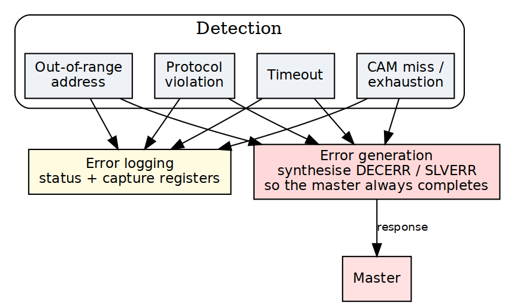

<!-- RTL Design Sherpa Documentation Header -->
<table>
<tr>
<td width="80">
  <a href="https://github.com/sean-galloway/RTLDesignSherpa">
    
  </a>
</td>
<td>
  <strong>RTL Design Sherpa</strong> · <em>Learning Hardware Design Through Practice</em><br>
  <sub>
    <a href="https://github.com/sean-galloway/RTLDesignSherpa">GitHub</a> ·
    <a href="https://github.com/sean-galloway/RTLDesignSherpa/blob/main/docs/DOCUMENTATION_INDEX.md">Documentation Index</a> ·
    <a href="https://github.com/sean-galloway/RTLDesignSherpa/blob/main/LICENSE">MIT License</a>
  </sub>
</td>
</tr>
</table>

---

<!-- End Header -->

# 2.9 Error Handling

> **What error handling this bridge actually has.** Measured against
> `rtl/generated/`, not designed on paper. The complete inventory:
>
> | Mechanism | Where | What it does |
> |---|---|---|
> | `DECERR` on unmapped access | `axi4_subtractive_slave` | answers, so an unmapped address cannot hang the master |
> | `o_hit_irq` / `o_hit_addr` / `o_hit_count` | same | sticky first-fault address and saturating count, cleared by `i_hit_clear` |
> | monbus error packet | `*_mon` builds only | reports the fault to a monitor bus |
> | response-ordering check | simulation only | `$error` on a BID/RID that does not match the FIFO head (BRIDGE-010) |
>
> Everything else this chapter describes -- a protocol checker, a
> per-transaction watchdog, an error status register, an error history buffer,
> error interrupt logic, and a `[bridge.error_handling]` TOML table -- is NOT
> BUILT. Searches for `protocol_check`, `error_status`, `error_history` and
> `error_irq` across every generated file return nothing, and the config loader
> does not know the `error_handling` table name, so such a section is silently
> ignored. Those parts are retained as design intent and each is marked.


Error handling is everything the bridge does when something goes wrong: detecting the problem, answering with the right AXI error response, logging what happened, and keeping the rest of the system running. The covered failure modes are protocol violations, out-of-range addresses, timeout conditions, and configuration errors.

## 2.9.1 Purpose and Function

Error handling does five things:

1. **Error Detection**: Identifies violations and abnormal conditions
2. **Error Response Generation**: Creates appropriate AXI error responses
3. **Error Reporting**: Logs and signals errors for debug
4. **Graceful Degradation**: Maintains system stability during errors
5. **Recovery Support**: Enables system recovery after errors

## 2.9.2 Error Categories

### Transaction Errors

**Out-of-Range (OOR) Addresses**:
```
Master requests address not mapped to any slave
Response: DECERR (Decode Error)
Action: Bridge generates error response internally
```

**Protocol Violations**:
```
Master violates AXI4 protocol rules
Examples:
  - VALID deasserted while READY=0
  - Incorrect burst parameters
  - ID width mismatches
Response: Configurable (error log, SLVERR, or ignore)
```

**Slave Errors**:
```
Slave returns SLVERR or DECERR response
Action: Bridge forwards error to master unchanged
```

### System Errors

**Timeout Conditions**: there are none. The bridge has NO transaction
timeout -- not on the AXI path and not in the APB shim, where 2.7 states it
three times ("There is no PREADY timeout anywhere in the path"). A slave that
never responds stalls that path indefinitely; nothing in the fabric detects or
breaks the stall.

This block previously described a configurable timeout returning DECERR. No
such mechanism was ever built, and believing in it is worse than knowing it is
absent -- an integrator counting on the fabric to time out will not add the
watchdog that actually protects the system.

```
(retained for contrast -- NOT implemented)
Slave fails to respond within configured timeout
Response: DECERR after timeout expires
Action: Force transaction completion
```

**CAM Overflow**:

> **Not built.** No generated bridge contains a CAM -- `bridge_cam.sv` is
> instantiated in zero of them. Responses are routed by the POSITION of an
> in-order per-slave FIFO holding a sideband master id, so out-of-order
> completion is not supported and the section below describes an option
> that was never implemented. See ch04 `02_id_tracking.md`.

```
Too many outstanding transactions (CAM full)
Response: Backpressure master (ARREADY/AWREADY=0)
Action: Wait for responses to free entries
```

**Configuration Errors**:
```
Invalid bridge configuration detected at generation time
Examples:
  - Overlapping slave address ranges
  - Invalid data width combinations
  - Illegal parameter values
Response: Generation error, fail early
```

## 2.9.3 Block Diagram

### Figure 2.9: Error Handling Architecture



Error handling system showing detection (OOR, protocol, timeout, bridge_id FIFO), generation, and logging subsystems.

## 2.9.4 Out-of-Range Address Handling

### Detection

Router identifies OOR when no slave address range matches:

```systemverilog
// Address decode with OOR detection
logic [NUM_SLAVES-1:0] slave_match;
logic oor_detected;

for (genvar i = 0; i < NUM_SLAVES; i++) begin
    assign slave_match[i] = (addr >= SLAVE_BASE[i]) && 
                            (addr <= SLAVE_END[i]);
end

assign oor_detected = ~(|slave_match) && ~default_slave_en;
```

### Error Response Generation

**Read OOR Response**:
```systemverilog
// Generate R response for OOR read
always_ff @(posedge clk) begin
    if (ar_oor_detected && arvalid && arready) begin
        // Capture transaction details
        oor_arid <= arid;
        oor_arlen <= arlen;
        oor_burst_count <= 0;
        oor_generating <= 1'b1;
    end else if (oor_generating) begin
        // Generate R beats
        rvalid <= 1'b1;
        rdata <= OOR_DATA_PATTERN;  // Configurable pattern
        rid <= oor_arid;
        rresp <= 2'b11;  // DECERR
        rlast <= (oor_burst_count == oor_arlen);
        
        if (rready) begin
            oor_burst_count <= oor_burst_count + 1;
            if (rlast) oor_generating <= 1'b0;
        end
    end
end
```

**Write OOR Response**:
```systemverilog
// Generate B response for OOR write
always_ff @(posedge clk) begin
    if (aw_oor_detected && awvalid && awready) begin
        // Capture write ID
        oor_awid <= awid;
        oor_w_count <= 0;
        oor_sinking_w <= 1'b1;
    end else if (oor_sinking_w) begin
        // Sink W data (accept and discard)
        wready <= 1'b1;
        
        if (wvalid && wlast) begin
            oor_sinking_w <= 1'b0;
            oor_gen_bresp <= 1'b1;
        end
    end else if (oor_gen_bresp) begin
        // Generate B response
        bvalid <= 1'b1;
        bid <= oor_awid;
        bresp <= 2'b11;  // DECERR
        
        if (bready) begin
            oor_gen_bresp <= 1'b0;
        end
    end
end
```

### Configurable Data Patterns

> **Not built.** The read fill value is a module PARAMETER of
> `axi4_subtractive_slave` (`READ_FILL`, default `32'hDEAD_BEEF`). The
> generator does not override it -- `bridge_2x2_rw.sv` passes only the width,
> `UNIT_ID` and `AGENT_ID` parameters -- and no TOML key sets it. There is no
> `[bridge.error_handling]` table; the loader does not know that name, so a
> config that contains one is silently ignored. To change the pattern today,
> override the parameter at instantiation.


```toml
[bridge.error_handling]
oor_read_data_pattern = 0xDEADCAFE  # Pattern for OOR reads
oor_response_latency = 2            # Cycles to generate response
```

## 2.9.5 Protocol Violation Handling

### Common Violations

**VALID Dropped While READY=0**:
```
AXI4 Rule: Once VALID asserted, must remain until READY
Violation: Master deasserts VALID before handshake
Detection: Track VALID history per channel
Action: Log error, optionally assert error signal
```

**Incorrect Burst Parameters**:
```
Violations:
  - SIZE > DATA_WIDTH
  - LEN > 255
  - Address not aligned to SIZE
  - Burst crosses 4KB boundary
Detection: Parameter checking logic
Action: SLVERR response or reject transaction
```

**ID Width Mismatch**:
```
Violation: Master uses ID wider than configured
Detection: Check ID values against expected width
Action: Truncate or error (configurable)
```

### Protocol Checker Implementation

> **Not built.** No generated bridge contains a protocol checker: a search for
> `protocol_check` / `proto_check` / `protocol_viol` across every file in
> `rtl/generated/` returns nothing. The section below describes hardware that
> was never implemented. Protocol violations by an attached master or slave are
> not detected -- with one exception, the BRIDGE-010 response-ordering check,
> which is simulation-only and cannot fire in silicon.


```systemverilog
// AXI4 protocol checker (simplified)
module axi_protocol_checker #(
    parameter ID_WIDTH = 4,
    parameter ADDR_WIDTH = 32,
    parameter DATA_WIDTH = 64
) (
    input logic clk, rst_n,
    // AXI signals
    input logic arvalid, arready,
    input logic [ADDR_WIDTH-1:0] araddr,
    input logic [7:0] arlen,
    input logic [2:0] arsize,
    // Error outputs
    output logic protocol_error,
    output logic [7:0] error_code
);

    // Check: VALID held until READY
    logic arvalid_prev;
    always_ff @(posedge clk) begin
        arvalid_prev <= arvalid;
        if (arvalid_prev && !arvalid && !arready) begin
            protocol_error <= 1'b1;
            error_code <= 8'h01;  // VALID_DROPPED
        end
    end
    
    // Check: SIZE <= DATA_WIDTH
    always_comb begin
        if (arvalid && (arsize > $clog2(DATA_WIDTH/8))) begin
            protocol_error = 1'b1;
            error_code = 8'h02;  // INVALID_SIZE
        end
    end
    
    // Check: Address alignment
    always_comb begin
        if (arvalid && (araddr[arsize-1:0] != 0)) begin
            protocol_error = 1'b1;
            error_code = 8'h03;  // UNALIGNED_ADDR
        end
    end
    
    // Additional checks...
endmodule
```

## 2.9.6 Timeout Detection

### Per-Transaction Watchdog

> **Not built.** As described, The bridge has NO per-transaction watchdog: it
> never terminates a stuck transaction and never manufactures a response for
> one. Non-monitor builds contain zero timeout logic -- `bridge_2x2_rw` and
> `bridge_mix_a` have no `timeout` signal at all.
>
> What DOES exist, and only in `*_mon` builds, is observability:
> `cfg_wr_timeout_enable` / `cfg_wr_timeout_cycles` / `cfg_wr_axi_timeout_mask`
> (and the `rd` equivalents) are inputs to the AXI MONITOR, which emits a
> timeout EVENT PACKET on monbus when a transaction outlives the programmed
> cycle count. It reports; it does not intervene. A hung slave still hangs the
> bridge -- the monitor just tells you it happened.


```systemverilog
// Timeout detector for outstanding transactions
typedef struct packed {
    logic valid;
    logic [TOTAL_ID_WIDTH-1:0] id;
    logic [15:0] timestamp;
    logic is_read;  // 1=read, 0=write
} timeout_entry_t;

timeout_entry_t watchdog [0:15];  // Track up to 16 transactions
logic [15:0] global_timer;

always_ff @(posedge clk) begin
    if (!rst_n) begin
        global_timer <= 0;
    end else begin
        global_timer <= global_timer + 1;
        
        // Check for timeouts
        for (int i = 0; i < 16; i++) begin
            if (watchdog[i].valid) begin
                logic [15:0] elapsed;
                elapsed = global_timer - watchdog[i].timestamp;
                
                if (elapsed > TIMEOUT_THRESHOLD) begin
                    // Timeout detected
                    timeout_error <= 1'b1;
                    timeout_id <= watchdog[i].id;
                    timeout_type <= watchdog[i].is_read ? "READ" : "WRITE";
                    
                    // Force completion with DECERR
                    force_error_response(watchdog[i]);
                    watchdog[i].valid <= 1'b0;
                end
            end
        end
    end
end
```

### Timeout Configuration
> **Not built.** No watchdog exists to configure. In `*_mon` builds the
> `cfg_*_timeout_*` inputs configure the AXI MONITOR's reporting threshold,
> not any bridge behaviour.


There is none. `[bridge.error_handling]` is not a table the loader knows, and
`enable_timeout` / `timeout_cycles` / `timeout_action` / `per_slave_timeout`
are not keys -- `config_validator` rejects unknown keys, so a TOML written from
the block this section used to contain does not load at all.

A hung slave stalls its path indefinitely. If the system needs to survive that,
the watchdog belongs outside the bridge.

## 2.9.7 Error Logging and Reporting

### Error Status Register
> **Not built.** No generated file contains an error status register. The
> nearest real thing is the subtractive slave's `o_hit_irq` / `o_hit_addr` /
> `o_hit_count`, which are module PORTS, not a memory-mapped register.


```
Error Status Register (Read/Clear):
┌──────┬──────────────────────────────────────┐
│ Bits │ Description                          │
├──────┼──────────────────────────────────────┤
│ 0    │ OOR Read Error                       │
│ 1    │ OOR Write Error                      │
│ 2    │ Protocol Violation                   │
│ 3    │ Timeout Error                        │
│ 4    │ bridge_id FIFO overflow (gated off)  │
│ 5    │ Slave Error (SLVERR received)        │
│ 6    │ Decode Error (DECERR received)       │
│ 7    │ ID Match Error                       │
│15:8  │ Reserved                             │
│31:16 │ Error Count (saturating)             │
└──────┴──────────────────────────────────────┘
```

### Error History Buffer
> **Not built.** There is no history buffer. Only the FIRST fault address is
> retained (`o_hit_addr`), plus a saturating count.


```systemverilog
// Circular buffer for error history
typedef struct packed {
    logic [7:0] error_type;
    logic [31:0] address;
    logic [TOTAL_ID_WIDTH-1:0] id;
    logic [31:0] timestamp;
    logic [7:0] master_index;
    logic [7:0] slave_index;
} error_entry_t;

error_entry_t error_log [0:15];  // 16-entry history
logic [3:0] error_wr_ptr;

always_ff @(posedge clk) begin
    if (error_detected) begin
        error_log[error_wr_ptr] <= {
            error_type,
            error_addr,
            error_id,
            global_timer,
            error_master,
            error_slave
        };
        error_wr_ptr <= error_wr_ptr + 1;
    end
end
```

### Error Interrupts
> **Not built as a block.** The only interrupt is `o_hit_irq` from the
> subtractive slave: one sticky bit, cleared by `i_hit_clear`. There is no
> interrupt controller, mask register or priority logic.


```
Optional interrupt generation:

Interrupt Enable Register:
  - OOR_INT_EN
  - TIMEOUT_INT_EN
  - PROTOCOL_INT_EN
  - etc.

Interrupt when enabled error occurs
Clear on status register read or explicit clear
```

## 2.9.8 Resource Utilization

### Error Handling Resources
> **Not built.** These figures price a protocol checker, watchdog and error
> registers that do not exist. The real cost is the subtractive slave plus a
> few status flops.


```
Logic Elements:  ~800-1200 LEs
Registers:       ~400-600 regs
Block RAM:       0-2 KB (if error logging enabled)

Breakdown:
- OOR detection/response:     ~300 LEs, ~100 regs
- Protocol checkers:           ~250 LEs, ~50 regs
- Timeout watchers:            ~200 LEs, ~150 regs
- Error logging:               ~150 LEs, ~100 regs
- Status registers:            ~100 LEs, ~50 regs

Optional error log (16 entries): +2KB BRAM
```

## 2.9.9 Configuration Parameters

### Error Handling Configuration (TOML)
> **Not built.** The loader does not know a `[bridge.error_handling]` table.
> A config containing one is silently ignored -- nothing warns. The read fill
> pattern is the `READ_FILL` parameter of `axi4_subtractive_slave`, which the
> generator never overrides.


```toml
[bridge.error_handling]
# OOR handling
# NOT REAL KEYS. Out-of-range handling is fixed, not configured: the
# subtractive slave always answers DECERR with READ_FILL (0xDEADBEEF), there
# is no timeout anywhere in the bridge, and there is no protocol checker.
# Kept visible rather than deleted because several pages once described these
# as configuration, and a reader who saw them elsewhere should find out here
# that they do not exist.
#
#   enable_oor_errors / oor_response_type / oor_read_pattern
#   enable_timeout / timeout_cycles / timeout_response
#   enable_protocol_checker
protocol_checker_mode = "log"     # "log", "error", "ignore"

# Error logging
enable_error_log = true
error_log_depth = 16              # Entries in circular buffer

# Error reporting
enable_error_interrupts = false
error_status_register_addr = 0xFFFF_FFF0  # Optional mapped register
```

## 2.9.10 Debug and Observability

### Recommended Debug Signals

```
Error Detection:
- OOR flags (per master)
- Protocol violation flags
- Timeout counters
- bridge_id FIFO occupancy

Error Response:
- Error response generation FSM states
- Active error responses
- Error data patterns

Error Logging:
- Error count
- Last error type
- Last error address
- Error log write pointer
```

## 2.9.11 Common Issues and Debug

**Symptom**: Unexpected DECERR responses  
**Check**:
- Address map configuration (gaps?)
- Slave address ranges (overlaps?)
- Default slave configuration
- Timeout thresholds (too short?)

**Symptom**: System hangs on certain addresses  
**Check**:
- Timeout detection enabled?
- Slave responsiveness
- Protocol violations upstream
- bridge_id FIFO overflow (prevented by the not-full gate, BRIDGE-011)

**Symptom**: Error log filling quickly  
**Check**:
- What errors are occurring?
- Master behavior (bad addresses?)
- Slave configuration
- Timeout thresholds

## 2.9.12 Verification Considerations

### Test Scenarios

1. **OOR Address Tests**:
```
- Read from unmapped address
- Write to unmapped address
- Burst to partially mapped range
- Verify DECERR response
```

2. **Timeout Tests**:
```
- Slave never responds
- Verify timeout after N cycles
- Check error logged
- Verify forced completion
```

3. **Protocol Violation Tests**:
```
- Drop VALID before READY
- Invalid burst parameters
- Misaligned addresses
- Verify detection and response
```

4. **Error Recovery Tests**:
```
- Error occurs
- System continues operating
- Subsequent transactions succeed
- Error status readable
```

5. **Error Logging Tests**:
```
- Generate multiple errors
- Verify all logged
- Check circular buffer wrap
- Verify timestamps
```

## 2.9.13 Recovery Mechanisms

### Automatic Recovery

```
OOR Errors:
  - Generate error response
  - Continue normal operation
  - No intervention needed

Timeout Errors:
  - Force transaction completion
  - Pop the bridge_id FIFO
  - Allow new transactions

Protocol Violations:
  - Log error
  - Complete/reject transaction  
  - Continue with next transaction
```

### Manual Recovery

```
bridge_id FIFO stuck:
  - Software reset via control register
  - Reset the bridge_id FIFO pointers
  - Restart affected masters

Persistent Errors:
  - Read error log
  - Identify root cause
  - Reconfigure or reset subsystem
```

## 2.9.14 Safety and Reliability

### Error Containment

```
Goal: Prevent error propagation

Mechanisms:
- Isolate error to originating master
- Don't corrupt other masters' transactions
- Maintain crossbar integrity
- Log for post-mortem analysis
```

### Fail-Safe Behavior

```
On Critical Error:
1. Generate safe error response (DECERR)
2. Log error details
3. Assert error signal (optional)
4. Continue operation if possible
5. Halt only if configured (safety-critical mode)
```

### Error Injection (Debug/Test)

> **Not built.** The loader knows no `bridge.debug` table and no
> `error_injection` -- searching `config_loader.py` for either returns nothing.
> A config containing this section is accepted and silently ignored, which is
> worse than an error: the build looks configured and injects nothing.

```toml
[bridge.debug]
enable_error_injection = true

[[bridge.debug.error_injection]]
type = "oor"
trigger_address = 0xBAD_ADDR
action = "decerr"

[[bridge.debug.error_injection]]
type = "timeout"
trigger_after_n_cycles = 100
target_slave = 2
```

## 2.9.15 Future Enhancements

### Planned Features
- **Error Recovery FSM**: Automatic recovery from certain error conditions
- **Error Rate Limiting**: Prevent error storm from misbehaving master
- **Detailed Error Telemetry**: Capture full transaction context on error
- **Error Prediction**: Detect patterns indicating impending failures

### Under Consideration
- **ECC Protection**: Error correction for internal state
- **Redundant Checking**: Duplicate checkers for safety-critical
- **Watchdog Timers**: System-level health monitoring
- **Error Severity Levels**: Classify errors by impact

---

**Related Sections**:
- Section 2.2: Slave Router (OOR detection)
- Section 2.5: ID Management (bridge_id FIFO depth)
- Section 2.8: Response Routing (error response paths)
- Chapter 5: Verification (error testing strategies)
