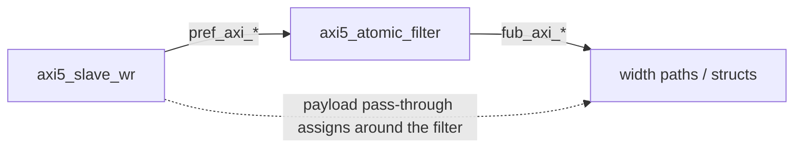
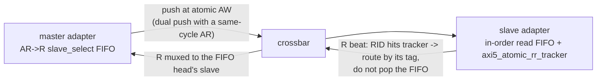

<!-- RTL Design Sherpa Documentation Header -->
<table>
<tr>
<td width="80">
  
</td>
<td>
  <strong>RTL Design Sherpa</strong> · <em>Learning Hardware Design Through Practice</em> 
  
    <a href="https://github.com/sean-galloway/RTLDesignSherpa">GitHub</a> ·
    <a href="https://github.com/sean-galloway/RTLDesignSherpa/blob/main/docs/DOCUMENTATION_INDEX.md">Documentation Index</a> ·
    <a href="https://github.com/sean-galloway/RTLDesignSherpa/blob/main/LICENSE">MIT License</a>
  
</td>
</tr>
</table>

---

<!-- End Header -->

# AMBA5 Boundary and Native Sideband

How AXI5/APB5 ports ride the AXI4 fabric (BRIDGE-002 phases A5-1 through
A5-3). One spec table drives every generator:
`bin/bridge_pkg/sideband.py::SIDEBAND_FIELDS` maps each feature to its
per-channel struct fields, widths, and wrapper port bases — package,
adapter, crossbar, and slave-adapter emission all iterate it in the same
order, so struct layout and wiring cannot drift apart.

## Boundary Wrappers

- AXI5 **master** port → `axi5_slave_{wr,rd}[_mon]` at the master adapter
  (the bridge is a slave to the external master).
- AXI5 **slave** port → `axi5_master_{wr,rd}[_mon]` at the slave adapter.
- Both families carry every feature signal through their skid path,
  gated by `ENABLE_<FEATURE>` parameters; the generator binds every pin
  (enabled features connect through, the rest tie/open).

## Native Sideband Through the Structs (A5-2)

The per-bridge `_pkg` channel structs gain feature fields as the **union**
of features on any AXI5 port. Pure-AXI4 bridges emit no fields, so their
RTL stays byte-identical — the zero-drift invariant.

- **Master adapter:** packs its own enabled fields from the wrapper's
  `fub_axi_*` sideband on the **direct (width-matched) arm only**;
  converter arms pack `'0` — per-beat and per-transaction sideband cannot
  traverse the dwidth-converter IP. Because non-qualifying sources are
  guaranteed `'0`, the crossbar forwards request fields unconditionally.
- **Crossbar:** explodes struct fields into discrete
  `<slave>_axi_<sig>` nets for feature-enabled AXI5 slaves; response
  fields (`b.trace`, `r.trace`, `r.poison`) mux from qualifying slaves
  and default `'0` (they must be driven for every master since union
  fields exist in every struct).
- **Slave adapter:** rides `xbar_<slave>_axi_<sig>` nets into the
  wrapper via the component's `native_sideband` flag, which stops
  terminating enabled features' fub ports (fall-through to the
  connector prefix).

The struct field for AWUNIQUE/ARUNIQUE is named `uniq` (`unique` is an SV
keyword).

## Connectivity Gating (poison, atomic)

`AXI5_CONNECTIVITY_GATED_FEATURES` in the validator: these features are
legal only when **every** connected path is AXI5-both-ends,
feature-enabled, and width-matched — otherwise a config error naming the
offending pair. Droppable sideband that terminates mid-path is legal but
prints a generation-time warning per (master, slave, feature).

## Atomic Filter (A5-3a, write-only masters)

A **write-only** atomic-enabled master's wr path inserts `axi5_atomic_filter`
between the boundary wrapper and the fabric:

Handshakes (AW/W/B) and the B payload (`bid`/`bresp`) go **through** the
filter; all other payload gets `pref → fub` pass-through assigns. Store-
class ATOP and plain writes forward; read-return classes are swallowed
(W burst consumed) and answered with a local DECERR B. See the module doc:
`docs/markdown/rtl-amba/axi5/axi5_atomic_filter.md`. The filter exists
because a port with no read path has nowhere to deliver the R beat those
classes answer with. A port that has one gets the next section instead.

## Read-Return Atomics (A5-3b, rw masters)

An **rw** atomic-enabled master has no filter. AtomicLoad (`10xxxx`),
AtomicSwap and AtomicCompare (`11000x`) ride the AW path to the slave like
any write; the slave performs the operation and answers on **both** B and
R, the R beat carrying the location's original data under the **AW's ID**.
Two things in this fabric had to learn about that beat, because every
R-return tracker in it is fed by AR handshakes:

**Master adapter.** The AR->R tracking FIFO that drives `r_slave_select`
takes an entry at the atomic AW handshake as well as at AR. An AR and an
atomic AW can handshake in the same cycle, so the FIFO has a dual push: AR
takes the first slot, the AW the second, and the AW's own gate
(`aw_rr_gate_ok`) demands two free slots and the same
single-outstanding-target rule the read side already applies. The AW is
the last entry pushed, so it becomes the active target. The B/W paths are
unchanged. The trace tracker mirrors the dual push so the R beat echoes
the AW's trace (BRIDGE-012).

**Out of range.** A read-return atomic that decodes to the subtractive
slave would otherwise wedge the port: that slave answers DECERR on B and
knows nothing about R, while the master adapter is holding an R-return slot
for the beat. The tracker entry therefore carries a `local` flag and the
AW's ID, and when it reaches the head the R mux presents a single DECERR
beat with that ID itself, holding every slave's `rready` off
(`r_path_active && !r_local_head`) for that cycle. B and R both report
DECERR, and the port keeps working. This is BRIDGE-009's rule applied to
the atomic path.

**The invariant underneath.** The crossbar's response mux is an OR-merge
and is a mux only while at most one connected slave's tracker head belongs
to a given master; the master adapter's single-outstanding-target gate is
what guarantees that. The atomic AW's gate therefore yields when an AR to a
different slave handshakes in the same cycle (the one way a dual push could
hold two targets), and every generated crossbar now carries a simulation-
only `$countones` guard on each master's response-mux select vector that
reports the cycle the invariant slips.

**Slave adapter.** `axi5_atomic_rr_tracker` (module doc:
`docs/markdown/rtl-amba/axi5/axi5_atomic_rr_tracker.md`) records
(AWID -> requester index) at every AW handshake with `AWATOP[5]` set, and
answers combinationally from `RID`. An R beat it claims is routed by its
tag and does **not** pop the in-order read FIFO; every other beat routes by
FIFO position as before. The atomic AW's `awready` is held while the
tracker is full. The BRIDGE-010 in-order check skips tracked beats and
reports, in simulation, an R beat that matches both a tracked atomic and
the FIFO head: that is two requesters aliasing one ID at this slave, which
this fabric does not disambiguate.

**Validator.** An rw atomic master's connected atomic slaves must be `rw`
(a write-only slave cannot return read data). The return tracker sits
beside whichever read tracker the slave uses, the in-order FIFO or the
`enable_ooo` CAM (BRIDGE-015 repaired that mode). A write-only atomic
master is not subject to the rule; it keeps the filter.

**Filelist.** `axi5_atomic_filter.f` is pulled only when a write-only
atomic master exists; `axi5_atomic_rr_tracker.f` only when an rw atomic
slave exists. Pure-AXI4 bridges and the A5-3a fixture are byte-identical
to before this change.

## APB5 Slaves (A5-3c)

`protocol = "apb5"` reuses the entire APB4 path with two deltas: the
slave adapter instantiates `axi4_to_apb5_shim` (a sideband wrapper over
the APB4 shim — see the converters MAS), and the external surface adds
`PAUSER/PWUSER` out (driven `'0`) and `PWAKEUP/PRUSER/PBUSER` in
(terminated). The generated TB drives the port with the APB4 BFM: APB5
keeps the APB4 transfer protocol.

## Lite and APB Requesters (BRIDGE-014)

Every protocol value is legal on a master port. Two of them needed work
beyond the AXI4-Lite master path that already existed:

- **`axil5` master.** The AXI4-Lite promotion (AXI4 extras tied at the
  top, `axi4_slave_*` wrappers, the wide-slave aligner toward wider slaves)
  plus the whole AXI5-Lite sideband on the boundary, directions flipped for
  a requester. `exclusive` and `user` -- the two groups with an AXI4
  destination -- join the Lite surface and reach the adapter's AXI4 face;
  the rest is terminated at the top. `validate_axil5_features` applies to
  masters and slaves alike, so a config cannot name a group the design
  drops.
- **`apb` / `apb5` master.** The bridge is the APB completer.
  `apb4_to_axi4` / `apb5_to_axi4` (converters: `apb{4,5}_slave` +
  `apb_cmdrsp_to_axi4`) sit inside the master adapter in front of the
  ordinary timing wrapper, so monitoring, decode, width adaptation and the
  response mux are untouched. One transfer -> one single-beat AXI4
  transaction; SLVERR and DECERR fold to PSLVERR; `PAUSER[0]`/`PWUSER[0]`
  ride the fabric USER bit (visible at an `axil5` slave with `user`).
  `PWAKEUP` is requester-driven and terminated.

Validator rules: Lite masters `id_width = 0`; APB masters `addr_width = 32`
(a requester addresses the whole fabric, unlike an APB slave port's window
offset). The generated TB drives `axil5` masters with the AXIL5 BFMs and
`apb`/`apb5` masters with `APBMaster`/`APB5Master`; `master_read`/
`master_write` unwrap the APB transaction and turn `PSLVERR` into
`AxiResponseError(resp=2)` -- APB cannot tell SLVERR from DECERR, so 2 is
the honest code.

## Verification Anchors

- Generator unit tests: `bin/tests/test_generator_pkg.py` (feature
  gating, poison/atomic connectivity rules, generation smoke).
- Sideband **values** end-to-end, driven per transaction by the AXI5
  master BFM: `dv/tests/test_bridge_1x2_{rd,wr}_axi5n_sideband.py`
  (native path and drop path; the AXI5 slave BFM echoes trace on B/R).
- Sideband **through the arbiter**: `dv/tests/test_bridge_2x2_axi5_sideband_arb.py`
  -- two AXI5 masters with distinct NSAIDs contend for the AXI5 slave; every
  slave-side AW/AR NSAID must belong to its issuing master and the counts
  must match.
- Sideband **across a width converter**: `dv/tests/test_bridge_1x2_rd_axi5w_sideband.py`
  -- 32b AXI5 master into a 64b AXI4 slave; data round-trips, trace returns 0.
- Atomics, filtered: `dv/tests/test_bridge_1x2_wr_axi5a_atomics.py` (store
  forwards; load, swap AND compare answered DECERR by the filter, via
  `atomic_operation`) and `val/amba/test_axi5_atomic_filter.py`.
- Atomics, read-return: `dv/tests/test_bridge_1x2_rw_axi5a_atomics.py` --
  load ADD/SET/UMAX, swap, compare (match and mismatch) on both slaves,
  each checked three ways (R data is the pre-op value, memory holds the
  post-op value, a plain read agrees), then reads and atomics in flight
  together across and within slaves. The slave BFM performs the operation;
  the AXI5 checker treats a read-return atomic as an outstanding read and
  flags any R beat nobody requested. `val/amba/test_axi5_atomic_rr_tracker.py`
  covers the tracker alone. Mutation-checked: with the tracker's `hit`
  removed from `rid_valid`, the R beat is never routed and the test fails
  on a read-return timeout.
- Lite requesters: `dv/tests/test_bridge_2x2_lite_req_sideband.py` on
  `bridge_2x2_lite_req` (AXI4-Lite + AXI5-Lite masters, 64b AXI4 + AXI5-Lite
  slaves) -- `user`/`lock` from the AXI5-Lite master seen at the AXI5-Lite
  slave and absent from the AXI4-Lite master's traffic, terminated groups
  reading 0, both halves of a 64-bit row from both Lite masters (the
  aligner), and both ID-less masters in flight at one slave.
- APB requesters: `dv/tests/test_bridge_2x3_apb_req_paths.py` on
  `bridge_2x3_apb_req` (APB4 + APB5 masters, AXI4 + AXI5-Lite + APB4
  slaves) -- PSLVERR for unmapped addresses with the port working after,
  PPROT at the AXI4 slave, the APB5 USER bit at the AXI5-Lite slave and 0
  from the APB4 master, APB in / APB out through the fabric from both
  requesters interleaved. The converters alone:
  `projects/components/converters/dv/tests/test_apb{4,5}_to_axi4.py`.
- AXI5 compliance at the boundary: every generated TB arms an
  `AXI5ComplianceChecker` on each AXI5 master port and every generated test
  asserts zero violations before PASSED; `dv/tests/test_bridge_1x2_rd_axi5_bfm5.py`
  is the read-side sign-off.
