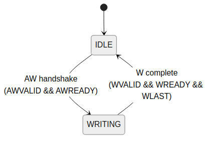

<!-- RTL Design Sherpa Documentation Header -->
<table>
<tr>
<td width="80">
  <a href="https://github.com/sean-galloway/RTLDesignSherpa">
    
  </a>
</td>
<td>
  <strong>RTL Design Sherpa</strong> · <em>Learning Hardware Design Through Practice</em><br>
  <sub>
    <a href="https://github.com/sean-galloway/RTLDesignSherpa">GitHub</a> ·
    <a href="https://github.com/sean-galloway/RTLDesignSherpa/blob/main/docs/DOCUMENTATION_INDEX.md">Documentation Index</a> ·
    <a href="https://github.com/sean-galloway/RTLDesignSherpa/blob/main/LICENSE">MIT License</a>
  </sub>
</td>
</tr>
</table>

---

<!-- End Header -->

# Transaction Tracking FSMs

## Overview

Bridge uses several FSMs to track outstanding transactions and ensure correct response routing. These FSMs work in conjunction with the ID management CAM to maintain transaction state.

## Write Data Tracking FSM

### Purpose

Track W channel data beats to ensure correct routing after AW handshake.

### States

| State | Description |
|-------|-------------|
| IDLE | Waiting for AW handshake |
| WRITING | Routing W beats to target slave |

### Figure 3.1: Write Data Tracking FSM



### Implementation

```systemverilog
typedef enum logic [0:0] {
    W_IDLE    = 1'b0,
    W_WRITING = 1'b1
} w_state_t;

w_state_t r_w_state;
logic [$clog2(NUM_SLAVES)-1:0] r_w_target;

always_ff @(posedge clk or negedge rst_n) begin
    if (!rst_n) begin
        r_w_state <= W_IDLE;
        r_w_target <= '0;
    end else begin
        case (r_w_state)
            W_IDLE: begin
                if (awvalid && awready) begin
                    r_w_state <= W_WRITING;
                    r_w_target <= decoded_slave;
                end
            end
            W_WRITING: begin
                if (wvalid && wready && wlast) begin
                    r_w_state <= W_IDLE;
                end
            end
        endcase
    end
end
```

## Response Pending Counter

### Purpose

Track number of outstanding transactions per master for flow control.

### Implementation

```systemverilog
logic [7:0] r_outstanding [NUM_MASTERS];

// Increment on AR/AW acceptance
always_ff @(posedge clk or negedge rst_n) begin
    if (!rst_n) begin
        for (int i = 0; i < NUM_MASTERS; i++)
            r_outstanding[i] <= '0;
    end else begin
        for (int m = 0; m < NUM_MASTERS; m++) begin
            logic inc = (ar_accepted[m] || aw_accepted[m]);
            logic dec = (r_delivered[m] || b_delivered[m]);

            case ({inc, dec})
                2'b10: r_outstanding[m] <= r_outstanding[m] + 1;
                2'b01: r_outstanding[m] <= r_outstanding[m] - 1;
                default: r_outstanding[m] <= r_outstanding[m];
            endcase
        end
    end
end

// Backpressure when outstanding limit reached
assign accept_ar[m] = (r_outstanding[m] < MAX_OUTSTANDING);
assign accept_aw[m] = (r_outstanding[m] < MAX_OUTSTANDING);
```

## Burst Counter FSM

### Purpose

Track burst beat count for responses spanning multiple cycles.

### States

| State | Description |
|-------|-------------|
| IDLE | No burst in progress |
| COUNTING | Tracking burst beats |

### Implementation

```systemverilog
logic [7:0] r_burst_count;
logic r_burst_active;

always_ff @(posedge clk or negedge rst_n) begin
    if (!rst_n) begin
        r_burst_count <= '0;
        r_burst_active <= 1'b0;
    end else begin
        if (!r_burst_active && rvalid && rready) begin
            // Start new burst
            r_burst_active <= !rlast;
            r_burst_count <= rlast ? '0 : 8'd1;
        end else if (r_burst_active && rvalid && rready) begin
            // Continue burst
            r_burst_count <= r_burst_count + 1;
            r_burst_active <= !rlast;
        end
    end
end
```

## Related Documentation

- [Arbiter FSMs](01_arbiter_fsms.md) - Address channel arbitration
- [ID Management](../ch04_id_management/01_cam_architecture.md) - CAM for response tracking
