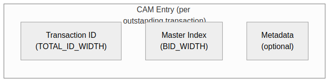

<!-- RTL Design Sherpa Documentation Header -->
<table>
<tr>
<td width="80">
  <a href="https://github.com/sean-galloway/RTLDesignSherpa">
    
  </a>
</td>
<td>
  <strong>RTL Design Sherpa</strong> · <em>Learning Hardware Design Through Practice</em><br>
  <sub>
    <a href="https://github.com/sean-galloway/RTLDesignSherpa">GitHub</a> ·
    <a href="https://github.com/sean-galloway/RTLDesignSherpa/blob/main/docs/DOCUMENTATION_INDEX.md">Documentation Index</a> ·
    <a href="https://github.com/sean-galloway/RTLDesignSherpa/blob/main/LICENSE">MIT License</a>
  </sub>
</td>
</tr>
</table>

---

<!-- End Header -->

# CAM Architecture

## Overview

Bridge uses Content-Addressable Memory (CAM) structures to track outstanding transactions and enable out-of-order response routing. The CAM allows fast lookup of master origin based on transaction ID.

## CAM Purpose

### Transaction Tracking

The CAM stores:
- Transaction ID (key)
- Originating master index (value)
- Transaction metadata (optional)

### Response Routing

When a response arrives:
1. Extract transaction ID from response
2. CAM lookup returns originating master
3. Route response to correct master

## CAM Structure

### Figure 4.1: CAM Entry Format



### CAM Sizing

```
CAM Depth = MAX_OUTSTANDING × NUM_MASTERS
CAM Width = TOTAL_ID_WIDTH + BID_WIDTH + METADATA_WIDTH
```

### Example Configuration

```
4 masters, 4-bit external ID, max 16 outstanding per master:
  BID_WIDTH = clog2(4) = 2
  TOTAL_ID_WIDTH = 4 + 2 = 6
  CAM Depth = 16 × 4 = 64 entries
  CAM Width = 6 + 2 + 8 = 16 bits
```

## CAM Operations

### Insertion (AR/AW Acceptance)

```systemverilog
// On AR handshake
if (arvalid && arready) begin
    cam_write_en <= 1'b1;
    cam_write_id <= {bid, arid};  // Key
    cam_write_master <= master_idx;  // Value
end
```

### Lookup (R/B Response)

```systemverilog
// On R response from slave
logic [BID_WIDTH-1:0] response_master;
logic cam_hit;

cam_lookup(slave_rid, response_master, cam_hit);

if (cam_hit) begin
    route_response_to(response_master);
end else begin
    // Error: Unknown transaction
end
```

### Deletion (Response Complete)

```systemverilog
// On RLAST or B response
if ((rvalid && rready && rlast) || (bvalid && bready)) begin
    cam_delete_en <= 1'b1;
    cam_delete_id <= response_id;
end
```

## Implementation Options

### Distributed RAM CAM

For small outstanding counts (< 16 entries):

```systemverilog
// Parallel comparator-based CAM
logic [DEPTH-1:0] valid;
logic [ID_WIDTH-1:0] id_table [DEPTH];
logic [BID_WIDTH-1:0] master_table [DEPTH];

// Parallel compare for lookup
logic [DEPTH-1:0] match;
for (genvar i = 0; i < DEPTH; i++) begin
    assign match[i] = valid[i] && (id_table[i] == lookup_id);
end
```

### Block RAM CAM

For larger outstanding counts (> 16 entries):

```systemverilog
// Sequential search CAM (saves logic)
logic [$clog2(DEPTH)-1:0] search_idx;
logic searching;

always_ff @(posedge clk) begin
    if (start_lookup) begin
        searching <= 1'b1;
        search_idx <= 0;
    end else if (searching) begin
        if (match_found || search_idx == DEPTH-1)
            searching <= 1'b0;
        else
            search_idx <= search_idx + 1;
    end
end
```

## CAM Overflow Handling

### Prevention

```systemverilog
// Backpressure when CAM full
assign ar_ready = !cam_full && downstream_ready;
assign aw_ready = !cam_full && downstream_ready;
```

### Error Response

If CAM overflow would occur:
1. Assert backpressure (ARREADY/AWREADY = 0)
2. Wait for responses to free entries
3. Never drop transactions

## Related Documentation

- [ID Tracking](02_id_tracking.md) - ID table implementation
- [Response Routing](../ch02_blocks/08_response_routing.md) - Using CAM for routing
