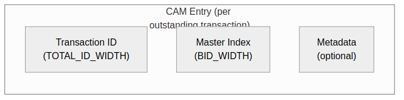

<!-- RTL Design Sherpa Documentation Header -->
<table>
<tr>
<td width="80">
  <a href="https://github.com/sean-galloway/RTLDesignSherpa">
    
  </a>
</td>
<td>
  <strong>RTL Design Sherpa</strong> · <em>Learning Hardware Design Through Practice</em><br>
  <sub>
    <a href="https://github.com/sean-galloway/RTLDesignSherpa">GitHub</a> ·
    <a href="https://github.com/sean-galloway/RTLDesignSherpa/blob/main/docs/DOCUMENTATION_INDEX.md">Documentation Index</a> ·
    <a href="https://github.com/sean-galloway/RTLDesignSherpa/blob/main/LICENSE">MIT License</a>
  </sub>
</td>
</tr>
</table>

---

<!-- End Header -->

# CAM Architecture

## Overview

**This chapter describes a design that was NEVER BUILT.**

> **What the generated bridge actually does.** There is no CAM, no ID table and
> no ID injection. `bridge_cam.sv` exists in the tree and is instantiated in
> **zero** generated bridges. AXI IDs pass through UNTOUCHED and at equal width
> -- `cpu_m_axi_awid` and `ddr_s_axi_awid` are both 4 bits in `bridge_2x2_rw`,
> with nothing prepended and nothing stripped.
>
> The originating master travels as a SIDEBAND signal (`xbar_bridge_id_aw` /
> `xbar_bridge_id_ar`) beside the transaction. Each slave adapter pushes it
> into an in-order FIFO on the address handshake, pops it on the response, and
> routes the response by FIFO POSITION -- never by the returned BID/RID.
>
> Two consequences follow, and both are tracked:
> * each slave port REQUIRES responses in request order across all IDs; a slave
>   that reorders between IDs misroutes here (BRIDGE-010, now detected by a
>   simulation-only check that compares the returned BID/RID against the FIFO
>   head);
> * the FIFO is fixed-depth, so the address handshake is gated on it being
>   not-full (BRIDGE-011).
>
> Out-of-order response routing is therefore NOT supported and NOT implemented.
>
> ---
>
> **Everything below this line describes a design that was never built.** It is
> retained because the mechanism that replaced it is easy to mistake for it.

The CAM existed to make out-of-order response routing possible: it would record which master owns each outstanding transaction ID, so a single lookup answers the routing question in one shot. Here's what was on the whiteboard.

## Functional Description

### What the CAM Was Meant to Do

**Transaction tracking.** The CAM stores:

- Transaction ID (key)
- Originating master index (value)
- Transaction metadata (optional)

**Response routing.** When a response arrives:

1. Extract transaction ID from response
2. CAM lookup returns originating master
3. Route response to correct master

### Figure 4.1: CAM Entry Format



### CAM Sizing

Depth scales with total outstanding transactions; width scales with everything the entry has to hold:

```
CAM Depth = MAX_OUTSTANDING × NUM_MASTERS
CAM Width = TOTAL_ID_WIDTH + BID_WIDTH + METADATA_WIDTH
```

### Example Configuration

```
4 masters, 4-bit external ID, max 16 outstanding per master:
  BID_WIDTH = clog2(4) = 2
  TOTAL_ID_WIDTH = 4 + 2 = 6
  CAM Depth = 16 × 4 = 64 entries
  CAM Width = 6 + 2 + 8 = 16 bits
```

### Insertion (AR/AW Acceptance)

On the AR handshake, the CAM writes the key (`{bid, arid}`) against the value (`master_idx`):

```systemverilog
// On AR handshake
if (arvalid && arready) begin
    cam_write_en <= 1'b1;
    cam_write_id <= {bid, arid};  // Key
    cam_write_master <= master_idx;  // Value
end
```

### Lookup (R/B Response)

When a response comes back from the slave, the lookup is one shot. A miss means the response belongs to no outstanding transaction — that's an error, full stop.

```systemverilog
// On R response from slave
logic [BID_WIDTH-1:0] response_master;
logic cam_hit;

cam_lookup(slave_rid, response_master, cam_hit);

if (cam_hit) begin
    route_response_to(response_master);
end else begin
    // Error: Unknown transaction
end
```

### Deletion (Response Complete)

Entries free up when the transaction completes — the last R beat, or the B beat:

```systemverilog
// On RLAST or B response
if ((rvalid && rready && rlast) || (bvalid && bready)) begin
    cam_delete_en <= 1'b1;
    cam_delete_id <= response_id;
end
```

### Implementation Options

Two ways to build it, picked by depth.

#### Distributed RAM CAM

For small outstanding counts (< 16 entries), a parallel comparator array does the lookup combinationally — every entry compared at once, logic cost scaling with depth:

```systemverilog
// Parallel comparator-based CAM
logic [DEPTH-1:0] valid;
logic [ID_WIDTH-1:0] id_table [DEPTH];
logic [BID_WIDTH-1:0] master_table [DEPTH];

// Parallel compare for lookup
logic [DEPTH-1:0] match;
for (genvar i = 0; i < DEPTH; i++) begin
    assign match[i] = valid[i] && (id_table[i] == lookup_id);
end
```

#### Block RAM CAM

For larger outstanding counts (> 16 entries), the parallel approach gets expensive, so the design falls back to a sequential search — one entry per cycle until a match or the end of the table:

```systemverilog
// Sequential search CAM (saves logic)
logic [$clog2(DEPTH)-1:0] search_idx;
logic searching;

always_ff @(posedge clk) begin
    if (start_lookup) begin
        searching <= 1'b1;
        search_idx <= 0;
    end else if (searching) begin
        if (match_found || search_idx == DEPTH-1)
            searching <= 1'b0;
        else
            search_idx <= search_idx + 1;
    end
end
```

### CAM Overflow Handling

**Prevention.** The CAM never overflows because it backpressures first:

```systemverilog
// Backpressure when CAM full
assign ar_ready = !cam_full && downstream_ready;
assign aw_ready = !cam_full && downstream_ready;
```

**Error response.** If CAM overflow would occur:

1. Assert backpressure (ARREADY/AWREADY = 0)
2. Wait for responses to free entries
3. Never drop transactions

Worth repeating: none of this exists. The generated bridge gates the address handshake on the tracking FIFO being not-full instead (BRIDGE-011), and it routes responses strictly in order.

## Related Modules

- [ID Tracking](02_id_tracking.md) - ID table implementation
- [Response Routing](../ch02_blocks/08_response_routing.md) - Using CAM for routing
