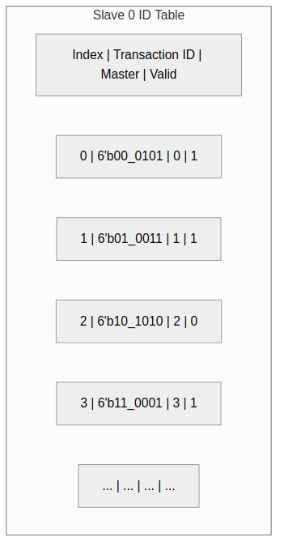

<!-- RTL Design Sherpa Documentation Header -->
<table>
<tr>
<td width="80">
  <a href="https://github.com/sean-galloway/RTLDesignSherpa">
    
  </a>
</td>
<td>
  <strong>RTL Design Sherpa</strong> · <em>Learning Hardware Design Through Practice</em><br>
  <sub>
    <a href="https://github.com/sean-galloway/RTLDesignSherpa">GitHub</a> ·
    <a href="https://github.com/sean-galloway/RTLDesignSherpa/blob/main/docs/DOCUMENTATION_INDEX.md">Documentation Index</a> ·
    <a href="https://github.com/sean-galloway/RTLDesignSherpa/blob/main/LICENSE">MIT License</a>
  </sub>
</td>
</tr>
</table>

---

<!-- End Header -->

# ID Tracking Tables

## Overview

ID tracking tables maintain the mapping between extended IDs (with Bridge ID) and originating masters. These tables enable correct response routing in multi-master systems.

## Table Structure

### Per-Slave ID Table

Each slave has its own ID tracking table:

### Figure 4.2: ID Table Structure



### Table Sizing

```
Entries = MAX_OUTSTANDING_PER_SLAVE
Width = TOTAL_ID_WIDTH + clog2(NUM_MASTERS) + 1 (valid)
```

## ID Extension

### Master-Side Extension

When transaction enters Bridge:

```systemverilog
// Extend ID with Bridge ID (master index)
logic [TOTAL_ID_WIDTH-1:0] extended_id;
assign extended_id = {master_bid, external_id};

// Example: Master 2, external ID = 4'hA
// master_bid = 2'b10, external_id = 4'b1010
// extended_id = 6'b10_1010
```

### Slave-Side Presentation

Extended ID goes to slave:

```systemverilog
assign s_axi_arid = extended_id;  // 6 bits to slave
assign s_axi_awid = extended_id;  // 6 bits to slave
```

## ID Extraction

### Response Parsing

When response returns from slave:

```systemverilog
// Extract Bridge ID and external ID
logic [BID_WIDTH-1:0] bridge_id;
logic [ID_WIDTH-1:0] external_id;

assign bridge_id = slave_rid[TOTAL_ID_WIDTH-1:ID_WIDTH];
assign external_id = slave_rid[ID_WIDTH-1:0];

// Route to master based on bridge_id
assign m_rvalid[bridge_id] = s_rvalid;
assign m_rid[bridge_id] = external_id;  // Strip Bridge ID
```

## Table Operations

### Allocation (AR/AW Phase)

```systemverilog
always_ff @(posedge clk) begin
    if (arvalid && arready) begin
        // Find free entry
        for (int i = 0; i < DEPTH; i++) begin
            if (!valid[i]) begin
                id_table[i] <= extended_arid;
                master_table[i] <= master_idx;
                valid[i] <= 1'b1;
                break;
            end
        end
    end
end
```

### Lookup (R/B Phase)

```systemverilog
// Combinational lookup
logic [NUM_MASTERS-1:0] master_onehot;
always_comb begin
    master_onehot = '0;
    for (int i = 0; i < DEPTH; i++) begin
        if (valid[i] && (id_table[i] == response_id)) begin
            master_onehot[master_table[i]] = 1'b1;
        end
    end
end
```

### Deallocation (Response Complete)

```systemverilog
always_ff @(posedge clk) begin
    if (rvalid && rready && rlast) begin
        // Find and invalidate matching entry
        for (int i = 0; i < DEPTH; i++) begin
            if (valid[i] && (id_table[i] == response_rid)) begin
                valid[i] <= 1'b0;
                break;
            end
        end
    end
end
```

## Multi-ID Considerations

### Same External ID, Different Masters

```
Master 0 issues ID=5 → Extended: 00_0101
Master 1 issues ID=5 → Extended: 01_0101
Master 2 issues ID=5 → Extended: 10_0101

All three can be outstanding simultaneously!
The extended ID ensures uniqueness.
```

### Same Extended ID (Error)

This cannot happen:
- Bridge ID is unique per master
- Extended ID = {unique BID, external ID}
- Same extended ID implies same master + same external ID
- AXI4 requires unique IDs per master for outstanding transactions

## Resource Utilization

### Table Resources

```
4 masters, 4-bit external ID, 16 outstanding per slave:

Per-slave table:
  Entries: 16
  Width: 6 + 2 + 1 = 9 bits
  Total: 16 × 9 = 144 bits

4 slaves:
  Total: 4 × 144 = 576 bits (~72 bytes)

Implementation:
  Distributed RAM: ~150 LEs
  Block RAM: 1 BRAM (minimum)
```

## Related Documentation

- [CAM Architecture](01_cam_architecture.md) - CAM implementation details
- [Response Routing](../ch02_blocks/08_response_routing.md) - Using tables for routing
