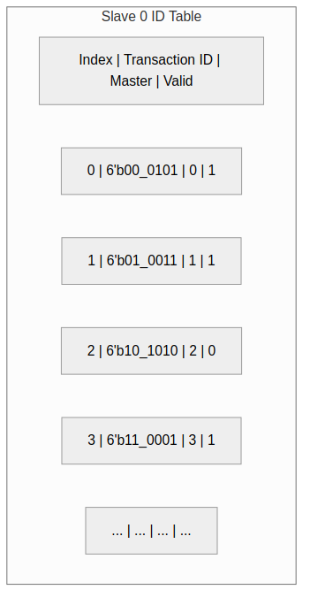

<!-- RTL Design Sherpa Documentation Header -->
<table>
<tr>
<td width="80">
  <a href="https://github.com/sean-galloway/RTLDesignSherpa">
    
  </a>
</td>
<td>
  <strong>RTL Design Sherpa</strong> · <em>Learning Hardware Design Through Practice</em><br>
  <sub>
    <a href="https://github.com/sean-galloway/RTLDesignSherpa">GitHub</a> ·
    <a href="https://github.com/sean-galloway/RTLDesignSherpa/blob/main/docs/DOCUMENTATION_INDEX.md">Documentation Index</a> ·
    <a href="https://github.com/sean-galloway/RTLDesignSherpa/blob/main/LICENSE">MIT License</a>
  </sub>
</td>
</tr>
</table>

---

<!-- End Header -->

# Response Tracking

## Overview

A multi-master fabric has to know which master a response belongs to. This bridge records it **positionally**: each slave adapter pushes the originating master's `bridge_id` onto an in-order FIFO at the address handshake and pops it on the response, routing by FIFO head. The AXI ID passes through untouched in both directions.

```systemverilog
wr_fifo[wr_ptr[...]] <= xbar_bridge_id_aw;      // push on AW accept
assign bid_bridge_id  = wr_fifo[rd_ptr[...]];   // route by the HEAD
```

The consequence is a requirement the fabric does not check: **each slave port must return B/R in request order across ALL IDs.** AXI4 permits a slave to complete different-ID transactions out of order. Every generated slave adapter now carries a SIMULATION-ONLY check that compares the returned BID/RID against the FIFO head and $error()s on a mismatch (BRIDGE-010); it cannot fire in silicon --
see BRIDGE-010.

The rest of this page documents an **ID tracking table** design that was specified but never built: extended IDs formed by prepending a Bridge ID, per-slave lookup tables, out-of-order completion. `bridge_cam.sv` exists in the tree and is instantiated in zero generated bridges. It is kept because the positional scheme above is easy to mistake for it, and because several other pages once described it as real.

---

## Functional Description

### HISTORICAL -- the unbuilt ID-table design

Everything below this line describes the design that was NOT implemented.

### Not implemented: the per-slave ID table

**What follows describes a design that was never built.** It is retained
because the mechanism that replaced it is easy to mistake for it.

The generated RTL has no ID tables and no CAM: `bridge_cam.sv` exists in the
tree and is instantiated in zero generated bridges. IDs are pass-through --
the slave port is declared at the same width as the master port, and nothing
is prepended. Each slave adapter instead keeps an **in-order FIFO** of the
originating master's `bridge_id`, pushed on the address handshake and popped
on the response, and routes by FIFO POSITION rather than by the returned
BID/RID. The consequence -- each slave port must return B/R in request order
across all IDs -- is tracked as BRIDGE-010.

### Per-Slave ID Table (historical)

Each slave was to have its own ID tracking table:

### Figure 4.2: ID Table Structure



### Table Sizing

```
Entries = MAX_OUTSTANDING_PER_SLAVE
Width = TOTAL_ID_WIDTH + clog2(NUM_MASTERS) + 1 (valid)
```

### ID Extension

#### Master-Side Extension

When a transaction enters the bridge, its ID would have been extended with the Bridge ID (master index):

```systemverilog
// Extend ID with Bridge ID (master index)
logic [TOTAL_ID_WIDTH-1:0] extended_id;
assign extended_id = {master_bid, external_id};

// Example: Master 2, external ID = 4'hA
// master_bid = 2'b10, external_id = 4'b1010
// extended_id = 6'b10_1010
```

#### Slave-Side Presentation (historical design -- not built)

In the unbuilt design an extended ID would have gone to the slave. In the RTL
the slave receives the master's ID unchanged:

```systemverilog
assign s_axi_arid = extended_id;  // 6 bits to slave
assign s_axi_awid = extended_id;  // 6 bits to slave
```

### ID Extraction

#### Response Parsing

When the response returns from the slave, the extended ID splits back apart — the upper bits pick the master, the lower bits go home as the ID:

```systemverilog
// Extract Bridge ID and external ID
logic [BID_WIDTH-1:0] bridge_id;
logic [ID_WIDTH-1:0] external_id;

assign bridge_id = slave_rid[TOTAL_ID_WIDTH-1:ID_WIDTH];
assign external_id = slave_rid[ID_WIDTH-1:0];

// Route to master based on bridge_id
assign m_rvalid[bridge_id] = s_rvalid;
assign m_rid[bridge_id] = external_id;  // Strip Bridge ID
```

### Table Operations

#### Allocation (AR/AW Phase)

On the address handshake, find a free entry and claim it:

```systemverilog
always_ff @(posedge clk) begin
    if (arvalid && arready) begin
        // Find free entry
        for (int i = 0; i < DEPTH; i++) begin
            if (!valid[i]) begin
                id_table[i] <= extended_arid;
                master_table[i] <= master_idx;
                valid[i] <= 1'b1;
                break;
            end
        end
    end
end
```

#### Lookup (R/B Phase)

The lookup is combinational across the whole table, producing a one-hot master select:

```systemverilog
// Combinational lookup
logic [NUM_MASTERS-1:0] master_onehot;
always_comb begin
    master_onehot = '0;
    for (int i = 0; i < DEPTH; i++) begin
        if (valid[i] && (id_table[i] == response_id)) begin
            master_onehot[master_table[i]] = 1'b1;
        end
    end
end
```

#### Deallocation (Response Complete)

When the last beat lands, invalidate the matching entry:

```systemverilog
always_ff @(posedge clk) begin
    if (rvalid && rready && rlast) begin
        // Find and invalidate matching entry
        for (int i = 0; i < DEPTH; i++) begin
            if (valid[i] && (id_table[i] == response_rid)) begin
                valid[i] <= 1'b0;
                break;
            end
        end
    end
end
```

### Multi-ID Considerations

#### Same External ID, Different Masters

```
Master 0 issues ID=5 → Extended: 00_0101
Master 1 issues ID=5 → Extended: 01_0101
Master 2 issues ID=5 → Extended: 10_0101

All three can be outstanding simultaneously!
The extended ID ensures uniqueness.
```

That was the whole point of the extension — three masters can each have ID=5 outstanding at once, and the prepended Bridge ID keeps them distinct.

#### Same Extended ID (historical design -- not built)

This cannot happen:

- Bridge ID is unique per master
- Extended ID = {unique BID, external ID}
- Same extended ID implies same master + same external ID
- AXI4 requires unique IDs per master for outstanding transactions

## Design Notes

### Resource Utilization

What the tables would have cost, for the record:

```
4 masters, 4-bit external ID, 16 outstanding per slave:

Per-slave table:
  Entries: 16
  Width: 6 + 2 + 1 = 9 bits
  Total: 16 × 9 = 144 bits

4 slaves:
  Total: 4 × 144 = 576 bits (~72 bytes)

Implementation:
  Distributed RAM: ~150 LEs
  Block RAM: 1 BRAM (minimum)
```

## Related Modules

- [CAM Architecture](01_cam_architecture.md) - CAM implementation details
- [Response Routing](../ch02_blocks/08_response_routing.md) - Using tables for routing
