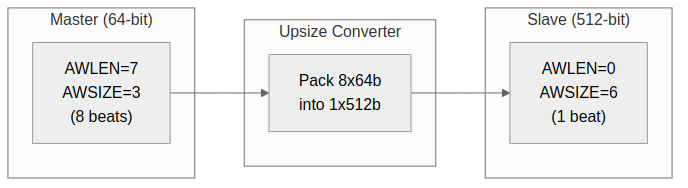
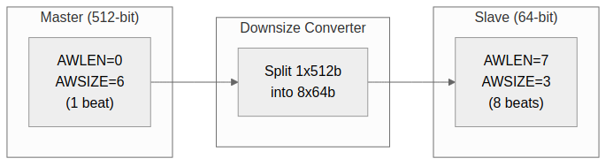

<!-- RTL Design Sherpa Documentation Header -->
<table>
<tr>
<td width="80">
  <a href="https://github.com/sean-galloway/RTLDesignSherpa">
    
  </a>
</td>
<td>
  <strong>RTL Design Sherpa</strong> · <em>Learning Hardware Design Through Practice</em><br>
  <sub>
    <a href="https://github.com/sean-galloway/RTLDesignSherpa">GitHub</a> ·
    <a href="https://github.com/sean-galloway/RTLDesignSherpa/blob/main/docs/DOCUMENTATION_INDEX.md">Documentation Index</a> ·
    <a href="https://github.com/sean-galloway/RTLDesignSherpa/blob/main/LICENSE">MIT License</a>
  </sub>
</td>
</tr>
</table>

---

<!-- End Header -->

# Width Converters

## Overview

Width converters handle data width mismatches between masters and slaves. Bridge automatically inserts upsizers (narrow to wide) and downsizers (wide to narrow) as needed.

## Upsize Converter

### Purpose

Convert narrow master data to wide slave interface.

### Figure 5.1: Upsize Converter (64-bit to 512-bit)



### Implementation

```systemverilog
module width_upsize #(
    parameter IN_WIDTH = 64,
    parameter OUT_WIDTH = 512
) (
    input  logic clk, rst_n,

    // Narrow input
    input  logic                    s_valid,
    output logic                    s_ready,
    input  logic [IN_WIDTH-1:0]     s_data,
    input  logic                    s_last,

    // Wide output
    output logic                    m_valid,
    input  logic                    m_ready,
    output logic [OUT_WIDTH-1:0]    m_data,
    output logic                    m_last
);

    localparam RATIO = OUT_WIDTH / IN_WIDTH;

    logic [OUT_WIDTH-1:0] r_buffer;
    logic [$clog2(RATIO)-1:0] r_count;

    always_ff @(posedge clk or negedge rst_n) begin
        if (!rst_n) begin
            r_count <= '0;
            r_buffer <= '0;
        end else if (s_valid && s_ready) begin
            // Pack input into buffer
            r_buffer[r_count * IN_WIDTH +: IN_WIDTH] <= s_data;

            if (s_last || r_count == RATIO - 1) begin
                r_count <= '0;
            end else begin
                r_count <= r_count + 1;
            end
        end
    end

    // Output when buffer full or last beat
    assign m_valid = (r_count == RATIO - 1) || s_last;
    assign m_data = r_buffer;
    assign s_ready = !m_valid || m_ready;

endmodule
```

### Burst Length Conversion

| Master AWLEN | Master Beats | Slave AWLEN | Slave Beats |
|--------------|--------------|-------------|-------------|
| 7 (8 beats) | 8 × 64b | 0 (1 beat) | 1 × 512b |
| 15 (16 beats) | 16 × 64b | 1 (2 beats) | 2 × 512b |
| 255 (256 beats) | 256 × 64b | 31 (32 beats) | 32 × 512b |

: Table 5.3: Burst Length Conversion Examples

## Downsize Converter

### Purpose

Convert wide master data to narrow slave interface.

### Figure 5.2: Downsize Converter (512-bit to 64-bit)



### Implementation

```systemverilog
module width_downsize #(
    parameter IN_WIDTH = 512,
    parameter OUT_WIDTH = 64
) (
    input  logic clk, rst_n,

    // Wide input
    input  logic                    s_valid,
    output logic                    s_ready,
    input  logic [IN_WIDTH-1:0]     s_data,
    input  logic                    s_last,

    // Narrow output
    output logic                    m_valid,
    input  logic                    m_ready,
    output logic [OUT_WIDTH-1:0]    m_data,
    output logic                    m_last
);

    localparam RATIO = IN_WIDTH / OUT_WIDTH;

    logic [IN_WIDTH-1:0] r_buffer;
    logic [$clog2(RATIO)-1:0] r_count;
    logic r_active;

    always_ff @(posedge clk or negedge rst_n) begin
        if (!rst_n) begin
            r_count <= '0;
            r_buffer <= '0;
            r_active <= 1'b0;
        end else begin
            if (!r_active && s_valid) begin
                // Load new wide word
                r_buffer <= s_data;
                r_active <= 1'b1;
                r_count <= '0;
            end else if (r_active && m_ready) begin
                if (r_count == RATIO - 1) begin
                    r_active <= 1'b0;
                end else begin
                    r_count <= r_count + 1;
                end
            end
        end
    end

    // Output from buffer slice
    assign m_valid = r_active;
    assign m_data = r_buffer[r_count * OUT_WIDTH +: OUT_WIDTH];
    assign m_last = r_active && (r_count == RATIO - 1);
    assign s_ready = !r_active;

endmodule
```

## Strobe Handling

### Upsize Strobe Packing

```systemverilog
// Pack 8-byte strobes into 64-byte strobes
logic [7:0] in_strb;   // 64-bit input
logic [63:0] out_strb; // 512-bit output

always_ff @(posedge clk) begin
    if (s_valid && s_ready) begin
        out_strb[r_count * 8 +: 8] <= in_strb;
    end
end
```

### Downsize Strobe Splitting

```systemverilog
// Split 64-byte strobes into 8-byte strobes
logic [63:0] in_strb;  // 512-bit input
logic [7:0] out_strb;  // 64-bit output

assign out_strb = in_strb[r_count * 8 +: 8];
```

## Resource Utilization

### Upsize Converter (64 to 512)

```
Registers: ~520 (buffer + control)
Logic: ~200 LEs (packing + control)
```

### Downsize Converter (512 to 64)

```
Registers: ~520 (buffer + control)
Logic: ~150 LEs (selection + control)
```

## AXIL-to-Wider-Slave Master-Side Alignment Converters

When an AXI4-Lite master connects to a wider AXI4 slave through the bridge, alignment issues arise: AXIL single-beat transactions are not inherently wide-alignment-aware. The bridge generator emits master-side alignment converters (`axil_to_axi4_wide_align_{rd,wr}.sv`) to handle partial-word alignment on the AXIL side while producing properly-aligned transactions on the wide slave side.

### Use Case Example

```
32-bit AXIL Master → Bridge → 64-bit AXI4 Slave

Master writes 32-bit word to offset 0x04:
  Data = 0xAABBCCDD (on bits [31:0])
  
Alignment converter must place it on 64-bit slave at offset 0x04:
  Slave sees: 0xXXXXAAAABBCCDD (on bits [63:0])
  
(The converter handles partial-byte-lane selection.)
```

### Architecture

**Read Path**:
- Master issues AXIL read (no burst, single beat)
- Converter passes address to slave (unchanged)
- Slave returns 64-bit word
- Converter extracts the relevant 32-bit slice for the master

**Write Path**:
- Master issues AXIL write with address offset and 32-bit data
- Converter computes byte-lane position within 64-bit word
- Converter expands 32-bit strobe to 64-bit strobe (8 lanes)
- Converter sends full 64-bit write to slave
- Slave performs a 64-bit write with byte strobes

### Modules

- **`axil_to_axi4_wide_align_rd.sv`**: Read path (address → data conversion)
- **`axil_to_axi4_wide_align_wr.sv`**: Write path (strobe expansion, data placement)

**Note**: These converters handle **width alignment**, not **protocol bridging**. Protocol conversion (AXIL→AXI4 burst restriction) is applied separately at the slave boundary (via `axi4_to_axil4_*` shims if needed).

## Related Documentation

- [Width Conversion Block](../ch02_blocks/06_width_conversion.md) - Block-level description
- [APB Converters](02_apb_converters.md) - Protocol conversion
- [Generator-Emitted Conversion Shims](../ch02_blocks/07_protocol_conversion.md#generator-emitted-conversion-shims) - Master-side vs. slave-side shim placement
