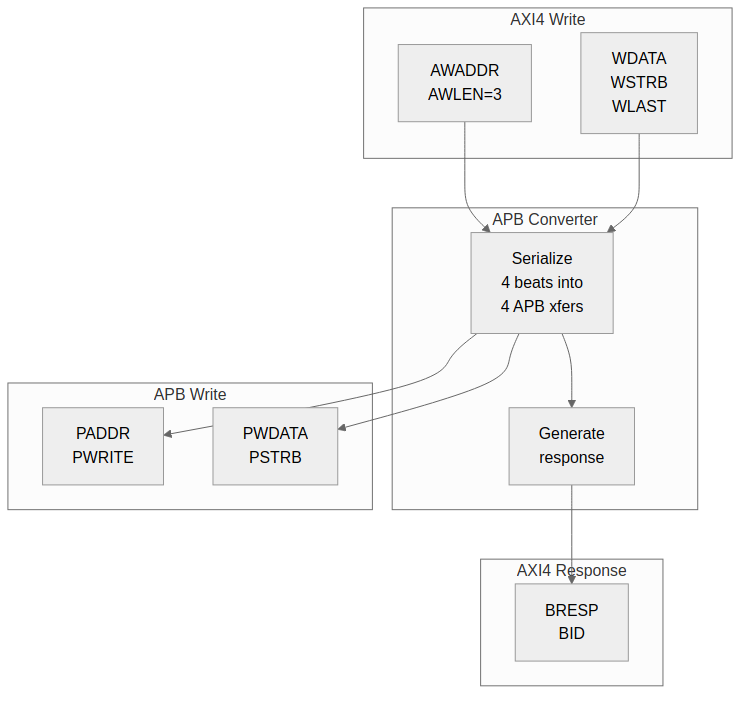
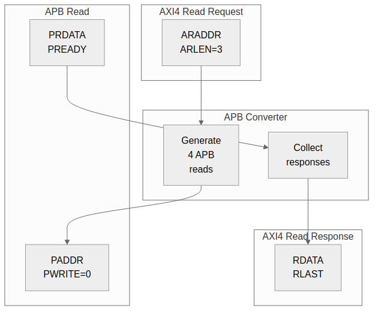

<!-- RTL Design Sherpa Documentation Header -->
<table>
<tr>
<td width="80">
  <a href="https://github.com/sean-galloway/RTLDesignSherpa">
    
  </a>
</td>
<td>
  <strong>RTL Design Sherpa</strong> · <em>Learning Hardware Design Through Practice</em><br>
  <sub>
    <a href="https://github.com/sean-galloway/RTLDesignSherpa">GitHub</a> ·
    <a href="https://github.com/sean-galloway/RTLDesignSherpa/blob/main/docs/DOCUMENTATION_INDEX.md">Documentation Index</a> ·
    <a href="https://github.com/sean-galloway/RTLDesignSherpa/blob/main/LICENSE">MIT License</a>
  </sub>
</td>
</tr>
</table>

---

<!-- End Header -->

# APB Converters

## Overview

APB converters transform AXI4 transactions into APB protocol. This is necessary when high-performance masters need to access low-speed peripherals.

## Conversion Requirements

### Protocol Differences

| Feature | AXI4 | APB |
|---------|------|-----|
| Channels | 5 (AW, W, B, AR, R) | 1 (combined) |
| Bursts | Up to 256 beats | None (single) |
| Pipelining | Yes | No |
| Min cycles | 1 per beat | 2 per transfer |

: Table 5.1: AXI4 vs APB Protocol Comparison

### Conversion Strategy

1. Split AXI4 bursts into individual APB transfers
2. Serialize AW+W into APB write sequence
3. Convert AR into APB read sequence
4. Generate AXI4 responses from APB completions

## Write Conversion

### Figure 5.3: AXI4 Write to APB Write



### State Machine

```systemverilog
typedef enum logic [2:0] {
    IDLE,
    AW_ACCEPT,
    W_ACCEPT,
    APB_SETUP,
    APB_ACCESS,
    B_GENERATE
} apb_wr_state_t;

apb_wr_state_t r_state;

always_ff @(posedge clk or negedge rst_n) begin
    if (!rst_n) begin
        r_state <= IDLE;
    end else begin
        case (r_state)
            IDLE: if (awvalid) r_state <= AW_ACCEPT;

            AW_ACCEPT: begin
                if (awready) r_state <= W_ACCEPT;
            end

            W_ACCEPT: begin
                if (wvalid && wready) r_state <= APB_SETUP;
            end

            APB_SETUP: r_state <= APB_ACCESS;

            APB_ACCESS: begin
                if (pready) begin
                    if (r_beat_count == r_awlen)
                        r_state <= B_GENERATE;
                    else
                        r_state <= W_ACCEPT;  // Next beat
                end
            end

            B_GENERATE: begin
                if (bready) r_state <= IDLE;
            end
        endcase
    end
end
```

## Read Conversion

### Figure 5.4: AXI4 Read to APB Read



### Read State Machine

```systemverilog
typedef enum logic [2:0] {
    IDLE,
    AR_ACCEPT,
    APB_SETUP,
    APB_ACCESS,
    R_GENERATE
} apb_rd_state_t;
```

## Burst Handling

### Burst to Single Conversion

```
AXI4 Burst (AWLEN=7, 8 beats):
  Beat 0: AWADDR + 0×SIZE
  Beat 1: AWADDR + 1×SIZE
  Beat 2: AWADDR + 2×SIZE
  ...
  Beat 7: AWADDR + 7×SIZE

APB Sequence:
  Transfer 0: PADDR = AWADDR + 0×SIZE
  Transfer 1: PADDR = AWADDR + 1×SIZE
  ...
  Transfer 7: PADDR = AWADDR + 7×SIZE
```

### Address Calculation

```systemverilog
// Calculate APB address for each beat
logic [ADDR_WIDTH-1:0] apb_addr;
logic [7:0] beat_count;

always_comb begin
    case (r_burst_type)
        FIXED: apb_addr = r_base_addr;
        INCR:  apb_addr = r_base_addr + (beat_count << r_size);
        WRAP:  apb_addr = wrap_address(r_base_addr, beat_count, r_size, r_len);
    endcase
end
```

## Error Handling

### APB Error to AXI4 Response

| APB PSLVERR | AXI4 Response |
|-------------|---------------|
| 0 (OK) | OKAY (2'b00) |
| 1 (Error) | SLVERR (2'b10) |

: Table 5.2: APB to AXI4 Error Mapping

### Error Propagation

```systemverilog
// Latch first error in burst
logic r_error_seen;

always_ff @(posedge clk) begin
    if (r_state == APB_ACCESS && pready && pslverr)
        r_error_seen <= 1'b1;
    if (r_state == IDLE)
        r_error_seen <= 1'b0;
end

// Final response reflects any errors
assign bresp = r_error_seen ? 2'b10 : 2'b00;
```

## Performance Considerations

### Throughput Impact

```
AXI4 alone: 1 beat per cycle (peak)
AXI4 to APB: 1 beat per 2+ cycles (minimum)

Throughput reduction: ~50% or more
```

### Latency Impact

```
AXI4 read: 1-2 cycles (typical)
AXI4-to-APB read: 4+ cycles minimum
  - 1 cycle: AR accept
  - 1 cycle: APB setup
  - 1+ cycles: APB access (PREADY)
  - 1 cycle: R generate
```

## Resource Utilization

### APB Converter Resources

```
Logic Elements: ~300-400 LEs
Registers: ~100-150 regs
Block RAM: 0

Breakdown:
- State machine: ~50 LEs, ~20 regs
- Address calc: ~100 LEs, ~50 regs
- Beat counter: ~30 LEs, ~8 regs
- Data buffering: ~100 LEs, ~DATA_WIDTH regs
```

## Related Documentation

- [Protocol Conversion Block](../ch02_blocks/07_protocol_conversion.md) - Block description
- [Width Converters](01_width_converters.md) - Data width conversion
