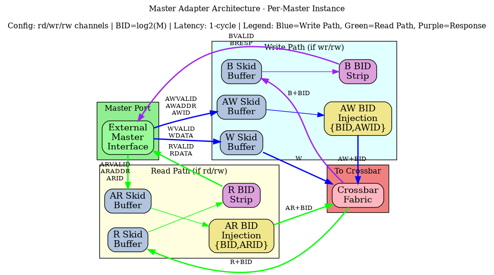

# 2.1 Master Adapter

The Master Adapter is a per-master module that provides timing isolation, protocol normalization, and request preparation for the crossbar interconnect. Each master port in the bridge has its own dedicated adapter instance.

## 2.1.1 Purpose and Function

The Master Adapter serves several critical functions:

1. **Timing Isolation**: Inserts pipeline registers (skid buffers) to break combinatorial paths from master to crossbar
2. **Channel Specialization**: Separates read-only, write-only, and read-write masters for optimal resource utilization
3. **Bridge ID Injection**: Adds internal tracking IDs to transactions for response routing
4. **Protocol Normalization**: Ensures all transactions meet crossbar assumptions and constraints
5. **Backpressure Management**: Handles ready/valid handshaking with single-cycle latency

## 2.1.2 Block Diagram



*Figure 2.1: Master Adapter architecture showing per-master skid buffers, bridge ID injection/stripping, and channel specialization for rd/wr/rw configurations.*

## 2.1.3 Channel Specialization

The Bridge generator creates three types of master adapters based on the channel usage specified in the configuration:

### Read-Only Masters
**Channels**: AR (Address Read), R (Read Data)

```
Configuration: "rd" or "read"
RTL Generated: adapter_master_rd_<id>.sv

Optimizations:
- No write address channel logic
- No write data channel logic
- No write response channel logic
- Reduced arbitration participation (read path only)
```

### Write-Only Masters
**Channels**: AW (Address Write), W (Write Data), B (Write Response)

```
Configuration: "wr" or "write"
RTL Generated: adapter_master_wr_<id>.sv

Optimizations:
- No read address channel logic
- No read data channel logic
- Reduced arbitration participation (write path only)
```

### Read-Write Masters
**Channels**: AR, R, AW, W, B (Full AXI4 interface)

```
Configuration: "rw" or "readwrite"
RTL Generated: adapter_master_rw_<id>.sv

Full Functionality:
- All five AXI4 channels implemented
- Participates in both read and write arbitration
- Maximum flexibility but larger resource footprint
```

## 2.1.4 Skid Buffer Architecture

Each AXI4 channel passes through a skid buffer for timing isolation. The skid buffer implements:

### Registered Forward Path
```systemverilog
// Simplified skid buffer concept
always_ff @(posedge clk) begin
    if (!rst_n) begin
        valid_reg <= 1'b0;
    end else if (!valid_reg || ready_out) begin
        valid_reg <= valid_in;
        data_reg  <= data_in;
    end
end
```

### Single-Cycle Backpressure Response
- When downstream is not ready, accepts one additional beat into holding register
- Signals ready_in = 0 in same cycle to upstream
- No combinatorial paths between upstream and downstream

### Pipeline Depth
- Default: 1 stage (skid buffer)
- Configurable: Up to 8 stages for high-frequency designs
- Trade-off: Latency vs. timing closure

**Performance Impact**:
- Adds 1 cycle latency per channel
- Enables higher clock frequencies
- Prevents critical paths through crossbar

## 2.1.5 Bridge ID Management

### ID Width Calculation
```
BID_WIDTH = clog2(num_masters)

Examples:
- 2 masters  → BID_WIDTH = 1
- 4 masters  → BID_WIDTH = 2
- 8 masters  → BID_WIDTH = 3
- 16 masters → BID_WIDTH = 4
```

### ID Injection (Request Path)

For each master adapter, a unique constant Bridge ID is appended to the AXI transaction ID:

```
AR Channel:
  Internal ARID = {MASTER_BID[BID_WIDTH-1:0], External ARID[ARID_WIDTH-1:0]}
  Internal ARID Width = BID_WIDTH + ARID_WIDTH

AW Channel:
  Internal AWID = {MASTER_BID[BID_WIDTH-1:0], External AWID[AWID_WIDTH-1:0]}
  Internal AWID Width = BID_WIDTH + AWID_WIDTH
```

**Example**: 4-master system, external ARID_WIDTH = 4
```
Master 0: BID = 2'b00, External ID = 4'h3 → Internal ID = 6'b00_0011
Master 1: BID = 2'b01, External ID = 4'h3 → Internal ID = 6'b01_0011
Master 2: BID = 2'b10, External ID = 4'h5 → Internal ID = 6'b10_0101
Master 3: BID = 2'b11, External ID = 4'hA → Internal ID = 6'b11_1010
```

### ID Stripping (Response Path)

The Bridge ID is removed from responses before returning to the master:

```
R Channel:
  External RID = Internal RID[ARID_WIDTH-1:0]
  Bridge routes based on Internal RID[BID_WIDTH+ARID_WIDTH-1:ARID_WIDTH]

B Channel:
  External BID = Internal BID[AWID_WIDTH-1:0]
  Bridge routes based on Internal BID[BID_WIDTH+AWID_WIDTH-1:AWID_WIDTH]
```

This ensures:
- Master sees original transaction IDs
- Bridge internally tracks which master originated each transaction
- Responses route back to correct master even with ID reuse across masters

## 2.1.6 Protocol Normalization

The Master Adapter enforces several protocol requirements:

### Valid Address Ranges
- Checks addresses against slave address maps
- Flags out-of-range accesses for error handling
- Prevents deadlocks from illegal addresses

### Burst Constraints
- Validates ARLEN/AWLEN vs. 4KB boundary rules
- Ensures burst types are supported (FIXED, INCR, WRAP)
- Checks SIZE vs. DATA_WIDTH compatibility

### Signal Defaults
- Provides default values for unused signals
- Ensures ARCACHE/AWCACHE have legal values
- Sets ARPROT/AWPROT based on configuration

## 2.1.7 Interface Specifications

### External Master Interface (per master)
```
Input Channels (from master):
- ARVALID, ARREADY, ARADDR, ARBURST, ARCACHE, ARID, ARLEN, 
  ARLOCK, ARPROT, ARQOS, ARSIZE

- AWVALID, AWREADY, AWADDR, AWBURST, AWCACHE, AWID, AWLEN,
  AWLOCK, AWPROT, AWQOS, AWSIZE

- WVALID, WREADY, WDATA, WSTRB, WLAST

Output Channels (to master):
- RVALID, RREADY, RDATA, RID, RLAST, RRESP

- BVALID, BREADY, BID, BRESP
```

### Internal Crossbar Interface (per master)
```
Output Channels (to crossbar):
- AR* signals + Internal ARID (wider)
- AW* signals + Internal AWID (wider)  
- W* signals (unchanged)

Input Channels (from crossbar):
- R* signals + Internal RID (wider)
- B* signals + Internal BID (wider)
```

## 2.1.8 Resource Utilization

### Per-Master Adapter Resources (Typical)

**Read-Write Master (64-bit data, 32-bit addr, 4-bit ID)**:
```
Logic Elements:  ~200-400 (depending on ID width and features)
Registers:       ~150-250 (pipeline stages + control)
Block RAM:       0 (CAM is in crossbar core)

Breakdown:
- Skid buffers (5 channels × ~30 regs each): ~150 regs
- ID manipulation logic: ~50 LEs
- Control FSMs: ~100 LEs
- Routing logic: ~50 LEs
```

**Read-Only Master**: ~60% of read-write resources  
**Write-Only Master**: ~65% of read-write resources

### Scaling Considerations

Resource usage scales with:
- Number of masters (linear scaling, one adapter per master)
- ID width (logarithmic: +BID_WIDTH bits per transaction)
- Pipeline depth (linear: deeper pipelines = more registers)
- Data width (linear: wider data = wider skid buffers)

## 2.1.9 Timing Characteristics

### Latency

**Request Path** (Master → Crossbar):
- Minimum: 1 cycle (skid buffer)
- With 4-stage pipeline: 4 cycles
- With ID injection: +0 cycles (combinatorial within stage)

**Response Path** (Crossbar → Master):
- Minimum: 1 cycle (skid buffer)
- With 4-stage pipeline: 4 cycles
- With ID stripping: +0 cycles (combinatorial within stage)

**Total Round-Trip Overhead**: 2-8 cycles (depending on pipeline depth)

### Throughput

- **Maximum**: 1 transaction per cycle per channel (fully pipelined)
- **Backpressure**: Propagates with 1-cycle latency
- **Burst Performance**: No degradation; bursts flow continuously when ready

### Critical Paths

Typical critical paths (if skid buffers not used):
- Master ARVALID → Crossbar arbitration logic
- Crossbar grant → Master ARREADY
- Slave RDATA → Master RDATA

**Solution**: Skid buffers break all these paths at the cost of 1-cycle latency.

## 2.1.10 Configuration Parameters

### Per-Master Parameters (from TOML/CSV)

```toml
[[masters]]
name = "cpu"
channels = "rw"              # "rd", "wr", or "rw"
arid_width = 4               # External ID width
awid_width = 4               # Can differ from ARID
addr_width = 32              # Address bus width
data_width = 64              # Data bus width
pipeline_depth = 1           # Skid buffer stages (1-8)
```

### Global Parameters (affect all adapters)

```toml
[bridge]
internal_data_width = 64     # Crossbar data width
enable_width_conversion = true
bid_width = 2                # Calculated: clog2(num_masters)
```

## 2.1.11 Debug and Observability

### Recommended Debug Signals

For ILA or waveform capture:
```
- Master adapter input valid/ready (all channels)
- Master adapter output valid/ready (all channels)
- Bridge ID assignments per transaction
- Pipeline stage occupancy
- Backpressure events (ready = 0 while valid = 1)
```

### Common Issues and Debug

**Symptom**: Master hangs waiting for READY  
**Check**: 
- Is adapter receiving grants from arbiters?
- Is slave responding to requests?
- Is response path clear?

**Symptom**: Incorrect data returned to master  
**Check**:
- Bridge ID extraction logic
- ID width mismatches
- Response routing in crossbar

**Symptom**: Timing violations  
**Check**:
- Increase pipeline_depth parameter
- Verify clock frequency vs. design complexity
- Check for combinatorial loops

## 2.1.12 Future Enhancements

### Planned Features
- **Dynamic Pipeline Depth**: Adjust depth based on operating frequency
- **FIFO Mode**: Deeper buffering (16-256 entries) for burst-intensive masters
- **QoS Support**: Priority-based arbitration hints
- **Performance Counters**: Transaction counts, stall cycles, utilization metrics

### Under Consideration
- **Clock Domain Crossing**: Per-master clock domains with async FIFOs
- **Width Conversion at Adapter**: Move width logic to adapters for distributed conversion
- **Outstanding Transaction Tracking**: Windowing for improved OOO performance

---

**Related Sections**:
- Section 2.3: Crossbar Core (interconnect architecture)
- Section 2.4: Arbitration (how adapters compete for slaves)
- Section 2.5: ID Management (CAM structures for response routing)
- Section 3.2: Master Port Interface (signal-level specifications)
