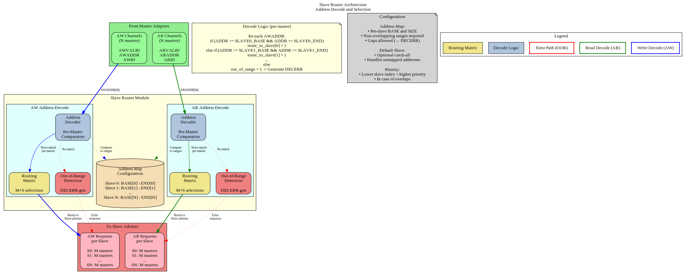

# 2.2 Slave Router

The Slave Router is responsible for address decoding and routing master requests to the appropriate slave. Each master has its own dedicated slave router instance that examines addresses and directs transactions to one of the configured slaves or generates error responses for out-of-range addresses.

## 2.2.1 Purpose and Function

The Slave Router performs the following critical functions:

1. **Address Decoding**: Matches request addresses against configured slave address ranges
2. **Request Routing**: Directs AR/AW/W channels to the selected slave
3. **Out-of-Range Detection**: Identifies addresses that don't map to any slave
4. **Error Response Generation**: Creates DECERR responses for invalid addresses
5. **Default Slave Support**: Routes unmapped addresses to optional default slave

## 2.2.2 Block Diagram



*Figure 2.2: Slave router architecture showing address decoding, routing matrix, and out-of-range detection for AW and AR channels.*

## 2.2.3 Address Decoding Algorithm

### Configuration-Based Address Maps

Each slave is configured with:
```toml
[[slaves]]
name = "memory"
base_address = 0x4000_0000
size = 0x1000_0000        # 256 MB
default = false           # Not a default slave
```

The router generates address ranges:
```
Start Address = base_address
End Address   = base_address + size - 1
```

### Decoding Priority

When multiple slaves have overlapping address ranges, the router uses **first-match priority**:

```
Priority Order = Order in configuration file (top to bottom)

Example:
  Slave 0: 0x0000_0000 - 0x0FFF_FFFF  (checked first)
  Slave 1: 0x1000_0000 - 0x1FFF_FFFF  (checked second)
  Slave 2: 0x2000_0000 - 0x2FFF_FFFF  (checked third)
  
Address 0x1000_5000 → Matches Slave 1
```

### Range Checking Logic

For each address, the router performs:

```systemverilog
// Simplified address decode logic
logic [NUM_SLAVES-1:0] slave_match;

for (int i = 0; i < NUM_SLAVES; i++) begin
    slave_match[i] = (addr >= SLAVE_BASE[i]) && 
                     (addr <= SLAVE_END[i]);
end

// Priority encode: Select first matching slave
logic [$clog2(NUM_SLAVES)-1:0] slave_select;
always_comb begin
    slave_select = 0;
    for (int i = 0; i < NUM_SLAVES; i++) begin
        if (slave_match[i]) begin
            slave_select = i;
            break;  // First match wins
        end
    end
end

// Out-of-range detection
logic oor = ~(|slave_match);  // No slaves matched
```

### Power-of-Two Optimization

For slaves with power-of-two sizes starting at aligned addresses, simplified decode:

```systemverilog
// Optimized decode for: base=0x8000_0000, size=0x1000_0000 (256MB)
// Mask off lower bits: Only check upper bits
logic match = (addr[31:28] == 4'h8);  // Much simpler than range check
```

The generator automatically detects and applies this optimization.

## 2.2.4 Request Routing

### AR Channel Routing

Read address routing flow:
1. **Decode**: Determine target slave from ARADDR
2. **Check OOR**: If no slave matches, flag for error response
3. **Route**: Send AR transaction to selected slave's arbiter
4. **Track**: Remember routing decision for R channel responses

```
ARADDR → Decoder → Slave Selection → AR to Slave Arbiter
                    ↓
                 If OOR → Error Response Generator
```

### AW/W Channel Routing

Write transactions require coordinated routing:

1. **AW Phase**: 
   - Decode AWADDR to determine target slave
   - Route AW transaction to selected slave's arbiter
   - **Store routing decision** for subsequent W beats

2. **W Phase**:
   - **Follow AW routing** (W channel has no address)
   - Route all W beats to same slave as AW
   - Continue until WLAST = 1

```
AWADDR → Decoder → Slave Selection → AW to Slave Arbiter
                                      ↓
                                   Store Routing
                                      ↓
W[0..N] ────────────────────────────→ W to Same Slave
(until WLAST)
```

### Write Data Tracking FSM

```
State Machine for W Channel Routing:

IDLE:
  - Wait for AWVALID && AWREADY
  - On handshake: Store target slave, goto WRITING
  
WRITING:
  - Route W beats to stored slave
  - On WVALID && WREADY && WLAST: goto IDLE
  
Error Handling:
  - If AW was OOR: Discard W beats, generate BRESP error
```

## 2.2.5 Out-of-Range Handling

### Detection

An address is out-of-range (OOR) if:
```
∀ slaves[i]: (address < base[i]) OR (address > end[i])
```

Unless a default slave is configured.

### Error Response Generation

When OOR is detected:

**Read Transactions (AR → R)**:
```
1. Accept ARVALID (assert ARREADY) 
2. Do NOT forward to any slave
3. Generate R response internally:
   - RID = Original ARID (with BID preserved)
   - RDATA = 0xBADDCAFE_DEADBEEF (debug pattern) or all zeros
   - RRESP = 2'b11 (DECERR)
   - RLAST = 1 (for each beat if burst)
4. Latency: Typically 2-3 cycles after AR acceptance
```

**Write Transactions (AW/W → B)**:
```
1. Accept AWVALID (assert AWREADY)
2. Accept all W beats until WLAST (sink the data)
3. Do NOT forward to any slave
4. Generate B response internally:
   - BID = Original AWID (with BID preserved)
   - BRESP = 2'b11 (DECERR)
5. Latency: Typically 2-3 cycles after WLAST
```

### Debug Data Patterns

For OOR read responses, configurable data patterns aid debugging:

```
Option 1: All zeros (default)
  RDATA = 64'h0000_0000_0000_0000

Option 2: Debug signature
  RDATA = 64'hBADD_CAFE_DEAD_BEEF

Option 3: Address echo (LSBs)
  RDATA = {32'hBADD_ADDR, ARADDR[31:0]}

Option 4: Master/Slave ID indicator  
  RDATA = {8'hEE, Master_ID[7:0], Slave_ID[7:0], ARADDR[47:0]}
```

## 2.2.6 Default Slave Support

### Configuration

```toml
[[slaves]]
name = "error_responder"
base_address = 0x0        # Ignored for default slave
size = 0x0                # Ignored for default slave
default = true            # Catch-all for unmapped addresses
```

### Behavior

When a default slave is configured:
- Addresses that don't match any specific slave → Routed to default slave
- Default slave typically returns DECERR but with configurable response
- Useful for prototyping (accept all addresses initially)
- Can implement memory-mapped debug register for address capture

**Note**: Only ONE default slave allowed per bridge.

## 2.2.7 Address Aliasing

### Multiple Slaves, Same Address

If configuration has overlapping ranges:
```toml
[[slaves]]
name = "fast_cache"
base_address = 0x8000_0000
size = 0x1000_0000

[[slaves]]
name = "slow_memory"
base_address = 0x8000_0000  # Same base!
size = 0x4000_0000
```

**Result**: First-match priority applies. All accesses go to `fast_cache`. The `slow_memory` range 0x9000_0000-0xBFFF_FFFF is **unreachable** from this master.

**Warning**: Generator can optionally flag this as error in DRC mode.

### Intentional Aliasing Use-Cases

Legitimate uses of overlapping ranges:
1. **Cache hierarchy**: Small fast cache shadows larger slow memory
2. **Memory remapping**: Different views of same physical memory
3. **Peripheral mirroring**: Register block appears at multiple addresses

## 2.2.8 Configuration Parameters

### Per-Router Parameters

```toml
# Router behavior is defined by slave configurations

[[slaves]]
name = "ddr_memory"
base_address = 0x8000_0000
size = 0x4000_0000           # 1 GB
default = false
oor_data_pattern = 0xDEAD    # Pattern for OOR reads
```

### Global Parameters

```toml
[bridge]
enable_default_slave = false      # Allow default slave
strict_address_decode = true      # Flag overlapping ranges as errors
oor_response_latency = 2          # Cycles for OOR error response (2-4)
```

## 2.2.9 Resource Utilization

### Per-Router Resources (Typical)

**4-slave configuration (32-bit address)**:
```
Logic Elements:  ~150-200 LEs
Registers:       ~50 regs
Block RAM:       0

Breakdown:
- Address comparators (4 slaves × ~30 LEs): ~120 LEs
- Priority encoder: ~20 LEs
- W channel FSM: ~30 regs, ~20 LEs
- OOR error generator: ~20 regs, ~10 LEs
```

**8-slave configuration**:
```
Logic Elements:  ~250-350 LEs (scales roughly with slave count)
Registers:       ~60 regs
```

### Scaling Considerations

Resource usage scales with:
- **Number of slaves**: Linear (each slave adds comparator logic)
- **Address width**: Minimal impact (wider comparators, but same structure)
- **Optimizations**: Power-of-two sizes reduce logic significantly

## 2.2.10 Timing Characteristics

### Decode Latency

**Combinatorial Decode (Default)**:
- Address → Slave selection: 0 cycles (combinatorial)
- Critical path: ARADDR → Slave arbiter request
- May limit maximum frequency in large systems

**Registered Decode (Optional)**:
- Address → Slave selection: 1 cycle (registered)
- Adds latency but breaks critical path
- Recommended for >8 slaves or >300 MHz operation

### Throughput

- **Maximum**: 1 transaction per cycle per master
- **No blocking**: Router does not stall; arbiters handle conflicts
- **Pipelining**: AR and AW decode in parallel (independent paths)

### Critical Paths

Typical critical paths:
- ARADDR → Address comparators → Priority encoder → Arbiter request
- w/4 slaves: ~10-15 logic levels (FPGA-dependent)
- w/8 slaves: ~12-18 logic levels

**Mitigation**:
- Enable registered decode mode (+1 cycle latency)
- Use power-of-two slave sizes (simplified compare)
- Synthesizer optimization directives

## 2.2.11 Debug and Observability

### Recommended Debug Signals

```
- Address decode outputs (which slave matched)
- OOR flags (per channel)
- Default slave hit counter
- W channel FSM state
- Routing decision storage (for W tracking)
```

### Common Issues and Debug

**Symptom**: Reads return all zeros  
**Check**:
- Is address out-of-range?
- Check slave base/size configuration
- Verify address decode logic in waveform

**Symptom**: Write data goes to wrong slave  
**Check**:
- W channel tracking FSM state
- Did AW routing complete before W started?
- Check for AWVALID/AWREADY handshake

**Symptom**: Unexpected DECERR responses  
**Check**:
- Address decode configuration
- Overlapping slave ranges (wrong priority)
- Off-by-one in size calculations

## 2.2.12 Verification Considerations

### Address Decode Tests

Critical test scenarios:
1. **Boundary conditions**: base_address, base_address + size - 1
2. **Just out-of-range**: base_address - 1, base_address + size
3. **Each slave**: Verify routing to correct slave
4. **Overlapping ranges**: Verify priority encoding
5. **Default slave**: Unmapped addresses route correctly

### Write Tracking Tests

W channel FSM testing:
1. **Simple write**: Single AW, single W (WLAST=1)
2. **Burst write**: AW with AWLEN=7, eight W beats
3. **Back-to-back writes**: New AW before previous W completes
4. **Interleaved masters**: Multiple masters writing simultaneously (if supported)

### OOR Error Tests

```
Test: Read from unmapped address
- Send AR to 0xFFFF_FFFF (assuming unmapped)
- Verify R response with RRESP = DECERR
- Verify RID matches ARID
- Check response latency

Test: Write to unmapped address
- Send AW to invalid address
- Send W data
- Verify B response with BRESP = DECERR
- Verify BID matches AWID
```

## 2.2.13 Performance Optimization

### Techniques

**1. Registered Decode (High Frequency)**
```
Trade-off: +1 cycle latency for timing closure
Best for: >8 slaves, >300 MHz targets
```

**2. Simplified Address Decode (Power-of-2)**
```
Optimization: Mask-based compare instead of range check
Best for: Slaves with aligned, power-of-2 sizes
Savings: ~50% reduction in comparator logic
```

**3. Parallel Decode (Low Logic)**
```
Implementation: Separate decoders per address bit-field
Best for: Many non-overlapping slaves
Savings: Reduces logic depth for priority encoding
```

**4. CAM-Based Decode (Many Slaves)**
```
Trade-off: Uses block RAM for address lookup table
Best for: >16 slaves, non-contiguous ranges
Note: Requires RAM resources
```

## 2.2.14 Future Enhancements

### Planned Features
- **Dynamic Address Remapping**: Runtime-configurable slave ranges
- **Transaction Filtering**: Block certain address ranges per-master
- **Priority Hints**: QoS-based prioritization (beyond first-match)
- **Address Translation**: Offset/mask transformations before slave routing

### Under Consideration
- **Multi-region Slaves**: Slave spans multiple non-contiguous ranges
- **Secure Address Spaces**: Per-master access control lists
- **Debug Address Capture**: Log invalid addresses to register

---

**Related Sections**:
- Section 2.1: Master Adapter (upstream from router)
- Section 2.3: Crossbar Core (downstream arbitration)
- Section 2.4: Arbitration (how routed requests compete)
- Section 3.3: Slave Port Interface (target of routed requests)
