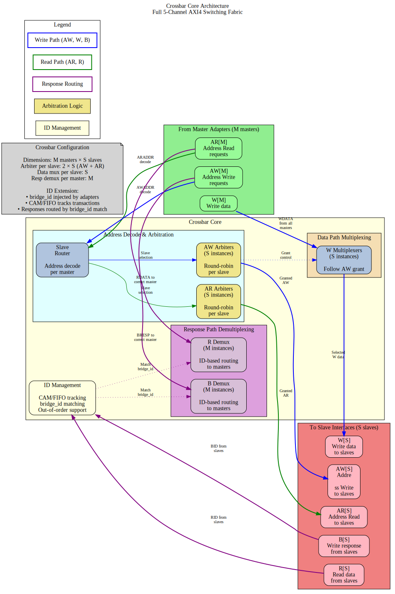

# 2.3 Crossbar Core

The Crossbar Core is the central interconnect fabric that enables any-to-any connectivity between masters and slaves. It contains the arbitration logic, transaction routing, and response path management that form the heart of the bridge.

## 2.3.1 Purpose and Function

The Crossbar Core performs the following critical functions:

1. **Full Connectivity**: Provides complete N×M master-to-slave interconnect matrix
2. **Independent Arbitration**: Per-slave arbiters allow parallel access to different slaves
3. **Response Routing**: Directs slave responses back to originating masters using Bridge IDs
4. **Transaction Ordering**: Maintains AXI ordering requirements within address dependencies
5. **Backpressure Management**: Handles flow control across multiple concurrent transactions

## 2.3.2 Block Diagram



*Figure 2.3: Crossbar core architecture showing complete M×S switching fabric with address decode, per-slave arbitration, data path multiplexing, and ID-based response routing.*

## 2.3.3 Connectivity Matrix

### Full N×M Crossbar

The bridge implements a **non-blocking crossbar** where:
- N masters can each access different slaves simultaneously
- Conflicts occur only when multiple masters target the same slave
- Independent read and write paths increase parallelism

**Example**: 4 masters, 3 slaves
```
         S0   S1   S2
    M0   ●    ●    ●
    M1   ●    ●    ●
    M2   ●    ●    ●
    M3   ●    ●    ●

● = Connection available
```

### Request Path Multiplexing

For each slave, requests from all masters are multiplexed:

```
Slave 0 Request Inputs:
  - M0 → S0 (AR, AW, W channels)
  - M1 → S0 (AR, AW, W channels)
  - M2 → S0 (AR, AW, W channels)
  - M3 → S0 (AR, AW, W channels)
  
Arbiter selects one master per channel per cycle
  → Grants propagate through MUX
  → Selected master's transaction forwarded to slave
```

### Response Path Demultiplexing

Responses from slaves are demultiplexed back to masters:

```
Slave 0 Response Outputs (R, B channels):
  - Extract Bridge ID from RID/BID
  - Route to corresponding master (M0, M1, M2, or M3)
  - Strip Bridge ID before delivering to master adapter
  
Uses CAM (Content Addressable Memory) for fast ID lookup
```

## 2.3.4 Request Path Architecture

### Per-Slave Request Arbitration

Each slave has **independent arbiters** for:
1. **AR Channel**: Read address arbitration (all masters competing)
2. **AW/W Channels**: Write address/data arbitration (all masters competing)

This separation allows:
- Simultaneous read and write to same slave (if slave supports it)
- Independent grant decisions for AR vs. AW channels
- Better throughput for mixed read/write workloads

### Request Multiplexers

After arbitration, multiplexers select granted master's signals:

```systemverilog
// Simplified AR channel MUX for Slave 0
always_comb begin
    case (ar_grant_s0)
        2'b00: begin  // Master 0 granted
            s0_arvalid = m0_arvalid;
            s0_araddr  = m0_araddr;
            s0_arid    = m0_arid;    // Includes Bridge ID
            // ... other AR signals
        end
        2'b01: begin  // Master 1 granted
            s0_arvalid = m1_arvalid;
            s0_araddr  = m1_araddr;
            s0_arid    = m1_arid;
            // ... other AR signals
        end
        // ... cases for M2, M3
    endcase
end
```

### Backpressure Propagation

Ready signals flow back from slave through arbiter to granted master:

```
Slave S0 ARREADY → Arbiter → Granted Master ARREADY
                           ↘ Other Masters ARREADY = 0
```

This ensures:
- Only granted master sees READY from slave
- Non-granted masters see READY = 0 (backpressure)
- No combinatorial loops in ready path (registered arbitration)

## 2.3.5 Response Path Architecture

### Bridge ID Extraction

Response routing uses the Bridge ID embedded in transaction IDs:

```
R Channel:
  Slave RID = {BID[BID_WIDTH-1:0], Original_ID[ID_WIDTH-1:0]}
  Extract: Master_Index = BID
  Route R response to Master[Master_Index]

B Channel:
  Slave BID = {BID[BID_WIDTH-1:0], Original_ID[ID_WIDTH-1:0]}
  Extract: Master_Index = BID
  Route B response to Master[Master_Index]
```

### CAM-Based Routing (Optional)

For large master counts or OOO responses, a CAM tracks outstanding transactions:

```
CAM Entry Structure:
  - Internal ID (with BID)
  - Master index
  - Transaction type (read/write)
  - Timestamp (for timeout detection)

Lookup:
  Input: RID or BID from slave
  Output: Master index for routing
  Latency: 1 cycle (registered CAM)
```

**Benefit**: Handles complex scenarios like ID reordering, burst interleaving

### Response Demultiplexers

Based on extracted Bridge ID, responses are routed:

```systemverilog
// Simplified R channel DEMUX from Slave 0
logic [BID_WIDTH-1:0] master_id;
assign master_id = s0_rid[TOTAL_ID_WIDTH-1:ID_WIDTH];  // Extract BID

always_comb begin
    // Default: No masters receive response
    m0_rvalid = 1'b0;
    m1_rvalid = 1'b0;
    m2_rvalid = 1'b0;
    m3_rvalid = 1'b0;
    
    // Route to indicated master
    case (master_id)
        2'b00: begin
            m0_rvalid = s0_rvalid;
            m0_rdata  = s0_rdata;
            m0_rid    = s0_rid[ID_WIDTH-1:0];  // Strip BID
            // ... other R signals
        end
        2'b01: begin
            m1_rvalid = s0_rvalid;
            // ... route to M1
        end
        // ... M2, M3
    endcase
end
```

### Multi-Slave Response Merging

When multiple slaves can respond simultaneously, arbitration ensures:
- Only one slave's response delivered per master per cycle
- Fair arbitration if multiple slaves have responses for same master
- No response loss (responses queued until master ready)

## 2.3.6 AXI Ordering Requirements

The crossbar maintains AXI ordering rules:

### Read-After-Write (RAW) Ordering

**Rule**: Read from address must see data from earlier write to same address

**Crossbar Behavior**:
- Ordering enforced at slave level (slave handles RAW within itself)
- Crossbar does NOT reorder transactions to same slave from same master
- Different masters to same slave: No ordering guaranteed (slave must handle)

### Write-After-Write (WAW) Ordering

**Rule**: Writes to overlapping addresses must complete in issue order

**Crossbar Behavior**:
- Same master to same slave: Order preserved by arbiter (FIFO grant queue)
- Different masters to same slave: Slave responsible for write ordering

### Out-of-Order (OOO) Completion

**Allowed**: 
- Read responses can return out-of-order (different RIDs)
- Reads to different slaves can complete in any order
- Writes to different slaves can complete in any order

**Crossbar Support**:
- Bridge ID tracking enables OOO response routing
- Master sees responses in slave-determined order
- Multi-master OOO requires careful slave design

## 2.3.7 Resource Utilization

### Crossbar Core Resources

**4 masters × 3 slaves configuration (64-bit data, 32-bit addr)**:

```
Logic Elements:  ~2000-3500 LEs
Registers:       ~800-1200 regs
Block RAM:       0-4 KB (if CAM used)

Breakdown per slave:
- Arbiter (4 masters, RR):        ~200 LEs, ~50 regs
- Request MUX (AR/AW/W):          ~400 LEs, ~100 regs
- Response DEMUX (R/B):           ~300 LEs, ~80 regs
- Control FSMs:                   ~100 LEs, ~50 regs

Total for 3 slaves: 3 × 1000 LEs = ~3000 LEs
Plus routing overhead: +500 LEs
```

### Scaling with Masters and Slaves

**Linear scaling**:
- Adding 1 master: +~500 LEs per slave (new arbiter input)
- Adding 1 slave: +~1000 LEs (complete new slave port)

**Example**: 8 masters × 6 slaves
```
Estimated:  ~12,000 LEs, ~3000 regs
Block RAM:  ~8 KB (for CAM if enabled)
```

### Optimization Techniques

1. **Read-Only/Write-Only Masters**: Reduces arbiter complexity by 40-50%
2. **Power-of-Two Master Count**: Simplifies BID width and routing logic
3. **Pipeline Stages**: Trading latency for frequency (deeper pipelines)

## 2.3.8 Timing Characteristics

### Latency

**Request Path** (Master → Slave):
- Arbiter decision: 1 cycle (registered)
- MUX selection: 0 cycles (combinatorial) or +1 cycle (registered)
- **Total**: 1-2 cycles through crossbar

**Response Path** (Slave → Master):
- BID extraction: 0 cycles (combinatorial)
- DEMUX routing: 0 cycles (combinatorial) or +1 cycle (registered)
- **Total**: 0-1 cycles through crossbar

**End-to-End** (Master adapter → Slave adapter):
- Adapters: 2 cycles (skid buffers)
- Router: 0-1 cycles (decode)
- Crossbar: 1-2 cycles (arbitration + MUX)
- **Total**: 3-5 cycles minimum latency

### Throughput

**Best Case** (no conflicts):
- Each master to different slave: N transactions/cycle (N = master count)
- Maximum aggregate bandwidth: N × data_width bits/cycle

**Arbitration Limits**:
- Multiple masters to one slave: 1 transaction/cycle to that slave
- Other slaves remain available for parallel access

**Burst Performance**:
- Once granted, bursts flow at 1 beat/cycle
- Grant held until burst completes (RLAST or WLAST)

## 2.3.9 Critical Paths

### Common Critical Paths

1. **Arbiter Request → Grant**:
   - All masters' VALID signals → Arbiter logic → Grant decision
   - Depth: ~5-8 logic levels for 4 masters

2. **Grant → Ready Backpressure**:
   - Slave READY → Arbiter → Selected master READY
   - Depth: ~4-6 logic levels

3. **Response Demux**:
   - Slave RDATA/RID → BID extraction → Master select → Master RDATA
   - Depth: ~6-10 logic levels for 64-bit data

### Mitigation Strategies

1. **Registered MUX/DEMUX**: +1 cycle latency, breaks paths
2. **Pipelined Arbitration**: Multi-cycle arbiter for >8 masters
3. **Hierarchical Crossbar**: For >16 masters, use tree structure

## 2.3.10 Configuration Parameters

### Crossbar Parameters (from TOML)

```toml
[bridge]
num_masters = 4
num_slaves = 3
internal_data_width = 64
arbiter_type = "round_robin"       # "round_robin", "fixed_priority", "weighted"
registered_mux = false             # true = +1 cycle, better timing
registered_demux = false           # true = +1 cycle, better timing
enable_cam = false                 # true = CAM-based routing
cam_depth = 16                     # Outstanding transactions tracked
```

## 2.3.11 Debug and Observability

### Recommended Debug Signals

```
Per Slave:
- Arbiter grants (which master granted)
- Arbiter requests (which masters requesting)
- Request MUX outputs (VALID, READY, ADDR, ID)
- Response DEMUX inputs (VALID, READY, DATA, ID)

Global:
- Active transactions count
- Stall counters (arbiter conflicts)
- BID extraction errors
- CAM hit/miss (if enabled)
```

### Performance Counters

Useful metrics for profiling:
```
- Transactions per slave (read, write separate)
- Arbiter conflict rate (requests denied due to grant  contention)
- Average grant latency
- Utilization per master (% cycles active)
- Utilization per slave (% cycles busy)
```

## 2.3.12 Common Issues and Debug

**Symptom**: Master hangs with VALID=1, READY=0  
**Check**:
- Is another master holding grant to this slave?
- Is arbiter logic functioning (check grant signals)?
- Is slave responding with READY?

**Symptom**: Response goes to wrong master  
**Check**:
- Bridge ID values (verify correct BID per master)
- CAM contents (if used)
- BID extraction logic (check bit positions)

**Symptom**: Throughput lower than expected  
**Check**:
- Arbiter conflicts (multiple masters to same slave?)
- Pipeline depth (excessive latency reducing effective bandwidth?)
- Burst efficiency (are bursts being granted properly?)

## 2.3.13 Verification Considerations

### Functional Tests

1. **Single Master to Each Slave**: Verify basic connectivity
2. **All Masters to One Slave**: Stress arbiter fairness
3. **All Masters to All Slaves**: Maximum parallelism test
4. **OOO Responses**: Issue transactions with different latencies
5. **Burst Interleaving**: Multiple masters with bursts to same slave

### Corner Cases

```
- Back-to-back grants (no idle cycles)
- Grant held for maximum burst length (256 beats)
- Rapid master switching (each gets 1 transaction then switches)
- Response while request in progress (pipelining)
- All masters requesting same slave simultaneously
```

### Protocol Compliance

- AXI4 protocol checker at each master/slave interface
- Verify no READY → VALID dependencies (AXI violation)
- Check ID preservation through crossbar (modulo Bridge ID)
- Verify LAST signal handling

## 2.3.14 Future Enhancements

### Planned Features
- **Weighted Round-Robin**: QoS support with configurable priorities
- **Slave-Side Arbitration Policies**: Per-slave arbiter configuration
- **Grant Prediction**: Speculative grant for lower latency
- **Congestion Control**: Throttling to prevent hotspots

### Under Consideration
- **Partial Crossbar**: Configurable master-to-slave connectivity (not full mesh)
- **Multi-Tier Hierarchy**: For 32+ masters/slaves
- **Virtual Channels**: Separate channels for different traffic classes
- **Register Slicing**: Automatic pipeline insertion for timing

---

**Related Sections**:
- Section 2.1: Master Adapter (request sources)
- Section 2.2: Slave Router (address decode before arbitration)
- Section 2.4: Arbitration (detailed arbiter algorithms)
- Section 2.5: ID Management (CAM structures, Bridge ID tracking)
- Section 3.1: Top-Level Integration (crossbar instantiation)
