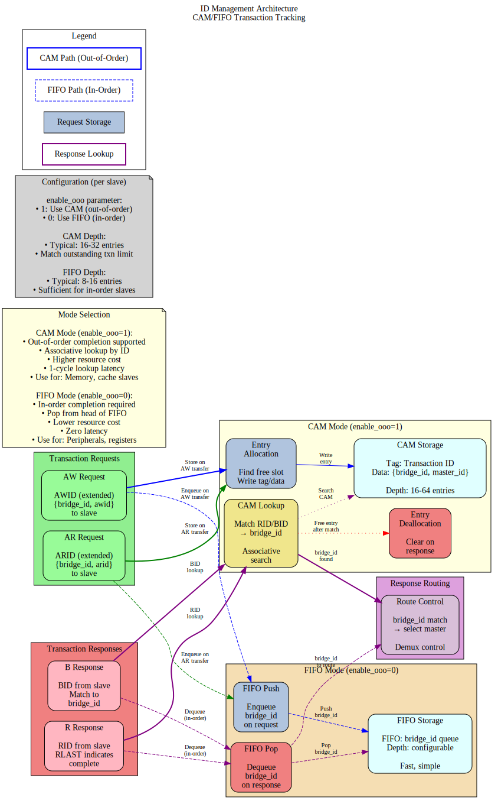

# 2.5 ID Management

ID Management is the system by which the bridge tracks outstanding transactions and routes responses back to the originating master. This is accomplished through Bridge ID injection, Content Addressable Memory (CAM) structures, and ID translation logic.

## 2.5.1 Purpose and Function

The ID management system performs the following critical functions:

1. **Transaction Tracking**: Maintains association between requests and originating masters
2. **Response Routing**: Directs responses to correct master using embedded IDs
3. **Out-of-Order Support**: Handles responses returning in different order than issued
4. **ID Space Isolation**: Prevents ID conflicts between multiple masters
5. **Burst Management**: Tracks multi-beat bursts through the bridge

## 2.5.2 Bridge ID Concept

### Problem Statement

Without ID management, the bridge cannot determine which master originated a transaction:

```
Scenario: Two masters with overlapping IDs
  Master 0: Issues read with ARID = 4'h5
  Master 1: Issues read with ARID = 4'h5 (same ID!)
  
When slave responds with RID = 4'h5, which master gets the response?
  → Ambiguous! Need additional information.
```

### Solution: Bridge ID Injection

The bridge adds a **Bridge ID (BID)** to each transaction ID:

```
Internal ID = {Bridge_ID, Original_ID}

Master 0, ARID = 4'h5:
  Internal ARID = {2'b00, 4'h5} = 6'b00_0101
  
Master 1, ARID = 4'h5:
  Internal ARID = {2'b01, 4'h5} = 6'b01_0101
  
Now responses with RID = 6'b00_0101 → Route to Master 0
                    RID = 6'b01_0101 → Route to Master 1
```

## 2.5.3 Block Diagram



*Figure 2.5: ID management architecture showing CAM and FIFO modes for transaction tracking and response routing.*

## 2.5.4 Bridge ID Width Calculation

### Formula

```
BID_WIDTH = clog2(NUM_MASTERS)

Where clog2(x) = ceiling(log2(x))
```

### Examples

```
2 masters:  clog2(2)  = 1 bit   (BID: 0, 1)
3 masters:  clog2(3)  = 2 bits  (BID: 00, 01, 10)
4 masters:  clog2(4)  = 2 bits  (BID: 00, 01, 10, 11)
5 masters:  clog2(5)  = 3 bits  (BID: 000-100)
8 masters:  clog2(8)  = 3 bits  (BID: 000-111)
16 masters: clog2(16) = 4 bits  (BID: 0000-1111)
```

### ID Width Growth

```
Configuration: 4 masters, external ARID_WIDTH = 4

Internal ARID_WIDTH = BID_WIDTH + External ARID_WIDTH
                    = 2 + 4
                    = 6 bits

Slave sees 6-bit IDs
Master sees 4-bit IDs
Bridge translates between them
```

## 2.5.5 ID Injection (Request Path)

### Read Address Channel (AR)

```systemverilog
// ID injection at master adapter
logic [BID_WIDTH-1:0] master_bid;         // Constant per master
logic [ARID_WIDTH-1:0] external_arid;     // From master
logic [TOTAL_ARID_WIDTH-1:0] internal_arid;  // To crossbar

assign master_bid = MASTER_INDEX;  // M0=0, M1=1, M2=2, M3=3
assign internal_arid = {master_bid, external_arid};

// Example: Master 2, ARID = 4'h7
// internal_arid = {2'b10, 4'h7} = 6'b10_0111
```

### Write Address Channel (AW)

```systemverilog
// ID injection for write transactions
logic [BID_WIDTH-1:0] master_bid;
logic [AWID_WIDTH-1:0] external_awid;
logic [TOTAL_AWID_WIDTH-1:0] internal_awid;

assign internal_awid = {master_bid, external_awid};

// Note: AWID and ARID widths can differ per master
```

### Injection Timing

**Combinatorial** (default):
- ID concatenation done in same cycle as VALID assertion
- Zero latency overhead
- May contribute to critical path in high-frequency designs

**Registered** (optional):
- Add pipeline register after ID injection
- +1 cycle latency
- Breaks critical path

## 2.5.6 ID Extraction (Response Path)

### Read Data Channel (R)

```systemverilog
// ID extraction at crossbar response router
logic [TOTAL_RID_WIDTH-1:0] internal_rid;   // From slave
logic [BID_WIDTH-1:0] extracted_bid;        // Upper bits
logic [RID_WIDTH-1:0] external_rid;         // Lower bits

// Extract Bridge ID
assign extracted_bid = internal_rid[TOTAL_RID_WIDTH-1:RID_WIDTH];

// Strip Bridge ID for master
assign external_rid = internal_rid[RID_WIDTH-1:0];

// Route based on BID
always_comb begin
    case (extracted_bid)
        2'b00: master0_rvalid = slave_rvalid;
        2'b01: master1_rvalid = slave_rvalid;
        2'b10: master2_rvalid = slave_rvalid;
        2'b11: master3_rvalid = slave_rvalid;
    endcase
end
```

### Write Response Channel (B)

```systemverilog
// Similar extraction for write responses
logic [TOTAL_BID_WIDTH-1:0] internal_bid;
logic [BID_WIDTH-1:0] extracted_bid;
logic [BID_WIDTH-1:0] external_bid;

assign extracted_bid = internal_bid[TOTAL_BID_WIDTH-1:BID_WIDTH];
assign external_bid = internal_bid[BID_WIDTH-1:0];

// Route to originating master
```

## 2.5.7 Content Addressable Memory (CAM)

### When to Use CAM

**Simple Configurations** (No CAM needed):
- Single master (BID unnecessary)
- Direct ID mapping suffices
- Lower resource usage

**Complex Configurations** (CAM beneficial):
- Many masters (>8)
- Out-of-order responses common
- Multiple outstanding transactions per master
- ID reordering within slave

### CAM Structure

```
Entry Format:
┌────────────┬──────────────┬─────────────┬───────────┬───────┐
│ Internal ID│ Master Index │ Transaction │ Timestamp │ Valid │
│  (6-12 bits│  (2-4 bits)  │    Type     │ (counter) │ (1b)  │
│            │              │   (R/W)     │           │       │
└────────────┴──────────────┴─────────────┴───────────┴───────┘
     10b           3b             1b          16b         1b

Total per entry: ~30 bits
CAM depth: 16-64 entries typical
```

### CAM Operations

**Allocation** (Request Path):
```
1. Master issues AR/AW transaction
2. Find free CAM entry (Valid = 0)
3. Write entry:
   - Internal ID = {BID, External_ID}
   - Master Index = BID
   - Transaction Type = Read or Write
   - Timestamp = Current cycle count
   - Valid = 1
4. Forward transaction to slave
```

**Lookup** (Response Path):
```
1. Slave returns R/B response with Internal ID
2. CAM lookup: Search for matching Internal ID
3. Extract Master Index from matching entry
4. Route response to Master[Master Index]
5. If LAST: Deallocate entry (Valid = 0)
```

**Associative Search**:
- All entries checked in parallel
- 1-cycle lookup (registered CAM)
- Match found → Returns master index
- No match → Error condition (protocol violation)

## 2.5.8 CAM Implementation

### Parallel CAM (Fast, Resource-Intensive)

```systemverilog
// Parallel CAM structure (16 entries)
typedef struct packed {
    logic valid;
    logic [TOTAL_ID_WIDTH-1:0] internal_id;
    logic [BID_WIDTH-1:0] master_idx;
    logic txn_type;  // 0=read, 1=write
    logic [15:0] timestamp;
} cam_entry_t;

cam_entry_t cam [0:15];

// Parallel search
logic [15:0] match;
logic [3:0] match_idx;

for (genvar i = 0; i < 16; i++) begin
    assign match[i] = cam[i].valid && 
                      (cam[i].internal_id == response_id);
end

// Priority encode first match
assign match_idx = find_first_set(match);
assign routed_master = cam[match_idx].master_idx;
```

### Sequential CAM (Slow, Resource-Efficient)

```systemverilog
// Sequential CAM search (multi-cycle)
logic [3:0] search_idx;
logic searching;

always_ff @(posedge clk) begin
    if (search_start) begin
        search_idx <= 0;
        searching <= 1'b1;
    end else if (searching) begin
        if (cam[search_idx].valid && 
            cam[search_idx].internal_id == response_id) begin
            // Match found
            routed_master <= cam[search_idx].master_idx;
            searching <= 1'b0;
        end else if (search_idx == 15) begin
            // No match found (error)
            searching <= 1'b0;
            error <= 1'b1;
        end else begin
            search_idx <= search_idx + 1;
        end
    end
end
```

**Trade-off**:
- Parallel: 1-cycle, ~2000 LEs for 16 entries
- Sequential: 16 cycles, ~200 LEs for 16 entries

## 2.5.9 Outstanding Transaction Limits

### Configuration

```toml
[bridge]
enable_cam = true
cam_depth = 16              # Max outstanding transactions

[[masters]]
name = "cpu"
max_outstanding_reads = 8   # Per-master limit
max_outstanding_writes = 8
```

### Enforcement

When CAM full:
```
1. Master issues new request
2. Check CAM for free entry
3. If full:
   - ARREADY/AWREADY = 0 (backpressure)
   - Wait for response to free entry
4. When entry freed (RLAST/BVALID):
   - Accept new request
```

### Sizing Guidelines

```
CAM Depth = Σ(max_outstanding per master) + Safety margin

Example: 4 masters, 4 outstanding each
  Minimum CAM depth = 4 × 4 = 16 entries
  Recommended depth = 20 entries (25% margin)
```

## 2.5.10 Resource Utilization

### ID Injection/Extraction Only

**Per Master** (no CAM):
```
Logic Elements:  ~20-50 LEs
Registers:       ~10 regs

Simple bit concatenation and extraction
Minimal overhead
```

### With CAM

**CAM Resources** (16 entries, 6-bit IDs):
```
Parallel CAM:
  Logic Elements:  ~2000 LEs
  Registers:       ~500 regs
  Block RAM:       0 (distributed)

BRAM-Based CAM:
  Logic Elements:  ~500 LEs
  Registers:       ~100 regs
  Block RAM:       1-2 KB

Sequential CAM:
  Logic Elements:  ~200 LEs
  Registers:       ~100 regs
  Block RAM:       0
```

### Scaling

```
CAM Depth      Parallel      BRAM         Sequential
16 entries     ~2000 LEs     ~500 LEs     ~200 LEs
32 entries     ~4000 LEs     ~800 LEs     ~250 LEs
64 entries     ~8000 LEs     ~1200 LEs    ~300 LEs
```

## 2.5.11 Timing Characteristics

### ID Injection Latency

**Combinatorial** (default):
- 0 cycles overhead
- Part of adapter pipeline stage

**Registered**:
- +1 cycle latency
- Breaks timing path

### ID Extraction/Routing Latency

**Direct Decode** (no CAM):
- 0 cycles (combinatorial BID extraction)

**Parallel CAM**:
- 1 cycle (registered search)

**Sequential CAM**:
- 1-N cycles (where N = CAM depth)
- Average: N/2 cycles

### End-to-End Impact

```
Configuration: No CAM, combinatorial ID management
  Request:  Master → +0 cycles → Crossbar
  Response: Slave → +0 cycles → Master
  Total: 0 cycles overhead

Configuration: Parallel CAM, registered
  Request:  Master → +1 cycle (allocation) → Crossbar
  Response: Slave → +1 cycle (lookup) → Master
  Total: 2 cycles overhead
```

## 2.5.12 Configuration Parameters

### ID Management Configuration (TOML)

```toml
[bridge]
num_masters = 4
enable_cam = false              # Use CAM for ID tracking
cam_type = "parallel"           # "parallel", "bram", "sequential"
cam_depth = 16                  # Outstanding transaction capacity

[bridge.id_management]
registered_injection = false    # Register ID injection (+1 cycle)
registered_extraction = false   # Register ID extraction (+1 cycle)
enable_timeout = true           # Detect hung transactions
timeout_cycles = 10000          # Cycles before timeout error

[[masters]]
name = "cpu"
arid_width = 4                  # External ID width
awid_width = 4
max_outstanding_reads = 8       # CAM allocation limit
max_outstanding_writes = 8
```

## 2.5.13 Debug and Observability

### Recommended Debug Signals

```
ID Injection:
- Master BID assignments (constant per master)
- External IDs (from masters)
- Internal IDs (after injection)

ID Extraction:
- Internal IDs (from slaves)
- Extracted BIDs
- External IDs (to masters)

CAM (if enabled):
- CAM occupancy (number of valid entries)
- Allocation/deallocation events
- Search hits/misses
- Timeout events
```

### Performance Counters

```
- Total transactions tracked
- CAM hit rate
- CAM miss rate (should be 0)
- Average CAM occupancy
- Peak CAM occupancy
- Timeout errors
- ID width overhead (bits added per transaction)
```

## 2.5.14 Common Issues and Debug

**Symptom**: Response goes to wrong master  
**Check**:
- BID assignment (verify each master has unique BID)
- ID width calculation (BID_WIDTH correct?)
- Bit slicing in extraction logic
- CAM contents (if used)

**Symptom**: CAM full, transactions stalling  
**Check**:
- CAM depth vs. outstanding transaction count
- Are responses being received? (slave responsive?)
- Timeout threshold (too short?)
- Leaked entries (not deallocated after LAST)

**Symptom**: CAM miss errors  
**Check**:
- Slave returning incorrect IDs
- ID corruption in transit
- Race condition (deallocation before response complete)

## 2.5.15 Verification Considerations

### Test Scenarios

1. **Basic ID Injection/Extraction**:
```
- Single master, single transaction
- Verify BID added correctly
- Verify BID stripped before response delivery
- Check external ID unchanged
```

2. **Multi-Master ID Isolation**:
```
- Multiple masters with same external IDs
- Verify responses route to correct master
- Check BID uniqueness prevents collisions
```

3. **CAM Capacity**:
```
- Issue max_outstanding transactions
- Verify backpressure when CAM full
- Issue responses to free entries
- Verify new transactions accepted
```

4. **Out-of-Order Responses**:
```
- Issue transactions: ID=1, ID=2, ID=3
- Return responses: ID=3, ID=1, ID=2
- Verify CAM correctly routes each
```

5. **CAM Timeout**:
```
- Issue transaction
- Slave doesn't respond within timeout_cycles
- Verify timeout error signaled
- Verify CAM entry deallocated (or flagged)
```

## 2.5.16 Future Enhancements

### Planned Features
- **Dynamic CAM Depth**: Runtime adjustment based on utilization
- **Per-Master CAM Partition**: Guaranteed entries per master
- **ID Compression**: Reduce internal ID width for slaves with limited ID support
- **Transaction Ordering**: CAM tracks issue order for reordering enforcement

### Under Consideration
- **Multi-Level CAM**: Hierarchical for large transaction counts
- **TCAM Support**: Partial ID matching (wildcards)
- **Error Injection**: Debug mode to test error handling
- **CAM Mirrors**: Redundant CAMs for fail-safe operation

---

**Related Sections**:
- Section 2.1: Master Adapter (BID injection location)
- Section 2.3: Crossbar Core (BID extraction, response routing)
- Section 2.8: Response Routing (detailed routing logic)
- Section 3.2: Master Port Interface (ID width specifications)
