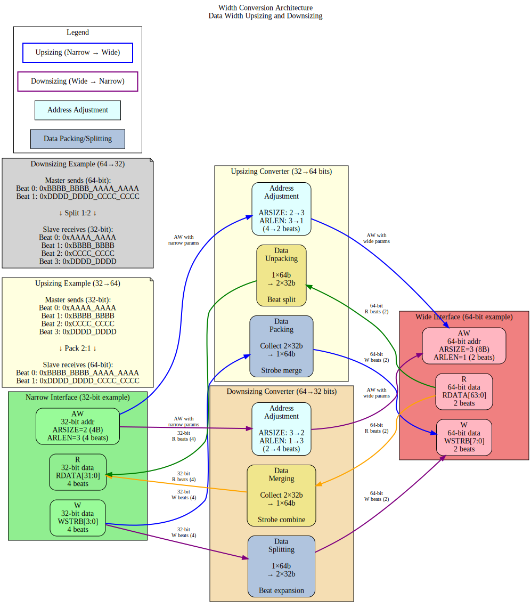

# 2.6 Width Conversion

Width Conversion is the mechanism by which the bridge adapts between masters and slaves with different data bus widths. The bridge uses a 64-bit internal data path, with conversion logic at the master and slave interfaces to support narrower or wider external widths.

## 2.6.1 Purpose and Function

Width conversion performs the following critical functions:

1. **Data Path Adaptation**: Converts between different data widths (8, 16, 32, 64, 128, 256 bits)
2. **Burst Splitting**: Divides wide transactions into multiple narrow transactions
3. **Burst Merging**: Combines multiple narrow beats into fewer wide beats
4. **Strobe Mapping**: Translates write strobes across width boundaries
5. **Address Alignment**: Adjusts addresses for width differences

## 2.6.2 Internal Data Width

### 64-Bit Standard

The bridge uses **64-bit (8-byte) internal data width** for the crossbar:

```
Rationale:
- Balance between resource usage and performance
- Common width for modern embedded processors
- Efficient for both 32-bit and 64-bit masters
- Reasonably sized multiplexers in crossbar
```

### Width Conversion Locations

```
Master (32-bit) → [Upsizer] → Crossbar (64-bit) → [Downsizer] → Slave (32-bit)
Master (64-bit) → [No conversion] → Crossbar (64-bit) → [No conversion] → Slave (64-bit)
Master (128-bit) → [Downsizer] → Crossbar (64-bit) → [Upsizer] → Slave (128-bit)
```

## 2.6.3 Block Diagram



*Figure 2.6: Width conversion architecture showing data upsizing and downsizing with beat count adjustment and strobe handling.*

## 2.6.4 Upsizing (Narrow to Wide)

### Overview

**Upsizing** converts narrow data to wide data by buffering multiple narrow beats into a single wide beat.

```
Example: 32-bit master → 64-bit crossbar
  Master beat 0: 32'hAAAA_BBBB (bytes 3:0)
  Master beat 1: 32'hCCCC_DDDD (bytes 7:4)
  → Crossbar beat: 64'hCCCC_DDDD_AAAA_BBBB
```

### Write Upsizing

**Burst of 4 (32-bit) → Burst of 2 (64-bit)**:

```
Master AW: AWADDR = 0x1000, AWLEN = 3, AWSIZE = 2 (4 bytes)
Master W beats:
  W[0]: WDATA = 0xAAAA_BBBB, WSTRB = 4'b1111, WLAST = 0
  W[1]: WDATA = 0xCCCC_DDDD, WSTRB = 4'b1111, WLAST = 0
  W[2]: WDATA = 0xEEEE_FFFF, WSTRB = 4'b1111, WLAST = 0
  W[3]: WDATA = 0x1111_2222, WSTRB = 4'b1111, WLAST = 1

Crossbar AW: AWADDR = 0x1000, AWLEN = 1, AWSIZE = 3 (8 bytes)
Crossbar W beats:
  W[0]: WDATA = 0xCCCC_DDDD_AAAA_BBBB, WSTRB = 8'b1111_1111, WLAST = 0
  W[1]: WDATA = 0x1111_2222_EEEE_FFFF, WSTRB = 8'b1111_1111, WLAST = 1
```

### Read Upsizing

**Burst of 8 (32-bit) → Burst of 4 (64-bit)**:

```
Master AR: ARADDR = 0x2000, ARLEN = 7, ARSIZE = 2 (4 bytes)

Crossbar AR: ARADDR = 0x2000, ARLEN = 3, ARSIZE = 3 (8 bytes)

Crossbar R beats:
  R[0]: RDATA = 0x1111_2222_3333_4444, RLAST = 0
  R[1]: RDATA = 0x5555_6666_7777_8888, RLAST = 0
  R[2]: RDATA = 0x9999_AAAA_BBBB_CCCC, RLAST = 0
  R[3]: RDATA = 0xDDDD_EEEE_FFFF_0000, RLAST = 1

Master R beats (split from crossbar):
  R[0]: RDATA = 0x3333_4444, RLAST = 0  (from R[0] low)
  R[1]: RDATA = 0x1111_2222, RLAST = 0  (from R[0] high)
  R[2]: RDATA = 0x7777_8888, RLAST = 0  (from R[1] low)
  R[3]: RDATA = 0x5555_6666, RLAST = 0  (from R[1] high)
  R[4]: RDATA = 0xBBBB_CCCC, RLAST = 0  (from R[2] low)
  R[5]: RDATA = 0x9999_AAAA, RLAST = 0  (from R[2] high)
  R[6]: RDATA = 0xFFFF_0000, RLAST = 0  (from R[3] low)
  R[7]: RDATA = 0xDDDD_EEEE, RLAST = 1  (from R[3] high)
```

### Strobe Mapping (Upsizing)

```
32-bit WSTRB → 64-bit WSTRB:

Beat 0 (lower 32 bits):
  32-bit WSTRB = 4'b1010 → 64-bit WSTRB = 8'b0000_1010

Beat 1 (upper 32 bits):
  32-bit WSTRB = 4'b1111 → 64-bit WSTRB = 8'b1111_0000

Combined:
  64-bit WSTRB = 8'b1111_1010
```

## 2.6.5 Downsizing (Wide to Narrow)

### Overview

**Downsizing** converts wide data to narrow data by splitting a single wide beat into multiple narrow beats.

```
Example: 128-bit master → 64-bit crossbar
  Master beat: 128'h1111_2222_3333_4444_5555_6666_7777_8888
  → Crossbar beat 0: 64'h5555_6666_7777_8888 (lower)
  → Crossbar beat 1: 64'h1111_2222_3333_4444 (upper)
```

### Write Downsizing

**Burst of 2 (128-bit) → Burst of 4 (64-bit)**:

```
Master AW: AWADDR = 0x3000, AWLEN = 1, AWSIZE = 4 (16 bytes)
Master W beats:
  W[0]: WDATA = 0xAAAA...(128 bits), WSTRB = 16'hFFFF, WLAST = 0
  W[1]: WDATA = 0xBBBB...(128 bits), WSTRB = 16'hFFFF, WLAST = 1

Crossbar AW: AWADDR = 0x3000, AWLEN = 3, AWSIZE = 3 (8 bytes)
Crossbar W beats:
  W[0]: WDATA = 0xAAAA_low(64), WSTRB = 8'hFF, WLAST = 0
  W[1]: WDATA = 0xAAAA_high(64), WSTRB = 8'hFF, WLAST = 0
  W[2]: WDATA = 0xBBBB_low(64), WSTRB = 8'hFF, WLAST = 0
  W[3]: WDATA = 0xBBBB_high(64), WSTRB = 8'hFF, WLAST = 1
```

### Read Downsizing

**Burst of 1 (128-bit) → Burst of 2 (64-bit)**:

```
Master AR: ARADDR = 0x4000, ARLEN = 0, ARSIZE = 4 (16 bytes)

Crossbar AR: ARADDR = 0x4000, ARLEN = 1, ARSIZE = 3 (8 bytes)

Crossbar R beats:
  R[0]: RDATA = 0x1111_2222_3333_4444, RLAST = 0
  R[1]: RDATA = 0x5555_6666_7777_8888, RLAST = 1

Master R beat (merged):
  R[0]: RDATA = 0x5555_6666_7777_8888_1111_2222_3333_4444, RLAST = 1
```

### Strobe Mapping (Downsizing)

```
128-bit WSTRB → 64-bit WSTRB (split):

128-bit WSTRB = 16'hF0F0_0FF0

Beat 0 (bytes 7:0):
  64-bit WSTRB = 8'b0000_1111_1111_0000 = 8'h0F0 → 8'hF0

Beat 1 (bytes 15:8):
  64-bit WSTRB = 8'b1111_0000_1111_0000 = 8'hF0F0 >> 8 → 8'hF0
```

## 2.6.6 Address Alignment

### Address Adjustment for Width

When changing widths, addresses must align to the new width:

```
32-bit (4-byte) aligned address: 0x1004
Upsized to 64-bit (8-byte): 0x1000 (round down to 8-byte boundary)

Narrow access at 0x1004 within 64-bit word:
  - Byte offset = 0x1004 & 0x7 = 4
  - Data at bytes [7:4] of 64-bit word
  - Lower bytes [3:0] unused (WSTRB = 8'b1111_0000)
```

### Unaligned Access Handling

```
Master: 32-bit, unaligned access at 0x1002
Problem: Not aligned to 4-byte boundary

Options:
1. Error response (strict mode)
2. Round down address, use WSTRB for actual bytes
3. Split into multiple aligned accesses

Bridge default: Option 2 (use WSTRB)
```

## 2.6.7 Burst Length Adjustment

### Length Calculation

```
Formula:
  New_Length = (Old_Length + 1) × (Old_Width / New_Width) - 1

Example: Upsizing 32→64
  Old: AWLEN = 7 (8 beats), WIDTH = 32
  New: AWLEN = (7+1) × (32/64) - 1 = 8 × 0.5 - 1 = 3 (4 beats)

Example: Downsizing 128→64
  Old: ARLEN = 3 (4 beats), WIDTH = 128
  New: ARLEN = (3+1) × (128/64) - 1 = 4 × 2 - 1 = 7 (8 beats)
```

### Odd Burst Lengths

When burst doesn't divide evenly:

```
Example: 3 beats of 32-bit → 64-bit
  3 beats × 4 bytes = 12 bytes total
  12 bytes / 8 bytes per beat = 1.5 beats
  
Solution:
  - Beat 0: Full 64-bit (8 bytes)
  - Beat 1: Partial 64-bit (4 bytes, WSTRB = 8'b0000_1111)
  - AWLEN = 1 (2 beats)
```

## 2.6.8 Resource Utilization

### Per-Converter Resources

**32→64 Upsizer**:
```
Logic Elements:  ~300 LEs
Registers:       ~100 regs (buffering + FSM)
Block RAM:       0

Breakdown:
- Data buffer (32 bits): ~32 regs
- Strobe buffer: ~4 regs
- Beat counter: ~8 regs
- Control FSM: ~50 LEs, ~20 regs
- MUX logic: ~150 LEs
```

**64→32 Downsizer**:
```
Logic Elements:  ~250 LEs
Registers:       ~120 regs
Block RAM:       0

Similar structure but includes split logic
```

**128→64 Downsizer**:
```
Logic Elements:  ~400 LEs
Registers:       ~180 regs
Block RAM:       0

Larger data paths, more complex MUX
```

### Scaling

Resource usage scales primarily with:
- **Width ratio**: 2:1 vs. 4:1 vs. 8:1 conversion
- **Data width**: 128-bit vs. 256-bit buffers
- **Buffering depth**: Single vs. multi-beat buffering

## 2.6.9 Timing Characteristics

### Latency

**Upsizing** (combining beats):
- Buffering latency: 1-2 cycles (wait for N narrow beats)
- First beat output: After receiving required narrow beats
- Example: 32→64 requires 2 master beats before 1 crossbar beat

**Downsizing** (splitting beats):
- Minimal latency: 1 cycle (register stage)
- First beat output: Immediately (split from wide beat)
- Example: 128→64 outputs first 64-bit beat immediately

### Throughput

**Upsizing Throughput**:
```
32→64 upsizing:
  Master: 32 bits/cycle = 4 bytes/cycle
  Crossbar: 64 bits per 2 cycles = 4 bytes/cycle (same)
  No throughput loss
```

**Downsizing Throughput**:
```
128→64 downsizing:
  Master: 128 bits/cycle = 16 bytes/cycle
  Crossbar: 64 bits/cycle = 8 bytes/cycle
  Throughput halved (crossbar becomes bottleneck)
```

## 2.6.10 Configuration Parameters

### Width Conversion Configuration (TOML)

```toml
[bridge]
internal_data_width = 64        # Crossbar width
enable_width_conversion = true  # Allow width differences

[[masters]]
name = "cpu_32bit"
data_width = 32                 # Narrower than crossbar (upsizing)
addr_width = 32

[[masters]]
name = "dma_64bit"
data_width = 64                 # Matches crossbar (no conversion)
addr_width = 32

[[masters]]
name = "gpu_128bit"
data_width = 128                # Wider than crossbar (downsizing)
addr_width = 36

[[slaves]]
name = "memory_64bit"
data_width = 64                 # Matches crossbar (no conversion)

[[slaves]]
name = "periph_32bit"
data_width = 32                 # Narrower than crossbar (downsizing)
```

## 2.6.11 Debug and Observability

### Recommended Debug Signals

```
Upsizer:
- Beat accumulator (partial wide beat being assembled)
- Beat counter (position in burst)
- Buffer valid (accumulated beats ready)
- Strobe accumulation

Downsizer:
- Beat splitter state (which sub-beat currently outputting)
- Remaining beats to output
- Source data register
```

### Common Issues and Debug

**Symptom**: Data corruption after width conversion  
**Check**:
- Byte ordering (endianness)
- Strobe mapping (correct bytes enabled)
- Address alignment
- Burst length calculation

**Symptom**: Stalls after width conversion  
**Check**:
- Buffer depths (upsizer needs buffering)
- Backpressure propagation
- LAST signaling

**Symptom**: Incorrect burst lengths  
**Check**:
- Length calculation formula
- Odd burst handling
- SIZE field matching width

## 2.6.12 Verification Considerations

### Test Scenarios

1. **Power-of-2 Width Ratios**:
```
- 32→64 (2:1)
- 64→128 (1:2)
- 32→128 (4:1)
```

2. **Various Burst Lengths**:
```
- Single beat (ALEN=0)
- Even bursts (ALEN=3, 7, 15)
- Odd bursts (ALEN=1, 5, 9)
```

3. **Sub-Word Accesses**:
```
- Byte writes (WSTRB with individual bytes)
- Half-word, word accesses
- Unaligned accesses
```

4. **Mixed Widths**:
```
- 32-bit master → 64-bit crossbar → 32-bit slave
- 128-bit master → 64-bit crossbar → 32-bit slave
- All width combinations
```

## 2.6.13 Performance Considerations

### Conversion Overhead

**Upsizing Overhead**:
- Buffering latency: +1-2 cycles
- Throughput maintained
- Best for burst-oriented masters

**Downsizing Overhead**:
- Split latency: +1 cycle
- Throughput reduced by width ratio
- Can bottleneck wide masters

### Optimization Strategies

1. **Match Common Widths**: Design masters/slaves to match internal width (64-bit)
2. **Burst Sizing**: Use appropriate burst lengths for width ratios
3. **Parallel Paths**: Multiple 32-bit masters can aggregate to 64-bit crossbar bandwidth
4. **Selective Conversion**: Only convert where necessary

## 2.6.14 Future Enhancements

### Planned Features
- **Configurable Internal Width**: Support 32, 64, 128, 256-bit crossbar
- **Multi-Beat Buffering**: Deeper upsizing buffers for smoother flow
- **Byte Rotation**: Handle unaligned access more efficiently
- **Pipelined Conversion**: Multi-stage for high frequency

### Under Consideration
- **Asymmetric Widths**: Different widths for read vs. write paths
- **Sparse Data Optimization**: Skip unused bytes in conversions
- **Tagged Data**: Metadata preservation through width conversion
- **Zero-Copy Bypass**: Direct routing for matching widths

---

**Related Sections**:
- Section 2.1: Master Adapter (upsizing location)
- Section 2.3: Crossbar Core (internal data width)
- Section 3.2: Master Port Interface (width specifications)
- Section 3.3: Slave Port Interface (width specifications)
