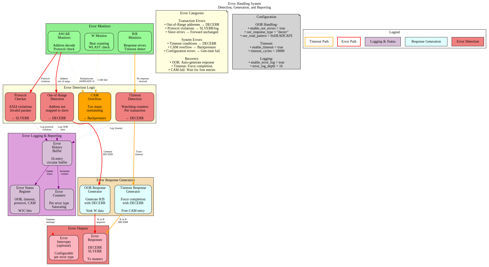

# 2.9 Error Handling

Error Handling encompasses all mechanisms by which the bridge detects, reports, and recovers from error conditions. This includes protocol violations, out-of-range addresses, timeout conditions, and configuration errors.

## 2.9.1 Purpose and Function

Error handling performs the following critical functions:

1. **Error Detection**: Identifies violations and abnormal conditions
2. **Error Response Generation**: Creates appropriate AXI error responses
3. **Error Reporting**: Logs and signals errors for debug
4. **Graceful Degradation**: Maintains system stability during errors
5. **Recovery Support**: Enables system recovery after errors

## 2.9.2 Error Categories

### Transaction Errors

**Out-of-Range (OOR) Addresses**:
```
Master requests address not mapped to any slave
Response: DECERR (Decode Error)
Action: Bridge generates error response internally
```

**Protocol Violations**:
```
Master violates AXI4 protocol rules
Examples:
  - VALID deasserted while READY=0
  - Incorrect burst parameters
  - ID width mismatches
Response: Configurable (error log, SLVERR, or ignore)
```

**Slave Errors**:
```
Slave returns SLVERR or DECERR response
Action: Bridge forwards error to master unchanged
```

### System Errors

**Timeout Conditions**:
```
Slave fails to respond within configured timeout
Response: DECERR after timeout expires
Action: Force transaction completion
```

**CAM Overflow**:
```
Too many outstanding transactions (CAM full)
Response: Backpressure master (ARREADY/AWREADY=0)
Action: Wait for responses to free entries
```

**Configuration Errors**:
```
Invalid bridge configuration detected at generation time
Examples:
  - Overlapping slave address ranges
  - Invalid data width combinations
  - Illegal parameter values
Response: Generation error, fail early
```

## 2.9.3 Block Diagram



*Figure 2.9: Error handling system showing detection (OOR, protocol, timeout, CAM), generation, and logging subsystems.*

## 2.9.4 Out-of-Range Address Handling

### Detection

Router identifies OOR when no slave address range matches:

```systemverilog
// Address decode with OOR detection
logic [NUM_SLAVES-1:0] slave_match;
logic oor_detected;

for (genvar i = 0; i < NUM_SLAVES; i++) begin
    assign slave_match[i] = (addr >= SLAVE_BASE[i]) && 
                            (addr <= SLAVE_END[i]);
end

assign oor_detected = ~(|slave_match) && ~default_slave_en;
```

### Error Response Generation

**Read OOR Response**:
```systemverilog
// Generate R response for OOR read
always_ff @(posedge clk) begin
    if (ar_oor_detected && arvalid && arready) begin
        // Capture transaction details
        oor_arid <= arid;
        oor_arlen <= arlen;
        oor_burst_count <= 0;
        oor_generating <= 1'b1;
    end else if (oor_generating) begin
        // Generate R beats
        rvalid <= 1'b1;
        rdata <= OOR_DATA_PATTERN;  // Configurable pattern
        rid <= oor_arid;
        rresp <= 2'b11;  // DECERR
        rlast <= (oor_burst_count == oor_arlen);
        
        if (rready) begin
            oor_burst_count <= oor_burst_count + 1;
            if (rlast) oor_generating <= 1'b0;
        end
    end
end
```

**Write OOR Response**:
```systemverilog
// Generate B response for OOR write
always_ff @(posedge clk) begin
    if (aw_oor_detected && awvalid && awready) begin
        // Capture write ID
        oor_awid <= awid;
        oor_w_count <= 0;
        oor_sinking_w <= 1'b1;
    end else if (oor_sinking_w) begin
        // Sink W data (accept and discard)
        wready <= 1'b1;
        
        if (wvalid && wlast) begin
            oor_sinking_w <= 1'b0;
            oor_gen_bresp <= 1'b1;
        end
    end else if (oor_gen_bresp) begin
        // Generate B response
        bvalid <= 1'b1;
        bid <= oor_awid;
        bresp <= 2'b11;  // DECERR
        
        if (bready) begin
            oor_gen_bresp <= 1'b0;
        end
    end
end
```

### Configurable Data Patterns

```toml
[bridge.error_handling]
oor_read_data_pattern = 0xDEADCAFE  # Pattern for OOR reads
oor_response_latency = 2            # Cycles to generate response
```

## 2.9.5 Protocol Violation Handling

### Common Violations

**VALID Dropped While READY=0**:
```
AXI4 Rule: Once VALID asserted, must remain until READY
Violation: Master deasserts VALID before handshake
Detection: Track VALID history per channel
Action: Log error, optionally assert error signal
```

**Incorrect Burst Parameters**:
```
Violations:
  - SIZE > DATA_WIDTH
  - LEN > 255
  - Address not aligned to SIZE
  - Burst crosses 4KB boundary
Detection: Parameter checking logic
Action: SLVERR response or reject transaction
```

**ID Width Mismatch**:
```
Violation: Master uses ID wider than configured
Detection: Check ID values against expected width
Action: Truncate or error (configurable)
```

### Protocol Checker Implementation

```systemverilog
// AXI4 protocol checker (simplified)
module axi_protocol_checker #(
    parameter ID_WIDTH = 4,
    parameter ADDR_WIDTH = 32,
    parameter DATA_WIDTH = 64
) (
    input logic clk, rst_n,
    // AXI signals
    input logic arvalid, arready,
    input logic [ADDR_WIDTH-1:0] araddr,
    input logic [7:0] arlen,
    input logic [2:0] arsize,
    // Error outputs
    output logic protocol_error,
    output logic [7:0] error_code
);

    // Check: VALID held until READY
    logic arvalid_prev;
    always_ff @(posedge clk) begin
        arvalid_prev <= arvalid;
        if (arvalid_prev && !arvalid && !arready) begin
            protocol_error <= 1'b1;
            error_code <= 8'h01;  // VALID_DROPPED
        end
    end
    
    // Check: SIZE <= DATA_WIDTH
    always_comb begin
        if (arvalid && (arsize > $clog2(DATA_WIDTH/8))) begin
            protocol_error = 1'b1;
            error_code = 8'h02;  // INVALID_SIZE
        end
    end
    
    // Check: Address alignment
    always_comb begin
        if (arvalid && (araddr[arsize-1:0] != 0)) begin
            protocol_error = 1'b1;
            error_code = 8'h03;  // UNALIGNED_ADDR
        end
    end
    
    // Additional checks...
endmodule
```

## 2.9.6 Timeout Detection

### Per-Transaction Watchdog

```systemverilog
// Timeout detector for outstanding transactions
typedef struct packed {
    logic valid;
    logic [TOTAL_ID_WIDTH-1:0] id;
    logic [15:0] timestamp;
    logic is_read;  // 1=read, 0=write
} timeout_entry_t;

timeout_entry_t watchdog [0:15];  // Track up to 16 transactions
logic [15:0] global_timer;

always_ff @(posedge clk) begin
    if (!rst_n) begin
        global_timer <= 0;
    end else begin
        global_timer <= global_timer + 1;
        
        // Check for timeouts
        for (int i = 0; i < 16; i++) begin
            if (watchdog[i].valid) begin
                logic [15:0] elapsed;
                elapsed = global_timer - watchdog[i].timestamp;
                
                if (elapsed > TIMEOUT_THRESHOLD) begin
                    // Timeout detected
                    timeout_error <= 1'b1;
                    timeout_id <= watchdog[i].id;
                    timeout_type <= watchdog[i].is_read ? "READ" : "WRITE";
                    
                    // Force completion with DECERR
                    force_error_response(watchdog[i]);
                    watchdog[i].valid <= 1'b0;
                end
            end
        end
    end
end
```

### Timeout Configuration

```toml
[bridge.error_handling]
enable_timeout = true
timeout_cycles = 10000         # Max cycles before timeout
timeout_action = "decerr"      # "decerr", "slverr", or "hang"
per_slave_timeout = [          # Optional per-slave overrides
    {name = "slow_periph", timeout = 50000},
    {name = "fast_mem", timeout = 1000}
]
```

## 2.9.7 Error Logging and Reporting

### Error Status Register

```
Error Status Register (Read/Clear):
┌──────┬──────────────────────────────────────┐
│ Bits │ Description                          │
├──────┼──────────────────────────────────────┤
│ 0    │ OOR Read Error                       │
│ 1    │ OOR Write Error                      │
│ 2    │ Protocol Violation                   │
│ 3    │ Timeout Error                        │
│ 4    │ CAM Overflow                         │
│ 5    │ Slave Error (SLVERR received)        │
│ 6    │ Decode Error (DECERR received)       │
│ 7    │ ID Match Error                       │
│15:8  │ Reserved                             │
│31:16 │ Error Count (saturating)             │
└──────┴──────────────────────────────────────┘
```

### Error History Buffer

```systemverilog
// Circular buffer for error history
typedef struct packed {
    logic [7:0] error_type;
    logic [31:0] address;
    logic [TOTAL_ID_WIDTH-1:0] id;
    logic [31:0] timestamp;
    logic [7:0] master_index;
    logic [7:0] slave_index;
} error_entry_t;

error_entry_t error_log [0:15];  // 16-entry history
logic [3:0] error_wr_ptr;

always_ff @(posedge clk) begin
    if (error_detected) begin
        error_log[error_wr_ptr] <= {
            error_type,
            error_addr,
            error_id,
            global_timer,
            error_master,
            error_slave
        };
        error_wr_ptr <= error_wr_ptr + 1;
    end
end
```

### Error Interrupts

```
Optional interrupt generation:

Interrupt Enable Register:
  - OOR_INT_EN
  - TIMEOUT_INT_EN
  - PROTOCOL_INT_EN
  - etc.

Interrupt when enabled error occurs
Clear on status register read or explicit clear
```

## 2.9.8 Resource Utilization

### Error Handling Resources

```
Logic Elements:  ~800-1200 LEs
Registers:       ~400-600 regs
Block RAM:       0-2 KB (if error logging enabled)

Breakdown:
- OOR detection/response:     ~300 LEs, ~100 regs
- Protocol checkers:           ~250 LEs, ~50 regs
- Timeout watchers:            ~200 LEs, ~150 regs
- Error logging:               ~150 LEs, ~100 regs
- Status registers:            ~100 LEs, ~50 regs

Optional error log (16 entries): +2KB BRAM
```

## 2.9.9 Configuration Parameters

### Error Handling Configuration (TOML)

```toml
[bridge.error_handling]
# OOR handling
enable_oor_errors = true
oor_response_type = "decerr"      # "decerr", "slverr"
oor_read_pattern = 0xDEADCAFE     # Data pattern for OOR reads

# Timeout detection
enable_timeout = true
timeout_cycles = 10000
timeout_response = "decerr"

# Protocol checking
enable_protocol_checker = true
protocol_checker_mode = "log"     # "log", "error", "ignore"

# Error logging
enable_error_log = true
error_log_depth = 16              # Entries in circular buffer

# Error reporting
enable_error_interrupts = false
error_status_register_addr = 0xFFFF_FFF0  # Optional mapped register
```

## 2.9.10 Debug and Observability

### Recommended Debug Signals

```
Error Detection:
- OOR flags (per master)
- Protocol violation flags
- Timeout counters
- CAM occupancy

Error Response:
- Error response generation FSM states
- Active error responses
- Error data patterns

Error Logging:
- Error count
- Last error type
- Last error address
- Error log write pointer
```

## 2.9.11 Common Issues and Debug

**Symptom**: Unexpected DECERR responses  
**Check**:
- Address map configuration (gaps?)
- Slave address ranges (overlaps?)
- Default slave configuration
- Timeout thresholds (too short?)

**Symptom**: System hangs on certain addresses  
**Check**:
- Timeout detection enabled?
- Slave responsiveness
- Protocol violations upstream
- CAM overflow

**Symptom**: Error log filling quickly  
**Check**:
- What errors are occurring?
- Master behavior (bad addresses?)
- Slave configuration
- Timeout thresholds

## 2.9.12 Verification Considerations

### Test Scenarios

1. **OOR Address Tests**:
```
- Read from unmapped address
- Write to unmapped address
- Burst to partially mapped range
- Verify DECERR response
```

2. **Timeout Tests**:
```
- Slave never responds
- Verify timeout after N cycles
- Check error logged
- Verify forced completion
```

3. **Protocol Violation Tests**:
```
- Drop VALID before READY
- Invalid burst parameters
- Misaligned addresses
- Verify detection and response
```

4. **Error Recovery Tests**:
```
- Error occurs
- System continues operating
- Subsequent transactions succeed
- Error status readable
```

5. **Error Logging Tests**:
```
- Generate multiple errors
- Verify all logged
- Check circular buffer wrap
- Verify timestamps
```

## 2.9.13 Recovery Mechanisms

### Automatic Recovery

```
OOR Errors:
  - Generate error response
  - Continue normal operation
  - No intervention needed

Timeout Errors:
  - Force transaction completion
  - Free CAM entry
  - Allow new transactions

Protocol Violations:
  - Log error
  - Complete/reject transaction  
  - Continue with next transaction
```

### Manual Recovery

```
CAM Stuck:
  - Software reset via control register
  - Clear CAM entries
  - Restart affected masters

Persistent Errors:
  - Read error log
  - Identify root cause
  - Reconfigure or reset subsystem
```

## 2.9.14 Safety and Reliability

### Error Containment

```
Goal: Prevent error propagation

Mechanisms:
- Isolate error to originating master
- Don't corrupt other masters' transactions
- Maintain crossbar integrity
- Log for post-mortem analysis
```

### Fail-Safe Behavior

```
On Critical Error:
1. Generate safe error response (DECERR)
2. Log error details
3. Assert error signal (optional)
4. Continue operation if possible
5. Halt only if configured (safety-critical mode)
```

### Error Injection (Debug/Test)

```toml
[bridge.debug]
enable_error_injection = true

[[bridge.debug.error_injection]]
type = "oor"
trigger_address = 0xBAD_ADDR
action = "decerr"

[[bridge.debug.error_injection]]
type = "timeout"
trigger_after_n_cycles = 100
target_slave = 2
```

## 2.9.15 Future Enhancements

### Planned Features
- **Error Recovery FSM**: Automatic recovery from certain error conditions
- **Error Rate Limiting**: Prevent error storm from misbehaving master
- **Detailed Error Telemetry**: Capture full transaction context on error
- **Error Prediction**: Detect patterns indicating impending failures

### Under Consideration
- **ECC Protection**: Error correction for internal state
- **Redundant Checking**: Duplicate checkers for safety-critical
- **Watchdog Timers**: System-level health monitoring
- **Error Severity Levels**: Classify errors by impact

---

**Related Sections**:
- Section 2.2: Slave Router (OOR detection)
- Section 2.5: ID Management (CAM overflow)
- Section 2.8: Response Routing (error response paths)
- Chapter 5: Verification (error testing strategies)
