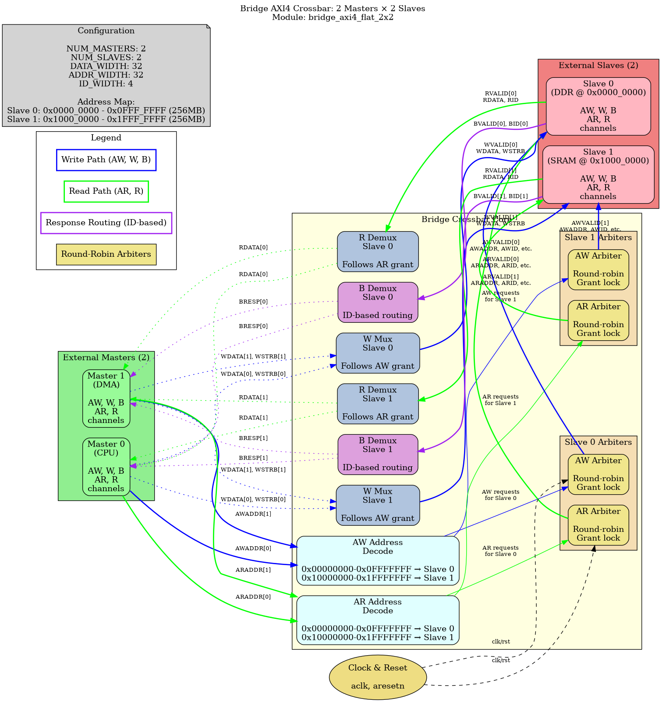
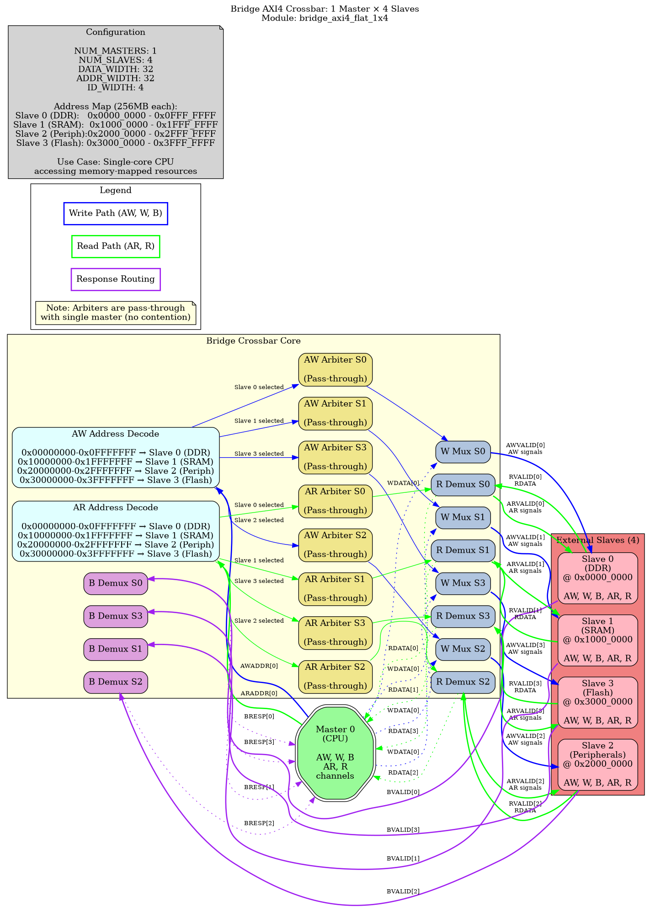

### Generated RTL Module Structure

#### Overview

The Bridge generator creates complete SystemVerilog crossbar modules from CSV configuration files. Each generated module contains all necessary logic for address decoding, arbitration, data multiplexing, and response routing across the specified master-slave topology.

**Generated Module Naming:** `bridge_axi4_flat_<M>x<S>` where M = number of masters, S = number of slaves

#### Example Configurations

**2x2 Configuration:** 2 masters connecting to 2 slaves



**1x4 Configuration:** 1 master connecting to 4 slaves



#### Module Organization

**Top-Level Structure:**

```systemverilog
module bridge_axi4_flat_2x2 #(
    parameter int NUM_MASTERS = 2,
    parameter int NUM_SLAVES  = 2,
    parameter int DATA_WIDTH  = 32,
    parameter int ADDR_WIDTH  = 32,
    parameter int ID_WIDTH    = 4,
    parameter int STRB_WIDTH  = 4
)(
    // Clock and reset
    input  logic aclk,
    input  logic aresetn,

    // Master-side interfaces (slave ports on bridge)
    // Array of AXI4 signals [NUM_MASTERS]
    input  logic [ADDR_WIDTH-1:0] s_axi_awaddr  [NUM_MASTERS],
    input  logic [ID_WIDTH-1:0]   s_axi_awid    [NUM_MASTERS],
    // ... all AW, W, B, AR, R channel signals

    // Slave-side interfaces (master ports on bridge)
    // Array of AXI4 signals [NUM_SLAVES]
    output logic [ADDR_WIDTH-1:0] m_axi_awaddr  [NUM_SLAVES],
    output logic [ID_WIDTH-1:0]   m_axi_awid    [NUM_SLAVES],
    // ... all AW, W, B, AR, R channel signals
);
```

**Key Organizational Principles:**

1. **Packed Arrays for Ports**
   - Master signals: `s_axi_*[NUM_MASTERS]`
   - Slave signals: `m_axi_*[NUM_SLAVES]`
   - Enables scalable, parameterized instantiation

2. **Modular Internal Organization**
   - Address decode logic (AW, AR separate)
   - Per-slave arbitration FSMs (AW, AR independent)
   - Data multiplexing (W follows AW, R follows AR)
   - Response demultiplexing (B, R route by ID)

3. **Clear Signal Naming Convention**
   - Request matrices: `aw_request_matrix[s][m]`, `ar_request_matrix[s][m]`
   - Grant matrices: `aw_grant_matrix[s][m]`, `ar_grant_matrix[s][m]`
   - Grant tracking: `aw_last_grant[s]`, `ar_last_grant[s]`
   - Grant state: `aw_grant_active[s]`, `ar_grant_active[s]`

#### Internal Structure Breakdown

**1. Address Decode Logic**

```systemverilog
// ==========================================================================
// Write Address Decode (AW channel)
// ==========================================================================
logic [NUM_MASTERS-1:0] aw_request_matrix [NUM_SLAVES];

always_comb begin
    // Initialize all write address requests to zero
    for (int s = 0; s < NUM_SLAVES; s++) begin
        aw_request_matrix[s] = '0;
    end

    // Decode AWADDR to slave for each master
    for (int m = 0; m < NUM_MASTERS; m++) begin
        if (s_axi_awvalid[m]) begin
            // Check master's address against all slave ranges
            if (s_axi_awaddr[m] < 32'h10000000)
                aw_request_matrix[0][m] = 1'b1;  // Slave 0

            if (s_axi_awaddr[m] >= 32'h10000000 &&
                s_axi_awaddr[m] < 32'h20000000)
                aw_request_matrix[1][m] = 1'b1;  // Slave 1
        end
    end
end
```

**Purpose:**
- Examines each master's address (AWADDR or ARADDR)
- Compares against slave address ranges
- Generates request bit per master-slave pair
- Separate decode for write (AW) and read (AR) channels

**2. Arbiter FSMs (Per-Slave, Per-Direction)**

Each slave has two independent arbiter FSMs:
- **AW Arbiter** - Arbitrates write address requests
- **AR Arbiter** - Arbitrates read address requests

**Total FSM Count:** `2 × NUM_SLAVES`

See [Chapter 3.2 - Arbiter FSMs](02_arbiter_fsms.md) for detailed FSM documentation.

**3. Data Multiplexing**

**W Channel (Write Data):**
```systemverilog
// W channel follows AW grant (locked until WLAST)
generate
    for (genvar s = 0; s < NUM_SLAVES; s++) begin : gen_w_mux
        always_comb begin
            m_axi_wdata[s]  = '0;
            m_axi_wstrb[s]  = '0;
            m_axi_wlast[s]  = 1'b0;
            m_axi_wvalid[s] = 1'b0;

            // Multiplex granted master's W signals
            for (int m = 0; m < NUM_MASTERS; m++) begin
                if (aw_grant_matrix[s][m]) begin
                    m_axi_wdata[s]  = s_axi_wdata[m];
                    m_axi_wstrb[s]  = s_axi_wstrb[m];
                    m_axi_wlast[s]  = s_axi_wlast[m];
                    m_axi_wvalid[s] = s_axi_wvalid[m];
                end
            end
        end
    end
endgenerate
```

**R Channel (Read Data):**
```systemverilog
// R channel follows AR grant (locked until RLAST)
generate
    for (genvar s = 0; s < NUM_SLAVES; s++) begin : gen_r_demux
        always_comb begin
            for (int m = 0; m < NUM_MASTERS; m++) begin
                s_axi_rdata[m]  = '0;
                s_axi_rid[m]    = '0;
                s_axi_rresp[m]  = '0;
                s_axi_rlast[m]  = 1'b0;
                s_axi_rvalid[m] = 1'b0;

                if (ar_grant_matrix[s][m]) begin
                    s_axi_rdata[m]  = m_axi_rdata[s];
                    s_axi_rid[m]    = m_axi_rid[s];
                    s_axi_rresp[m]  = m_axi_rresp[s];
                    s_axi_rlast[m]  = m_axi_rlast[s];
                    s_axi_rvalid[m] = m_axi_rvalid[s];
                end
            end
        end
    end
endgenerate
```

**4. Response Demultiplexing**

**B Channel (Write Response):**
```systemverilog
// B channel routed by ID (supports out-of-order completion)
// TODO Phase 2: Use ID lookup table instead of grant matrix
```

Currently follows AW grant matrix, but should use ID-based routing for true out-of-order support.

#### Scalability Characteristics

**Module Complexity vs Configuration:**

| Configuration | FSM Count | Mux/Demux Count | Address Decoders | Lines of RTL |
|---------------|-----------|-----------------|------------------|--------------|
| 1×1 | 2 | 4 | 2 | ~400 |
| 2×2 | 4 | 8 | 2 | ~600 |
| 4×4 | 8 | 16 | 2 | ~900 |
| 8×8 | 16 | 32 | 2 | ~1500 |

**Resource Scaling:**
- **FSMs:** Linear with NUM_SLAVES (2 per slave)
- **Mux Logic:** Linear with NUM_MASTERS × NUM_SLAVES
- **Address Decode:** Fixed (2 decoders regardless of topology)
- **Synthesis Impact:** Minimal for up to 8×8 configurations

#### Integration Example

**Instantiation Pattern:**

```systemverilog
// Instantiate generated 2×2 crossbar
bridge_axi4_flat_2x2 #(
    .NUM_MASTERS(2),
    .NUM_SLAVES(2),
    .DATA_WIDTH(32),
    .ADDR_WIDTH(32),
    .ID_WIDTH(4),
    .STRB_WIDTH(4)
) u_bridge (
    .aclk         (sys_clk),
    .aresetn      (sys_rst_n),

    // Master 0 (CPU)
    .s_axi_awaddr ({cpu_awaddr}),
    .s_axi_awid   ({cpu_awid}),
    // ... all CPU AXI4 signals

    // Master 1 (DMA)
    .s_axi_awaddr ({dma_awaddr}),
    .s_axi_awid   ({dma_awid}),
    // ... all DMA AXI4 signals

    // Slave 0 (DDR)
    .m_axi_awaddr ({ddr_awaddr}),
    .m_axi_awid   ({ddr_awid}),
    // ... all DDR AXI4 signals

    // Slave 1 (SRAM)
    .m_axi_awaddr ({sram_awaddr}),
    .m_axi_awid   ({sram_awid}),
    // ... all SRAM AXI4 signals
);
```

**Note:** Array indexing syntax varies by tool - some tools require explicit array element connections.

#### Code Organization Sections

**Generated module contains these distinct sections:**

1. **Module Header & Parameters** (~20 lines)
   - Module declaration
   - Parameter definitions
   - Port list with packed arrays

2. **Address Decode Logic** (~50 lines per direction)
   - AW decode: AWADDR → slave request matrix
   - AR decode: ARADDR → slave request matrix
   - Combinational logic with address range checks

3. **Arbiter FSMs** (~40 lines per slave per direction)
   - AW arbiter: Round-robin with grant locking
   - AR arbiter: Independent from AW arbiter
   - Sequential logic with reset handling

4. **Channel Multiplexing** (~30 lines per slave per direction)
   - AW channel: Master → selected slave
   - W channel: Follows AW grant, locked until WLAST
   - AR channel: Master → selected slave
   - R channel: Follows AR grant, locked until RLAST

5. **Response Demultiplexing** (~30 lines per slave per direction)
   - B channel: Slave → ID-matched master (TODO: ID table)
   - R channel: Slave → grant-matched master
   - Handles valid/ready handshaking

6. **Ready Signal Generation** (~20 lines)
   - Master AWREADY: OR of all slave grants
   - Master ARREADY: OR of all slave grants
   - Slave WREADY: Grant-based routing
   - Slave RREADY: Grant-based routing

#### Comparison with Other Crossbar Generators

| Feature | Manual RTL | Bridge Generator | Commercial Tools |
|---------|-----------|------------------|------------------|
| **Configuration** | Code editing | CSV files | GUI/scripts |
| **Generation Time** | Hours-days | Seconds | Minutes |
| **Custom Prefixes** | Manual | Automatic | Limited |
| **Channel-Specific** | Manual | Yes (wr/rd/rw) | Sometimes |
| **Verification** | Manual | Framework available | Usually included |
| **Cost** | Engineer time | Free | $$$-$$$$$ |

#### Future Enhancements

**Phase 2 Features (Planned):**
- Transaction ID tracking with distributed RAM
- True out-of-order write/read completion
- B/R response routing via ID lookup tables
- Performance monitoring hooks

**Phase 3 Features (Planned):**
- Quality-of-Service (QoS) arbitration
- Slave-side data width conversion
- Optional pipeline registers for timing closure
- Configurable arbitration algorithms (weighted, priority-based)

---

**See Also:**
- [1.1 - Introduction](../ch01_overview/01_introduction.md) - Bridge overview and features
- [2.4 - Channel-Specific Masters](../ch02_csv_generator/04_channel_specific.md) - wr/rd/rw configuration
- [3.2 - Arbiter FSMs](02_arbiter_fsms.md) - Detailed FSM documentation

**Source Code:**
- `rtl/bridge_axi4_flat_2x2.sv` - Example 2×2 crossbar (reference implementation)
- `rtl/bridge_axi4_flat_4x4.sv` - Example 4×4 crossbar (larger scale)
