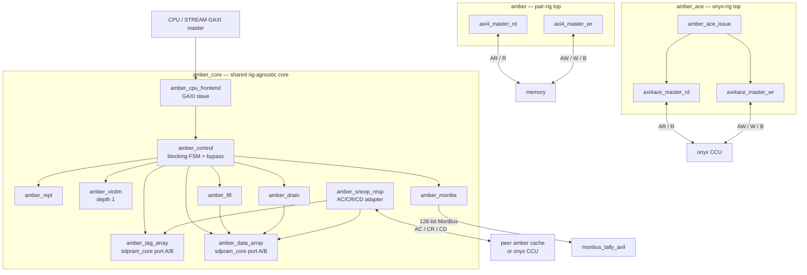

<!-- RTL Design Sherpa Documentation Header -->
<table>
<tr>
<td width="80">
  
</td>
<td>
  <strong>RTL Design Sherpa</strong> · <em>Learning Hardware Design Through Practice</em> 
  
    <a href="https://github.com/sean-galloway/RTLDesignSherpa">GitHub</a> ·
    <a href="https://github.com/sean-galloway/RTLDesignSherpa/blob/main/docs/DOCUMENTATION_INDEX.md">Documentation Index</a> ·
    <a href="https://github.com/sean-galloway/RTLDesignSherpa/blob/main/LICENSE">MIT License</a>
  
</td>
</tr>
</table>

---

<!-- End Header -->

# Block Diagram

Figure 2.1 shows the shared `amber_core` and the two rig tops that instantiate it. The core is rig-agnostic: the CPU-side front end, control FSM, arrays, replacement engine, fill/drain engines, snoop responder, and observation wrapper are identical in both configurations. The pair-rig top adds plain AXI4 masters to memory; the onyx-rig top adds ACE masters and the `amber_ace_issue` coherent-transaction issuer.

**Source:** [01_block_diagram.mmd](../assets/mermaid/01_block_diagram.mmd) — the fence above mirrors it.

## Module roles

| Module | Role |
|---|---|
| `amber` | Pair-rig top: `amber_core` + plain AXI4 masters + snoop responder toward peer. |
| `amber_ace` | Onyx-rig top: `amber_core` + ACE masters + `amber_ace_issue` + snoop responder toward onyx. |
| `amber_core` | Shared rig-agnostic core instantiated by both tops. |
| `amber_cpu_frontend` | GAXI slave: request acceptance, response return, replay latch. |
| `amber_control` | Blocking pipeline FSM; owns tag-array control arbitration and the pending-fill bypass register. |
| `amber_tag_array` / `amber_data_array` | Dual-port `sdpram_core` stores; port A CPU/fill, port B snoop. |
| `amber_repl` | Pluggable replacement policy engine. |
| `amber_victim` | Dirty victim buffer + drain trigger; depth 1. |
| `amber_fill` / `amber_drain` | Read/write engines; plain AXI4 under `amber`, ACE under `amber_ace`. |
| `amber_snoop_resp` | ACE AC/CR/CD adapter; bus-agnostic inside. |
| `amber_ace_issue` | Maps cache events to the onyx D2 coherent-transaction subset. |
| `amber_monlite` | Observation wrapper; emits MonBus packets, never stalls. |

: Table 2.1: Module roles
