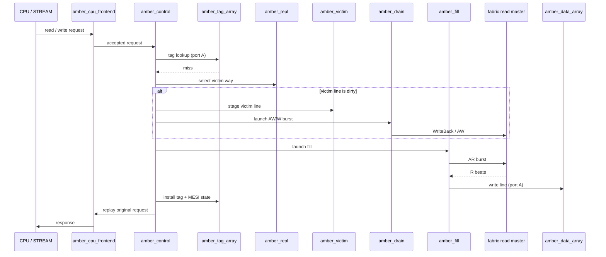

<!-- RTL Design Sherpa Documentation Header -->
<table>
<tr>
<td width="80">
  
</td>
<td>
  <strong>RTL Design Sherpa</strong> · <em>Learning Hardware Design Through Practice</em> 
  
    <a href="https://github.com/sean-galloway/RTLDesignSherpa">GitHub</a> ·
    <a href="https://github.com/sean-galloway/RTLDesignSherpa/blob/main/docs/DOCUMENTATION_INDEX.md">Documentation Index</a> ·
    <a href="https://github.com/sean-galloway/RTLDesignSherpa/blob/main/LICENSE">MIT License</a>
  
</td>
</tr>
</table>

---

<!-- End Header -->

# Data Flow: Hits, Misses, Fills, and Drains

## Hit path

A CPU request accepted by `amber_cpu_frontend` is latched and presented to `amber_control`. The control FSM drives a tag lookup on port A of `amber_tag_array`. On a hit, the state field is checked: read returns data from `amber_data_array` port A; write updates data and promotes the line to Modified. The response returns through the front end in the same transaction.

## Miss path

On a miss, `amber_repl` selects the victim way. If the victim is dirty, it is moved to `amber_victim` and `amber_drain` issues a write-back burst. Once the victim path is clear, `amber_fill` issues a read burst. Returned beats write `amber_data_array` port A; the tag and MESI state are installed; the original request replays from the front-end latch. Figure 3.1 shows the sequence.

**Source:** [02_miss_flow.mmd](../assets/mermaid/02_miss_flow.mmd) — the fence above mirrors it.

## Snoop path

A snoop arrives at `amber_snoop_resp`, is buffered, and is presented to `amber_control`. The control FSM reads `amber_tag_array` port B. If the address matches the pending-fill bypass register, the response is composed from the register's post-fill state and any fill beats already received. Otherwise the tag state determines `CRRESP` and whether `amber_data_array` port B supplies CD beats. The adapter returns CR and CD in order to the requester.

## Open shape: memory-side masters (D3)

D3 is open at the time of this writing. The direction is plain AXI4 read/write masters on the house `axi4_master_rd/wr` wrappers for the pair rig, and the existing `axi4ace_master_rd/wr` for the onyx rig. The exact skid depths, ID width, and user-width defaults follow the wrappers' own parameters; the cache does not override them except where geometry or bus width requires it. Finalizing D3 means pinning those defaults and the AW/AR burst length calculation in the fill/drain modules.

## Open shape: array construction (D11)

D11 is open: tag and data stores will be built from the shared `sdpram_core` primitive, with FPGA synthesis attributes per `GLOBAL_REQUIREMENTS.md` and the `[DEPTH]` array syntax. The dual-port behavior (port A CPU/fill, port B snoop) is fixed; the exact banking, write-masking, and byte-enable plumbing are micro-architecture details for the MAS.
