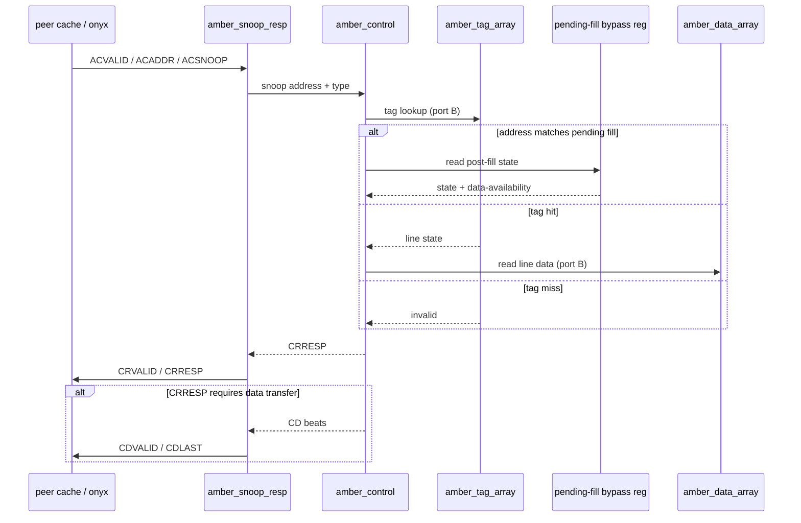

<!-- RTL Design Sherpa Documentation Header -->
<table>
<tr>
<td width="80">
  
</td>
<td>
  <strong>RTL Design Sherpa</strong> · <em>Learning Hardware Design Through Practice</em> 
  
    <a href="https://github.com/sean-galloway/RTLDesignSherpa">GitHub</a> ·
    <a href="https://github.com/sean-galloway/RTLDesignSherpa/blob/main/docs/DOCUMENTATION_INDEX.md">Documentation Index</a> ·
    <a href="https://github.com/sean-galloway/RTLDesignSherpa/blob/main/LICENSE">MIT License</a>
  
</td>
</tr>
</table>

---

<!-- End Header -->

# Coherence FSM and the Snoop Responder

## MESI state handling

Each tag entry carries a 3-bit state field. Only M/E/S/I are used in v1.0; the extra bit is reserved for MOESI O-state as a later elaboration upgrade (D6). State transitions follow the gem5 Ruby `MESI_Two_Level` SLICC tables and are cross-checked by the Python reference model and formal oracles (D9).

| Current state | Snoop type | Action | Next state | CRRESP (DT/PD/IS/WU/Err) |
|---|---|---|---|---|
| Modified | ReadShared | Transfer dirty data, pass dirty, downgrade to Shared | Shared | 1 / 1 / 1 / 0 / 0 |
| Modified | ReadOnce | Transfer dirty data, pass dirty, invalidate | Invalid | 1 / 1 / 0 / 0 / 0 |
| Modified | ReadUnique | Transfer dirty data, pass dirty, invalidate | Invalid | 1 / 1 / 0 / 0 / 0 |
| Modified | CleanShared | Transfer dirty data, pass dirty, downgrade to Shared | Shared | 1 / 1 / 1 / 0 / 0 |
| Modified | CleanInvalid | Transfer dirty data, pass dirty, invalidate | Invalid | 1 / 1 / 1 / 0 / 0 |
| Modified | MakeInvalid | Invalidate without data transfer (IHI0022 forbids DT here) | Invalid | 0 / 0 / 0 / 0 / 0 |
| Exclusive | ReadShared | Transfer clean data, downgrade to Shared | Shared | 1 / 0 / 1 / 1 / 0 |
| Exclusive | ReadOnce | Transfer clean data, downgrade to Shared | Shared | 1 / 0 / 1 / 1 / 0 |
| Exclusive | ReadUnique | Transfer clean data, invalidate | Invalid | 1 / 0 / 0 / 1 / 0 |
| Exclusive | CleanShared | Already clean; no transfer, no change | Exclusive | 0 / 0 / 1 / 1 / 0 |
| Exclusive | CleanInvalid | No data; invalidate | Invalid | 0 / 0 / 0 / 0 / 0 |
| Exclusive | MakeInvalid | No data; invalidate | Invalid | 0 / 0 / 0 / 0 / 0 |
| Shared | ReadShared | No data; keep Shared | Shared | 0 / 0 / 1 / 0 / 0 |
| Shared | ReadOnce | No data; keep Shared | Shared | 0 / 0 / 1 / 0 / 0 |
| Shared | ReadUnique | No data; invalidate | Invalid | 0 / 0 / 0 / 0 / 0 |
| Shared | CleanShared | No data; keep Shared | Shared | 0 / 0 / 0 / 0 / 0 |
| Shared | CleanInvalid | No data; invalidate | Invalid | 0 / 0 / 0 / 0 / 0 |
| Shared | MakeInvalid | No data; invalidate | Invalid | 0 / 0 / 0 / 0 / 0 |
| Invalid | any | No data; miss | Invalid | 0 / 0 / 0 / 0 / 0 |

: Table 3.0: MESI snoop CRRESP matrix — DT=DataTransfer, PD=PassDirty,
IS=IsShared, WU=WasUnique. Snoop encodings are the six IHI0022 AC types;
CleanUnique and MakeUnique are *transactions a master issues* (the onyx D2
subset), not snoop encodings, so they do not appear here.

This matrix is the amber MESI interpretation of the cocotb-framework 1.2.0
ACE BFM default handler, bit for bit — including the release-corrected
`MakeInvalid` behavior on Modified/Owned lines (invalidate, no data
transfer, IHI0022 forbids DataTransfer there). Where a textbook MESI
next-state could be argued either way (e.g. `Exclusive` + CleanShared:
already clean, so the line stays `Exclusive` while the response carries
`IsShared` per the family matrix), amber follows the BFM response bits and
the gem5 `MESI_Two_Level` transient-state tables for the transitions. The DV
scoreboard checks every CRRESP against this table, and
`CRRESP.validate_for_snoop` is the in-BFM guard for the same rules.

## Snoop flow

Figure 3.2 shows the probe path. The ACE adapter decouples ACE signaling from the cache core: inside `amber_core` the snoop is a bus-agnostic `{address, type, response, data}` transaction; only `amber_snoop_resp` speaks ACE.

**Source:** [03_snoop_flow.mmd](../assets/mermaid/03_snoop_flow.mmd) — the fence above mirrors it.

## Ordering convention

amber's adapter completes a transaction's CD beats before asserting its CR.
That is not amber being stricter than the protocol — IHI0022 requires the
snoop response only after the final CD beat, and the cocotb-framework 1.2.0
compliance checker (`check_cr_order` / `check_cd_order`) enforces exactly
this on every gather. The convention matches the family decision recorded
with onyx D4 and keeps the gather logic simple to verify.
