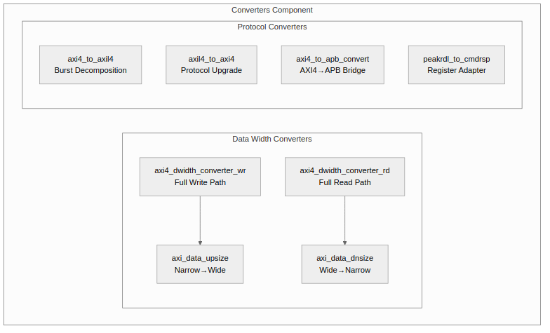

<!-- RTL Design Sherpa Documentation Header -->
<table>
<tr>
<td width="80">
  <a href="https://github.com/sean-galloway/RTLDesignSherpa">
    
  </a>
</td>
<td>
  <strong>RTL Design Sherpa</strong> · <em>Learning Hardware Design Through Practice</em><br>
  <sub>
    <a href="https://github.com/sean-galloway/RTLDesignSherpa">GitHub</a> ·
    <a href="https://github.com/sean-galloway/RTLDesignSherpa/blob/main/docs/DOCUMENTATION_INDEX.md">Documentation Index</a> ·
    <a href="https://github.com/sean-galloway/RTLDesignSherpa/blob/main/LICENSE">MIT License</a>
  </sub>
</td>
</tr>
</table>

---

<!-- End Header -->

# Chapter 1: Introduction - Overview

## 1.1 Purpose

The Converters component provides essential data width conversion and protocol conversion modules that enable seamless integration between components with different data widths or communication protocols.

## 1.2 Problem Statement

Modern SoC designs frequently encounter two integration challenges:

### 1.2.1 Data Width Mismatch

| Component | Typical Data Width |
|-----------|-------------------|
| CPU | 64-bit |
| DDR Controller | 512-bit |
| PCIe Endpoint | 128-bit |
| GPU | 256-bit |

: Table 1.1: Common Data Width Configurations

**Challenge:** Direct connection between mismatched widths is impossible. Width conversion is required.

### 1.2.2 Protocol Incompatibility

| Master Type | Protocol | Slave Type | Protocol |
|-------------|----------|------------|----------|
| CPU | AXI4 | DDR | AXI4 |
| DMA | AXI4 | UART | APB |
| CPU | AXI4 | GPIO | APB |
| Custom IP | AXI4-Lite | Fabric | AXI4 |

: Table 1.2: Protocol Mismatch Examples

**Challenge:** Different protocols require protocol bridges for communication.

## 1.3 Solution Architecture

### Figure 1.1: Converter Module Hierarchy



### 1.3.1 Data Width Converters

**Generic Building Blocks:**
- **axi_data_upsize** - Accumulates N narrow beats into 1 wide beat
- **axi_data_dnsize** - Splits 1 wide beat into N narrow beats

**Full AXI4 Converters:**
- **axi4_dwidth_converter_wr** - Complete write path (AW + W + B channels)
- **axi4_dwidth_converter_rd** - Complete read path (AR + R channels)

### 1.3.2 Protocol Converters

**AXI4 to AXI4-Lite:**
- **axi4_to_axil4_rd** - Read path burst decomposition
- **axi4_to_axil4_wr** - Write path burst decomposition
- **axi4_to_axil4** - Full bidirectional wrapper

**AXI4-Lite to AXI4:**
- **axil4_to_axi4_rd** - Read path protocol upgrade
- **axil4_to_axi4_wr** - Write path protocol upgrade
- **axil4_to_axi4** - Full bidirectional wrapper

**Other Converters:**
- **axi4_to_apb_convert** - Full AXI4-to-APB bridge
- **peakrdl_to_cmdrsp** - Register interface adapter

## 1.4 Key Design Decisions

### 1.4.1 Generic vs. Full Modules

The converter architecture uses a layered approach:

```
Layer 1: Generic Building Blocks
         axi_data_upsize, axi_data_dnsize
         - Protocol-agnostic data manipulation
         - Reusable across different contexts

Layer 2: Full AXI4 Converters
         axi4_dwidth_converter_wr, axi4_dwidth_converter_rd
         - Compose generic blocks with AXI4 channel management
         - Handle burst length adjustment, ID tracking

Layer 3: Protocol Converters
         axi4_to_axil4, axi4_to_apb, etc.
         - Full protocol translation
         - State machine control
```

### 1.4.2 Throughput vs. Area Trade-offs

| Configuration | Throughput | Area | Use Case |
|---------------|------------|------|----------|
| Upsize (single buffer) | 100% | 1x | All narrow-to-wide |
| Downsize (single buffer) | 80% | 1x | Area-constrained |
| Downsize (dual buffer) | 100% | 2x | High-performance |

: Table 1.3: Throughput vs. Area Trade-offs

**Design Decision:** Single-buffer upsize is always optimal (100% throughput at minimal cost). Downsize mode is configurable based on system requirements.

### 1.4.3 Sideband Signal Handling

Different modes for handling sideband signals (WSTRB, RRESP, etc.):

| Mode | Upsize Behavior | Downsize Behavior |
|------|-----------------|-------------------|
| Concatenate | Pack narrow strobes | Slice wide strobes |
| Broadcast | N/A | Repeat value |
| OR | Combine with OR | N/A |

: Table 1.4: Sideband Handling Modes

## 1.5 Performance Characteristics

### 1.5.1 Latency

| Module | Single-Beat | Burst (N beats) |
|--------|-------------|-----------------|
| axi_data_upsize | 0 cycles | N cycles to accumulate |
| axi_data_dnsize (single) | 1 cycle | N cycles + gap |
| axi_data_dnsize (dual) | 1 cycle | N cycles |
| axi4_to_axil4 | 0 cycles | 2xN cycles |
| axil4_to_axi4 | 0 cycles | N/A (single only) |

: Table 1.5: Latency Characteristics

### 1.5.2 Throughput

| Module | Configuration | Peak Throughput |
|--------|--------------|-----------------|
| axi_data_upsize | Single buffer | 1 beat/cycle |
| axi_data_dnsize | Single buffer | 0.8 beats/cycle |
| axi_data_dnsize | Dual buffer | 1 beat/cycle |
| axi4_to_axil4 | Burst | 0.5 beats/cycle |
| axil4_to_axi4 | Any | 1 beat/cycle |

: Table 1.6: Throughput Characteristics

## 1.6 Scope

### In Scope

- Integer width ratios (2:1, 4:1, 8:1, 16:1, etc.)
- AXI4, AXI4-Lite, and APB protocol support
- Configurable throughput vs. area trade-offs
- Generic building blocks for custom converters
- Burst-aware width conversion

### Out of Scope

- Non-integer width ratios (e.g., 3:2 conversion)
- AXI4-Stream protocol (see Stream component)
- Complex buffering beyond dual-buffer
- Clock domain crossing (use separate CDC modules)
- Address translation (handled by crossbar)

## 1.7 Target Applications

1. **CPU-to-DDR Integration** - 64-bit CPU to 512-bit memory controller
2. **DMA Engines** - Variable width data movers
3. **Mixed Protocol Systems** - AXI4 fabric with APB peripheral bus
4. **FPGA Fabric Interfaces** - Width matching for IP integration
5. **Register Access** - PeakRDL to custom control protocols

---

**Next:** [Chapter 2: Data Width Converter Blocks](../ch02_width_blocks/01_generic_blocks.md)
