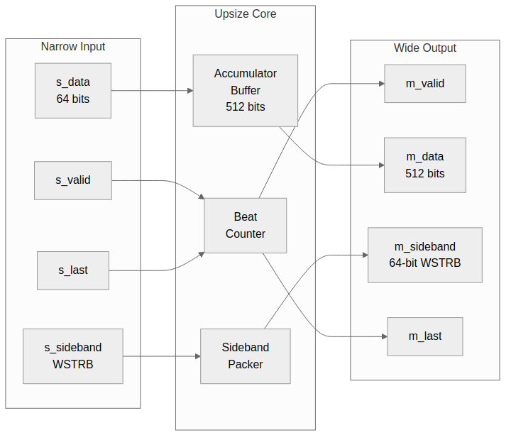

<!-- RTL Design Sherpa Documentation Header -->
<table>
<tr>
<td width="80">
  <a href="https://github.com/sean-galloway/RTLDesignSherpa">
    
  </a>
</td>
<td>
  <strong>RTL Design Sherpa</strong> · <em>Learning Hardware Design Through Practice</em><br>
  <sub>
    <a href="https://github.com/sean-galloway/RTLDesignSherpa">GitHub</a> ·
    <a href="https://github.com/sean-galloway/RTLDesignSherpa/blob/main/docs/DOCUMENTATION_INDEX.md">Documentation Index</a> ·
    <a href="https://github.com/sean-galloway/RTLDesignSherpa/blob/main/LICENSE">MIT License</a>
  </sub>
</td>
</tr>
</table>

---

<!-- End Header -->

# 2.2 axi_data_upsize Module

The **axi_data_upsize** module accumulates N narrow beats into 1 wide beat. It is the core building block for narrow-to-wide data width conversion.

## 2.2.1 Purpose and Function

The upsize module serves several critical functions:

1. **Data Accumulation**: Collects N narrow data beats into accumulator buffer
2. **Sideband Packing**: Concatenates or ORs sideband signals (WSTRB, etc.)
3. **Flow Control**: Manages valid/ready handshaking with single-cycle latency
4. **LAST Tracking**: Detects input LAST to generate output LAST

## 2.2.2 Block Diagram

### Figure 2.2: axi_data_upsize Architecture



## 2.2.3 Interface Specification

### Parameters

| Parameter | Type | Default | Description |
|-----------|------|---------|-------------|
| NARROW_WIDTH | int | 64 | Input data width (bits) |
| WIDE_WIDTH | int | 512 | Output data width (bits) |
| NARROW_SB_WIDTH | int | 8 | Input sideband width (bits) |
| WIDE_SB_WIDTH | int | 64 | Output sideband width |
| SB_OR_MODE | bit | 0 | 0=concatenate, 1=OR sidebands |
| USE_LAST | bit | 1 | Enable LAST signal tracking |

: Table 2.4: axi_data_upsize Parameters

### Ports

```systemverilog
module axi_data_upsize #(
    parameter int NARROW_WIDTH    = 64,
    parameter int WIDE_WIDTH      = 512,
    parameter int NARROW_SB_WIDTH = 8,
    parameter int WIDE_SB_WIDTH   = 64,
    parameter bit SB_OR_MODE      = 0,
    parameter bit USE_LAST        = 1
) (
    input  logic                        clk,
    input  logic                        rst_n,

    // Narrow input interface
    input  logic                        s_valid,
    output logic                        s_ready,
    input  logic [NARROW_WIDTH-1:0]     s_data,
    input  logic [NARROW_SB_WIDTH-1:0]  s_sideband,
    input  logic                        s_last,

    // Wide output interface
    output logic                        m_valid,
    input  logic                        m_ready,
    output logic [WIDE_WIDTH-1:0]       m_data,
    output logic [WIDE_SB_WIDTH-1:0]    m_sideband,
    output logic                        m_last
);
```

## 2.2.4 Operation

### Accumulation Cycle

```
Cycle 0: s_data[0] → buffer[63:0],   count = 0 → 1
Cycle 1: s_data[1] → buffer[127:64], count = 1 → 2
...
Cycle 7: s_data[7] → buffer[511:448], count = 7 → 0, m_valid = 1
Cycle 8: m_ready handshake, output complete
```

### Early LAST Handling

If `s_last` arrives before buffer is full:

```
Cycle 0: s_data[0] → buffer[63:0],   count = 0 → 1
Cycle 1: s_data[1] + s_last → buffer[127:64], count = 1 → 0
         m_valid = 1, m_last = 1
         Remaining bytes = don't care (masked by WSTRB)
```

### State Machine

```
IDLE (count=0):
  - s_valid=1 → load beat, increment count
  - count < RATIO-1 → stay in IDLE
  - count = RATIO-1 OR s_last → OUTPUT

OUTPUT (m_valid=1):
  - m_ready=1 → clear buffer, → IDLE
  - m_ready=0 → hold output
```

## 2.2.5 Sideband Handling

### Concatenate Mode (SB_OR_MODE=0)

Used for WSTRB packing:

```systemverilog
// Pack narrow sidebands into wide sideband
always_ff @(posedge clk) begin
    if (s_valid && s_ready) begin
        r_sideband[r_count * NARROW_SB_WIDTH +: NARROW_SB_WIDTH] <= s_sideband;
    end
end
```

**Example**: 8 beats of 8-bit WSTRB to 64-bit WSTRB
```
Beat 0: WSTRB = 0xFF → output[7:0]   = 0xFF
Beat 1: WSTRB = 0xF0 → output[15:8]  = 0xF0
Beat 2: WSTRB = 0x0F → output[23:16] = 0x0F
...
Beat 7: WSTRB = 0xAA → output[63:56] = 0xAA
Final:  output = 0xAA_..._0F_F0_FF
```

### OR Mode (SB_OR_MODE=1)

Used for error flag aggregation:

```systemverilog
// OR narrow sidebands together
always_ff @(posedge clk) begin
    if (s_valid && s_ready) begin
        if (r_count == 0)
            r_sideband <= {{(WIDE_SB_WIDTH-NARROW_SB_WIDTH){1'b0}}, s_sideband};
        else
            r_sideband <= r_sideband | s_sideband;
    end
end
```

**Example**: Any error in burst propagates
```
Beat 0: error = 0 → output = 0
Beat 1: error = 0 → output = 0
Beat 2: error = 1 → output = 1 (error detected)
Beat 3: error = 0 → output = 1 (remains set)
...
Final:  output = 1 (error occurred in burst)
```

## 2.2.6 Implementation

### Core Logic

```systemverilog
// Beat counter
logic [$clog2(RATIO)-1:0] r_count;

// Accumulator buffer
logic [WIDE_WIDTH-1:0] r_data;
logic [WIDE_SB_WIDTH-1:0] r_sideband;
logic r_last;

// Output valid when buffer full or early LAST
logic w_output_valid;
assign w_output_valid = (r_count == RATIO - 1) || r_last;

// Ready when not outputting or downstream ready
assign s_ready = !w_output_valid || m_ready;

// Main accumulation logic
always_ff @(posedge clk or negedge rst_n) begin
    if (!rst_n) begin
        r_count <= '0;
        r_data <= '0;
        r_sideband <= '0;
        r_last <= 1'b0;
    end else if (s_valid && s_ready) begin
        // Pack data into buffer
        r_data[r_count * NARROW_WIDTH +: NARROW_WIDTH] <= s_data;

        // Handle sideband based on mode
        if (SB_OR_MODE)
            r_sideband <= (r_count == 0) ? s_sideband : (r_sideband | s_sideband);
        else
            r_sideband[r_count * NARROW_SB_WIDTH +: NARROW_SB_WIDTH] <= s_sideband;

        // Track LAST
        r_last <= s_last;

        // Update counter
        if (s_last || r_count == RATIO - 1)
            r_count <= '0;
        else
            r_count <= r_count + 1'b1;
    end else if (m_valid && m_ready) begin
        r_last <= 1'b0;
    end
end

// Output assignments
assign m_valid = w_output_valid;
assign m_data = r_data;
assign m_sideband = r_sideband;
assign m_last = r_last;
```

## 2.2.7 Timing Characteristics

### Latency

| Scenario | Latency |
|----------|---------|
| Full buffer (N beats) | N cycles |
| Early LAST (M beats) | M cycles |
| Output handshake | 0-1 cycles |

: Table 2.5: Upsize Latency

### Throughput

**100% throughput** - No gaps required between input beats.

The accumulator accepts one beat per cycle continuously. When the output buffer is ready, it completes the handshake and immediately starts accumulating the next wide beat.

### Critical Paths

Typical critical paths:
- `s_data` → accumulator buffer → `m_data`
- `r_count` → comparison → `s_ready`

**Timing closure**: The module is designed for single-cycle operation with combinatorial paths only within registered stages.

## 2.2.8 Resource Utilization

### Typical Resources (64-bit to 512-bit)

```
Accumulator buffer:   512 flip-flops
Sideband buffer:      64 flip-flops (WSTRB)
Beat counter:         3 flip-flops
Control logic:        ~20 flip-flops
                      ~50-70 LUTs

Total: ~600 flip-flops, ~50-70 LUTs
```

### Scaling

| Configuration | Registers | LUTs |
|---------------|-----------|------|
| 32 → 128 (4:1) | ~170 | ~30 |
| 64 → 256 (4:1) | ~330 | ~40 |
| 64 → 512 (8:1) | ~600 | ~60 |
| 128 → 1024 (8:1) | ~1150 | ~80 |

: Table 2.6: Upsize Resource Scaling

## 2.2.9 Usage Example

### 64-bit to 512-bit Write Data

```systemverilog
axi_data_upsize #(
    .NARROW_WIDTH(64),
    .WIDE_WIDTH(512),
    .NARROW_SB_WIDTH(8),    // WSTRB
    .WIDE_SB_WIDTH(64),
    .SB_OR_MODE(0),         // Concatenate WSTRB
    .USE_LAST(1)
) u_wdata_upsize (
    .clk        (aclk),
    .rst_n      (aresetn),
    .s_valid    (s_wvalid),
    .s_ready    (s_wready),
    .s_data     (s_wdata),
    .s_sideband (s_wstrb),
    .s_last     (s_wlast),
    .m_valid    (m_wvalid),
    .m_ready    (m_wready),
    .m_data     (m_wdata),
    .m_sideband (m_wstrb),
    .m_last     (m_wlast)
);
```

---

**Next:** [axi_data_dnsize Module](03_axi_data_dnsize.md)
