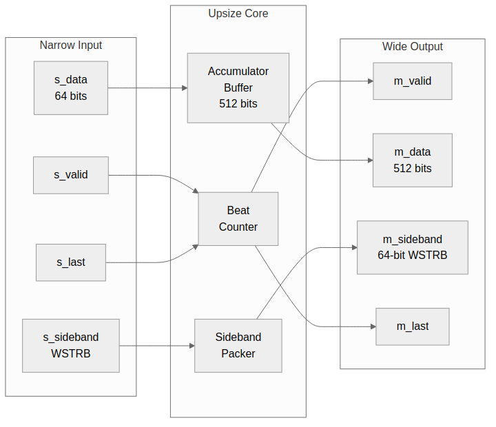

<!-- RTL Design Sherpa Documentation Header -->
<table>
<tr>
<td width="80">
  <a href="https://github.com/sean-galloway/RTLDesignSherpa">
    
  </a>
</td>
<td>
  <strong>RTL Design Sherpa</strong> · <em>Learning Hardware Design Through Practice</em><br>
  <sub>
    <a href="https://github.com/sean-galloway/RTLDesignSherpa">GitHub</a> ·
    <a href="https://github.com/sean-galloway/RTLDesignSherpa/blob/main/docs/DOCUMENTATION_INDEX.md">Documentation Index</a> ·
    <a href="https://github.com/sean-galloway/RTLDesignSherpa/blob/main/LICENSE">MIT License</a>
  </sub>
</td>
</tr>
</table>

---

<!-- End Header -->

# 2.2 axi_data_upsize Module

The **axi_data_upsize** module accumulates N narrow beats into 1 wide beat. It is the core building block for narrow-to-wide data width conversion.

## 2.2.1 Purpose and Function

The upsize module does four things:

1. **Data Accumulation**: Collects N narrow data beats into accumulator buffer
2. **Sideband Packing**: Concatenates or ORs sideband signals (WSTRB, etc.)
3. **Flow Control**: Manages valid/ready handshaking with single-cycle latency
4. **LAST Tracking**: Detects input LAST to generate output LAST

## 2.2.2 Block Diagram

### Figure 2.2: axi_data_upsize Architecture



## 2.2.3 Interface Specification

### Parameters

| Parameter | Type | Default | Description |
|-----------|------|---------|-------------|
| NARROW_WIDTH | int | 32 | Input data width (bits) |
| WIDE_WIDTH | int | 128 | Output data width (bits) |
| NARROW_SB_WIDTH | int | 0 | Input sideband width (bits), 0 if unused |
| WIDE_SB_WIDTH | int | 0 | Output sideband width, 0 if unused |
| SB_OR_MODE | int | 0 | 0=concatenate, 1=severity fold (numeric max) |

: Table 2.4: axi_data_upsize Parameters

### Ports

```systemverilog
module axi_data_upsize #(
    // Width Configuration
    parameter int NARROW_WIDTH    = 32,
    parameter int WIDE_WIDTH      = 128,
    parameter int NARROW_SB_WIDTH = 0,        // Sideband width (0 if unused)
    parameter int WIDE_SB_WIDTH   = 0,        // Wide sideband width
    parameter int SB_OR_MODE      = 0,        // 0=concatenate, 1=severity fold (numeric max)

    // Calculated Parameters
    localparam int WIDTH_RATIO = WIDE_WIDTH / NARROW_WIDTH,
    localparam int PTR_WIDTH   = $clog2(WIDTH_RATIO),
    // Ensure sideband widths are at least 1 for port declarations (unused if actual width is 0)
    localparam int NARROW_SB_PORT_WIDTH = (NARROW_SB_WIDTH > 0) ? NARROW_SB_WIDTH : 1,
    localparam int WIDE_SB_PORT_WIDTH = (WIDE_SB_WIDTH > 0) ? WIDE_SB_WIDTH : 1
) (
    input  logic                            aclk,
    input  logic                            aresetn,

    // Narrow Input (from slave or master)
    input  logic                            narrow_valid,
    output logic                            narrow_ready,
    input  logic [NARROW_WIDTH-1:0]         narrow_data,
    input  logic [NARROW_SB_PORT_WIDTH-1:0] narrow_sideband,  // Min width 1 to avoid [-1:0]
    input  logic                            narrow_last,

    // Wide Output (to master or slave)
    output logic                            wide_valid,
    input  logic                            wide_ready,
    output logic [WIDE_WIDTH-1:0]           wide_data,
    output logic [WIDE_SB_PORT_WIDTH-1:0]   wide_sideband,  // Min width 1 to avoid [-1:0]
    output logic                            wide_last
);
```

## 2.2.4 Operation

### Accumulation Cycle

```
Cycle 0: s_data[0] → buffer[63:0],   count = 0 → 1
Cycle 1: s_data[1] → buffer[127:64], count = 1 → 2
...
Cycle 7: s_data[7] → buffer[511:448], count = 7 → 0, m_valid = 1
Cycle 8: m_ready handshake, output complete
```

### Early LAST Handling

If `s_last` arrives before buffer is full:

```
Cycle 0: s_data[0] → buffer[63:0],   count = 0 → 1
Cycle 1: s_data[1] + s_last → buffer[127:64], count = 1 → 0
         m_valid = 1, m_last = 1
         Remaining bytes = don't care (masked by WSTRB)
```

### State Machine

```
IDLE (count=0):
  - s_valid=1 → load beat, increment count
  - count < RATIO-1 → stay in IDLE
  - count = RATIO-1 OR s_last → OUTPUT

OUTPUT (m_valid=1):
  - m_ready=1 → clear buffer, → IDLE
  - m_ready=0 → hold output
```

## 2.2.5 Sideband Handling

### Concatenate Mode (SB_OR_MODE=0)

Used for WSTRB packing:

```systemverilog
// Pack narrow sidebands into wide sideband
always_ff @(posedge clk) begin
    if (s_valid && s_ready) begin
        r_sideband[r_count * NARROW_SB_WIDTH +: NARROW_SB_WIDTH] <= s_sideband;
    end
end
```

**Example**: 8 beats of 8-bit WSTRB to 64-bit WSTRB
```
Beat 0: WSTRB = 0xFF → output[7:0]   = 0xFF
Beat 1: WSTRB = 0xF0 → output[15:8]  = 0xF0
Beat 2: WSTRB = 0x0F → output[23:16] = 0x0F
...
Beat 7: WSTRB = 0xAA → output[63:56] = 0xAA
Final:  output = 0xAA_..._0F_F0_FF
```

### Severity-Fold Mode (SB_OR_MODE=1)

Folds per-sub-beat responses into one wide-beat response by keeping the
**numeric maximum**, not a bitwise OR. The distinction matters for the mode's
primary use case, 2-bit RRESP: with the AXI encoding (OKAY=00, EXOKAY=01,
SLVERR=10, DECERR=11), `SLVERR | EXOKAY = DECERR` — an OR inflates the error
class the moment an exclusive-read beat mixes with a slave error (CONV-005).
Numeric max is exactly severity order for RRESP, so the fold keeps the worst
response instead:

```systemverilog
// gen_or_mode: keep the numeric max across the group's sub-beats
if (narrow_valid && narrow_ready) begin
    if (r_beat_ptr == '0)
        r_sideband_accumulator <= WIDE_SB_PORT_WIDTH'(narrow_sideband);
    else if (WIDE_SB_PORT_WIDTH'(narrow_sideband) > r_sideband_accumulator)
        r_sideband_accumulator <= WIDE_SB_PORT_WIDTH'(narrow_sideband);
end
```

For 1-bit sidebands (a bare error flag) max and OR coincide, so "any error in
the group propagates" still holds:

```
Beat 0: RRESP = OKAY   (00) → accumulator = 00
Beat 1: RRESP = EXOKAY (01) → accumulator = 01
Beat 2: RRESP = SLVERR (10) → accumulator = 10 (worst so far)
Beat 3: RRESP = OKAY   (00) → accumulator = 10 (max retained)
Final:  wide RRESP = SLVERR — not DECERR, which a bitwise OR would fabricate
```

## 2.2.6 Implementation

### Core Logic

```systemverilog
// Beat counter
logic [$clog2(RATIO)-1:0] r_count;

// Accumulator buffer
logic [WIDE_WIDTH-1:0] r_data;
logic [WIDE_SB_WIDTH-1:0] r_sideband;
logic r_last;

// Output valid when buffer full or early LAST
logic w_output_valid;
assign w_output_valid = (r_count == RATIO - 1) || r_last;

// Ready when not outputting or downstream ready
assign s_ready = !w_output_valid || m_ready;

// Main accumulation logic
always_ff @(posedge clk or negedge rst_n) begin
    if (!rst_n) begin
        r_count <= '0;
        r_data <= '0;
        r_sideband <= '0;
        r_last <= 1'b0;
    end else if (s_valid && s_ready) begin
        // Pack data into buffer
        r_data[r_count * NARROW_WIDTH +: NARROW_WIDTH] <= s_data;

        // Handle sideband based on mode
        if (SB_OR_MODE)
            r_sideband <= (r_count == 0) ? s_sideband : (r_sideband | s_sideband);
        else
            r_sideband[r_count * NARROW_SB_WIDTH +: NARROW_SB_WIDTH] <= s_sideband;

        // Track LAST
        r_last <= s_last;

        // Update counter
        if (s_last || r_count == RATIO - 1)
            r_count <= '0;
        else
            r_count <= r_count + 1'b1;
    end else if (m_valid && m_ready) begin
        r_last <= 1'b0;
    end
end

// Output assignments
assign m_valid = w_output_valid;
assign m_data = r_data;
assign m_sideband = r_sideband;
assign m_last = r_last;
```

## 2.2.7 Timing Characteristics

### Latency

| Scenario | Latency |
|----------|---------|
| Full buffer (N beats) | N cycles |
| Early LAST (M beats) | M cycles |
| Output handshake | 0-1 cycles |

: Table 2.5: Upsize Latency

### Throughput

**100% throughput** - no gaps required between input beats.

The accumulator accepts one beat per cycle, every cycle. When the output buffer completes its handshake, accumulation of the next wide beat starts immediately.

### Critical Paths

Typical critical paths:
- `s_data` → accumulator buffer → `m_data`
- `r_count` → comparison → `s_ready`

**Timing closure**: The module is designed for single-cycle operation, with combinatorial paths only within registered stages.

## 2.2.8 Resource Utilization

### Typical Resources (64-bit to 512-bit)

```
Accumulator buffer:   512 flip-flops
Sideband buffer:      64 flip-flops (WSTRB)
Beat counter:         3 flip-flops
Control logic:        ~20 flip-flops
                      ~50-70 LUTs

Total: ~600 flip-flops, ~50-70 LUTs
```

### Scaling

| Configuration | Registers | LUTs |
|---------------|-----------|------|
| 32 → 128 (4:1) | ~170 | ~30 |
| 64 → 256 (4:1) | ~330 | ~40 |
| 64 → 512 (8:1) | ~600 | ~60 |
| 128 → 1024 (8:1) | ~1150 | ~80 |

: Table 2.6: Upsize Resource Scaling

## 2.2.9 Usage Example

W-channel upsize (32 -> 128) with WSTRB as the concatenated sideband:

```systemverilog
axi_data_upsize #(
    .NARROW_WIDTH    (32),
    .WIDE_WIDTH      (128),
    .NARROW_SB_WIDTH (4),    // WSTRB, narrow side
    .WIDE_SB_WIDTH   (16),   // WSTRB, wide side
    .SB_OR_MODE      (0)     // concatenate strobes
) u_w_upsize (
    .aclk            (aclk),
    .aresetn         (aresetn),
    .narrow_valid    (s_wvalid),
    .narrow_ready    (s_wready),
    .narrow_data     (s_wdata),
    .narrow_sideband (s_wstrb),
    .narrow_last     (s_wlast),
    .wide_valid      (m_wvalid),
    .wide_ready      (m_wready),
    .wide_data       (m_wdata),
    .wide_sideband   (m_wstrb),
    .wide_last       (m_wlast)
);
```

