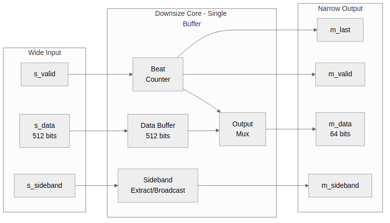
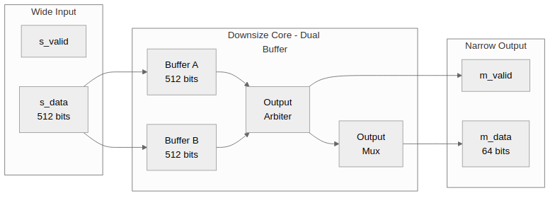

<!-- RTL Design Sherpa Documentation Header -->
<table>
<tr>
<td width="80">
  <a href="https://github.com/sean-galloway/RTLDesignSherpa">
    
  </a>
</td>
<td>
  <strong>RTL Design Sherpa</strong> · <em>Learning Hardware Design Through Practice</em><br>
  <sub>
    <a href="https://github.com/sean-galloway/RTLDesignSherpa">GitHub</a> ·
    <a href="https://github.com/sean-galloway/RTLDesignSherpa/blob/main/docs/DOCUMENTATION_INDEX.md">Documentation Index</a> ·
    <a href="https://github.com/sean-galloway/RTLDesignSherpa/blob/main/LICENSE">MIT License</a>
  </sub>
</td>
</tr>
</table>

---

<!-- End Header -->

# 2.3 axi_data_dnsize Module

The **axi_data_dnsize** module splits 1 wide beat into N narrow beats. It supports both single-buffer (80% throughput) and dual-buffer (100% throughput) modes.

## 2.3.1 Purpose and Function

The downsize module serves several critical functions:

1. **Data Splitting**: Extracts N narrow beats from one wide beat
2. **Sideband Extraction**: Slices or broadcasts sideband signals
3. **Dual-Buffer Mode**: Optional ping-pong buffering for 100% throughput
4. **Burst Tracking**: Optional LAST signal generation based on burst length

## 2.3.2 Block Diagram

### Figure 2.3: axi_data_dnsize Single-Buffer Architecture



### Figure 2.4: axi_data_dnsize Dual-Buffer Architecture



## 2.3.3 Interface Specification

### Parameters

| Parameter | Type | Default | Description |
|-----------|------|---------|-------------|
| WIDE_WIDTH | int | 512 | Input data width (bits) |
| NARROW_WIDTH | int | 64 | Output data width (bits) |
| WIDE_SB_WIDTH | int | 2 | Input sideband width |
| NARROW_SB_WIDTH | int | 2 | Output sideband width |
| SB_BROADCAST | bit | 1 | 0=slice, 1=broadcast sidebands |
| DUAL_BUFFER | bit | 0 | 0=single, 1=dual buffer mode |
| USE_BURST_TRACKER | bit | 0 | Enable burst-aware LAST generation |
| BURST_LEN_WIDTH | int | 8 | Width of burst length input |

: Table 2.7: axi_data_dnsize Parameters

### Ports

```systemverilog
module axi_data_dnsize #(
    parameter int WIDE_WIDTH       = 512,
    parameter int NARROW_WIDTH     = 64,
    parameter int WIDE_SB_WIDTH    = 2,
    parameter int NARROW_SB_WIDTH  = 2,
    parameter bit SB_BROADCAST     = 1,
    parameter bit DUAL_BUFFER      = 0,
    parameter bit USE_BURST_TRACKER = 0,
    parameter int BURST_LEN_WIDTH  = 8
) (
    input  logic                       clk,
    input  logic                       rst_n,

    // Wide input interface
    input  logic                       s_valid,
    output logic                       s_ready,
    input  logic [WIDE_WIDTH-1:0]      s_data,
    input  logic [WIDE_SB_WIDTH-1:0]   s_sideband,
    input  logic                       s_last,

    // Burst length input (optional)
    input  logic [BURST_LEN_WIDTH-1:0] burst_len,

    // Narrow output interface
    output logic                       m_valid,
    input  logic                       m_ready,
    output logic [NARROW_WIDTH-1:0]    m_data,
    output logic [NARROW_SB_WIDTH-1:0] m_sideband,
    output logic                       m_last
);
```

## 2.3.4 Single-Buffer Mode Operation

### Split Cycle

```
Cycle 0: s_data loaded → buffer, s_ready = 0
Cycle 1: m_data = buffer[63:0],   count = 0, m_valid = 1
Cycle 2: m_data = buffer[127:64], count = 1
...
Cycle 8: m_data = buffer[511:448], count = 7, m_last possible
Cycle 9: s_ready = 1, gap cycle (80% throughput loss)
```

### State Machine

```
IDLE:
  - s_valid=1 → load buffer → SPLITTING

SPLITTING:
  - Output beats 0 to RATIO-1
  - m_ready=1 → increment count
  - count=RATIO-1 AND m_ready → IDLE
```

### Throughput Analysis

**Why 80%?**

For ratio N, the cycle utilization is:
- N cycles outputting narrow beats
- 1 cycle loading next wide beat

Throughput = N / (N + 1)

| Ratio | Cycles Active | Cycles Total | Throughput |
|-------|---------------|--------------|------------|
| 2:1 | 2 | 3 | 66.7% |
| 4:1 | 4 | 5 | 80.0% |
| 8:1 | 8 | 9 | 88.9% |
| 16:1 | 16 | 17 | 94.1% |

: Table 2.8: Single-Buffer Throughput by Ratio

## 2.3.5 Dual-Buffer Mode Operation

### Ping-Pong Operation

```
Buffer A          Buffer B          Output
--------          --------          ------
Load beat 0       (empty)           (idle)
Outputting 0      Load beat 1       beat 0[0]
Outputting 0      Outputting 1      beat 0[1]
...               ...               ...
Outputting 0      Outputting 1      beat 0[N-1]
Load beat 2       Outputting 1      beat 1[0]
Outputting 2      Outputting 1      beat 1[1]
...
```

### State Machine (Dual)

```
Buffer A State: LOADING | OUTPUTTING | DONE
Buffer B State: LOADING | OUTPUTTING | DONE

Arbiter selects active output buffer
When output complete, swap buffers
```

### 100% Throughput

Dual-buffer achieves 100% throughput because:
- While buffer A outputs, buffer B loads
- While buffer B outputs, buffer A loads
- No gap cycles required

**Trade-off**: 2x register resources

## 2.3.6 Sideband Handling

### Slice Mode (SB_BROADCAST=0)

Used for WSTRB extraction:

```systemverilog
// Extract sideband slice per beat
assign m_sideband = r_sideband[r_count * NARROW_SB_WIDTH +: NARROW_SB_WIDTH];
```

**Example**: 64-bit WSTRB to 8-bit WSTRB
```
Input: 0xAA_BB_CC_DD_EE_FF_00_11

Beat 0: output WSTRB = 0x11 (bits [7:0])
Beat 1: output WSTRB = 0x00 (bits [15:8])
Beat 2: output WSTRB = 0xFF (bits [23:16])
...
Beat 7: output WSTRB = 0xAA (bits [63:56])
```

### Broadcast Mode (SB_BROADCAST=1)

Used for RRESP:

```systemverilog
// Broadcast same sideband to all beats
assign m_sideband = r_sideband[NARROW_SB_WIDTH-1:0];
```

**Example**: RRESP = OKAY for all beats
```
Input: RRESP = 2'b00 (OKAY)

Beat 0: output RRESP = 2'b00
Beat 1: output RRESP = 2'b00
...
Beat 7: output RRESP = 2'b00
```

## 2.3.7 Burst Tracking

### Purpose

When `USE_BURST_TRACKER=1`, the module generates correct `m_last` based on AXI4 burst length instead of relying on input `s_last`.

### Operation

```systemverilog
// Track narrow beats across burst
logic [BURST_LEN_WIDTH+RATIO_LOG2-1:0] r_burst_beats_remaining;

// Initialize on first beat
if (first_beat)
    r_burst_beats_remaining <= (burst_len + 1) * RATIO - 1;

// Decrement on each output
if (m_valid && m_ready)
    r_burst_beats_remaining <= r_burst_beats_remaining - 1;

// Generate LAST
assign m_last = (r_burst_beats_remaining == 0);
```

**Example**: ARLEN=3 (4 beats), ratio 8:1
```
Total narrow beats = 4 * 8 = 32
Beat 0-30: m_last = 0
Beat 31: m_last = 1
```

## 2.3.8 Implementation

### Single-Buffer Core Logic

```systemverilog
// Beat counter
logic [$clog2(RATIO)-1:0] r_count;
logic r_active;

// Data buffer
logic [WIDE_WIDTH-1:0] r_data;
logic [WIDE_SB_WIDTH-1:0] r_sideband;
logic r_last_wide;

// Load/output control
always_ff @(posedge clk or negedge rst_n) begin
    if (!rst_n) begin
        r_active <= 1'b0;
        r_count <= '0;
    end else begin
        if (!r_active && s_valid) begin
            // Load new wide beat
            r_data <= s_data;
            r_sideband <= s_sideband;
            r_last_wide <= s_last;
            r_active <= 1'b1;
            r_count <= '0;
        end else if (r_active && m_ready) begin
            if (r_count == RATIO - 1) begin
                r_active <= 1'b0;  // Done with this beat
            end else begin
                r_count <= r_count + 1'b1;
            end
        end
    end
end

// Output data slice
assign m_data = r_data[r_count * NARROW_WIDTH +: NARROW_WIDTH];

// Sideband (slice or broadcast)
assign m_sideband = SB_BROADCAST ?
    r_sideband[NARROW_SB_WIDTH-1:0] :
    r_sideband[r_count * NARROW_SB_WIDTH +: NARROW_SB_WIDTH];

// Control signals
assign m_valid = r_active;
assign s_ready = !r_active;
assign m_last = r_last_wide && (r_count == RATIO - 1);
```

## 2.3.9 Resource Utilization

### Single-Buffer (512-bit to 64-bit)

```
Data buffer:          512 flip-flops
Sideband buffer:      64 flip-flops
Beat counter:         3 flip-flops
Control logic:        ~10 flip-flops
                      ~30-50 LUTs

Total: ~590 flip-flops, ~30-50 LUTs
```

### Dual-Buffer (512-bit to 64-bit)

```
Data buffers (2x):    1024 flip-flops
Sideband buffers:     128 flip-flops
Beat counters (2x):   6 flip-flops
Control logic:        ~30 flip-flops
Ping-pong FSM:        ~50 LUTs

Total: ~1190 flip-flops, ~80-100 LUTs
```

### Comparison

| Mode | Registers | LUTs | Throughput |
|------|-----------|------|------------|
| Single | 590 | 40 | 80% |
| Dual | 1190 | 90 | 100% |

: Table 2.9: Resource Comparison

**Decision Guide**:
- Area-constrained: Use single buffer, accept 80% throughput
- Performance-critical: Use dual buffer, accept 2x resources

## 2.3.10 Usage Example

### 512-bit to 64-bit Read Data (High Performance)

```systemverilog
axi_data_dnsize #(
    .WIDE_WIDTH(512),
    .NARROW_WIDTH(64),
    .WIDE_SB_WIDTH(2),       // RRESP
    .NARROW_SB_WIDTH(2),
    .SB_BROADCAST(1),        // Broadcast RRESP
    .DUAL_BUFFER(1),         // 100% throughput
    .USE_BURST_TRACKER(1),   // Generate RLAST
    .BURST_LEN_WIDTH(8)
) u_rdata_dnsize (
    .clk        (aclk),
    .rst_n      (aresetn),
    .s_valid    (s_rvalid),
    .s_ready    (s_rready),
    .s_data     (s_rdata),
    .s_sideband (s_rresp),
    .s_last     (s_rlast),
    .burst_len  (ar_len),
    .m_valid    (m_rvalid),
    .m_ready    (m_rready),
    .m_data     (m_rdata),
    .m_sideband (m_rresp),
    .m_last     (m_rlast)
);
```

---

**Next:** [Dual-Buffer Architecture](04_dual_buffer.md)
