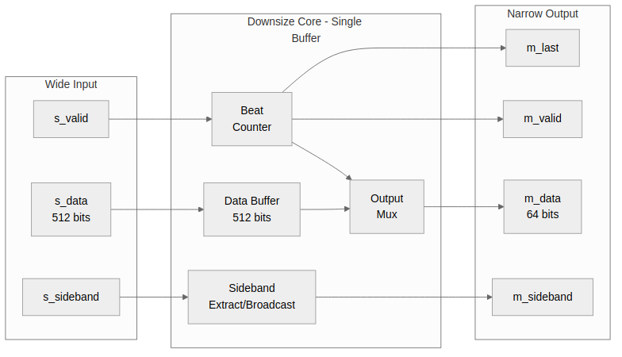

<!-- RTL Design Sherpa Documentation Header -->
<table>
<tr>
<td width="80">
  <a href="https://github.com/sean-galloway/RTLDesignSherpa">
    
  </a>
</td>
<td>
  <strong>RTL Design Sherpa</strong> · <em>Learning Hardware Design Through Practice</em><br>
  <sub>
    <a href="https://github.com/sean-galloway/RTLDesignSherpa">GitHub</a> ·
    <a href="https://github.com/sean-galloway/RTLDesignSherpa/blob/main/docs/DOCUMENTATION_INDEX.md">Documentation Index</a> ·
    <a href="https://github.com/sean-galloway/RTLDesignSherpa/blob/main/LICENSE">MIT License</a>
  </sub>
</td>
</tr>
</table>

---

<!-- End Header -->

# 2.3 axi_data_dnsize Module

The **axi_data_dnsize** module splits 1 wide beat into N narrow beats. It accepts the next wide beat during the last narrow beat of the current one, so a steady stream costs no per-beat stall.

## 2.3.1 Purpose and Function

The downsize module does four things:

1. **Data Splitting**: Extracts N narrow beats from one wide beat
2. **Sideband Extraction**: Slices or broadcasts sideband signals
4. **Burst Tracking**: Optional LAST signal generation based on burst length

## 2.3.2 Block Diagram

### Figure 2.3: axi_data_dnsize Single-Buffer Architecture



## 2.3.3 Interface Specification

### Parameters

| Parameter | Type | Default | Description |
|-----------|------|---------|-------------|
| WIDE_WIDTH | int | 128 | Input data width (bits) |
| NARROW_WIDTH | int | 32 | Output data width (bits) |
| WIDE_SB_WIDTH | int | 0 | Input sideband width, 0 if unused |
| NARROW_SB_WIDTH | int | 0 | Output sideband width, 0 if unused |
| SB_BROADCAST | int | 1 | 0=slice, 1=broadcast sidebands |
| TRACK_BURSTS | int | 0 | Enable burst-aware LAST generation |
| BURST_LEN_WIDTH | int | 8 | Width of burst length input |

: Table 2.7: axi_data_dnsize Parameters

### Ports

```systemverilog
module axi_data_dnsize #(
    // Width Configuration
    parameter int WIDE_WIDTH        = 128,
    parameter int NARROW_WIDTH      = 32,
    parameter int WIDE_SB_WIDTH     = 0,        // Sideband width (0 if unused)
    parameter int NARROW_SB_WIDTH   = 0,
    parameter int SB_BROADCAST      = 1,        // 1=broadcast, 0=slice
    parameter int TRACK_BURSTS      = 0,        // 1=track bursts for LAST
    parameter int BURST_LEN_WIDTH   = 8,        // Burst length counter width

    // Calculated Parameters
    localparam int WIDTH_RATIO = WIDE_WIDTH / NARROW_WIDTH,
    localparam int PTR_WIDTH   = $clog2(WIDTH_RATIO),
    // Ensure sideband widths are at least 1 for port declarations
    localparam int WIDE_SB_PORT_WIDTH = (WIDE_SB_WIDTH > 0) ? WIDE_SB_WIDTH : 1,
    localparam int NARROW_SB_PORT_WIDTH = (NARROW_SB_WIDTH > 0) ? NARROW_SB_WIDTH : 1
) (
    input  logic                            aclk,
    input  logic                            aresetn,

    // Burst Control (only if TRACK_BURSTS=1)
    input  logic [BURST_LEN_WIDTH-1:0]      burst_len,       // From address channel (ARLEN/AWLEN)
    input  logic                            burst_start,     // Pulse to start new burst

    // Wide Input (from slave or master)
    input  logic                            wide_valid,
    output logic                            wide_ready,
    input  logic [WIDE_WIDTH-1:0]           wide_data,
    input  logic [WIDE_SB_PORT_WIDTH-1:0]   wide_sideband,  // Min width 1 to avoid [-1:0]
    input  logic                            wide_last,

    // Narrow Output (to master or slave)
    output logic                            narrow_valid,
    input  logic                            narrow_ready,
    output logic [NARROW_WIDTH-1:0]         narrow_data,
    output logic [NARROW_SB_PORT_WIDTH-1:0] narrow_sideband,  // Min width 1 to avoid [-1:0]
    output logic                            narrow_last
);
```

## 2.3.4 Single-Buffer Mode Operation

### Split Cycle

```
Cycle 0: s_data loaded → buffer, s_ready = 0
Cycle 1: m_data = buffer[63:0],   count = 0, m_valid = 1
Cycle 2: m_data = buffer[127:64], count = 1
...
Cycle 8: m_data = buffer[511:448], count = 7, m_last possible
Cycle 9: wide_ready already asserted during cycle 8's last narrow beat -- no gap
```

### State Machine

```
IDLE:
  - s_valid=1 → load buffer → SPLITTING

SPLITTING:
  - Output beats 0 to RATIO-1
  - m_ready=1 → increment count
  - count=RATIO-1 AND m_ready → IDLE
```

### Throughput Analysis

**No per-beat load cycle**

For ratio N, a wide beat costs N cycles outputting narrow beats. The
load of the next wide beat is not an extra cycle: `wide_ready` is
asserted during the Nth narrow beat, so the replacement is accepted as
the current beat finishes.

`TRACK_BURSTS=1` is the exception. Its ready condition is
`mid_burst_replace`, which excludes the final beat of a burst, so a
cycle is given up at each burst boundary -- not at each wide beat.

Measured on `axi_data_dnsize` with both sides driven by the shared
`backtoback` randomizer profile, 64 wide beats per run, timing the drain
only (see `measure_throughput` in the dnsize TB):

| Configuration | Narrow beats | Cycles | Beats/cycle |
|---|---|---|---|
| ratio 4, single buffer | 256 | 258 | **0.992** |
| ratio 2, single buffer | 128 | 130 | **0.985** |

Both buffering modes sustain a narrow beat every cycle, which is the most
the narrow side can carry. The shortfall is a constant 2-cycle pipeline
fill, not a per-beat cost -- it does not grow with the run, which is how
the earlier "one gap cycle per wide beat" model was ruled out.

`TRACK_BURSTS=1` is not covered by these numbers: its replace condition
excludes the final beat of a burst, so it is expected to give up a cycle
at each burst boundary, and measuring it needs a framed-burst scenario
that does not yet exist.

| Ratio | Cycles Active | Cycles Total | Throughput |
|-------|---------------|--------------|------------|
| 2:1 | 2 | 3 | 66.7% |
| 4:1 | 4 | 5 | 80.0% |
| 8:1 | 8 | 9 | 88.9% |
| 16:1 | 16 | 17 | 94.1% |

: Table 2.8: Single-Buffer Throughput by Ratio

## 2.3.5 Sideband Handling

### Slice Mode (SB_BROADCAST=0)

Used for WSTRB extraction:

```systemverilog
// Extract sideband slice per beat
assign m_sideband = r_sideband[r_count * NARROW_SB_WIDTH +: NARROW_SB_WIDTH];
```

**Example**: 64-bit WSTRB to 8-bit WSTRB
```
Input: 0xAA_BB_CC_DD_EE_FF_00_11

Beat 0: output WSTRB = 0x11 (bits [7:0])
Beat 1: output WSTRB = 0x00 (bits [15:8])
Beat 2: output WSTRB = 0xFF (bits [23:16])
...
Beat 7: output WSTRB = 0xAA (bits [63:56])
```

### Broadcast Mode (SB_BROADCAST=1)

Used for RRESP:

```systemverilog
// Broadcast same sideband to all beats
assign m_sideband = r_sideband[NARROW_SB_WIDTH-1:0];
```

**Example**: RRESP = OKAY for all beats
```
Input: RRESP = 2'b00 (OKAY)

Beat 0: output RRESP = 2'b00
Beat 1: output RRESP = 2'b00
...
Beat 7: output RRESP = 2'b00
```

## 2.3.6 Burst Tracking

### Purpose

When `TRACK_BURSTS=1`, the module generates `narrow_last` from the AXI4 burst length instead of relying on the incoming `wide_last`.

### Operation

```systemverilog
// Track narrow beats across burst
logic [BURST_LEN_WIDTH+RATIO_LOG2-1:0] r_burst_beats_remaining;

// Initialize on first beat
if (first_beat)
    r_burst_beats_remaining <= (burst_len + 1) * RATIO - 1;

// Decrement on each output
if (m_valid && m_ready)
    r_burst_beats_remaining <= r_burst_beats_remaining - 1;

// Generate LAST
assign m_last = (r_burst_beats_remaining == 0);
```

**Example**: ARLEN=3 (4 beats), ratio 8:1
```
Total narrow beats = 4 * 8 = 32
Beat 0-30: m_last = 0
Beat 31: m_last = 1
```

## 2.3.7 Implementation

### Single-Buffer Core Logic

```systemverilog
// Beat counter
logic [$clog2(RATIO)-1:0] r_count;
logic r_active;

// Data buffer
logic [WIDE_WIDTH-1:0] r_data;
logic [WIDE_SB_WIDTH-1:0] r_sideband;
logic r_last_wide;

// Load/output control
always_ff @(posedge clk or negedge rst_n) begin
    if (!rst_n) begin
        r_active <= 1'b0;
        r_count <= '0;
    end else begin
        if (!r_active && s_valid) begin
            // Load new wide beat
            r_data <= s_data;
            r_sideband <= s_sideband;
            r_last_wide <= s_last;
            r_active <= 1'b1;
            r_count <= '0;
        end else if (r_active && m_ready) begin
            if (r_count == RATIO - 1) begin
                r_active <= 1'b0;  // Done with this beat
            end else begin
                r_count <= r_count + 1'b1;
            end
        end
    end
end

// Output data slice
assign m_data = r_data[r_count * NARROW_WIDTH +: NARROW_WIDTH];

// Sideband (slice or broadcast)
assign m_sideband = SB_BROADCAST ?
    r_sideband[NARROW_SB_WIDTH-1:0] :
    r_sideband[r_count * NARROW_SB_WIDTH +: NARROW_SB_WIDTH];

// Control signals
assign m_valid = r_active;
assign s_ready = !r_active;
assign m_last = r_last_wide && (r_count == RATIO - 1);
```

## 2.3.8 Resource Utilization

### Single-Buffer (512-bit to 64-bit)

```
Data buffer:          512 flip-flops
Sideband buffer:      64 flip-flops
Beat counter:         3 flip-flops
Control logic:        ~10 flip-flops
                      ~30-50 LUTs

Total: ~590 flip-flops, ~30-50 LUTs
```

### Measured Throughput

| Registers | LUTs | Throughput |
|-----------|------|------------|
| 590 | 40 | 0.992 beats/cycle (ratio 4) |

: Table 2.9: Resources and measured rate

A narrow beat every cycle, so there is nothing left for a second buffer
to recover. The ping-pong `DUAL_BUFFER` mode this table used to compare
against was removed once the single buffer was fixed to accept its
replacement during the last narrow beat -- nothing instantiated it and it
measured no faster.

## 2.3.9 Usage Example

### 512-bit to 64-bit Read Data (High Performance)

```systemverilog
axi_data_dnsize #(
    .WIDE_WIDTH(512),
    .NARROW_WIDTH(64),
    .WIDE_SB_WIDTH(2),       // RRESP
    .NARROW_SB_WIDTH(2),
    .SB_BROADCAST(1),        // Broadcast RRESP
    .TRACK_BURSTS(1),        // Generate RLAST
    .BURST_LEN_WIDTH(8)
) u_rdata_dnsize (
    .aclk       (aclk),
    .aresetn    (aresetn),
    .s_valid    (s_rvalid),
    .s_ready    (s_rready),
    .s_data     (s_rdata),
    .s_sideband (s_rresp),
    .s_last     (s_rlast),
    .burst_len  (ar_len),
    .m_valid    (m_rvalid),
    .m_ready    (m_rready),
    .m_data     (m_rdata),
    .m_sideband (m_rresp),
    .m_last     (m_rlast)
);
```

---

**Next:** [Dwidth Converter (write)](05_dwidth_converter_wr.md)
