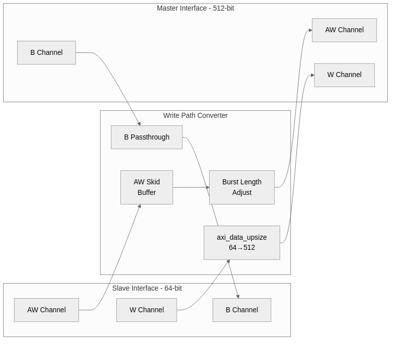

<!-- RTL Design Sherpa Documentation Header -->
<table>
<tr>
<td width="80">
  <a href="https://github.com/sean-galloway/RTLDesignSherpa">
    
  </a>
</td>
<td>
  <strong>RTL Design Sherpa</strong> · <em>Learning Hardware Design Through Practice</em><br>
  <sub>
    <a href="https://github.com/sean-galloway/RTLDesignSherpa">GitHub</a> ·
    <a href="https://github.com/sean-galloway/RTLDesignSherpa/blob/main/docs/DOCUMENTATION_INDEX.md">Documentation Index</a> ·
    <a href="https://github.com/sean-galloway/RTLDesignSherpa/blob/main/LICENSE">MIT License</a>
  </sub>
</td>
</tr>
</table>

---

<!-- End Header -->

# 2.5 axi4_dwidth_converter_wr

The **axi4_dwidth_converter_wr** module provides complete AXI4 write path conversion, handling AW, W, and B channels with burst length adjustment and proper protocol compliance.

## 2.5.1 Purpose and Function

The write converter combines the generic `axi_data_upsize` with AXI4 protocol handling:

1. **Address Channel (AW)**: Passes through with burst length adjustment
2. **Write Data Channel (W)**: Uses `axi_data_upsize` for data packing
3. **Response Channel (B)**: Passes through unchanged
4. **Burst Length Adjustment**: Converts AWLEN based on width ratio

## 2.5.2 Block Diagram

### Figure 2.6: Write Converter Architecture



## 2.5.3 Interface Specification

### Parameters

| Parameter | Type | Default | Description |
|-----------|------|---------|-------------|
| S_DATA_WIDTH | int | 64 | Slave-side (narrow) data width |
| M_DATA_WIDTH | int | 512 | Master-side (wide) data width |
| ADDR_WIDTH | int | 64 | Address width |
| ID_WIDTH | int | 4 | Transaction ID width |
| SKID_DEPTH | int | 2 | Pipeline buffer depth |

: Table 2.14: Write Converter Parameters

### Ports

```systemverilog
module axi4_dwidth_converter_wr #(
    parameter int S_DATA_WIDTH = 64,
    parameter int M_DATA_WIDTH = 512,
    parameter int ADDR_WIDTH   = 64,
    parameter int ID_WIDTH     = 4,
    parameter int SKID_DEPTH   = 2
) (
    input  logic clk,
    input  logic rst_n,

    // Slave interface (narrow, from master)
    input  logic                      s_awvalid,
    output logic                      s_awready,
    input  logic [ADDR_WIDTH-1:0]     s_awaddr,
    input  logic [7:0]                s_awlen,
    input  logic [2:0]                s_awsize,
    input  logic [1:0]                s_awburst,
    input  logic [ID_WIDTH-1:0]       s_awid,
    // ... other AW signals

    input  logic                      s_wvalid,
    output logic                      s_wready,
    input  logic [S_DATA_WIDTH-1:0]   s_wdata,
    input  logic [S_DATA_WIDTH/8-1:0] s_wstrb,
    input  logic                      s_wlast,

    output logic                      s_bvalid,
    input  logic                      s_bready,
    output logic [ID_WIDTH-1:0]       s_bid,
    output logic [1:0]                s_bresp,

    // Master interface (wide, to slave)
    output logic                      m_awvalid,
    input  logic                      m_awready,
    output logic [ADDR_WIDTH-1:0]     m_awaddr,
    output logic [7:0]                m_awlen,
    output logic [2:0]                m_awsize,
    output logic [1:0]                m_awburst,
    output logic [ID_WIDTH-1:0]       m_awid,
    // ... other AW signals

    output logic                      m_wvalid,
    input  logic                      m_wready,
    output logic [M_DATA_WIDTH-1:0]   m_wdata,
    output logic [M_DATA_WIDTH/8-1:0] m_wstrb,
    output logic                      m_wlast,

    input  logic                      m_bvalid,
    output logic                      m_bready,
    input  logic [ID_WIDTH-1:0]       m_bid,
    input  logic [1:0]                m_bresp
);
```

## 2.5.4 Burst Length Conversion

### Ratio Calculation

```systemverilog
localparam int RATIO = M_DATA_WIDTH / S_DATA_WIDTH;
localparam int RATIO_LOG2 = $clog2(RATIO);

// New AWLEN = (original AWLEN + 1) / RATIO - 1
// = (AWLEN + 1) >> RATIO_LOG2 - 1
```

### Examples

| S_DATA | M_DATA | Ratio | S_AWLEN | S_beats | M_AWLEN | M_beats |
|--------|--------|-------|---------|---------|---------|---------|
| 64 | 512 | 8 | 7 | 8 | 0 | 1 |
| 64 | 512 | 8 | 15 | 16 | 1 | 2 |
| 64 | 256 | 4 | 3 | 4 | 0 | 1 |
| 64 | 256 | 4 | 7 | 8 | 1 | 2 |

: Table 2.15: Burst Length Conversion Examples

### Non-Aligned Bursts

When burst length is not a multiple of ratio:

```
S_AWLEN = 5 (6 beats), RATIO = 8
M_AWLEN = 0 (1 beat)

The 6 narrow beats pack into 1 wide beat.
Remaining 2 positions have WSTRB = 0 (no write).
```

## 2.5.5 Address Channel Handling

### AW Passthrough with Adjustment

```systemverilog
// Burst length adjustment
logic [7:0] w_adjusted_awlen;
assign w_adjusted_awlen = ((s_awlen + 1) >> RATIO_LOG2) - 1;

// Size adjustment (wider data = larger size)
logic [2:0] w_adjusted_awsize;
assign w_adjusted_awsize = s_awsize + RATIO_LOG2;

// Address alignment check
logic w_aligned;
assign w_aligned = (s_awaddr[RATIO_LOG2+2:0] == '0);
```

### Skid Buffer for AW

```systemverilog
axi_skid_buffer #(
    .DATA_WIDTH(AW_CHANNEL_WIDTH)
) u_aw_skid (
    .clk     (clk),
    .rst_n   (rst_n),
    .s_valid (s_awvalid),
    .s_ready (s_awready),
    .s_data  ({s_awid, s_awaddr, w_adjusted_awlen, ...}),
    .m_valid (m_awvalid),
    .m_ready (m_awready),
    .m_data  ({m_awid, m_awaddr, m_awlen, ...})
);
```

## 2.5.6 Write Data Channel

### Upsize Instance

```systemverilog
axi_data_upsize #(
    .NARROW_WIDTH(S_DATA_WIDTH),
    .WIDE_WIDTH(M_DATA_WIDTH),
    .NARROW_SB_WIDTH(S_DATA_WIDTH/8),  // WSTRB
    .WIDE_SB_WIDTH(M_DATA_WIDTH/8),
    .SB_OR_MODE(0),                     // Concatenate WSTRB
    .USE_LAST(1)
) u_wdata_upsize (
    .clk        (clk),
    .rst_n      (rst_n),
    .s_valid    (s_wvalid),
    .s_ready    (s_wready),
    .s_data     (s_wdata),
    .s_sideband (s_wstrb),
    .s_last     (s_wlast),
    .m_valid    (m_wvalid),
    .m_ready    (m_wready),
    .m_data     (m_wdata),
    .m_sideband (m_wstrb),
    .m_last     (m_wlast)
);
```

## 2.5.7 Response Channel

### B Channel Passthrough

The response channel passes through unchanged:

```systemverilog
// Simple passthrough (or via skid buffer)
assign s_bvalid = m_bvalid;
assign m_bready = s_bready;
assign s_bid    = m_bid;
assign s_bresp  = m_bresp;
```

### Response Ordering

Responses return in order because:
- Single outstanding transaction per ID
- Upsize doesn't reorder data
- B response generated after all W beats accepted

## 2.5.8 AW/W Synchronization

### Challenge

AXI4 allows AW to arrive before, with, or after W data. The converter must handle all cases:

1. **AW before W**: Normal pipelining
2. **W before AW**: Data buffered until AW arrives
3. **Interleaved**: Multiple transactions in flight

### Solution

Use FIFO for AW information needed by upsize logic:

```systemverilog
// FIFO stores AWLEN for burst tracking
fifo_sync #(.WIDTH(8), .DEPTH(4)) u_aw_info_fifo (
    .clk     (clk),
    .rst_n   (rst_n),
    .wr_en   (s_awvalid && s_awready),
    .wr_data (s_awlen),
    .rd_en   (m_wvalid && m_wready && m_wlast),
    .rd_data (current_awlen),
    .full    (aw_fifo_full),
    .empty   (aw_fifo_empty)
);
```

## 2.5.9 Resource Utilization

### Typical Resources (64→512, ID=4, ADDR=64)

```
AW skid buffer:     ~200 flip-flops
W upsize:           ~600 flip-flops, ~60 LUTs
B skid buffer:      ~20 flip-flops
AW info FIFO:       ~50 flip-flops
Control logic:      ~100 LUTs

Total: ~870 flip-flops, ~160 LUTs
```

## 2.5.10 Timing Characteristics

### Latency

| Path | Latency |
|------|---------|
| AW passthrough | 1-2 cycles (skid) |
| W upsize | N cycles (accumulation) |
| B passthrough | 1 cycle (skid) |

: Table 2.16: Write Converter Latency

### Throughput

- AW channel: 1 transaction/cycle
- W channel: 100% (upsize is 100%)
- B channel: 1 response/cycle

## 2.5.11 Usage Example

```systemverilog
axi4_dwidth_converter_wr #(
    .S_DATA_WIDTH(64),
    .M_DATA_WIDTH(512),
    .ADDR_WIDTH(64),
    .ID_WIDTH(4),
    .SKID_DEPTH(2)
) u_wr_converter (
    .clk     (aclk),
    .rst_n   (aresetn),

    // 64-bit slave interface (from CPU)
    .s_awvalid (cpu_awvalid),
    .s_awready (cpu_awready),
    .s_awaddr  (cpu_awaddr),
    .s_awlen   (cpu_awlen),
    // ... other s_* signals

    // 512-bit master interface (to DDR)
    .m_awvalid (ddr_awvalid),
    .m_awready (ddr_awready),
    .m_awaddr  (ddr_awaddr),
    .m_awlen   (ddr_awlen),
    // ... other m_* signals
);
```

---

**Next:** [axi4_dwidth_converter_rd](06_dwidth_converter_rd.md)
