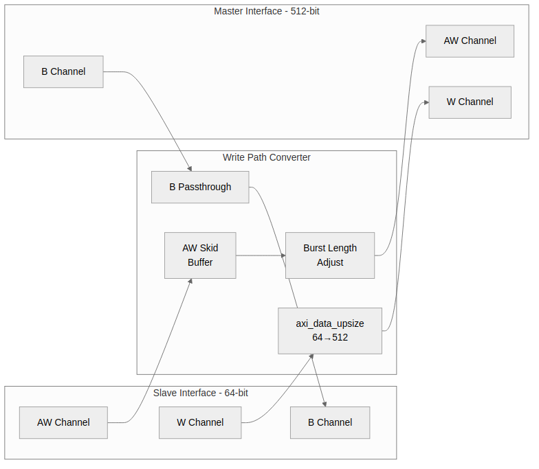

<!-- RTL Design Sherpa Documentation Header -->
<table>
<tr>
<td width="80">
  <a href="https://github.com/sean-galloway/RTLDesignSherpa">
    
  </a>
</td>
<td>
  <strong>RTL Design Sherpa</strong> · <em>Learning Hardware Design Through Practice</em><br>
  <sub>
    <a href="https://github.com/sean-galloway/RTLDesignSherpa">GitHub</a> ·
    <a href="https://github.com/sean-galloway/RTLDesignSherpa/blob/main/docs/DOCUMENTATION_INDEX.md">Documentation Index</a> ·
    <a href="https://github.com/sean-galloway/RTLDesignSherpa/blob/main/LICENSE">MIT License</a>
  </sub>
</td>
</tr>
</table>

---

<!-- End Header -->

# 2.5 axi4_dwidth_converter_wr

The **axi4_dwidth_converter_wr** module is the complete AXI4 write path — AW, W, and B channels with burst length adjustment for the new width.

## 2.5.1 Purpose and Function

The write converter combines the generic `axi_data_upsize` with AXI4 protocol handling:

1. **Address Channel (AW)**: Passes through with burst length adjustment
2. **Write Data Channel (W)**: Uses `axi_data_upsize` for data packing
3. **Response Channel (B)**: Passes through unchanged
4. **Burst Length Adjustment**: Converts AWLEN based on width ratio

## 2.5.2 Block Diagram

### Figure 2.6: Write Converter Architecture



## 2.5.3 Interface Specification

### Parameters

| Parameter | Type | Default | Description |
|-----------|------|---------|-------------|
| S_AXI_DATA_WIDTH | int | 32 | Slave-side data width |
| M_AXI_DATA_WIDTH | int | 128 | Master-side data width |
| AXI_ID_WIDTH | int | 8 | Transaction ID width |
| AXI_ADDR_WIDTH | int | 32 | Address width |
| AXI_USER_WIDTH | int | 1 | User-signal width |
| SKID_DEPTH_AW | int | 2 | AW skid buffer depth |
| SKID_DEPTH_W | int | 4 | W skid buffer depth |
| SKID_DEPTH_B | int | 2 | B skid buffer depth |

: Table 2.14: Write Converter Parameters

### Ports

```systemverilog
module axi4_dwidth_converter_wr #(
    // Width Configuration
    parameter int S_AXI_DATA_WIDTH  = 32,
    parameter int M_AXI_DATA_WIDTH  = 128,
    parameter int AXI_ID_WIDTH      = 8,
    parameter int AXI_ADDR_WIDTH    = 32,
    parameter int AXI_USER_WIDTH    = 1,

    // Skid Buffer Depths (for timing closure)
    parameter int SKID_DEPTH_AW     = 2,
    parameter int SKID_DEPTH_W      = 4,
    parameter int SKID_DEPTH_B      = 2,

    // Calculated Parameters
    localparam int S_STRB_WIDTH = S_AXI_DATA_WIDTH / 8,
    localparam int M_STRB_WIDTH = M_AXI_DATA_WIDTH / 8,
    localparam int WIDTH_RATIO  = (S_AXI_DATA_WIDTH < M_AXI_DATA_WIDTH) ?
                                  (M_AXI_DATA_WIDTH / S_AXI_DATA_WIDTH) :
                                  (S_AXI_DATA_WIDTH / M_AXI_DATA_WIDTH),
    localparam bit UPSIZE       = (S_AXI_DATA_WIDTH < M_AXI_DATA_WIDTH) ? 1'b1 : 1'b0,
    localparam bit DOWNSIZE     = (S_AXI_DATA_WIDTH > M_AXI_DATA_WIDTH) ? 1'b1 : 1'b0,

    // Skid buffer packed widths
    localparam int AW_WIDTH = AXI_ID_WIDTH + AXI_ADDR_WIDTH + 8 + 3 + 2 + 1 + 4 + 3 + 4 + 4 + AXI_USER_WIDTH,
    localparam int W_WIDTH  = S_AXI_DATA_WIDTH + S_STRB_WIDTH + 1 + AXI_USER_WIDTH,
    localparam int B_WIDTH  = AXI_ID_WIDTH + 2 + AXI_USER_WIDTH
) (
    // Clock and Reset
    input  logic                        aclk,
    input  logic                        aresetn,

    //==========================================================================
    // Slave AXI Write Interface
    //==========================================================================

    // Write Address Channel
    input  logic [AXI_ID_WIDTH-1:0]     s_axi_awid,
    input  logic [AXI_ADDR_WIDTH-1:0]   s_axi_awaddr,
    input  logic [7:0]                  s_axi_awlen,
    input  logic [2:0]                  s_axi_awsize,
    input  logic [1:0]                  s_axi_awburst,
    input  logic                        s_axi_awlock,
    input  logic [3:0]                  s_axi_awcache,
    input  logic [2:0]                  s_axi_awprot,
    input  logic [3:0]                  s_axi_awqos,
    input  logic [3:0]                  s_axi_awregion,
    input  logic [AXI_USER_WIDTH-1:0]   s_axi_awuser,
    input  logic                        s_axi_awvalid,
    output logic                        s_axi_awready,

    // Write Data Channel
    input  logic [S_AXI_DATA_WIDTH-1:0] s_axi_wdata,
    input  logic [S_STRB_WIDTH-1:0]     s_axi_wstrb,
    input  logic                        s_axi_wlast,
    input  logic [AXI_USER_WIDTH-1:0]   s_axi_wuser,
    input  logic                        s_axi_wvalid,
    output logic                        s_axi_wready,

    // Write Response Channel
    output logic [AXI_ID_WIDTH-1:0]     s_axi_bid,
    output logic [1:0]                  s_axi_bresp,
    output logic [AXI_USER_WIDTH-1:0]   s_axi_buser,
    output logic                        s_axi_bvalid,
    input  logic                        s_axi_bready,

    //==========================================================================
    // Master AXI Write Interface
    //==========================================================================

    // Write Address Channel
    output logic [AXI_ID_WIDTH-1:0]     m_axi_awid,
    output logic [AXI_ADDR_WIDTH-1:0]   m_axi_awaddr,
    output logic [7:0]                  m_axi_awlen,
    output logic [2:0]                  m_axi_awsize,
    output logic [1:0]                  m_axi_awburst,
    output logic                        m_axi_awlock,
    output logic [3:0]                  m_axi_awcache,
    output logic [2:0]                  m_axi_awprot,
    output logic [3:0]                  m_axi_awqos,
    output logic [3:0]                  m_axi_awregion,
    output logic [AXI_USER_WIDTH-1:0]   m_axi_awuser,
    output logic                        m_axi_awvalid,
    input  logic                        m_axi_awready,

    // Write Data Channel
    output logic [M_AXI_DATA_WIDTH-1:0] m_axi_wdata,
    output logic [M_STRB_WIDTH-1:0]     m_axi_wstrb,
    output logic                        m_axi_wlast,
    output logic [AXI_USER_WIDTH-1:0]   m_axi_wuser,
    output logic                        m_axi_wvalid,
    input  logic                        m_axi_wready,

    // Write Response Channel
    input  logic [AXI_ID_WIDTH-1:0]     m_axi_bid,
    input  logic [1:0]                  m_axi_bresp,
    input  logic [AXI_USER_WIDTH-1:0]   m_axi_buser,
    input  logic                        m_axi_bvalid,
    output logic                        m_axi_bready
);
```

## 2.5.4 Burst Length Conversion

### Ratio Calculation

```systemverilog
localparam int RATIO = M_AXI_DATA_WIDTH / S_AXI_DATA_WIDTH;
localparam int RATIO_LOG2 = $clog2(RATIO);

// New AWLEN = (original AWLEN + 1) / RATIO - 1
// = (AWLEN + 1) >> RATIO_LOG2 - 1
```

### Examples

| S_DATA | M_DATA | Ratio | S_AWLEN | S_beats | M_AWLEN | M_beats |
|--------|--------|-------|---------|---------|---------|---------|
| 64 | 512 | 8 | 7 | 8 | 0 | 1 |
| 64 | 512 | 8 | 15 | 16 | 1 | 2 |
| 64 | 256 | 4 | 3 | 4 | 0 | 1 |
| 64 | 256 | 4 | 7 | 8 | 1 | 2 |

: Table 2.15: Burst Length Conversion Examples

### Non-Aligned Bursts

When the burst length is not a multiple of the ratio:

```
S_AWLEN = 5 (6 beats), RATIO = 8
M_AWLEN = 0 (1 beat)

The 6 narrow beats pack into 1 wide beat.
Remaining 2 positions have WSTRB = 0 (no write).
```

## 2.5.5 Address Channel Handling

### AW Passthrough with Adjustment

The rewrite differs by direction, so the RTL has two generate branches.

**Narrow -> wide (upsize).** Beats combine, so the count divides -- and it
must round UP, because a burst that is not a whole multiple of the ratio
still needs a final partial wide beat:

```systemverilog
assign m_axi_awlen = ((int_awlen + 8'(WIDTH_RATIO)) / 8'(WIDTH_RATIO)) - 8'd1;
```

**Wide -> narrow (downsize).** Each wide beat becomes RATIO narrow ones:

```systemverilog
assign m_axi_awlen = ((int_awlen + 8'd1) * 8'(WIDTH_RATIO)) - 8'd1;
```

Rounding up is the whole point of the `+ WIDTH_RATIO` term. A floor
divide underflows: AWLEN=5 (6 beats) at RATIO=8 gives `(6 >> 3) - 1`,
which is -1 -- 8'hFF, a 256-beat burst -- where the correct answer is 0,
one wide beat.

**Size** is not derived from the incoming AWSIZE. Both branches drive the
master side at its own full width:

```systemverilog
assign m_axi_awsize = MASTER_SIZE[2:0];
```

This converter performs no address-alignment check; the read converter
aligns the address it issues (see 2.6.5).

### Skid Buffer for AW

```systemverilog
axi_skid_buffer #(
    .DATA_WIDTH(AW_CHANNEL_WIDTH)
) u_aw_skid (
    .clk     (clk),
    .rst_n   (rst_n),
    .s_valid (s_awvalid),
    .s_ready (s_awready),
    .s_data  ({s_awid, s_awaddr, w_adjusted_awlen, ...}),
    .m_valid (m_awvalid),
    .m_ready (m_awready),
    .m_data  ({m_awid, m_awaddr, m_awlen, ...})
);
```

## 2.5.6 Write Data Channel

### Upsize Instance

```systemverilog
axi_data_upsize #(
    .NARROW_WIDTH    (S_AXI_DATA_WIDTH),
    .WIDE_WIDTH      (M_AXI_DATA_WIDTH),
    .NARROW_SB_WIDTH (S_STRB_WIDTH),   // WSTRB
    .WIDE_SB_WIDTH   (M_STRB_WIDTH),
    .SB_OR_MODE      (0)               // Concatenate WSTRB
) u_w_upsize (
    .clk        (clk),
    .rst_n      (rst_n),
    .s_valid    (s_wvalid),
    .s_ready    (s_wready),
    .s_data     (s_wdata),
    .s_sideband (s_wstrb),
    .s_last     (s_wlast),
    .m_valid    (m_wvalid),
    .m_ready    (m_wready),
    .m_data     (m_wdata),
    .m_sideband (m_wstrb),
    .m_last     (m_wlast)
);
```

## 2.5.7 Response Channel

### B Channel Passthrough

The response channel passes through unchanged:

```systemverilog
// Simple passthrough (or via skid buffer)
assign s_bvalid = m_bvalid;
assign m_bready = s_bready;
assign s_bid    = m_bid;
assign s_bresp  = m_bresp;
```

### Response Ordering

Responses return in order because:
- Single outstanding transaction per ID
- Upsize doesn't reorder data
- B response generated after all W beats accepted

## 2.5.8 AW/W Synchronization

### Challenge

AXI4 allows AW to arrive before, with, or after W data. The converter must handle all cases:

1. **AW before W**: Normal pipelining
2. **W before AW**: Data buffered until AW arrives
3. **Interleaved**: Multiple transactions in flight

### Solution

The write converter carries no AW information queue. AW is handled on the
channel itself and the upsize block frames its output from the beats it
is given, so there is nothing to stash between the address and its data.

Compare the read converter, which does need one: its downsize block has
no length queue of its own, so overlapping read bursts would lose their
framing without an external ARLEN queue.

## 2.5.9 Resource Utilization

### Typical Resources (64→512, ID=4, ADDR=64)

```
AW skid buffer:     ~200 flip-flops
W upsize:           ~600 flip-flops, ~60 LUTs
B skid buffer:      ~20 flip-flops
Control logic:      ~100 LUTs

Total: ~820 flip-flops, ~160 LUTs

Hand estimates, not synthesis results. There is no AW information FIFO
in this converter.
```

## 2.5.10 Timing Characteristics

### Latency

| Path | Latency |
|------|---------|
| AW passthrough | 1-2 cycles (skid) |
| W upsize | N cycles (accumulation) |
| B passthrough | 1 cycle (skid) |

: Table 2.16: Write Converter Latency

### Throughput

- AW channel: 1 transaction/cycle
- W channel: 100% (upsize is 100%)
- B channel: 1 response/cycle

## 2.5.11 Usage Example

```systemverilog
axi4_dwidth_converter_wr #(
    .S_AXI_DATA_WIDTH(32),
    .M_AXI_DATA_WIDTH(128),
    .ADDR_WIDTH(64),
    .ID_WIDTH(4),
    .SKID_DEPTH(2)
) u_wr_converter (
    .clk     (aclk),
    .rst_n   (aresetn),

    // 64-bit slave interface (from CPU)
    .s_awvalid (cpu_awvalid),
    .s_awready (cpu_awready),
    .s_awaddr  (cpu_awaddr),
    .s_awlen   (cpu_awlen),
    // ... other s_* signals

    // 512-bit master interface (to DDR)
    .m_awvalid (ddr_awvalid),
    .m_awready (ddr_awready),
    .m_awaddr  (ddr_awaddr),
    .m_awlen   (ddr_awlen),
    // ... other m_* signals
);
```

---

**Next:** [axi4_dwidth_converter_rd](06_dwidth_converter_rd.md)
