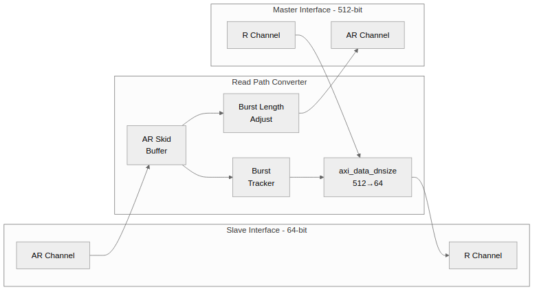

<!-- RTL Design Sherpa Documentation Header -->
<table>
<tr>
<td width="80">
  <a href="https://github.com/sean-galloway/RTLDesignSherpa">
    
  </a>
</td>
<td>
  <strong>RTL Design Sherpa</strong> · <em>Learning Hardware Design Through Practice</em><br>
  <sub>
    <a href="https://github.com/sean-galloway/RTLDesignSherpa">GitHub</a> ·
    <a href="https://github.com/sean-galloway/RTLDesignSherpa/blob/main/docs/DOCUMENTATION_INDEX.md">Documentation Index</a> ·
    <a href="https://github.com/sean-galloway/RTLDesignSherpa/blob/main/LICENSE">MIT License</a>
  </sub>
</td>
</tr>
</table>

---

<!-- End Header -->

# 2.6 axi4_dwidth_converter_rd

The **axi4_dwidth_converter_rd** module provides complete AXI4 read path conversion, handling AR and R channels with burst length adjustment and burst-aware RLAST generation.

## 2.6.1 Purpose and Function

The read converter combines the generic `axi_data_dnsize` with AXI4 protocol handling:

1. **Address Channel (AR)**: Passes through with burst length adjustment
2. **Read Data Channel (R)**: Uses `axi_data_dnsize` for data splitting
3. **Burst Tracking**: Generates correct RLAST based on original ARLEN
4. **Response Broadcasting**: Propagates RRESP to all narrow beats

## 2.6.2 Block Diagram

### Figure 2.7: Read Converter Architecture



## 2.6.3 Interface Specification

### Parameters

| Parameter | Type | Default | Description |
|-----------|------|---------|-------------|
| S_DATA_WIDTH | int | 64 | Slave-side (narrow) data width |
| M_DATA_WIDTH | int | 512 | Master-side (wide) data width |
| ADDR_WIDTH | int | 64 | Address width |
| ID_WIDTH | int | 4 | Transaction ID width |
| DUAL_BUFFER | bit | 1 | Enable dual-buffer for 100% throughput |
| SKID_DEPTH | int | 2 | Pipeline buffer depth |

: Table 2.17: Read Converter Parameters

### Ports

```systemverilog
module axi4_dwidth_converter_rd #(
    parameter int S_DATA_WIDTH = 64,
    parameter int M_DATA_WIDTH = 512,
    parameter int ADDR_WIDTH   = 64,
    parameter int ID_WIDTH     = 4,
    parameter bit DUAL_BUFFER  = 1,
    parameter int SKID_DEPTH   = 2
) (
    input  logic clk,
    input  logic rst_n,

    // Slave interface (narrow, to master)
    input  logic                      s_arvalid,
    output logic                      s_arready,
    input  logic [ADDR_WIDTH-1:0]     s_araddr,
    input  logic [7:0]                s_arlen,
    input  logic [2:0]                s_arsize,
    input  logic [1:0]                s_arburst,
    input  logic [ID_WIDTH-1:0]       s_arid,

    output logic                      s_rvalid,
    input  logic                      s_rready,
    output logic [S_DATA_WIDTH-1:0]   s_rdata,
    output logic [ID_WIDTH-1:0]       s_rid,
    output logic [1:0]                s_rresp,
    output logic                      s_rlast,

    // Master interface (wide, from slave)
    output logic                      m_arvalid,
    input  logic                      m_arready,
    output logic [ADDR_WIDTH-1:0]     m_araddr,
    output logic [7:0]                m_arlen,
    output logic [2:0]                m_arsize,
    output logic [1:0]                m_arburst,
    output logic [ID_WIDTH-1:0]       m_arid,

    input  logic                      m_rvalid,
    output logic                      m_rready,
    input  logic [M_DATA_WIDTH-1:0]   m_rdata,
    input  logic [ID_WIDTH-1:0]       m_rid,
    input  logic [1:0]                m_rresp,
    input  logic                      m_rlast
);
```

## 2.6.4 Burst Length Conversion

### Ratio Calculation

Same as write converter:

```systemverilog
localparam int RATIO = M_DATA_WIDTH / S_DATA_WIDTH;
localparam int RATIO_LOG2 = $clog2(RATIO);

// New ARLEN = (original ARLEN + 1) / RATIO - 1
```

### Examples

| S_DATA | M_DATA | Ratio | S_ARLEN | S_beats | M_ARLEN | M_beats |
|--------|--------|-------|---------|---------|---------|---------|
| 64 | 512 | 8 | 7 | 8 | 0 | 1 |
| 64 | 512 | 8 | 15 | 16 | 1 | 2 |
| 64 | 512 | 8 | 31 | 32 | 3 | 4 |

: Table 2.18: Read Burst Length Conversion

## 2.6.5 Address Channel Handling

### AR Passthrough with Adjustment

```systemverilog
// Burst length adjustment
logic [7:0] w_adjusted_arlen;
assign w_adjusted_arlen = ((s_arlen + 1) >> RATIO_LOG2) - 1;

// Size adjustment
logic [2:0] w_adjusted_arsize;
assign w_adjusted_arsize = s_arsize + RATIO_LOG2;
```

### AR Information FIFO

Store original ARLEN for RLAST generation:

```systemverilog
// FIFO to track original burst length
fifo_sync #(.WIDTH(8+ID_WIDTH), .DEPTH(4)) u_ar_info_fifo (
    .clk     (clk),
    .rst_n   (rst_n),
    .wr_en   (s_arvalid && s_arready),
    .wr_data ({s_arid, s_arlen}),
    .rd_en   (s_rvalid && s_rready && s_rlast),
    .rd_data ({current_arid, current_arlen}),
    .full    (ar_fifo_full),
    .empty   (ar_fifo_empty)
);
```

## 2.6.6 Read Data Channel

### Downsize Instance

```systemverilog
axi_data_dnsize #(
    .WIDE_WIDTH(M_DATA_WIDTH),
    .NARROW_WIDTH(S_DATA_WIDTH),
    .WIDE_SB_WIDTH(2),          // RRESP
    .NARROW_SB_WIDTH(2),
    .SB_BROADCAST(1),           // Broadcast RRESP
    .DUAL_BUFFER(DUAL_BUFFER),
    .USE_BURST_TRACKER(1),
    .BURST_LEN_WIDTH(8)
) u_rdata_dnsize (
    .clk        (clk),
    .rst_n      (rst_n),
    .s_valid    (m_rvalid),
    .s_ready    (m_rready),
    .s_data     (m_rdata),
    .s_sideband (m_rresp),
    .s_last     (m_rlast),
    .burst_len  (current_arlen),
    .m_valid    (s_rvalid),
    .m_ready    (s_rready),
    .m_data     (s_rdata),
    .m_sideband (s_rresp),
    .m_last     (s_rlast)
);
```

## 2.6.7 RLAST Generation

### Challenge

The wide interface generates RLAST based on M_ARLEN, but the narrow interface needs RLAST based on S_ARLEN:

```
Wide RLAST: Asserted on beat (M_ARLEN + 1)
Narrow RLAST: Asserted on beat (S_ARLEN + 1) = (M_ARLEN + 1) * RATIO
```

### Solution: Burst Tracker

```systemverilog
// Track narrow beats within burst
logic [15:0] r_beat_count;
logic [7:0]  r_total_narrow_beats;

always_ff @(posedge clk or negedge rst_n) begin
    if (!rst_n) begin
        r_beat_count <= '0;
        r_total_narrow_beats <= '0;
    end else begin
        if (new_burst_start) begin
            r_beat_count <= '0;
            r_total_narrow_beats <= (current_arlen + 1) * RATIO - 1;
        end else if (s_rvalid && s_rready) begin
            r_beat_count <= r_beat_count + 1;
        end
    end
end

assign s_rlast = (r_beat_count == r_total_narrow_beats);
```

## 2.6.8 RID Handling

### ID Passthrough

RID passes through unchanged:

```systemverilog
// RID from wide interface propagates to all narrow beats
assign s_rid = m_rid;

// Or use tracked ID from FIFO
assign s_rid = current_arid;
```

## 2.6.9 Dual-Buffer Impact

### Performance Comparison

| Mode | Throughput | Latency | Resources |
|------|------------|---------|-----------|
| Single | 80-90% | 1 cycle | 1x |
| Dual | 100% | 1 cycle | 2x |

: Table 2.19: Read Converter Performance

### When to Use Dual Buffer

**Use dual buffer for:**
- DDR read paths with high bandwidth
- Streaming read applications
- DMA read operations

**Use single buffer for:**
- Control register reads
- Low-bandwidth paths
- Area-constrained designs

## 2.6.10 Resource Utilization

### Typical Resources (512→64, ID=4, Dual Buffer)

```
AR skid buffer:     ~150 flip-flops
R downsize (dual):  ~1200 flip-flops, ~100 LUTs
AR info FIFO:       ~100 flip-flops
Burst tracker:      ~30 flip-flops, ~20 LUTs
Control logic:      ~80 LUTs

Total: ~1480 flip-flops, ~200 LUTs
```

### Single Buffer Version

```
R downsize (single): ~600 flip-flops, ~50 LUTs

Total: ~880 flip-flops, ~120 LUTs
```

## 2.6.11 Timing Characteristics

### Latency

| Path | Latency |
|------|---------|
| AR passthrough | 1-2 cycles (skid) |
| First R beat | 1 cycle (load buffer) |
| Subsequent R beats | 1 beat/cycle |

: Table 2.20: Read Converter Latency

### Throughput

- AR channel: 1 transaction/cycle
- R channel: 80% (single) or 100% (dual)

## 2.6.12 Usage Example

```systemverilog
axi4_dwidth_converter_rd #(
    .S_DATA_WIDTH(64),
    .M_DATA_WIDTH(512),
    .ADDR_WIDTH(64),
    .ID_WIDTH(4),
    .DUAL_BUFFER(1),      // High-performance mode
    .SKID_DEPTH(2)
) u_rd_converter (
    .clk     (aclk),
    .rst_n   (aresetn),

    // 64-bit slave interface (to CPU)
    .s_arvalid (cpu_arvalid),
    .s_arready (cpu_arready),
    .s_araddr  (cpu_araddr),
    .s_arlen   (cpu_arlen),
    .s_rvalid  (cpu_rvalid),
    .s_rready  (cpu_rready),
    .s_rdata   (cpu_rdata),
    // ... other s_* signals

    // 512-bit master interface (from DDR)
    .m_arvalid (ddr_arvalid),
    .m_arready (ddr_arready),
    .m_araddr  (ddr_araddr),
    .m_arlen   (ddr_arlen),
    .m_rvalid  (ddr_rvalid),
    .m_rready  (ddr_rready),
    .m_rdata   (ddr_rdata),
    // ... other m_* signals
);
```

---

**Next:** [Chapter 3: Protocol Converter Blocks](../ch03_protocol_blocks/01_overview.md)
