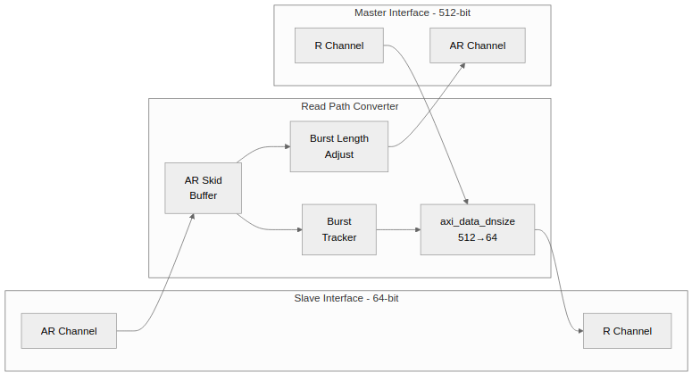

<!-- RTL Design Sherpa Documentation Header -->
<table>
<tr>
<td width="80">
  <a href="https://github.com/sean-galloway/RTLDesignSherpa">
    
  </a>
</td>
<td>
  <strong>RTL Design Sherpa</strong> · <em>Learning Hardware Design Through Practice</em><br>
  <sub>
    <a href="https://github.com/sean-galloway/RTLDesignSherpa">GitHub</a> ·
    <a href="https://github.com/sean-galloway/RTLDesignSherpa/blob/main/docs/DOCUMENTATION_INDEX.md">Documentation Index</a> ·
    <a href="https://github.com/sean-galloway/RTLDesignSherpa/blob/main/LICENSE">MIT License</a>
  </sub>
</td>
</tr>
</table>

---

<!-- End Header -->

# 2.6 axi4_dwidth_converter_rd

The **axi4_dwidth_converter_rd** module is the complete AXI4 read path — AR and R channels with burst length adjustment and burst-aware RLAST generation.

## 2.6.1 Purpose and Function

The read converter combines the generic `axi_data_dnsize` with AXI4 protocol handling:

1. **Address Channel (AR)**: Passes through with burst length adjustment
2. **Read Data Channel (R)**: Uses `axi_data_dnsize` for data splitting
3. **Burst Tracking**: Generates correct RLAST based on original ARLEN
4. **Response Broadcasting**: Propagates RRESP to all narrow beats

## 2.6.2 Block Diagram

### Figure 2.7: Read Converter Architecture



## 2.6.3 Interface Specification

### Parameters

| Parameter | Type | Default | Description |
|-----------|------|---------|-------------|
| S_AXI_DATA_WIDTH | int | 32 | Slave-side data width |
| M_AXI_DATA_WIDTH | int | 128 | Master-side data width |
| AXI_ID_WIDTH | int | 8 | Transaction ID width |
| AXI_ADDR_WIDTH | int | 32 | Address width |
| AXI_USER_WIDTH | int | 1 | User-signal width |
| SKID_DEPTH_AR | int | 2 | AR skid buffer depth |
| SKID_DEPTH_R | int | 4 | R skid buffer depth |

: Table 2.17: Read Converter Parameters

### Ports

```systemverilog
module axi4_dwidth_converter_rd #(
    // Width Configuration
    parameter int S_AXI_DATA_WIDTH  = 32,
    parameter int M_AXI_DATA_WIDTH  = 128,
    parameter int AXI_ID_WIDTH      = 8,
    parameter int AXI_ADDR_WIDTH    = 32,
    parameter int AXI_USER_WIDTH    = 1,

    // Skid Buffer Depths (for timing closure)
    parameter int SKID_DEPTH_AR     = 2,
    parameter int SKID_DEPTH_R      = 4,

    // Calculated Parameters
    localparam int S_STRB_WIDTH = S_AXI_DATA_WIDTH / 8,
    localparam int M_STRB_WIDTH = M_AXI_DATA_WIDTH / 8,
    localparam int WIDTH_RATIO  = (S_AXI_DATA_WIDTH < M_AXI_DATA_WIDTH) ?
                                  (M_AXI_DATA_WIDTH / S_AXI_DATA_WIDTH) :
                                  (S_AXI_DATA_WIDTH / M_AXI_DATA_WIDTH),
    localparam bit UPSIZE       = (S_AXI_DATA_WIDTH < M_AXI_DATA_WIDTH) ? 1'b1 : 1'b0,
    localparam bit DOWNSIZE     = (S_AXI_DATA_WIDTH > M_AXI_DATA_WIDTH) ? 1'b1 : 1'b0,

    // Skid buffer packed widths
    localparam int AR_WIDTH = AXI_ID_WIDTH + AXI_ADDR_WIDTH + 8 + 3 + 2 + 1 + 4 + 3 + 4 + 4 + AXI_USER_WIDTH,
    localparam int R_WIDTH  = S_AXI_DATA_WIDTH + 2 + AXI_USER_WIDTH + 1 + AXI_ID_WIDTH
) (
    // Clock and Reset
    input  logic                        aclk,
    input  logic                        aresetn,

    //==========================================================================
    // Slave AXI Read Interface
    //==========================================================================

    // Read Address Channel
    input  logic [AXI_ID_WIDTH-1:0]     s_axi_arid,
    input  logic [AXI_ADDR_WIDTH-1:0]   s_axi_araddr,
    input  logic [7:0]                  s_axi_arlen,
    input  logic [2:0]                  s_axi_arsize,
    input  logic [1:0]                  s_axi_arburst,
    input  logic                        s_axi_arlock,
    input  logic [3:0]                  s_axi_arcache,
    input  logic [2:0]                  s_axi_arprot,
    input  logic [3:0]                  s_axi_arqos,
    input  logic [3:0]                  s_axi_arregion,
    input  logic [AXI_USER_WIDTH-1:0]   s_axi_aruser,
    input  logic                        s_axi_arvalid,
    output logic                        s_axi_arready,

    // Read Data Channel
    output logic [AXI_ID_WIDTH-1:0]     s_axi_rid,
    output logic [S_AXI_DATA_WIDTH-1:0] s_axi_rdata,
    output logic [1:0]                  s_axi_rresp,
    output logic                        s_axi_rlast,
    output logic [AXI_USER_WIDTH-1:0]   s_axi_ruser,
    output logic                        s_axi_rvalid,
    input  logic                        s_axi_rready,

    //==========================================================================
    // Master AXI Read Interface
    //==========================================================================

    // Read Address Channel
    output logic [AXI_ID_WIDTH-1:0]     m_axi_arid,
    output logic [AXI_ADDR_WIDTH-1:0]   m_axi_araddr,
    output logic [7:0]                  m_axi_arlen,
    output logic [2:0]                  m_axi_arsize,
    output logic [1:0]                  m_axi_arburst,
    output logic                        m_axi_arlock,
    output logic [3:0]                  m_axi_arcache,
    output logic [2:0]                  m_axi_arprot,
    output logic [3:0]                  m_axi_arqos,
    output logic [3:0]                  m_axi_arregion,
    output logic [AXI_USER_WIDTH-1:0]   m_axi_aruser,
    output logic                        m_axi_arvalid,
    input  logic                        m_axi_arready,

    // Read Data Channel
    input  logic [AXI_ID_WIDTH-1:0]     m_axi_rid,
    input  logic [M_AXI_DATA_WIDTH-1:0] m_axi_rdata,
    input  logic [1:0]                  m_axi_rresp,
    input  logic                        m_axi_rlast,
    input  logic [AXI_USER_WIDTH-1:0]   m_axi_ruser,
    input  logic                        m_axi_rvalid,
    output logic                        m_axi_rready
);
```

## 2.6.4 Burst Length Conversion

### Ratio Calculation

Same as write converter:

```systemverilog
localparam int RATIO = M_AXI_DATA_WIDTH / S_AXI_DATA_WIDTH;
localparam int RATIO_LOG2 = $clog2(RATIO);

// New ARLEN = (original ARLEN + 1) / RATIO - 1
```

### Examples

| S_DATA | M_DATA | Ratio | S_ARLEN | S_beats | M_ARLEN | M_beats |
|--------|--------|-------|---------|---------|---------|---------|
| 64 | 512 | 8 | 7 | 8 | 0 | 1 |
| 64 | 512 | 8 | 15 | 16 | 1 | 2 |
| 64 | 512 | 8 | 31 | 32 | 3 | 4 |

: Table 2.18: Read Burst Length Conversion

## 2.6.5 Address Channel Handling

### AR Passthrough with Adjustment

Same two directions as the write converter (see 2.5.4 for why the upsize
divide rounds up):

```systemverilog
// narrow -> wide (upsize): beats combine, round up
assign m_axi_arlen  = ((int_arlen + 8'(WIDTH_RATIO)) / 8'(WIDTH_RATIO)) - 8'd1;

// wide -> narrow (downsize): each wide beat becomes RATIO narrow beats,
// and the product can exceed both AWLEN's 8 bits and the 256-beat legal
// maximum -- so one slave burst is SPLIT into master bursts of <= 256
// beats (same mechanism as the write converter, see 2.5.5)
assign m_axi_arlen  = 8'(w_this_beats - 9'd1);  // min(remaining, 256)

// size is the master's own full width, not a shift of ARSIZE
assign m_axi_arsize = MASTER_SIZE[2:0];
```

For a split read the slave must still see ONE burst: each master burst
returns its own RLAST, and every one except the final master burst's is
masked out of the upsize, whose accumulation simply continues across the
boundary. The masking is safe by construction -- 256 narrow beats is a
whole number of wide beats at every ratio, so a masked boundary can never
land mid-accumulation. A one-bit flag queue, pushed per issued AR and
popped per master RLAST, says which burst is final.

On the downsize path the issued address is aligned down to the master
data width, since a wide access cannot start mid-word:

```systemverilog
localparam int ALIGN_BITS = $clog2(M_STRB_WIDTH);
assign aligned_araddr = {int_araddr[AXI_ADDR_WIDTH-1:ALIGN_BITS],
                         {ALIGN_BITS{1'b0}}};
assign m_axi_araddr   = aligned_araddr;
```

### Burst-Length FIFO

Only the wide->narrow (downsize) read path needs one. The downsize block
ignores a `burst_start` pulse while a burst is active and keeps no length
queue of its own, so framing only the first burst would collapse N read
bursts into one -- bursts 2..N would drain with `narrow_last` never
asserting. A small queue holds one narrow ARLEN per outstanding burst:
its head feeds the downsize, and it pops as each narrow burst completes,
so every burst is framed however they overlap.

It is an inline circular buffer rather than a `fifo_sync` instance,
deliberately: this converter is widely instantiated and a submodule here
would add a filelist dependency to every consumer. It stores the length
alone -- ID is carried on the AXI channels, not through this queue -- and
AR is back-pressured when full, so it cannot overflow.

```systemverilog
            localparam int BLEN_FIFO_DEPTH = 16;
            localparam int BLEN_AW         = $clog2(BLEN_FIFO_DEPTH);

            logic [7:0]         blen_mem [BLEN_FIFO_DEPTH];
            logic [BLEN_AW:0]   blen_wptr, blen_rptr;   // extra MSB for full/empty
            logic               w_blen_push, w_blen_pop;

            // AR accepted -> enqueue its narrow length. A slave-side (narrow)
            // burst completes on its last-beat handshake -> dequeue.
            assign w_blen_push = int_ar_valid && int_ar_ready;
            assign w_blen_pop  = int_r_valid && int_r_ready && int_rlast;
```

The narrow->wide (upsize) direction needs no such queue; see the
generate branch in the RTL.

## 2.6.6 Read Data Channel

### Downsize Instance

```systemverilog
axi_data_dnsize #(
    .WIDE_WIDTH      (M_AXI_DATA_WIDTH),
    .NARROW_WIDTH    (S_AXI_DATA_WIDTH),
    .WIDE_SB_WIDTH   (2),          // RRESP
    .NARROW_SB_WIDTH (2),
    .SB_BROADCAST    (1),          // Broadcast RRESP
    .TRACK_BURSTS    (1),
    .BURST_LEN_WIDTH (8),
) u_r_dnsize (
    .clk        (clk),
    .rst_n      (rst_n),
    .s_valid    (m_rvalid),
    .s_ready    (m_rready),
    .s_data     (m_rdata),
    .s_sideband (m_rresp),
    .s_last     (m_rlast),
    .burst_len  (current_arlen),
    .m_valid    (s_rvalid),
    .m_ready    (s_rready),
    .m_data     (s_rdata),
    .m_sideband (s_rresp),
    .m_last     (s_rlast)
);
```

## 2.6.7 RLAST Generation

### Challenge

The wide interface generates RLAST based on M_ARLEN, but the narrow interface needs RLAST based on S_ARLEN:

```
Wide RLAST: Asserted on beat (M_ARLEN + 1)
Narrow RLAST: Asserted on beat (S_ARLEN + 1) = (M_ARLEN + 1) * RATIO
```

### Solution: Burst Tracker

```systemverilog
// Track narrow beats within burst
logic [15:0] r_beat_count;
logic [7:0]  r_total_narrow_beats;

always_ff @(posedge clk or negedge rst_n) begin
    if (!rst_n) begin
        r_beat_count <= '0;
        r_total_narrow_beats <= '0;
    end else begin
        if (new_burst_start) begin
            r_beat_count <= '0;
            r_total_narrow_beats <= (current_arlen + 1) * RATIO - 1;
        end else if (s_rvalid && s_rready) begin
            r_beat_count <= r_beat_count + 1;
        end
    end
end

assign s_rlast = (r_beat_count == r_total_narrow_beats);
```

## 2.6.8 RID Handling

### ID Passthrough

RID passes through unchanged:

```systemverilog
// RID from wide interface propagates to all narrow beats
assign s_rid = m_rid;

// Or use tracked ID from FIFO
assign s_rid = current_arid;
```

## 2.6.9 Resource Utilization

### Typical Resources (512→64, ID=4)

Hand estimates, not synthesis results, except the burst-length FIFO,
which is counted from its declaration.

```
AR skid buffer:      ~150 flip-flops
R downsize:          ~1200 flip-flops, ~100 LUTs
Burst-length FIFO:   138 flip-flops (16 x 8b + two 5b pointers)
Burst tracker:       ~30 flip-flops, ~20 LUTs
Control logic:       ~80 LUTs

Total: ~1500 flip-flops, ~200 LUTs
```

### Single Buffer Version

```
R downsize (single): ~600 flip-flops, ~50 LUTs

Total: ~880 flip-flops, ~120 LUTs
```

## 2.6.10 Timing Characteristics

### Latency

| Path | Latency |
|------|---------|
| AR passthrough | 1-2 cycles (skid) |
| First R beat | 1 cycle (load buffer) |
| Subsequent R beats | 1 beat/cycle |

: Table 2.20: Read Converter Latency

### Throughput

- AR channel: 1 transaction/cycle
- R channel: the downsize accepts its next wide beat during the last narrow beat, measured at 0.992 beats/cycle

## 2.6.11 Usage Example

```systemverilog
axi4_dwidth_converter_rd #(
    .S_AXI_DATA_WIDTH(32),
    .M_AXI_DATA_WIDTH(128),
    .ADDR_WIDTH(64),
    .ID_WIDTH(4),
    .SKID_DEPTH(2)
) u_rd_converter (
    .clk     (aclk),
    .rst_n   (aresetn),

    // 64-bit slave interface (to CPU)
    .s_arvalid (cpu_arvalid),
    .s_arready (cpu_arready),
    .s_araddr  (cpu_araddr),
    .s_arlen   (cpu_arlen),
    .s_rvalid  (cpu_rvalid),
    .s_rready  (cpu_rready),
    .s_rdata   (cpu_rdata),
    // ... other s_* signals

    // 512-bit master interface (from DDR)
    .m_arvalid (ddr_arvalid),
    .m_arready (ddr_arready),
    .m_araddr  (ddr_araddr),
    .m_arlen   (ddr_arlen),
    .m_rvalid  (ddr_rvalid),
    .m_rready  (ddr_rready),
    .m_rdata   (ddr_rdata),
    // ... other m_* signals
);
```

---

**Next:** [Chapter 3: Protocol Converter Blocks](../ch03_protocol_blocks/01_overview.md)
