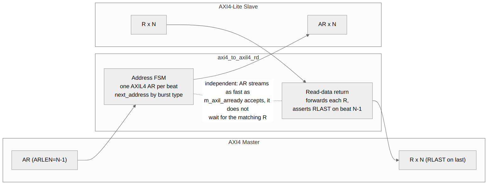
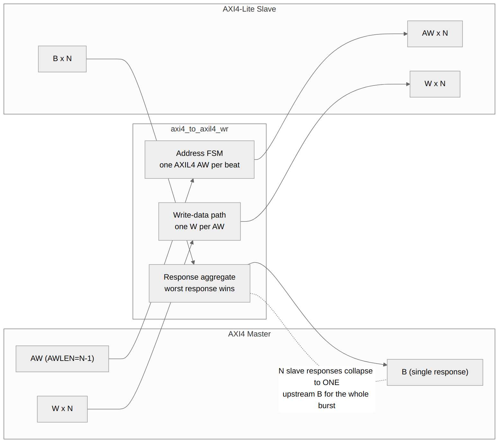

<!-- RTL Design Sherpa Documentation Header -->
<table>
<tr>
<td width="80">
  <a href="https://github.com/sean-galloway/RTLDesignSherpa">
    
  </a>
</td>
<td>
  <strong>RTL Design Sherpa</strong> · <em>Learning Hardware Design Through Practice</em><br>
  <sub>
    <a href="https://github.com/sean-galloway/RTLDesignSherpa">GitHub</a> ·
    <a href="https://github.com/sean-galloway/RTLDesignSherpa/blob/main/docs/DOCUMENTATION_INDEX.md">Documentation Index</a> ·
    <a href="https://github.com/sean-galloway/RTLDesignSherpa/blob/main/LICENSE">MIT License</a>
  </sub>
</td>
</tr>
</table>

---

<!-- End Header -->

# 3.2 AXI4 to AXI4-Lite Converter

The **axi4_to_axil4** converter family decomposes AXI4 burst transactions into sequential AXI4-Lite single-beat transactions.

## 3.2.1 Module Organization

```
axi4_to_axil4.sv          # Full bidirectional wrapper
├── axi4_to_axil4_rd.sv   # Read path converter
└── axi4_to_axil4_wr.sv   # Write path converter
```

### Design Philosophy

Read and write are separate modules, which buys:
- Independent optimization
- Selective instantiation (read-only, write-only, or both)
- Simpler verification (test paths independently)

## 3.2.2 Read Path (axi4_to_axil4_rd)

### Block Diagram

### Figure 3.2: AXI4 to AXI4-Lite Read Path



### Operation

**Single-Beat (ARLEN=0):**
```
Cycle 0: AR accepted (passthrough)
Cycle 1: R returned (passthrough)
Total: 0 extra cycles (pure passthrough)
```

**Multi-Beat (ARLEN=N-1):**
```
Cycle 0:   AR[0] issued to AXIL4
Cycle 1:   R[0] received, AR[1] issued
Cycle 2:   R[1] received, AR[2] issued
...
           R[N-1] received (RLAST)
```

AR issue and R return are fully independent: the address FSM streams
one AXIL4 AR per beat as fast as `m_axil_arready` accepts, with no
reference to R at all -- nothing in the AR path looks at `m_axil_rvalid`.
Against a slave with multi-cycle response latency the requests pipeline
ahead of the data, and end-to-end duration is set by the slave, not the
converter.

Bursts do not overlap each other: AR is held off until the burst in
flight has delivered its last beat, because the burst-tracking registers
hold one burst at a time.

### State Machine

```systemverilog
typedef enum logic [1:0] {
    RD_IDLE       = 2'b00,   // No burst in flight
    RD_BURST      = 2'b01,   // Issuing the AXIL4 reads of a burst
    RD_LAST_BEAT  = 2'b10    // Issuing the burst's final read
} rd_state_t;
```

A single-beat read (`ARLEN == 0`) never leaves `RD_IDLE`: it takes the
passthrough leg rather than the decomposition FSM. That is also why the
one-outstanding-burst guard cannot rely on the FSM state alone.

### Implementation

```systemverilog
    // Read state machine
    typedef enum logic [1:0] {
        RD_IDLE       = 2'b00,
        RD_BURST      = 2'b01,
        RD_LAST_BEAT  = 2'b10
    } rd_state_t;

    rd_state_t r_rd_state, w_rd_next_state;

    always_ff @(posedge aclk or negedge aresetn) begin
        if (!aresetn) begin
            r_rd_state <= RD_IDLE;
        end else begin
            r_rd_state <= w_rd_next_state;
        end
    end

    // Read next state logic
    always_comb begin
        w_rd_next_state = r_rd_state;
        case (r_rd_state)
            RD_IDLE: begin
                if (s_axi_arvalid && s_axi_arready) begin
                    if (s_axi_arlen == 0)
                        w_rd_next_state = RD_IDLE;  // Single beat, stay idle
                    else
                        w_rd_next_state = RD_BURST;  // Start burst decomposition
                end
            end
            RD_BURST: begin
                if (m_axil_arvalid && m_axil_arready) begin
                    if (r_ar_beat_count == r_ar_len - 1)
                        w_rd_next_state = RD_LAST_BEAT;
                end
            end
            RD_LAST_BEAT: begin
                if (m_axil_arvalid && m_axil_arready)
                    w_rd_next_state = RD_IDLE;
            end
            default: w_rd_next_state = RD_IDLE;
        endcase
    end
```

## 3.2.3 Write Path (axi4_to_axil4_wr)

### Block Diagram

### Figure 3.3: AXI4 to AXI4-Lite Write Path



### Operation

**Single-Beat (AWLEN=0):**
```
Cycle 0: AW+W accepted (passthrough)
Cycle 1: B returned (passthrough)
Total: 0 extra cycles
```

**Multi-Beat (AWLEN=N-1):**
```
Cycle 0:   AW[0] + W[0] issued
Cycle 1:   B[0] received, AW[1] + W[1] issued
...
           B[N-1] received (timing set by the AXIL4 slave)
           B[N-1] received
```

As on the read path, AW/W issue is independent of B return -- the write
FSM streams beats as fast as the AXIL4 slave accepts them, and mid-burst
B responses are consumed immediately (`m_axil_bready = s_axi_bready ||
!w_b_all_beats_done`). The single B the master receives is emitted once
every decomposed write has responded. Bursts do not overlap each other:
the next AW is held off until the burst in flight has its B accepted.

### AW/W Synchronization Challenge

AXI4 allows AW and W to arrive in any order:
- AW before W
- W before AW
- Interleaved

### Solution: W gated on the AW that owns it

W is gated directly against the state of the AW it belongs to, rather
than through pending-arrival flags, so a data beat cannot reach the
AXIL4 slave ahead of its own address:

* **Burst capture cycle.** When a burst's AW is being taken into the
  registers, W is held off for that cycle (`w_burst_capture`). Without
  it, the first W beat of the next burst slips out while the previous
  burst is still finishing, and the AXIL4 slave pairs an address from
  burst N with data from burst N+1.
* **During a burst.** W passes only once this burst's AW has actually
  been sent (`r_aw_sent`), or is being sent in this very cycle.
* **Single beats.** Straight passthrough; AW and W are presented
  together.

```systemverilog
    // s_axi_awready restricts the block to the ACCEPT cycle. Without it
    // a burst AW merely PARKED by the one-outstanding guard (awvalid=1,
    // awready=0) deadlocked the write already in flight (CONV-007).
    wire w_burst_capture = !r_aw_active && s_axi_awvalid && s_axi_awready &&
                           (s_axi_awlen > 0);

    assign m_axil_wvalid = w_burst_capture ? 1'b0 :
                           r_aw_active     ? (s_axi_wvalid &&
                                              (r_aw_sent ||
                                               (m_axil_awvalid && m_axil_awready))) :
                                             s_axi_wvalid;
    assign s_axi_wready  = w_burst_capture ? 1'b0 :
                           r_aw_active     ? (m_axil_wready &&
                                              (r_aw_sent ||
                                               (m_axil_awvalid && m_axil_awready))) :
                                             m_axil_wready;
```

The failure this guards against only appears back to back -- the next AW
arriving the cycle after `WR_LAST_BEAT` completes. A sequential test with
a cooldown between bursts never opens that window, which is why it
survived the FUB tests and was caught by a bridge-level probe.

### Response Aggregation

```systemverilog
// from the RTL: accumulate per response, reset on AW acceptance
always_ff @(posedge aclk or negedge aresetn) begin
    ...
    if (s_axi_awvalid && s_axi_awready)
        r_b_resp_accum <= 2'b00;
    if (m_axil_bvalid && m_axil_bready)
        if (m_axil_bresp > r_b_resp_accum)
            r_b_resp_accum <= m_axil_bresp;
end

// live-beat fold at emission (see 4.3.3 for why the registered-only
// form was a shipped bug)
assign w_b_resp_worst = (m_axil_bresp > r_b_resp_accum) ? m_axil_bresp
                                                        : r_b_resp_accum;
assign s_axi_bresp = w_b_resp_worst;
// (was:
                 r_worst_bresp;
```

## 3.2.4 Bidirectional Wrapper (axi4_to_axil4)

### Composition Pattern

```systemverilog
module axi4_to_axil4 #(
    parameter int AXI_ID_WIDTH   = 8,
    parameter int AXI_ADDR_WIDTH = 32,
    parameter int AXI_DATA_WIDTH = 32,
    parameter int AXI_USER_WIDTH = 1
) (
    // aclk/aresetn + full s_axi_*/m_axil_* channel set
);

    axi4_to_axil4_rd #(
        .AXI_ID_WIDTH   (AXI_ID_WIDTH),
        .AXI_ADDR_WIDTH (AXI_ADDR_WIDTH),
        .AXI_DATA_WIDTH (AXI_DATA_WIDTH),
        .AXI_USER_WIDTH (AXI_USER_WIDTH)
    ) u_rd_converter ( /* read channels */ );

    axi4_to_axil4_wr #(
        .AXI_ID_WIDTH   (AXI_ID_WIDTH),
        .AXI_ADDR_WIDTH (AXI_ADDR_WIDTH),
        .AXI_DATA_WIDTH (AXI_DATA_WIDTH),
        .AXI_USER_WIDTH (AXI_USER_WIDTH)
    ) u_wr_converter ( /* write channels */ );

endmodule
```

## 3.2.5 Resource Utilization

| Module | Registers | LUTs | BRAM |
|--------|-----------|------|------|
| axi4_to_axil4_rd | ~120 | ~180 | 0 |
| axi4_to_axil4_wr | ~150 | ~220 | 0 |
| axi4_to_axil4 (combined) | ~270 | ~400 | 0 |

: Table 3.6: AXI4 to AXIL4 Resources

## 3.2.6 Performance Analysis

### Throughput

| Transaction Type | Behaviour |
|------------------|-----------|
| Single-beat | Passthrough; no converter-inserted wait state |
| N-beat burst | One AXIL4 access per beat; requests stream at the slave's accept rate, independent of responses |
| Back-to-back bursts | Serialized: the next AR/AW waits for the previous burst's last beat |

: Table 3.7: AXI4 to AXIL4 Throughput

The previous "50% for any burst" figure was not measured and does not
follow from the design: the converter adds no wait state between beats,
so the achievable rate is whatever the AXIL4 slave sustains. A measured
characterization per slave latency has not been done and is not claimed
here.

### Latency

| Transaction Type | Latency |
|------------------|---------|
| Single-beat | 0 extra cycles |
| N-beat burst | slave-limited; requests stream independently of responses (see 3.2.6) |

: Table 3.8: AXI4 to AXIL4 Latency

## 3.2.7 Test Coverage

**Test Suite:** 42 tests passing

| Test Category | Tests | Status |
|---------------|-------|--------|
| Single-beat read | 4 | Pass |
| Multi-beat read | 6 | Pass |
| Single-beat write | 4 | Pass |
| Multi-beat write | 6 | Pass |
| Mixed traffic | 8 | Pass |
| Error injection | 6 | Pass |
| Edge cases | 8 | Pass |

: Table 3.9: Test Coverage Summary

---

**Next:** [AXI4-Lite to AXI4](03_axil4_to_axi4.md)
