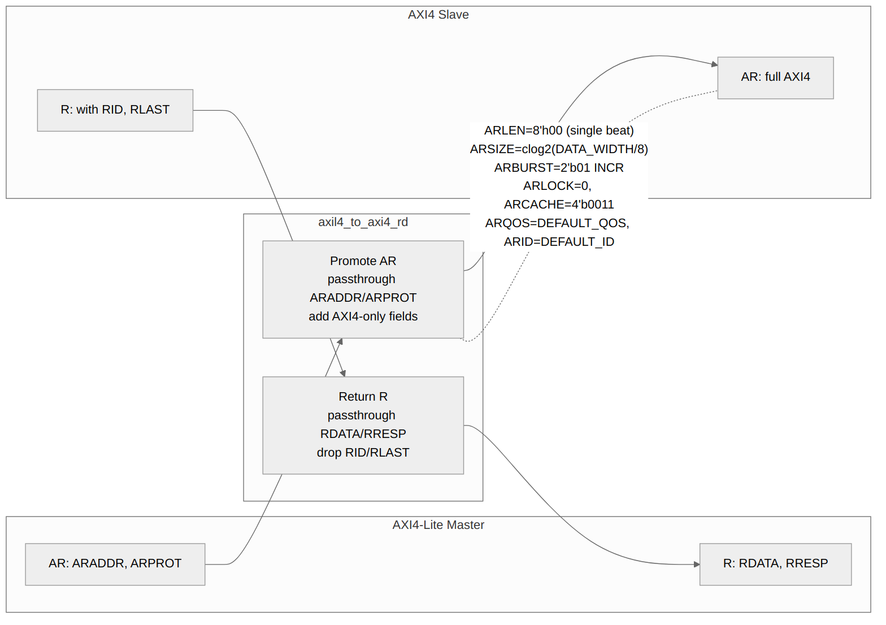
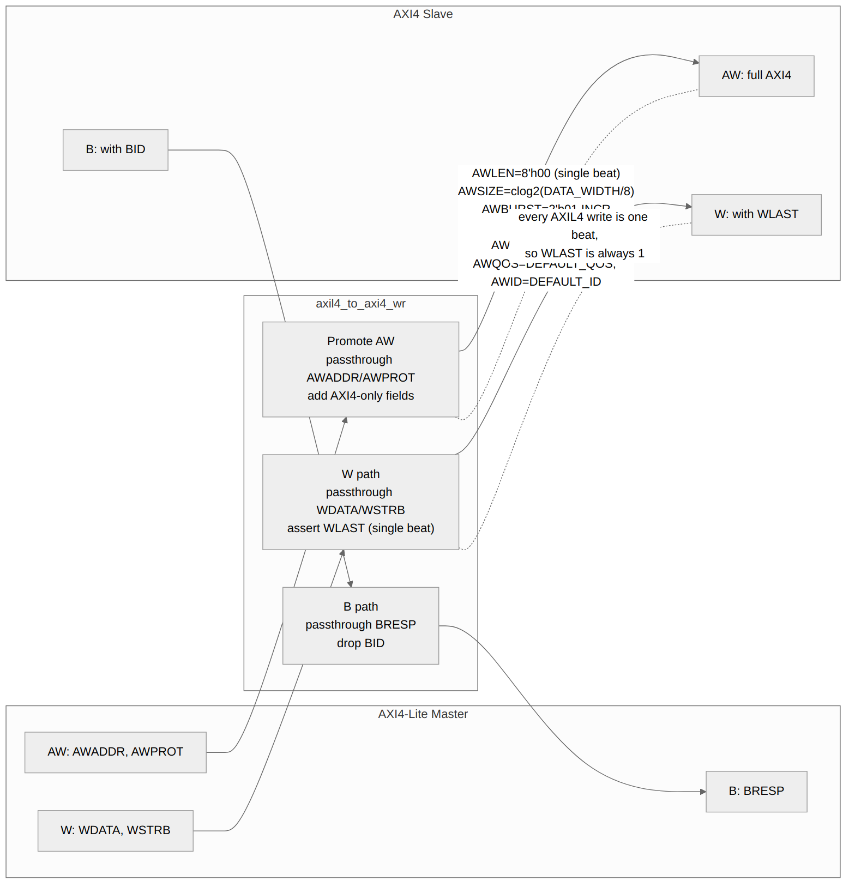

<!-- RTL Design Sherpa Documentation Header -->
<table>
<tr>
<td width="80">
  <a href="https://github.com/sean-galloway/RTLDesignSherpa">
    
  </a>
</td>
<td>
  <strong>RTL Design Sherpa</strong> · <em>Learning Hardware Design Through Practice</em><br>
  <sub>
    <a href="https://github.com/sean-galloway/RTLDesignSherpa">GitHub</a> ·
    <a href="https://github.com/sean-galloway/RTLDesignSherpa/blob/main/docs/DOCUMENTATION_INDEX.md">Documentation Index</a> ·
    <a href="https://github.com/sean-galloway/RTLDesignSherpa/blob/main/LICENSE">MIT License</a>
  </sub>
</td>
</tr>
</table>

---

<!-- End Header -->

# 3.3 AXI4-Lite to AXI4 Converter

The **axil4_to_axi4** converter family upgrades AXI4-Lite single-beat transactions to full AXI4 protocol by adding default burst signals.

## 3.3.1 Module Organization

```
axil4_to_axi4.sv          # Full bidirectional wrapper
├── axil4_to_axi4_rd.sv   # Read path converter
└── axil4_to_axi4_wr.sv   # Write path converter
```

## 3.3.2 Design Philosophy

**Zero-Overhead Upgrade:**
- Purely combinational logic
- No state machines or buffers
- Adds default values for missing AXI4 signals

**Why This Works:**
- AXI4-Lite is a subset of AXI4
- All AXI4-Lite transactions are single-beat
- Missing AXI4 signals have well-defined defaults

## 3.3.3 Signal Mapping

### Address Channel Signals

| AXI4-Lite Signal | AXI4 Signal | Default/Mapping |
| --- | --- | --- |
| ARADDR | ARADDR | Passthrough |
| ARPROT | ARPROT | Passthrough |
| ARVALID | ARVALID | Passthrough |
| ARREADY | ARREADY | Passthrough |
| - | ARLEN | 8'h00 (single beat) |
| - | ARSIZE | $clog2(DATA_WIDTH/8) |
| - | ARBURST | 2'b01 (INCR) |
| - | ARLOCK | 1'b0 (normal) |
| - | ARCACHE | 4'b0011 (bufferable, modifiable) |
| - | ARQOS | 4'(DEFAULT_QOS), parameter, default 0 |
| - | ARID | Configurable default |

: Table 3.10: AR Channel Mapping

### Data Channel Signals

| AXI4-Lite Signal | AXI4 Signal | Default/Mapping |
| --- | --- | --- |
| RDATA | RDATA | Passthrough |
| RRESP | RRESP | Passthrough |
| RVALID | RVALID | Passthrough |
| RREADY | RREADY | Passthrough |
| - | RLAST | 1'b1 (always last) |
| - | RID | Matches ARID |

: Table 3.11: R Channel Mapping

## 3.3.4 Read Path (axil4_to_axi4_rd)

### Block Diagram

### Figure 3.4: AXI4-Lite to AXI4 Read Path



### Implementation

```systemverilog
module axil4_to_axi4_rd #(
    // Width Configuration
    parameter int AXI_ID_WIDTH      = 8,
    parameter int AXI_ADDR_WIDTH    = 32,
    parameter int AXI_DATA_WIDTH    = 32,
    parameter int AXI_USER_WIDTH    = 1,

    // Default Values for AXI4-only Fields
    parameter int DEFAULT_ID        = 0,
    parameter int DEFAULT_REGION    = 0,
    parameter int DEFAULT_QOS       = 0,

    // Skid Buffer Depths (for timing closure)


    // Calculated Parameters
    localparam int STRB_WIDTH = AXI_DATA_WIDTH / 8,
    localparam int SIZE_VAL   = $clog2(STRB_WIDTH)  // ARSIZE for full width
) (
    // Clock and Reset
    input  logic                        aclk,
    input  logic                        aresetn,

    //==========================================================================
    // Slave AXI4-Lite Read Interface (Input - Simplified Protocol)
    //==========================================================================

    // Read Address Channel
    input  logic [AXI_ADDR_WIDTH-1:0]   s_axil_araddr,
    input  logic [2:0]                  s_axil_arprot,
    input  logic                        s_axil_arvalid,
    output logic                        s_axil_arready,

    // Read Data Channel
    output logic [AXI_DATA_WIDTH-1:0]   s_axil_rdata,
    output logic [1:0]                  s_axil_rresp,
    output logic                        s_axil_rvalid,
    input  logic                        s_axil_rready,

    //==========================================================================
    // Master AXI4 Read Interface (Output - Full Protocol)
    //==========================================================================

    // Read Address Channel
    output logic [AXI_ID_WIDTH-1:0]     m_axi_arid,
    output logic [AXI_ADDR_WIDTH-1:0]   m_axi_araddr,
    output logic [7:0]                  m_axi_arlen,
    output logic [2:0]                  m_axi_arsize,
    output logic [1:0]                  m_axi_arburst,
    output logic                        m_axi_arlock,
    output logic [3:0]                  m_axi_arcache,
    output logic [2:0]                  m_axi_arprot,
    output logic [3:0]                  m_axi_arqos,
    output logic [3:0]                  m_axi_arregion,
    output logic [AXI_USER_WIDTH-1:0]   m_axi_aruser,
    output logic                        m_axi_arvalid,
    input  logic                        m_axi_arready,

    // Read Data Channel
    input  logic [AXI_ID_WIDTH-1:0]     m_axi_rid,
    input  logic [AXI_DATA_WIDTH-1:0]   m_axi_rdata,
    input  logic [1:0]                  m_axi_rresp,
    input  logic                        m_axi_rlast,
    input  logic [AXI_USER_WIDTH-1:0]   m_axi_ruser,
    input  logic                        m_axi_rvalid,
    output logic                        m_axi_rready
);
```

**Key Points:**
- No registers - purely combinational
- RLAST from AXI4 is ignored (always 1 for AXIL4)
- RID from AXI4 is ignored (no ID tracking in AXIL4)

## 3.3.5 Write Path (axil4_to_axi4_wr)

### Block Diagram

### Figure 3.5: AXI4-Lite to AXI4 Write Path



### Implementation

```systemverilog
module axil4_to_axi4_wr #(
    // Width Configuration
    parameter int AXI_ID_WIDTH      = 8,
    parameter int AXI_ADDR_WIDTH    = 32,
    parameter int AXI_DATA_WIDTH    = 32,
    parameter int AXI_USER_WIDTH    = 1,

    // Default Values for AXI4-only Fields
    parameter int DEFAULT_ID        = 0,
    parameter int DEFAULT_REGION    = 0,
    parameter int DEFAULT_QOS       = 0,

    // Skid Buffer Depths (for timing closure)


    // Calculated Parameters
    localparam int STRB_WIDTH = AXI_DATA_WIDTH / 8,
    localparam int SIZE_VAL   = $clog2(STRB_WIDTH)  // AWSIZE for full width
) (
    // Clock and Reset
    input  logic                        aclk,
    input  logic                        aresetn,

    //==========================================================================
    // Slave AXI4-Lite Write Interface (Input - Simplified Protocol)
    //==========================================================================

    // Write Address Channel
    input  logic [AXI_ADDR_WIDTH-1:0]   s_axil_awaddr,
    input  logic [2:0]                  s_axil_awprot,
    input  logic                        s_axil_awvalid,
    output logic                        s_axil_awready,

    // Write Data Channel
    input  logic [AXI_DATA_WIDTH-1:0]   s_axil_wdata,
    input  logic [STRB_WIDTH-1:0]       s_axil_wstrb,
    input  logic                        s_axil_wvalid,
    output logic                        s_axil_wready,

    // Write Response Channel
    output logic [1:0]                  s_axil_bresp,
    output logic                        s_axil_bvalid,
    input  logic                        s_axil_bready,

    //==========================================================================
    // Master AXI4 Write Interface (Output - Full Protocol)
    //==========================================================================

    // Write Address Channel
    output logic [AXI_ID_WIDTH-1:0]     m_axi_awid,
    output logic [AXI_ADDR_WIDTH-1:0]   m_axi_awaddr,
    output logic [7:0]                  m_axi_awlen,
    output logic [2:0]                  m_axi_awsize,
    output logic [1:0]                  m_axi_awburst,
    output logic                        m_axi_awlock,
    output logic [3:0]                  m_axi_awcache,
    output logic [2:0]                  m_axi_awprot,
    output logic [3:0]                  m_axi_awqos,
    output logic [3:0]                  m_axi_awregion,
    output logic [AXI_USER_WIDTH-1:0]   m_axi_awuser,
    output logic                        m_axi_awvalid,
    input  logic                        m_axi_awready,

    // Write Data Channel
    output logic [AXI_DATA_WIDTH-1:0]   m_axi_wdata,
    output logic [STRB_WIDTH-1:0]       m_axi_wstrb,
    output logic                        m_axi_wlast,
    output logic [AXI_USER_WIDTH-1:0]   m_axi_wuser,
    output logic                        m_axi_wvalid,
    input  logic                        m_axi_wready,

    // Write Response Channel
    input  logic [AXI_ID_WIDTH-1:0]     m_axi_bid,
    input  logic [1:0]                  m_axi_bresp,
    input  logic [AXI_USER_WIDTH-1:0]   m_axi_buser,
    input  logic                        m_axi_bvalid,
    output logic                        m_axi_bready
);
```

## 3.3.6 Bidirectional Wrapper

```systemverilog
module axil4_to_axi4 #(
    parameter int AXI_ID_WIDTH   = 8,
    parameter int AXI_ADDR_WIDTH = 32,
    parameter int AXI_DATA_WIDTH = 32,
    parameter int AXI_USER_WIDTH = 1,
    parameter int DEFAULT_ID     = 0,
    parameter int DEFAULT_REGION = 0,
    parameter int DEFAULT_QOS    = 0
) (
    // ... all port declarations
);

    axil4_to_axi4_rd #(
        .AXI_ID_WIDTH    (AXI_ID_WIDTH),
        .AXI_ADDR_WIDTH  (AXI_ADDR_WIDTH),
        .AXI_DATA_WIDTH  (AXI_DATA_WIDTH),
        .AXI_USER_WIDTH  (AXI_USER_WIDTH),
        .DEFAULT_ID      (DEFAULT_ID),
        .DEFAULT_REGION  (DEFAULT_REGION),
        .DEFAULT_QOS     (DEFAULT_QOS)
    ) u_rd_converter (/* connections */);

    axil4_to_axi4_wr #(
        .AXI_ID_WIDTH    (AXI_ID_WIDTH),
        .AXI_ADDR_WIDTH  (AXI_ADDR_WIDTH),
        .AXI_DATA_WIDTH  (AXI_DATA_WIDTH),
        .AXI_USER_WIDTH  (AXI_USER_WIDTH),
        .DEFAULT_ID      (DEFAULT_ID),
        .DEFAULT_REGION  (DEFAULT_REGION),
        .DEFAULT_QOS     (DEFAULT_QOS)
    ) u_wr_converter (/* connections */);

endmodule
```

## 3.3.7 Resource Utilization

| Module | Registers | LUTs |
| --- | --- | --- |
| axil4_to_axi4_rd | 0 | ~50 |
| axil4_to_axi4_wr | 0 | ~60 |
| axil4_to_axi4 (combined) | 0 | ~110 |

: Table 3.12: AXIL4 to AXI4 Resources

**Note:** Zero registers — purely combinational logic.

## 3.3.8 Timing

| Metric | Value |
| --- | --- |
| Latency | 0 cycles |
| Throughput | 100% |
| Max frequency | Wire speed |

: Table 3.13: AXIL4 to AXI4 Performance

## 3.3.9 Testing

**Test Suite:** 14 tests passing

| Test Category | Tests | Status |
| --- | --- | --- |
| Single-beat read | 3 | Pass |
| Single-beat write | 3 | Pass |
| Mixed traffic | 4 | Pass |
| Default ID verification | 2 | Pass |
| Edge cases | 2 | Pass |

: Table 3.14: Test Coverage Summary

## 3.3.10 Usage Example

```systemverilog
axil4_to_axi4 #(
    .AXI_DATA_WIDTH (32),
    .AXI_ADDR_WIDTH (32),
    .AXI_ID_WIDTH   (8),
    .DEFAULT_ID     (8'h05),
    .DEFAULT_QOS    (0)
) u_axil2axi (
    .aclk           (aclk),
    .aresetn        (aresetn),
    // AXI4-Lite slave side: s_axil_*
    .s_axil_arvalid (lite_arvalid),
    .s_axil_arready (lite_arready),
    .s_axil_araddr  (lite_araddr),
    // ...
    // AXI4 master side: m_axi_* (ID/len/size driven from parameters;
    // the conversion is combinational, no internal pipelining)
    .m_axi_arvalid  (fab_arvalid),
    .m_axi_arready  (fab_arready)
    // ...
);
```

---

**Next:** [AXI4 to APB](04_axi4_to_apb4.md)
