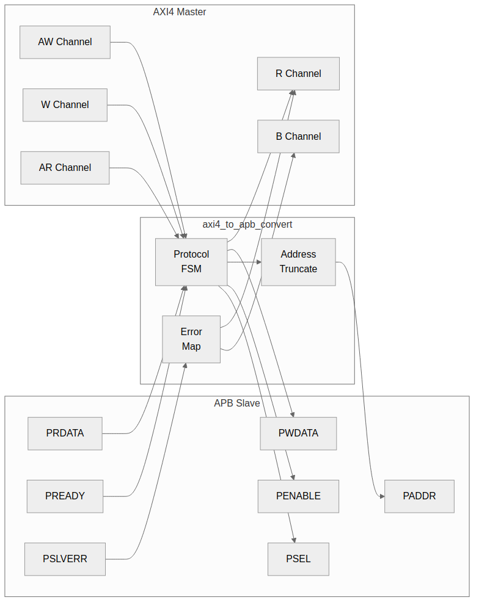
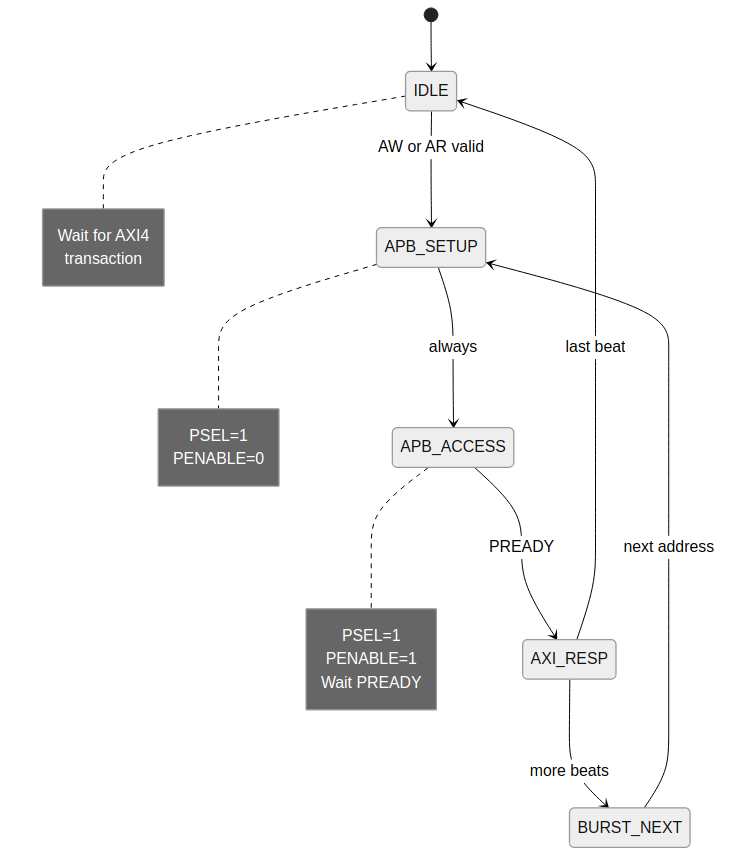

<!-- RTL Design Sherpa Documentation Header -->
<table>
<tr>
<td width="80">
  <a href="https://github.com/sean-galloway/RTLDesignSherpa">
    
  </a>
</td>
<td>
  <strong>RTL Design Sherpa</strong> · <em>Learning Hardware Design Through Practice</em><br>
  <sub>
    <a href="https://github.com/sean-galloway/RTLDesignSherpa">GitHub</a> ·
    <a href="https://github.com/sean-galloway/RTLDesignSherpa/blob/main/docs/DOCUMENTATION_INDEX.md">Documentation Index</a> ·
    <a href="https://github.com/sean-galloway/RTLDesignSherpa/blob/main/LICENSE">MIT License</a>
  </sub>
</td>
</tr>
</table>

---

<!-- End Header -->

# 3.4 AXI4 to APB Converter

The **axi4_to_apb_convert** module provides full protocol translation from AXI4 to APB, enabling AXI4 masters to access APB peripherals.

## 3.4.1 Purpose

Bridge the significant protocol differences between AXI4 and APB:

| Aspect | AXI4 | APB |
|--------|------|-----|
| Channels | 5 (AW, W, B, AR, R) | 1 (combined) |
| Phases | Pipelined | 2-phase (setup, access) |
| Bursts | Up to 256 beats | Single transfer |
| Address width | Up to 64 bits | Typically 32 bits |
| Data width | 8-1024 bits | 8-32 bits |

: Table 3.15: AXI4 vs APB Comparison

## 3.4.2 Block Diagram

### Figure 3.6: AXI4 to APB Converter



## 3.4.3 Interface Specification

### Parameters

| Parameter | Type | Default | Description |
|-----------|------|---------|-------------|
| AXI_ADDR_WIDTH | int | 64 | AXI4 address width |
| AXI_DATA_WIDTH | int | 32 | AXI4 data width |
| AXI_ID_WIDTH | int | 4 | AXI4 ID width |
| APB_ADDR_WIDTH | int | 32 | APB address width |
| APB_DATA_WIDTH | int | 32 | APB data width |

: Table 3.16: AXI4 to APB Parameters

### Ports

```systemverilog
module axi4_to_apb_convert #(
    parameter int AXI_ADDR_WIDTH = 64,
    parameter int AXI_DATA_WIDTH = 32,
    parameter int AXI_ID_WIDTH   = 4,
    parameter int APB_ADDR_WIDTH = 32,
    parameter int APB_DATA_WIDTH = 32
) (
    input  logic clk,
    input  logic rst_n,

    // AXI4 slave interface
    // AW channel
    input  logic                        s_awvalid,
    output logic                        s_awready,
    input  logic [AXI_ADDR_WIDTH-1:0]   s_awaddr,
    input  logic [7:0]                  s_awlen,
    input  logic [AXI_ID_WIDTH-1:0]     s_awid,

    // W channel
    input  logic                        s_wvalid,
    output logic                        s_wready,
    input  logic [AXI_DATA_WIDTH-1:0]   s_wdata,
    input  logic [AXI_DATA_WIDTH/8-1:0] s_wstrb,
    input  logic                        s_wlast,

    // B channel
    output logic                        s_bvalid,
    input  logic                        s_bready,
    output logic [AXI_ID_WIDTH-1:0]     s_bid,
    output logic [1:0]                  s_bresp,

    // AR channel
    input  logic                        s_arvalid,
    output logic                        s_arready,
    input  logic [AXI_ADDR_WIDTH-1:0]   s_araddr,
    input  logic [7:0]                  s_arlen,
    input  logic [AXI_ID_WIDTH-1:0]     s_arid,

    // R channel
    output logic                        s_rvalid,
    input  logic                        s_rready,
    output logic [AXI_DATA_WIDTH-1:0]   s_rdata,
    output logic [AXI_ID_WIDTH-1:0]     s_rid,
    output logic [1:0]                  s_rresp,
    output logic                        s_rlast,

    // APB master interface
    output logic                        psel,
    output logic                        penable,
    output logic                        pwrite,
    output logic [APB_ADDR_WIDTH-1:0]   paddr,
    output logic [APB_DATA_WIDTH-1:0]   pwdata,
    output logic [APB_DATA_WIDTH/8-1:0] pstrb,
    input  logic                        pready,
    input  logic [APB_DATA_WIDTH-1:0]   prdata,
    input  logic                        pslverr
);
```

## 3.4.4 State Machine

### Figure 3.7: AXI4 to APB FSM



### States

```systemverilog
typedef enum logic [2:0] {
    IDLE        = 3'b000,  // Wait for AXI4 transaction
    APB_SETUP   = 3'b001,  // APB setup phase
    APB_ACCESS  = 3'b010,  // APB access phase (wait PREADY)
    AXI_RESP_B  = 3'b011,  // Send AXI4 B response
    AXI_RESP_R  = 3'b100,  // Send AXI4 R response
    BURST_NEXT  = 3'b101   // Next beat in burst
} apb_state_t;
```

### Transitions

| Current State | Condition | Next State |
|---------------|-----------|------------|
| IDLE | s_awvalid | APB_SETUP (write) |
| IDLE | s_arvalid | APB_SETUP (read) |
| APB_SETUP | always | APB_ACCESS |
| APB_ACCESS | pready && is_write | AXI_RESP_B |
| APB_ACCESS | pready && is_read | AXI_RESP_R |
| AXI_RESP_B | s_bready && !more_beats | IDLE |
| AXI_RESP_B | s_bready && more_beats | BURST_NEXT |
| AXI_RESP_R | s_rready && !more_beats | IDLE |
| AXI_RESP_R | s_rready && more_beats | BURST_NEXT |
| BURST_NEXT | always | APB_SETUP |

: Table 3.17: FSM Transitions

## 3.4.5 Burst Handling

### Burst Decomposition

AXI4 bursts are decomposed into sequential APB transfers:

```
AXI4: AWADDR=0x1000, AWLEN=3 (4 beats)

APB sequence:
  Transfer 0: PADDR=0x1000
  Transfer 1: PADDR=0x1004
  Transfer 2: PADDR=0x1008
  Transfer 3: PADDR=0x100C
```

### Address Calculation

```systemverilog
// Calculate next address for INCR burst
logic [APB_ADDR_WIDTH-1:0] r_current_addr;
logic [2:0] r_awsize;

always_ff @(posedge clk) begin
    if (r_state == APB_ACCESS && pready) begin
        r_current_addr <= r_current_addr + (1 << r_awsize);
    end
end
```

## 3.4.6 Address Width Adaptation

### 64-bit to 32-bit Conversion

```systemverilog
// Truncate upper address bits
assign paddr = s_awaddr[APB_ADDR_WIDTH-1:0];

// Optional: Check for out-of-range access
wire w_addr_oor = |s_awaddr[AXI_ADDR_WIDTH-1:APB_ADDR_WIDTH];
```

## 3.4.7 Error Response Mapping

| APB Signal | AXI4 Response |
|------------|---------------|
| PSLVERR = 0 | OKAY (2'b00) |
| PSLVERR = 1 | SLVERR (2'b10) |

: Table 3.18: Error Mapping

### Error Aggregation

```systemverilog
// Track worst error in burst
logic r_error_seen;

always_ff @(posedge clk) begin
    if (r_state == IDLE)
        r_error_seen <= 1'b0;
    else if (r_state == APB_ACCESS && pready && pslverr)
        r_error_seen <= 1'b1;
end

// Final response
assign s_bresp = r_error_seen ? 2'b10 : 2'b00;
```

## 3.4.8 Implementation

### Core FSM

```systemverilog
always_ff @(posedge clk or negedge rst_n) begin
    if (!rst_n) begin
        r_state <= IDLE;
        r_is_write <= 1'b0;
    end else begin
        case (r_state)
            IDLE: begin
                if (s_awvalid && s_wvalid) begin
                    r_state <= APB_SETUP;
                    r_is_write <= 1'b1;
                    r_current_addr <= s_awaddr[APB_ADDR_WIDTH-1:0];
                    r_beat_count <= '0;
                    r_awlen <= s_awlen;
                    r_awid <= s_awid;
                end else if (s_arvalid) begin
                    r_state <= APB_SETUP;
                    r_is_write <= 1'b0;
                    r_current_addr <= s_araddr[APB_ADDR_WIDTH-1:0];
                    r_beat_count <= '0;
                    r_arlen <= s_arlen;
                    r_arid <= s_arid;
                end
            end

            APB_SETUP: begin
                r_state <= APB_ACCESS;
            end

            APB_ACCESS: begin
                if (pready) begin
                    r_rdata_saved <= prdata;
                    r_error_seen <= r_error_seen || pslverr;
                    if (r_is_write)
                        r_state <= AXI_RESP_B;
                    else
                        r_state <= AXI_RESP_R;
                end
            end

            AXI_RESP_B: begin
                if (s_bready) begin
                    if (r_beat_count == r_awlen)
                        r_state <= IDLE;
                    else
                        r_state <= BURST_NEXT;
                end
            end

            AXI_RESP_R: begin
                if (s_rready) begin
                    if (r_beat_count == r_arlen)
                        r_state <= IDLE;
                    else
                        r_state <= BURST_NEXT;
                end
            end

            BURST_NEXT: begin
                r_beat_count <= r_beat_count + 1;
                r_current_addr <= r_current_addr + (1 << r_size);
                r_state <= APB_SETUP;
            end
        endcase
    end
end
```

## 3.4.9 Resource Utilization

```
State machine:        ~50 LUTs, ~20 regs
Address logic:        ~30 LUTs, ~40 regs
Data buffering:       ~10 LUTs, ~70 regs
Control:              ~60 LUTs, ~20 regs

Total: ~150 LUTs, ~150 regs
```

## 3.4.10 Performance

### Timing Analysis

| Operation | Cycles |
|-----------|--------|
| Single write | 3-4 (setup + access + B) |
| Single read | 3-4 (setup + access + R) |
| N-beat write burst | 3N + 1 |
| N-beat read burst | 3N + 1 |

: Table 3.19: APB Converter Timing

### Throughput

**Best case:** 1 transfer per 3 cycles
**With slow PREADY:** Additional cycles per transfer

## 3.4.11 Usage Example

```systemverilog
axi4_to_apb_convert #(
    .AXI_ADDR_WIDTH(64),
    .AXI_DATA_WIDTH(32),
    .AXI_ID_WIDTH(4),
    .APB_ADDR_WIDTH(32),
    .APB_DATA_WIDTH(32)
) u_axi2apb (
    .clk     (aclk),
    .rst_n   (aresetn),

    // AXI4 slave (from CPU)
    .s_awvalid (cpu_awvalid),
    .s_awready (cpu_awready),
    // ... other AXI4 signals

    // APB master (to peripherals)
    .psel    (uart_psel),
    .penable (uart_penable),
    .pwrite  (uart_pwrite),
    .paddr   (uart_paddr),
    .pwdata  (uart_pwdata),
    .pready  (uart_pready),
    .prdata  (uart_prdata),
    .pslverr (uart_pslverr)
);
```

---

**Next:** [PeakRDL Adapter](05_peakrdl_adapter.md)
